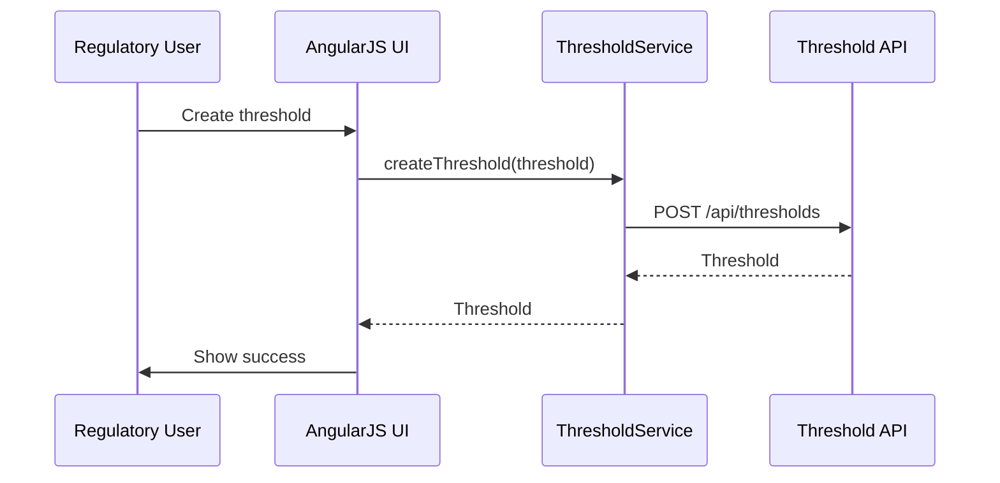

# Low-Level Design (LLD) for Epic QE-3556 – Threshold Evaluation & Alerts

## 1. Architecture

- AngularJS module `app.thresholds` supporting threshold configuration, alert monitoring, and dashboards.

## 2. Components

### 2.1 Services

- `ThresholdService` – manage thresholds.
- `AlertService` – retrieve alerts and history.

### 2.2 Controllers

- `ThresholdListController`
- `ThresholdDetailController`
- `AlertDashboardController`

### 2.3 Directives

- `thresholdForm` – capture thresholds with warning/critical levels.
- `alertList` – display active alerts.

## 3. Data Models

- `Threshold` – id, name, region, substance, warningLevel, criticalLevel.
- `Alert` – id, thresholdId, severity, createdAt, status.

## 4. Sequence Diagram

