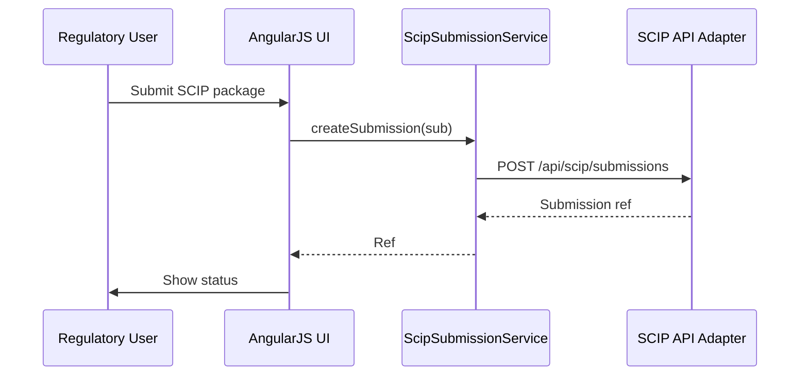

# Low-Level Design (LLD) for Epic QE-3557 – SCIP Submission UI

## 1. Architecture

- AngularJS module `app.scip` for preparing and managing SCIP submissions.

## 2. Components

### 2.1 Services

- `ScipSubmissionService` – create and track submissions.
- `ScipTemplateService` – manage IUCLID/SCIP templates.

### 2.2 Controllers

- `ScipSubmissionListController`
- `ScipSubmissionDetailController`

### 2.3 Directives

- `submissionStatusBadge` – show submission status.
- `submissionHistoryTable` – show attempts.

## 3. Data Models

- `ScipSubmission` – id, product, status, createdAt, submittedAt, echaReference.

## 4. Sequence Diagram

