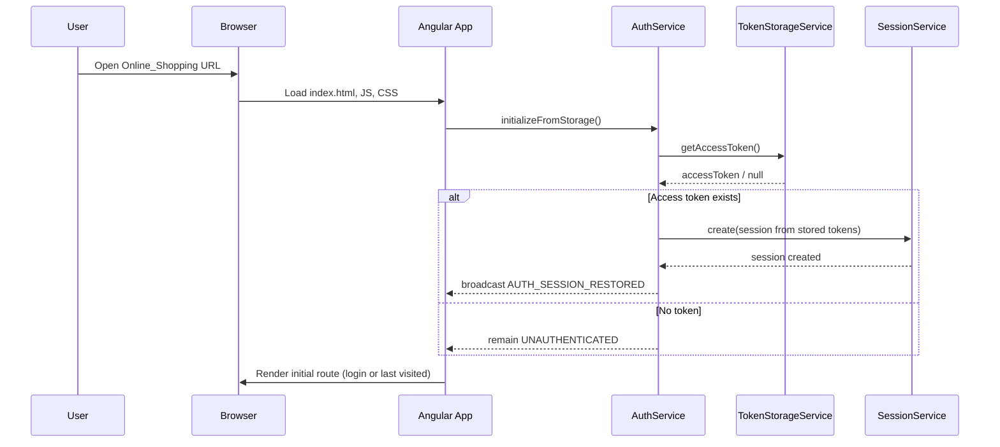
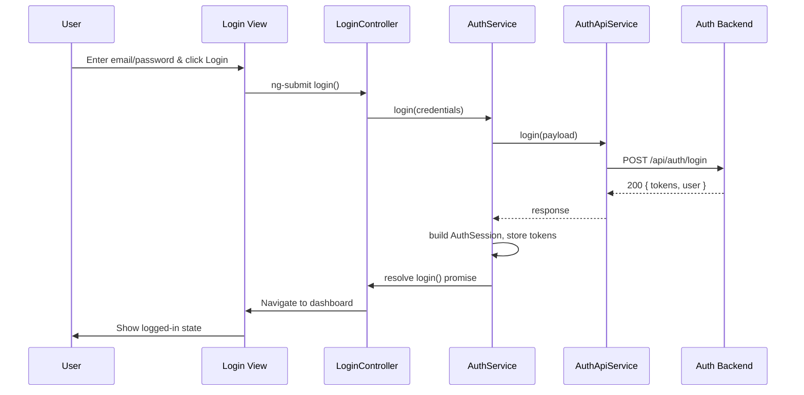
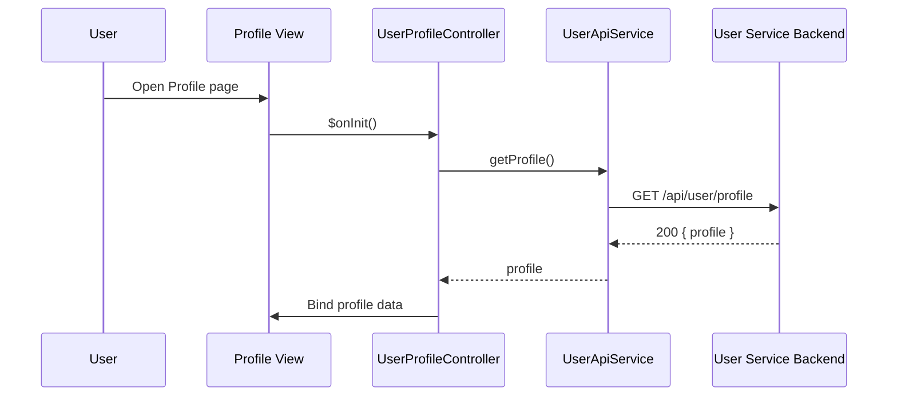
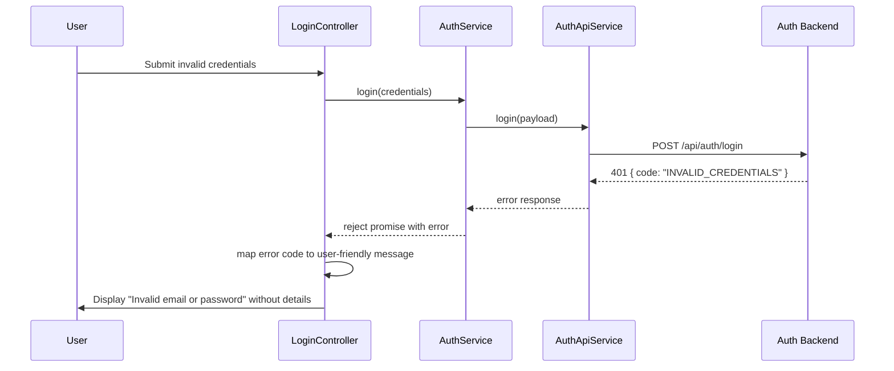

# Low-Level Design (LLD) – Authentication & Authorization Services

**Epic ID:** QE-3588  
**Application Name:** Online_Shopping  
**Technology Stack:**
- Frontend: AngularJS 1.x, JavaScript (ES6 syntax where compatible via transpilation/Babel), HTML5, CSS3, Bootstrap 3/4
- Backend Integration: RESTful APIs over HTTPS (TLS 1.3)
- Architecture: AngularJS MVC (Modules, Controllers, Services, Directives, Filters), REST-based backend microservices (Auth, User, RBAC, Audit, Fraud, Notification)

> This LLD translates the authentication and authorization HLD into implementable client and integration design for an enterprise-grade web application.

---

## 1. Application Architecture

### 1.1 AngularJS MVC Architecture Mapping

The Online_Shopping application will use a modular AngularJS 1.x architecture with dedicated modules for authentication, user profile, shared utilities, and layout.

**Primary AngularJS Modules:**

1. `onlineShopping.core`
   - Cross-cutting concerns: HTTP interceptors, configuration, logging utilities, constants.
2. `onlineShopping.auth`
   - Login, registration, logout, session handling, token storage, and guards.
3. `onlineShopping.user`
   - User profile view/update, preferences (notification/consent), basic account management.
4. `onlineShopping.rbac`
   - Client-side role awareness (consumer/seller/admin) and view-level authorization.
5. `onlineShopping.layout`
   - Navigation bar, sidebars, role-aware menus.
6. `onlineShopping.shared`
   - Reusable directives, filters, utility services, validators.

### 1.2 Mapping HLD Components to AngularJS Artifacts

| HLD Component                    | AngularJS Artifact(s)                                                                                          |
|----------------------------------|------------------------------------------------------------------------------------------------------------------|
| Web/Mobile Web Client            | `onlineShopping.*` modules, controllers, views, directives                                                       |
| Auth Service                     | `AuthApiService`, `SessionService`, `TokenStorageService`, HTTP interceptor                                      |
| User Service / Directory         | `UserApiService`, `UserProfileController`                                                                        |
| RBAC / Authorization Service     | `RbacApiService`, `AuthzService`, `rbacShowIf` directive                                                          |
| Session Store                    | Handled via backend; client-side via `SessionService` + token storage                                            |
| Audit Log Service                | Transparent through Auth/User APIs; surfaced via `AuditApiService` (admin-only screens)                           |
| Security Services (Crypto, KMS)  | Backend responsibility; client ensures secure transport & minimal data storage                                    |
| Fraud Detection Service          | Indirect through Auth APIs; client handles risk-related responses (e.g., CAPTCHA prompts)                         |
| Notification Service             | Indirect through User/Auth APIs; client provides UI for preferences and surfaces notifications results            |
| Application Services             | Other modules (catalog, orders, dashboard) that depend on `AuthService` and `AuthzService`                        |

### 1.3 Recommended Project Folder Structure

```text
web/
  index.html
  app/
    app.module.js
    app.routes.js

    core/
      core.module.js
      config/
        core.config.js
        http.config.js
        env.config.js
      constants/
        api-endpoints.constant.js
        roles.constant.js
        error-codes.constant.js
      services/
        logger.service.js
        http-interceptor.factory.js
        storage.service.js

    auth/
      auth.module.js
      controllers/
        login.controller.js
        register.controller.js
        logout.controller.js
      services/
        auth-api.service.js
        auth.service.js
        session.service.js
        token-storage.service.js
      directives/
        password-strength.directive.js
      views/
        login.html
        register.html
        logout.html

    user/
      user.module.js
      controllers/
        profile.controller.js
      services/
        user-api.service.js
      views/
        profile.html

    rbac/
      rbac.module.js
      services/
        rbac-api.service.js
        authz.service.js
      directives/
        rbac-show-if.directive.js

    layout/
      layout.module.js
      controllers/
        navbar.controller.js
      views/
        navbar.html

    shared/
      shared.module.js
      directives/
        form-field.directive.js
        focus-on-error.directive.js
      filters/
        mask-email.filter.js
      validators/
        email.validator.js

  assets/
    css/
      main.css
    js/
      lib/ (3rd-party libraries)
    img/

  config/
    env/
      env.dev.json
      env.qa.json
      env.prod.json
```

---

## 2. Component Specifications

### 2.1 Core Module Components

#### 2.1.1 Module: `onlineShopping.core`
- **Type:** AngularJS Module
- **File:** `app/core/core.module.js`
- **Responsibility:** Define core module and register cross-cutting services and configuration.
- **Public API:** N/A (module definition).
- **Dependencies:** `ngRoute`, `ngAnimate`, `ngMessages`, etc.

```js
angular.module('onlineShopping.core', [
  'ngRoute',
  'ngAnimate',
  'ngMessages'
]);
```

#### 2.1.2 Factory: `httpInterceptor`
- **Type:** Factory
- **File:** `app/core/services/http-interceptor.factory.js`
- **Responsibility:**
  - Attach access tokens to outgoing requests.
  - Handle 401/403 responses and redirect to login.
  - Standardize error handling and logging.
- **Public Methods:**
  - `request(config)` – add auth headers and standard headers.
  - `responseError(rejection)` – handle error responses.
- **Inputs:**
  - `config` (Angular `$http` config object)
  - `rejection` (HTTP error response)
- **Outputs:**
  - Modified `config` or rejected promise.
- **Dependencies:**
  - `$q`, `$injector` (lazy injection of `TokenStorageService`, `$location`), `LoggerService`.

#### 2.1.3 Service: `LoggerService`
- **Type:** Service
- **File:** `app/core/services/logger.service.js`
- **Responsibility:** Client-side logging abstraction.
- **Public Methods:**
  - `info(msg, meta)`, `warn(msg, meta)`, `error(msg, meta)`.
- **Dependencies:** `$log`.

#### 2.1.4 Service: `StorageService`
- **Type:** Service
- **File:** `app/core/services/storage.service.js`
- **Responsibility:**
  - Wrapper over `localStorage`/`sessionStorage` with JSON parsing/stringifying and namespacing.
- **Public Methods:**
  - `set(key, value, options)`, `get(key)`, `remove(key)`, `clearNamespace()`.
- **Dependencies:** None.

### 2.2 Auth Module Components

#### 2.2.1 Module: `onlineShopping.auth`
- **File:** `app/auth/auth.module.js`
- **Responsibility:** Group all auth-related controllers, services, directives.
- **Dependencies:** `onlineShopping.core`, `onlineShopping.rbac`.

#### 2.2.2 Service: `AuthApiService`
- **Type:** Service (communicates with Auth Service backend)
- **File:** `app/auth/services/auth-api.service.js`
- **Responsibility:** REST API integration for registration, login, logout, token refresh, password reset initiation.
- **Public Methods:**
  - `register(payload)` – POST `/api/auth/register`.
  - `login(payload)` – POST `/api/auth/login`.
  - `logout()` – POST `/api/auth/logout`.
  - `refreshToken(refreshToken)` – POST `/api/auth/token/refresh`.
  - `requestPasswordReset(payload)` – POST `/api/auth/password/reset/request`.
  - `confirmPasswordReset(payload)` – POST `/api/auth/password/reset/confirm`.
- **Inputs:** JSON request payloads.
- **Outputs:** Promises resolving to API responses.
- **Dependencies:** `$http`, `ApiEndpointsConstant`, `LoggerService`.

#### 2.2.3 Service: `AuthService`
- **Type:** Service
- **File:** `app/auth/services/auth.service.js`
- **Responsibility:**
  - Orchestrate login/registration flows.
  - Manage authentication state in client.
  - Coordinate with `TokenStorageService` and `SessionService`.
- **Public Methods:**
  - `register(user)` – high-level registration flow.
  - `login(credentials)` – login and store tokens.
  - `logout()` – clear tokens, notify backend.
  - `isAuthenticated()` – return boolean.
  - `getCurrentUser()` – return current user profile/claims.
  - `initializeFromStorage()` – restore session on app init.
- **Inputs:** User models, credentials.
- **Outputs:** Promises, state changes, events.
- **Dependencies:** `AuthApiService`, `TokenStorageService`, `SessionService`, `$rootScope`, `LoggerService`.

#### 2.2.4 Service: `TokenStorageService`
- **Type:** Service
- **File:** `app/auth/services/token-storage.service.js`
- **Responsibility:**
  - Securely store access and refresh tokens in browser (with defense-in-depth).
- **Public Methods:**
  - `storeTokens({ accessToken, refreshToken })`.
  - `getAccessToken()`.
  - `getRefreshToken()`.
  - `clearTokens()`.
- **Dependencies:** `StorageService`, `EnvConfig`.

#### 2.2.5 Service: `SessionService`
- **Type:** Service
- **File:** `app/auth/services/session.service.js`
- **Responsibility:**
  - Maintain client-session metadata (user roles, expiration times, last activity).
- **Public Methods:**
  - `create(sessionData)`.
  - `destroy()`.
  - `getUser()`.
  - `getRoles()`.
  - `hasRole(role)`.
- **Dependencies:** `StorageService`.

#### 2.2.6 Controller: `LoginController`
- **Type:** Controller
- **File:** `app/auth/controllers/login.controller.js`
- **Responsibility:**
  - Handle login form interactions and error display.
- **Public Methods / Scope:**
  - `vm.credentials` – `{ email, password }`.
  - `vm.rememberMe` – boolean.
  - `vm.login()` – submit credentials.
  - `vm.error` – error message.
- **Inputs:** Form data.
- **Outputs:** Navigation, error messages, events (`AUTH_LOGIN_SUCCESS`, `AUTH_LOGIN_FAILURE`).
- **Dependencies:** `AuthService`, `$location`, `$routeParams`, `LoggerService`.

#### 2.2.7 Controller: `RegisterController`
- **Type:** Controller
- **File:** `app/auth/controllers/register.controller.js`
- **Responsibility:**
  - Handle registration form, validation, and submission.
- **Public Methods / Scope:**
  - `vm.user` – `{ email, password, confirmPassword, role, consentFlags }`.
  - `vm.register()`.
  - `vm.passwordStrength` (derived state).
  - `vm.error`, `vm.success`.
- **Dependencies:** `AuthService`, `$location`, `LoggerService`.

#### 2.2.8 Controller: `LogoutController`
- **Type:** Controller
- **File:** `app/auth/controllers/logout.controller.js`
- **Responsibility:**
  - Call `AuthService.logout()` and redirect to login.
- **Dependencies:** `AuthService`, `$location`.

#### 2.2.9 Directive: `passwordStrength`
- **Type:** Directive
- **File:** `app/auth/directives/password-strength.directive.js`
- **Responsibility:**
  - Provide real-time visual feedback on password strength.
- **Inputs:** `ngModel` (password string).
- **Outputs:** CSS classes, visual meter.
- **Dependencies:** Internal scoring logic; can use a `PasswordPolicyService` (optional).

### 2.3 User Module Components

#### 2.3.1 Service: `UserApiService`
- **Type:** Service
- **File:** `app/user/services/user-api.service.js`
- **Responsibility:**
  - Communicate with User Service / Directory backend.
- **Public Methods:**
  - `getProfile()` – GET `/api/user/profile`.
  - `updateProfile(profile)` – PUT `/api/user/profile`.
  - `updatePreferences(prefs)` – PUT `/api/user/preferences`.
- **Dependencies:** `$http`, `ApiEndpointsConstant`, `LoggerService`.

#### 2.3.2 Controller: `UserProfileController`
- **Type:** Controller
- **File:** `app/user/controllers/profile.controller.js`
- **Responsibility:**
  - Display and update user profile & notification preferences.
- **Public Methods / Scope:**
  - `vm.profile`.
  - `vm.preferences`.
  - `vm.saveProfile()`.
  - `vm.savePreferences()`.
- **Dependencies:** `UserApiService`, `LoggerService`.

### 2.4 RBAC Module Components

#### 2.4.1 Service: `RbacApiService`
- **Type:** Service
- **File:** `app/rbac/services/rbac-api.service.js`
- **Responsibility:**
  - Communicate with backend RBAC service for role/permission resolution if required client-side.
- **Public Methods:**
  - `getPermissions()` – GET `/api/rbac/permissions`.
- **Dependencies:** `$http`, `ApiEndpointsConstant`.

#### 2.4.2 Service: `AuthzService`
- **Type:** Service
- **File:** `app/rbac/services/authz.service.js`
- **Responsibility:**
  - Provide client-side authorization helpers using roles and permissions.
- **Public Methods:**
  - `hasRole(role)`.
  - `hasAnyRole(rolesArray)`.
  - `can(permission)`.
- **Dependencies:** `SessionService`.

#### 2.4.3 Directive: `rbacShowIf`
- **Type:** Directive
- **File:** `app/rbac/directives/rbac-show-if.directive.js`
- **Responsibility:**
  - Conditionally show/hide UI elements based on roles/permissions.
- **Attributes:**
  - `rbac-show-if="'ADMIN'"` or `rbac-show-if="['SELLER','ADMIN']"`.
- **Dependencies:** `AuthzService`.

### 2.5 Layout Module Components

#### 2.5.1 Controller: `NavbarController`
- **Type:** Controller
- **File:** `app/layout/controllers/navbar.controller.js`
- **Responsibility:**
  - Render role-aware navigation items.
- **Public Methods:**
  - `vm.menuItems` (filtered based on `AuthzService`).
  - `vm.logout()` (delegates to `AuthService.logout`).
- **Dependencies:** `AuthService`, `AuthzService`, `$location`.

### 2.6 Shared Module Components

#### 2.6.1 Directive: `formField`
- **File:** `app/shared/directives/form-field.directive.js`
- **Responsibility:** Standardized label, input, and error messages structure with WCAG-compliant markup.

#### 2.6.2 Directive: `focusOnError`
- **File:** `app/shared/directives/focus-on-error.directive.js`
- **Responsibility:** Move keyboard focus to first invalid field on submit to support accessibility.

#### 2.6.3 Filter: `maskEmail`
- **File:** `app/shared/filters/mask-email.filter.js`
- **Responsibility:** Obfuscate email addresses in UI or logs (e.g., `user@example.com` → `u***@example.com`).

---

## 3. Component Responsibilities (Detailed)

### 3.1 Auth Flow Ownership

- **UI Handling:** `LoginController`, `RegisterController`, `LogoutController`, templates (`login.html`, `register.html`).
- **Business Logic:** `AuthService` orchestrates flows, interacts with APIs, interprets responses (e.g., account locked, MFA-ready).
- **State Management:**
  - `SessionService` stores current user and roles.
  - `TokenStorageService` persists tokens.
- **API Communication:** `AuthApiService` handles raw HTTP calls and maps responses to domain objects.
- **Validation:**
  - Client-side with AngularJS `ngMessages` & custom validators (e.g., `emailValidator`, password policy in `passwordStrength`).
  - Server-side enforced via API responses.

### 3.2 Profile Management Ownership

- **UI:** `UserProfileController` & `profile.html`.
- **Business Logic:** `UserApiService` and `UserProfileController` coordinate data transformation (e.g., preferences flags transformation, consent mapping).
- **State Management:**
  - Profile data cached in session for quicker access.
- **Validation:**
  - Client ensures email format, max lengths, etc; server enforces final rules.

### 3.3 RBAC Ownership

- **UI:** `rbacShowIf` directive dynamically includes/excludes UI widgets.
- **Business Logic:** `AuthzService` interprets roles and permissions from session/jwt claims.
- **State Management:**
  - `SessionService` maintains roles; tokens may embed roles.

### 3.4 Error and Resiliency Ownership

- **Client Error Handling:**
  - `httpInterceptor` centralizes mapping of HTTP errors to user-friendly messages.
  - Controllers set `vm.error` based on structured error objects.
- **Resiliency:**
  - Client uses idempotent retry only for safe GET operations if network errors occur.
  - For login/registration, client does not auto-retry; prompts users.

---

## 4. Interface Specifications

### 4.1 REST API Interfaces

> Note: URIs and payloads are defined for client implementation. Backend services must adhere to or adapt these contracts.

#### 4.1.1 Registration

- **Endpoint:** `/api/auth/register`
- **Method:** `POST`
- **Headers:**
  - `Content-Type: application/json`
  - `Accept: application/json`
- **Request Payload:**

```json
{
  "email": "user@example.com",
  "password": "P@ssw0rd!",
  "role": "CONSUMER",        
  "firstName": "John",
  "lastName": "Doe",
  "locale": "en-US",
  "consents": {
    "termsAccepted": true,
    "privacyAccepted": true,
    "marketingOptIn": false
  }
}
```

- **Response 201 (Created):**

```json
{
  "userId": "u_123456",
  "email": "user@example.com",
  "role": "CONSUMER",
  "status": "PENDING_VERIFICATION",   
  "createdAt": "2025-01-01T12:00:00Z"
}
```

- **Error Responses:**
  - `400` – validation error (invalid email, weak password, unsupported role).
  - `409` – user already exists.
  - `500` – server error.

#### 4.1.2 Login

- **Endpoint:** `/api/auth/login`
- **Method:** `POST`
- **Request Payload:**

```json
{
  "email": "user@example.com",
  "password": "P@ssw0rd!",
  "deviceInfo": {
    "deviceId": "uuid-123",
    "userAgent": "Mozilla/5.0",
    "ipAddress": "0.0.0.0"
  }
}
```

- **Response 200 (OK):**

```json
{
  "accessToken": "<jwt-access-token>",
  "refreshToken": "<refresh-token>",
  "expiresIn": 3600,
  "tokenType": "Bearer",
  "user": {
    "userId": "u_123456",
    "email": "user@example.com",
    "role": "CONSUMER",
    "status": "ACTIVE",
    "lastLoginAt": "2025-01-01T12:34:56Z"
  }
}
```

- **Error Responses:**
  - `400` – malformed request.
  - `401` – invalid credentials.
  - `423` – account locked (if supported by backend).
  - `429` – too many attempts.

#### 4.1.3 Logout

- **Endpoint:** `/api/auth/logout`
- **Method:** `POST`
- **Headers:** `Authorization: Bearer <accessToken>`
- **Request Payload:** Optional; may include device/session ID.

```json
{
  "sessionId": "session-123"
}
```

- **Response 204 (No Content)**
- **Error Responses:** `401` – invalid/expired token.

#### 4.1.4 Token Refresh

- **Endpoint:** `/api/auth/token/refresh`
- **Method:** `POST`
- **Request Payload:**

```json
{
  "refreshToken": "<refresh-token>"
}
```

- **Response 200:**

```json
{
  "accessToken": "<new-access-token>",
  "refreshToken": "<new-refresh-token>",
  "expiresIn": 3600,
  "tokenType": "Bearer"
}
```

- **Error Responses:** `401` – invalid refresh token, `423` – account locked.

#### 4.1.5 Get Profile

- **Endpoint:** `/api/user/profile`
- **Method:** `GET`
- **Headers:** `Authorization: Bearer <accessToken>`
- **Response 200:**

```json
{
  "userId": "u_123456",
  "email": "user@example.com",
  "firstName": "John",
  "lastName": "Doe",
  "role": "CONSUMER",
  "status": "ACTIVE",
  "locale": "en-US",
  "notificationPreferences": {
    "marketingOptIn": false,
    "securityAlerts": true
  }
}
```

#### 4.1.6 Update Profile

- **Endpoint:** `/api/user/profile`
- **Method:** `PUT`
- **Request Payload:**

```json
{
  "firstName": "John",
  "lastName": "Doe",
  "locale": "en-US"
}
```

- **Response:** `200` with updated profile or `204` no content.

#### 4.1.7 RBAC Permissions

- **Endpoint:** `/api/rbac/permissions`
- **Method:** `GET`
- **Headers:** `Authorization: Bearer <accessToken>`
- **Response 200:**

```json
{
  "roles": ["CONSUMER"],
  "permissions": [
    "ORDER_CREATE",
    "ORDER_VIEW",
    "ACCOUNT_MANAGE"
  ]
}
```

### 4.2 Controller-Service-Directive Interactions

- Controllers use services via AngularJS DI.
- Directives communicate with controllers through `ngModel` and isolated scope bindings.
- HTTP interceptor is registered globally in `core.config.js`.

---

## 5. Data Model Design

### 5.1 JavaScript Models (Client-Side)

#### 5.1.1 `UserModel`

```js
class UserModel {
  constructor(data = {}) {
    this.userId = data.userId || null;
    this.email = data.email || '';
    this.firstName = data.firstName || '';
    this.lastName = data.lastName || '';
    this.role = data.role || 'CONSUMER';
    this.status = data.status || 'PENDING_VERIFICATION';
    this.locale = data.locale || 'en-US';
    this.notificationPreferences = Object.assign({
      marketingOptIn: false,
      securityAlerts: true
    }, data.notificationPreferences);
  }
}
```

- **Data Types:**
  - `userId`: `String|null`
  - `email`: `String`
  - `firstName`, `lastName`: `String`
  - `role`: `String` (enum: `CONSUMER`, `SELLER`, `ADMIN`)
  - `status`: `String` (enum: `PENDING_VERIFICATION`, `ACTIVE`, `LOCKED`, `SUSPENDED`)
  - `locale`: `String`
  - `notificationPreferences`: Object
- **Validation Rules:**
  - Email must be valid format and <= 254 chars.
  - Names <= 100 chars, letters plus limited punctuation.
  - Role must be one of known roles.

#### 5.1.2 `AuthSession`

```js
class AuthSession {
  constructor(data = {}) {
    this.accessToken = data.accessToken || null;
    this.refreshToken = data.refreshToken || null;
    this.expiresAt = data.expiresAt || null; // epoch ms
    this.user = new UserModel(data.user || {});
  }
}
```

- **State Transitions:**
  - `UNAUTHENTICATED` → `AUTHENTICATED` on successful login.
  - `AUTHENTICATED` → `UNAUTHENTICATED` on logout or token expiry.
  - `AUTHENTICATED` → `AUTHENTICATED` (new tokens) on refresh.

#### 5.1.3 `LoginCredentials`

```js
class LoginCredentials {
  constructor(email = '', password = '') {
    this.email = email;
    this.password = password;
  }
}
```

- **Validation:**
  - Email required; password required; password length 8–64 chars.

### 5.2 Validation Rules Implementation

- Use AngularJS `ngMessages` in templates.
- Custom validators:
  - `emailValidator` directive.
  - `passwordPolicy` directive using regex + entropy calculation.
- Server-side validation errors are mapped to client fields via error codes.

---

## 6. Data Flow

### 6.1 Login Data Flow

1. **User Action:** User enters credentials and clicks "Login".
2. **View (`login.html`):**
   - Angular form captures `vm.credentials`.
   - Client-side validation performs basic checks.
3. **Controller (`LoginController`):**
   - `vm.login()` invokes `AuthService.login(vm.credentials)` if form valid.
4. **Service (`AuthService`):**
   - Builds API request payload.
   - Calls `AuthApiService.login(payload)`.
5. **Service (`AuthApiService`):**
   - Sends `POST /api/auth/login`.
   - Returns promise with response.
6. **Backend (Auth Service):**
   - Validates credentials, interacts with User Service, RBAC, Session Store as per HLD.
   - Issues tokens, logs events, updates fraud detection.
7. **AuthApiService:**
   - Resolves promise with response data.
8. **AuthService:**
   - Constructs `AuthSession` instance.
   - Stores tokens via `TokenStorageService`.
   - Updates `SessionService` state.
   - Broadcasts `AUTH_LOGIN_SUCCESS` on `$rootScope`.
9. **Controller:**
   - On success, redirects to dashboard.
   - On error, sets `vm.error` and possibly triggers UI hints (e.g., CAPTCHA).
10. **UI Update:**
    - Navbar updates to show user info and role-based menus.

### 6.2 Registration Data Flow

1. User completes registration form and submits.
2. `RegisterController` validates and calls `AuthService.register(user)`.
3. `AuthService` calls `AuthApiService.register(payload)`.
4. Backend Auth Service creates user, logs event, triggers notifications.
5. Client receives success, displays confirmation and redirects to login or verification page.

### 6.3 Profile Update Data Flow

1. User navigates to profile page.
2. `UserProfileController` loads profile via `UserApiService.getProfile()`.
3. User edits fields and submits.
4. Controller calls `UserApiService.updateProfile(profile)`.
5. Backend persists changes, logs audit event.
6. Client updates view and notifies user.

### 6.4 Authorization Data Flow (UI)

1. After login, `SessionService` stores roles and permissions.
2. `AuthzService` exposes `hasRole/hasAnyRole` methods.
3. `rbacShowIf` directive consults `AuthzService` to decide element visibility.
4. Routes for certain paths include `resolve` functions checking `isAuthenticated` and `hasRole`.

---

## 7. Sequence Diagrams (Mermaid)

### 7.1 Application Initialization



### 7.2 Login Workflow



### 7.3 Service/API Interactions (Profile Fetch)



### 7.4 Error Handling Scenario (Invalid Login)



---

## 8. Implementation Details

### 8.1 AngularJS Implementation Approach

- Use IIFE wrappers for all JS files to avoid global scope pollution.
- Use `controllerAs` syntax (e.g., `vm`) instead of `$scope` to align with modern AngularJS practices.
- Use ES6 classes where reasonable and transpile to ES5 for browser compatibility.

Example `LoginController`:

```js
(function() {
  'use strict';

  class LoginController {
    constructor(AuthService, $location, LoggerService) {
      this.AuthService = AuthService;
      this.$location = $location;
      this.LoggerService = LoggerService;
      this.credentials = new LoginCredentials();
      this.error = null;
    }

    login(form) {
      if (!form.$valid) {
        return;
      }
      this.error = null;
      this.AuthService.login(this.credentials)
        .then(() => {
          this.$location.path('/dashboard');
        })
        .catch(err => {
          this.LoggerService.warn('Login failed', err);
          this.error = 'Invalid email or password.';
        });
    }
  }

  LoginController.$inject = ['AuthService', '$location', 'LoggerService'];

  angular
    .module('onlineShopping.auth')
    .controller('LoginController', LoginController);
})();
```

### 8.2 Dependency Injection Details

- All services/controllers must define `$inject` arrays for minification safety.
- `httpInterceptor` is registered via `$httpProvider.interceptors.push('httpInterceptor');` in `core.config.js`.
- Environment-specific values injected via `EnvConfig` constant loaded before app bootstrap.

### 8.3 Business Logic Flow

- `AuthService` encapsulates:
  - Input sanitization (trim spaces, lower-casing emails).
  - Mapping backend error codes to generic UX messages.
  - Updating session state, clearing tokens on failures like `ACCOUNT_LOCKED`.

### 8.4 Validation Logic

- For registration and profile forms, HTML5 attributes (`required`, `maxlength`, `type="email"`) combined with Angular validation.
- Custom directives add: password complexity, matching passwords (`confirmPassword`), and trimmed input.

### 8.5 State Management Approach

- Client-side state is ephemeral; source of truth is server.
- Token and basic user metadata stored in storage with a namespaced key (e.g., `os_auth_session`).
- On logout, storage is cleared completely.

### 8.6 DOM Interaction Approach

- Use directives and Angular bindings instead of direct DOM manipulation.
- For accessibility, directives like `focusOnError` manage focus using `$timeout` and `element[0].focus()` in a controlled way.

### 8.7 API Integration Approach

- All API calls go through `$http` using a base URL from `EnvConfig.apiBaseUrl`.
- Standard headers enforced via `httpInterceptor`.
- Timeout and retry policies defined per-request; login/registration should have explicit timeouts and no silent retries.

---

## 9. Configuration

### 9.1 AngularJS Configuration Files

- `app/app.module.js`: root module registration.
- `app/app.routes.js`: route definitions for `/login`, `/register`, `/profile`, etc., with route guards.
- `app/core/config/core.config.js`: logger and runtime config.
- `app/core/config/http.config.js`: HTTP interceptor registration and default headers.

### 9.2 Environment-Specific Properties

- JSON config files per environment (dev/qa/prod) containing:

```json
{
  "apiBaseUrl": "https://api-dev.online-shopping.com",
  "auth": {
    "tokenStorage": "sessionStorage",  
    "accessTokenKey": "os_access_token",
    "refreshTokenKey": "os_refresh_token"
  },
  "logging": {
    "level": "debug"
  }
}
```

- Loaded at runtime before bootstrapping Angular via a small bootstrap script that sets `window.__env` and is then wrapped in an `EnvConfig` constant.

### 9.3 API Base URLs

- `ApiEndpointsConstant` defines logical endpoints:

```js
angular.module('onlineShopping.core')
  .constant('ApiEndpointsConstant', {
    AUTH: {
      LOGIN: '/api/auth/login',
      REGISTER: '/api/auth/register',
      LOGOUT: '/api/auth/logout',
      REFRESH: '/api/auth/token/refresh'
    },
    USER: {
      PROFILE: '/api/user/profile',
      PREFERENCES: '/api/user/preferences'
    },
    RBAC: {
      PERMISSIONS: '/api/rbac/permissions'
    }
  });
```

### 9.4 Feature Flags

- Example flags stored in environment config:

```json
{
  "features": {
    "enableSellerRegistration": false,
    "enableAdminUI": true,
    "enableMfaStub": false
  }
}
```

- Consumed by a `FeatureFlagService` to toggle UI features.

### 9.5 Logging & Telemetry Configuration

- Client logs are limited to non-sensitive data and may be sent to a telemetry endpoint if enabled:
  - `POST /api/logs/client` for selected events (e.g., JS errors, failed API calls with anonymized metadata).
- Global error handler registered via `$provide.decorator('$exceptionHandler', ...)` to capture uncaught exceptions.

---

## 10. Error Handling and Resiliency

### 10.1 Client-Side Exception Handling

- `$exceptionHandler` captures unhandled errors and sends anonymized reports (if enabled) through `LoggerService`.
- User-facing messages are generic: "Something went wrong. Please try again.".

### 10.2 REST API Error Handling

- `httpInterceptor.responseError` logic:
  - If `status === 401`: clear session, redirect to `/login`, show message.
  - If `status === 403`: show "Access denied" page.
  - If `status === 429`: show specific message about rate limit.
  - Otherwise: log error and show generic message.

### 10.3 Retry Mechanisms

- Only idempotent GET requests may be retried on network failure using a simple wrapper in `LoggerService` or a dedicated `RetryService`.
- Auth operations are **not** auto-retried to avoid duplicate actions and fraud risk.

### 10.4 Logging Strategy

- Client logs:
  - Severity: `info`, `warn`, `error`.
  - Metadata sanitized (no passwords, tokens, PII).
- Server-side logs (Audit Log Service) are not directly visible in client; client may surface correlation IDs from response headers to support support staff.

### 10.5 Recovery & Fallback Behavior

- If token refresh fails (e.g., invalid refresh token), client logs the user out, clears tokens, and redirects to login.
- In case of backend outage, UI displays maintenance message and disables login/register buttons.

---

## 11. Security Considerations

### 11.1 Input Validation and Sanitization

- All inputs are trimmed and normalized on client before submission.
- AngularJS templates use `ng-bind` instead of `{{}}` where feasible to reduce XSS risk.
- Special characters in emails/names are preserved but validated via regex and length restrictions.

### 11.2 XSS Prevention

- No user-supplied HTML rendered with `ng-bind-html` unless explicitly sanitized.
- CSP (Content Security Policy) recommended at HTTP response level (server configuration).
- Escape all dynamic text in templates via standard AngularJS bindings.

### 11.3 CSRF Protection

- Backend issues CSRF tokens if cookie-based auth is used; client includes token via header or hidden field.
- For token-based auth (recommended), CSRF risk is minimized; ensure tokens are never stored in cookies with `HttpOnly` disabled.

### 11.4 Secure API Communication

- All API endpoints use HTTPS (TLS 1.3 enforced at API Gateway).
- Client rejects requests to non-HTTPS endpoints by not configuring them.

### 11.5 Authentication and Authorization Integration Points

- Authentication:
  - All routes except `/login`, `/register`, `/forgot-password` are protected by route guards that check `AuthService.isAuthenticated()`.
- Authorization:
  - Route metadata includes required roles.

```js
$routeProvider.when('/admin', {
  templateUrl: 'app/admin/views/admin-dashboard.html',
  controller: 'AdminDashboardController',
  controllerAs: 'vm',
  resolve: {
    auth: function(AuthService, AuthzService, $location) {
      if (!AuthService.isAuthenticated() || !AuthzService.hasRole('ADMIN')) {
        $location.path('/access-denied');
      }
    }
  }
});
```

### 11.6 Sensitive Data Handling

- Passwords never logged, never stored client-side.
- Tokens stored only in `sessionStorage` by default; `rememberMe` may switch to `localStorage` with explicit user consent.
- Minimal PII stored on client; any cached profile data can be cleared via logout.

### 11.7 Audit Logging Approach (Client Perspective)

- While audit logging is primarily server-side, client ensures:
  - It sends sufficient context (device info, correlation IDs) as allowed.
  - It does not tamper with server-generated audit-related headers or tokens.

---

## 12. Summary Mapping (HLD → AngularJS Implementation)

- Auth, User, RBAC, and related security services from HLD are mapped into:
  - AngularJS modules: `onlineShopping.auth`, `onlineShopping.user`, `onlineShopping.rbac`, `onlineShopping.core`.
  - Controllers for login, registration, logout, profile.
  - Services for API communication, session management, and authorization.
  - Directives for password strength, RBAC-aware UI controls, and accessibility enhancements.
- Sequence diagrams and data flows ensure developers can implement features without needing the HLD.
