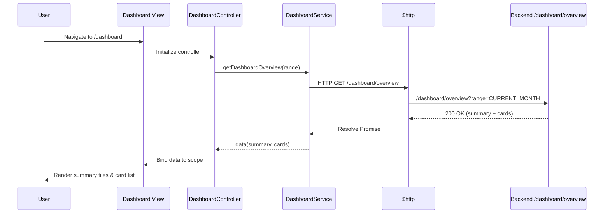
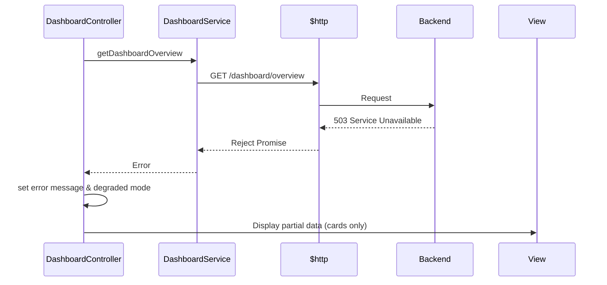
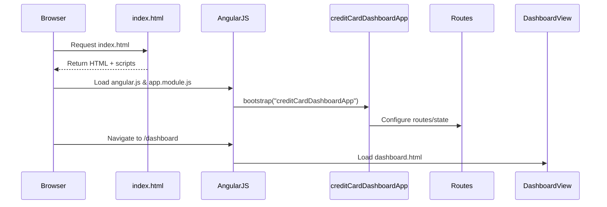
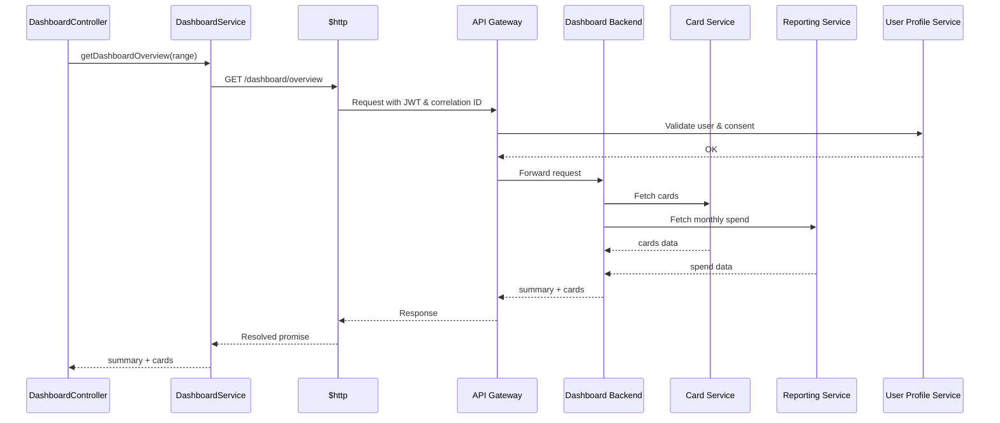
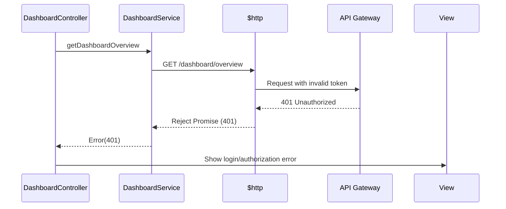

# Low-Level Design (LLD) – Credit Card Analysis Dashboard

**Epic ID:** QE-3635  
**Application Name:** CreditCardAnalysisDashboard  
**Technology Stack:**
- AngularJS (1.x) – SPA front-end
- JavaScript ES6 (transpiled/bundled for legacy support)
- HTML5, CSS3, Bootstrap
- REST APIs (JSON over HTTPS)
- MVC Architecture (AngularJS modules/controllers/services/views)

---

## 1. Application Architecture

### 1.1 AngularJS MVC Mapping

The HLD’s logical components are mapped to AngularJS MVC artifacts as follows:

- **Browser UI Layer (SPA / Responsive Web App)**
  - `creditCardDashboardApp` (AngularJS root module)
  - Feature module: `ccd.dashboard` (Dashboard feature)
  - Controllers:
    - `DashboardController` – main dashboard controller
    - `CardListController` – manages per-card listing and selection
  - Directives/Components:
    - `ccdSummaryTiles` – summary KPI tiles
    - `ccdCardList` – responsive card list panel
    - `ccdMonthlySpendChart` – monthly spend visualization wrapper
    - `ccdErrorBanner` – reusable error/info banner
  - Views (HTML templates):
    - `views/dashboard/dashboard.html`
    - Partial templates for widgets

- **Application Service Layer (Dashboard Service)** → AngularJS Services:
  - `DashboardService` – orchestrates API calls to backend dashboard endpoints
  - `UserContextService` – holds authenticated user metadata and consent state

- **Card Service / Transaction Service / Reporting & Aggregation / User Profile**
  - Represented as REST backends exposed via API Gateway.
  - AngularJS side:
    - `CardApiService` – `/api/cards` endpoints
    - `TransactionApiService` – `/api/transactions` endpoints
    - `ReportingApiService` – `/api/reporting` endpoints
    - `UserProfileApiService` – `/api/user-profile` endpoints

- **Security & Logging Related HLD Components**
  - JWT token handling and headers – `AuthInterceptor` (HTTP interceptor)
  - Audit/log correlation IDs – `LoggingService`
  - Configuration & environment – `ConfigService`

### 1.2 Project Folder Structure

```text
CreditCardAnalysisDashboard/
  index.html
  app/
    app.module.js
    app.config.js
    app.routes.js
    app.constants.js

    core/
      services/
        config.service.js
        auth.interceptor.js
        logging.service.js
        user-context.service.js
      models/
        card.model.js
        transaction.model.js
        dashboard-summary.model.js
        user-profile.model.js
      filters/
        currency-locale.filter.js
        date-range.filter.js

    dashboard/
      dashboard.module.js
      controllers/
        dashboard.controller.js
        card-list.controller.js
      services/
        dashboard.service.js
        card-api.service.js
        transaction-api.service.js
        reporting-api.service.js
        user-profile-api.service.js
      directives/
        summary-tiles.directive.js
        card-list.directive.js
        monthly-spend-chart.directive.js
        error-banner.directive.js
      views/
        dashboard.html
        partials/
          summary-tiles.html
          card-list.html
          monthly-spend-chart.html
          error-banner.html

  assets/
    css/
      main.css
      dashboard.css
    js/
      vendor/   (AngularJS, Bootstrap, etc.)
    img/
      icons/

  config/
    env.dev.json
    env.test.json
    env.prod.json

  test/
    unit/
    e2e/
```

---

## 2. Component Specifications

### 2.1 AngularJS Modules

#### 2.1.1 Root Module – `creditCardDashboardApp`

- **Type:** AngularJS Module
- **File:** `app/app.module.js`
- **Responsibility:**
  - Bootstrap the AngularJS SPA.
  - Declare core dependencies (ngRoute/ui.router, ngAnimate, etc.).
- **Public API:** N/A (configuration only)
- **Dependencies:**
  - `ngRoute` or `ui.router`
  - `ccd.dashboard`
  - Any shared/core modules

```js
angular.module('creditCardDashboardApp', [
  'ngRoute',
  'ccd.dashboard'
]);
```

#### 2.1.2 Feature Module – `ccd.dashboard`

- **Type:** AngularJS Module
- **File:** `app/dashboard/dashboard.module.js`
- **Responsibility:**
  - Encapsulate dashboard-related controllers, services, directives.
- **Dependencies:**
  - `ngResource` (optional)
  - `ui.bootstrap` for Bootstrap components

```js
angular.module('ccd.dashboard', ['ngResource', 'ui.bootstrap']);
```

### 2.2 Controllers

#### 2.2.1 `DashboardController`

- **File:** `app/dashboard/controllers/dashboard.controller.js`
- **Responsibility:**
  - Control the overall dashboard view.
  - Trigger initial load of consolidated metrics.
  - Manage state for summary tiles, loading, and global errors.
- **Public Methods:**
  - `init()` – called on controller initialization.
  - `refreshDashboard()` – reloads dashboard metrics.
  - `onDateRangeChange(range)` – handles changes in date filters.
- **Inputs:**
  - Date range (e.g., current month, last 3 months).
  - User context from `UserContextService`.
- **Outputs:**
  - `vm.summary` (dashboard summary model).
  - `vm.cards` (array of card models).
  - `vm.errors` (error messages for UI).
- **Dependencies (Injected):**
  - `DashboardService`
  - `UserContextService`
  - `$log`

```js
class DashboardController {
  constructor(DashboardService, UserContextService, $log) {
    'ngInject';
    this.DashboardService = DashboardService;
    this.UserContextService = UserContextService;
    this.$log = $log;

    this.summary = null;
    this.cards = [];
    this.isLoading = false;
    this.error = null;
  }

  $onInit() {
    this.init();
  }

  init() {
    this.refreshDashboard();
  }

  refreshDashboard() {
    this.isLoading = true;
    this.error = null;

    const range = { type: 'CURRENT_MONTH' };

    this.DashboardService
      .getDashboardOverview(range)
      .then((data) => {
        this.summary = data.summary;
        this.cards = data.cards;
      })
      .catch((err) => {
        this.$log.error('Failed to load dashboard', err);
        this.error = 'Unable to load dashboard at this time.';
      })
      .finally(() => {
        this.isLoading = false;
      });
  }

  onDateRangeChange(range) {
    this.refreshDashboard(range);
  }
}

angular
  .module('ccd.dashboard')
  .controller('DashboardController', DashboardController);
```

#### 2.2.2 `CardListController`

- **File:** `app/dashboard/controllers/card-list.controller.js`
- **Responsibility:**
  - Manage per-card interactions (selection, expansion, etc.).
- **Public Methods:**
  - `selectCard(card)` – selects a card.
- **Inputs:**
  - `cards` (bound from parent controller/directive).
- **Outputs:**
  - `selectedCard` (currently active card).
- **Dependencies:** None beyond Angular core.

```js
class CardListController {
  constructor() {
    'ngInject';
    this.selectedCard = null;
  }

  selectCard(card) {
    this.selectedCard = card;
  }
}

angular
  .module('ccd.dashboard')
  .controller('CardListController', CardListController);
```

### 2.3 Services

#### 2.3.1 `DashboardService`

- **File:** `app/dashboard/services/dashboard.service.js`
- **Responsibility:**
  - Orchestrate backend calls to retrieve dashboard overview.
  - Apply client-side aggregation if required.
  - Encapsulate error and fallback logic for dashboard-specific needs.
- **Public Methods:**
  - `getDashboardOverview(dateRange)` → `Promise<DashboardOverview>`
- **Inputs:**
  - `dateRange` (object with from/to or named range).
- **Outputs:**
  - Consolidated object: `{ summary, cards }`.
- **Dependencies (Injected):**
  - `$http`
  - `ConfigService`
  - `LoggingService`

```js
class DashboardService {
  constructor($http, ConfigService, LoggingService, $q) {
    'ngInject';
    this.$http = $http;
    this.ConfigService = ConfigService;
    this.LoggingService = LoggingService;
    this.$q = $q;
  }

  getDashboardOverview(dateRange) {
    const url = `${this.ConfigService.apiBaseUrl}/dashboard/overview`;
    const params = this._buildRangeParams(dateRange);

    const correlationId = this.LoggingService.newCorrelationId();

    return this.$http
      .get(url, {
        params,
        headers: { 'X-Correlation-Id': correlationId }
      })
      .then(res => res.data)
      .catch(err => {
        this.LoggingService.error('DashboardService.getDashboardOverview', err, correlationId);
        return this.$q.reject(err);
      });
  }

  _buildRangeParams(range) {
    // Convert logical range into query params
    if (range && range.type === 'CURRENT_MONTH') {
      return { range: 'CURRENT_MONTH' };
    }
    return range || {};
  }
}

angular
  .module('ccd.dashboard')
  .service('DashboardService', DashboardService);
```

#### 2.3.2 `CardApiService`

- **File:** `app/dashboard/services/card-api.service.js`
- **Responsibility:**
  - Direct interaction with Card Service APIs.
- **Public Methods:**
  - `getUserCards()` → `Promise<Card[]>`
- **Dependencies:**
  - `$http`, `ConfigService`, `LoggingService`

```js
class CardApiService {
  constructor($http, ConfigService, LoggingService, $q) {
    'ngInject';
    this.$http = $http;
    this.ConfigService = ConfigService;
    this.LoggingService = LoggingService;
    this.$q = $q;
  }

  getUserCards() {
    const url = `${this.ConfigService.apiBaseUrl}/cards`;
    const correlationId = this.LoggingService.newCorrelationId();

    return this.$http
      .get(url, { headers: { 'X-Correlation-Id': correlationId } })
      .then(res => res.data.cards)
      .catch(err => {
        this.LoggingService.error('CardApiService.getUserCards', err, correlationId);
        return this.$q.reject(err);
      });
  }
}

angular
  .module('ccd.dashboard')
  .service('CardApiService', CardApiService);
```

#### 2.3.3 `TransactionApiService`

- **File:** `app/dashboard/services/transaction-api.service.js`
- **Responsibility:**
  - Access transaction data when needed.
- **Public Methods:**
  - `getTransactions(filter)` → `Promise<Transaction[]>`

#### 2.3.4 `ReportingApiService`

- **File:** `app/dashboard/services/reporting-api.service.js`
- **Responsibility:**
  - Fetch aggregated monthly spend and other KPIs.
- **Public Methods:**
  - `getMonthlySpend(range)`

#### 2.3.5 `UserProfileApiService`

- **File:** `app/dashboard/services/user-profile-api.service.js`
- **Responsibility:**
  - Fetch user profile, locale, and consent flags.

#### 2.3.6 `UserContextService`

- **File:** `app/core/services/user-context.service.js`
- **Responsibility:**
  - Cache user context and consent for reuse across controllers/services.

#### 2.3.7 `ConfigService`

- **File:** `app/core/services/config.service.js`
- **Responsibility:**
  - Load environment-specific configuration (API base URLs, feature flags).

#### 2.3.8 `LoggingService`

- **File:** `app/core/services/logging.service.js`
- **Responsibility:**
  - Standardize logging (info/warn/error) and correlation IDs.

### 2.4 Directives / Components

#### 2.4.1 `ccdSummaryTiles`

- **File:** `app/dashboard/directives/summary-tiles.directive.js`
- **Template:** `app/dashboard/views/partials/summary-tiles.html`
- **Responsibility:**
  - Display summary metrics: total credit limit, available credit, outstanding amount, monthly spend.
- **Inputs (Isolate Scope):**
  - `summary` – bound summary model.

```js
function ccdSummaryTiles() {
  return {
    restrict: 'E',
    scope: {
      summary: '='
    },
    templateUrl: 'app/dashboard/views/partials/summary-tiles.html'
  };
}

angular
  .module('ccd.dashboard')
  .directive('ccdSummaryTiles', ccdSummaryTiles);
```

#### 2.4.2 `ccdCardList`

- **File:** `app/dashboard/directives/card-list.directive.js`
- **Template:** `app/dashboard/views/partials/card-list.html`
- **Responsibility:**
  - Render list of cards with key details.
- **Inputs:**
  - `cards` – array of card models.

#### 2.4.3 `ccdMonthlySpendChart`

- **File:** `app/dashboard/directives/monthly-spend-chart.directive.js`
- **Template:** `app/dashboard/views/partials/monthly-spend-chart.html`
- **Responsibility:**
  - Render monthly spend chart using charting library (e.g., Chart.js).
- **Inputs:**
  - `data` – timeseries data of monthly spend.

#### 2.4.4 `ccdErrorBanner`

- **File:** `app/dashboard/directives/error-banner.directive.js`
- **Template:** `app/dashboard/views/partials/error-banner.html`
- **Responsibility:**
  - Show user-friendly error messages or degraded-mode notices.
- **Inputs:**
  - `message` – error text.

### 2.5 Filters

- **`currencyLocale` Filter** – adjusts currency formatting per user locale.
- **`dateRange` Filter** – displays a user-friendly label for date ranges.

---

## 3. Component Responsibilities

### 3.1 Controllers

- **DashboardController**
  - Owns high-level dashboard state (summary metrics, cards, loading/error flags).
  - Delegates data retrieval to `DashboardService`.
  - Handles user actions like changing date range and triggering refresh.
  - Does not contain business rules beyond orchestration and simple UI logic.

- **CardListController**
  - Handles UI state for card selection and highlighting.
  - Delegates any non-trivial logic (e.g., per-card calculations) to services or models.

### 3.2 Services

- **DashboardService**
  - Orchestrates the call to backend `/dashboard/overview` endpoint.
  - Enforces client-side constraints (e.g., valid range values) before sending requests.
  - Logs failures and returns meaningful rejections for controllers.

- **CardApiService / TransactionApiService / ReportingApiService / UserProfileApiService**
  - Each maps directly to a backend service defined in HLD.
  - No UI logic; pure data access and minimal transformation.

- **ConfigService**
  - Central point for environment-specific values.

- **LoggingService**
  - Central point for console/remote logging.

- **UserContextService**
  - Maintains the authenticated user’s identity, locale, and consent.

### 3.3 Directives

- **Summary tiles directive**
  - Only presentational logic (no data access).

- **Card list directive**
  - Only presentational logic and minor interaction handling.

- **Monthly spend chart directive**
  - Encapsulates 3rd-party chart library usage; controllers pass data only.

- **Error banner directive**
  - Standard way to show errors; ensures consistent UX.

---

## 4. Interface Specifications

### 4.1 REST API Interfaces (Client-Side Contracts)

#### 4.1.1 Dashboard Overview

- **Endpoint:** `/dashboard/overview`
- **HTTP Method:** `GET`
- **Request:**
  - Headers:
    - `Authorization: Bearer <JWT>`
    - `X-Correlation-Id: <UUID>`
  - Query Params:
    - `range` (string; e.g., `CURRENT_MONTH`, `LAST_3_MONTHS`)
- **Response (200):**

```json
{
  "summary": {
    "totalCreditLimit": 15000.00,
    "totalAvailableCredit": 8000.00,
    "totalOutstanding": 7000.00,
    "monthlySpend": 1200.00,
    "currency": "USD",
    "asOfDate": "2024-07-31"
  },
  "cards": [
    {
      "cardId": "CARD-001",
      "maskedNumber": "**** **** **** 1234",
      "productType": "Visa Platinum",
      "creditLimit": 5000.00,
      "availableCredit": 3000.00,
      "outstandingAmount": 2000.00,
      "currency": "USD"
    }
  ]
}
```

- **Error Responses:**
  - `401 Unauthorized` – invalid or expired token.
  - `403 Forbidden` – consent not granted or access denied by policy.
  - `500 Internal Server Error` – generic server failure.

#### 4.1.2 Card Service (Sample)

- **Endpoint:** `/cards`
- **Method:** `GET`
- **Response:**

```json
{
  "cards": [
    {
      "cardId": "CARD-001",
      "maskedNumber": "**** **** **** 1234",
      "productType": "Visa Platinum",
      "creditLimit": 5000.00,
      "availableCredit": 3000.00,
      "outstandingAmount": 2000.00,
      "currency": "USD"
    }
  ]
}
```

#### 4.1.3 Reporting Service – Monthly Spend

- **Endpoint:** `/reporting/monthly-spend`
- **Method:** `GET`
- **Query Params:**
  - `from` (ISO date)
  - `to` (ISO date)

- **Response:**

```json
{
  "monthlySpend": 1200.00,
  "currency": "USD",
  "period": {
    "from": "2024-07-01",
    "to": "2024-07-31"
  }
}
```

### 4.2 AngularJS Internal Interfaces

- **Controllers → Services:**
  - Controllers call service methods returning promises; they never use `$http` directly.
- **Directives → Controllers:**
  - Input bindings via isolate scope or `bindToController`.
- **Interceptors:**
  - `AuthInterceptor` attaches tokens and handles 401/403.

---

## 5. Data Model Design

### 5.1 Models

#### 5.1.1 `Card` Model

- **File:** `app/core/models/card.model.js`
- **Structure:**

```js
export class Card {
  constructor({
    cardId = null,
    maskedNumber = '',
    productType = '',
    creditLimit = 0.0,
    availableCredit = 0.0,
    outstandingAmount = 0.0,
    currency = 'USD'
  } = {}) {
    this.cardId = cardId;
    this.maskedNumber = maskedNumber;
    this.productType = productType;
    this.creditLimit = creditLimit;
    this.availableCredit = availableCredit;
    this.outstandingAmount = outstandingAmount;
    this.currency = currency;
  }
}
```

- **Validation Rules:**
  - `creditLimit`, `availableCredit`, `outstandingAmount` ≥ 0.
  - `maskedNumber` never contains full PAN.

#### 5.1.2 `DashboardSummary` Model

- **File:** `app/core/models/dashboard-summary.model.js`

```js
export class DashboardSummary {
  constructor({
    totalCreditLimit = 0.0,
    totalAvailableCredit = 0.0,
    totalOutstanding = 0.0,
    monthlySpend = 0.0,
    currency = 'USD',
    asOfDate = null
  } = {}) {
    this.totalCreditLimit = totalCreditLimit;
    this.totalAvailableCredit = totalAvailableCredit;
    this.totalOutstanding = totalOutstanding;
    this.monthlySpend = monthlySpend;
    this.currency = currency;
    this.asOfDate = asOfDate;
  }
}
```

- **Validation Rules:**
  - All numeric fields ≥ 0.
  - `currency` must be ISO 4217 code.

#### 5.1.3 `UserProfile` Model

- Attributes: `userId`, `locale`, `preferredCurrency`, `consentFlags`.

#### 5.1.4 `Transaction` Model

- Attributes: `transactionId`, `cardId`, `amount`, `currency`, `date`, `category`.

### 5.2 State Transitions

- **DashboardSummary State:**
  - `UNINITIALIZED` → `LOADING` → `READY` or `ERROR`.
  - Represented via controller flags (`isLoading`, `error`).

- **Card Selection State:**
  - `selectedCard` `null` → `Card` instance on user selection.

---

## 6. Data Flow

### 6.1 High-Level Flow

1. **User Action:** User navigates to `/dashboard`.
2. **View:** `dashboard.html` loads, `DashboardController` initialized.
3. **Controller:** `DashboardController.init()` calls `DashboardService.getDashboardOverview()`.
4. **Service:** `DashboardService` calls backend `/dashboard/overview` via `$http`.
5. **API Gateway / Backend:** Dashboard microservice fetches cards and aggregates metrics.
6. **Response:** JSON payload returned and transformed to models.
7. **UI Update:** Controller updates `summary` and `cards`; directives render tiles and list.

### 6.2 Detailed Sequence – Successful Load



### 6.3 Error Flow – Reporting Service Unavailable



---

## 7. Sequence Diagrams

### 7.1 Application Initialization



### 7.2 Primary User Workflow – Dashboard View

(Already covered in section 6.2.)

### 7.3 Service/API Interactions



### 7.4 Error Handling Scenario – Unauthorized



---

## 8. Implementation Details

### 8.1 AngularJS Implementation Approach

- Use **component-based** directives for reuse and testability.
- Controllers in `controllerAs` syntax with ES6 classes.
- Strict DI annotations using `'ngInject'` to support minification.

### 8.2 JavaScript ES6 Patterns

- Use classes for services and models, compiled via Babel if needed.
- Arrow functions for callbacks where appropriate.
- Template literals for URLs and logs.

### 8.3 Dependency Injection

- Services and controllers registered via `.service()` and `.controller()`.
- HTTP interceptor `AuthInterceptor` registered in `app.config.js`.

```js
function AuthInterceptor($q, UserContextService) {
  'ngInject';
  return {
    request(config) {
      const token = UserContextService.getToken();
      if (token) {
        config.headers.Authorization = `Bearer ${token}`;
      }
      return config;
    },
    responseError(rejection) {
      // global 401/403 handling
      return $q.reject(rejection);
    }
  };
}

angular
  .module('creditCardDashboardApp')
  .factory('AuthInterceptor', AuthInterceptor)
  .config(($httpProvider) => {
    'ngInject';
    $httpProvider.interceptors.push('AuthInterceptor');
  });
```

### 8.4 Business Logic Flow

- All aggregation logic resides in backend; front-end assumes aggregated values.
- Front-end validation ensures ranges are allowed and fields non-empty.

### 8.5 Validation Logic

- Date range controls prevented from selecting future dates.
- Input fields sanitized to avoid script injections.
- Strict client-side type checking (e.g., numeric fields parsed via `Number`).

### 8.6 State Management

- Use controller state fields (`isLoading`, `error`, `summary`, `cards`).
- No global state libraries required (single-page simple dashboard).

### 8.7 DOM Interaction

- DOM interactions via directives only; no direct DOM manipulation in controllers.
- Use Bootstrap classes for responsive layout.

### 8.8 API Integration

- All API calls pass through `$http` with base URL from `ConfigService`.
- Correlation IDs and Authorization headers attached via interceptor and services.

---

## 9. Configuration

### 9.1 AngularJS Configuration Files

- `app/app.config.js`
  - Configure routes and HTTP interceptors.
- `app/app.constants.js`
  - Define constant values (e.g., API path prefixes).

### 9.2 Environment-Specific Properties

- `config/env.dev.json`, `env.test.json`, `env.prod.json` include:
  - `apiBaseUrl`
  - `featureFlags` (e.g., `enableMonthlySpendChart`)
  - `logLevel`

- `ConfigService` loads appropriate env file during bootstrap.

### 9.3 API Base URLs

- Example `env.prod.json`:

```json
{
  "apiBaseUrl": "https://api.prod.bank.com", 
  "featureFlags": {
    "enableMonthlySpendChart": true
  },
  "logLevel": "INFO"
}
```

### 9.4 Feature Flags

- Controlled via `featureFlags` section; directives/components check flags to enable/disable optional features.

### 9.5 Logging & Telemetry

- `LoggingService` sends logs to browser console in dev, to remote endpoint in prod.
- Telemetry headers (e.g., `X-Correlation-Id`) added to every request.

---

## 10. Error Handling and Resiliency

### 10.1 Client-Side Exception Handling

- Use `$exceptionHandler` override to capture uncaught exceptions and send to `LoggingService`.

```js
angular
  .module('creditCardDashboardApp')
  .factory('$exceptionHandler', (LoggingService) => {
    'ngInject';
    return (exception, cause) => {
      LoggingService.error('Unhandled exception', { exception, cause });
    };
  });
```

### 10.2 REST API Error Handling

- HTTP interceptor normalizes error responses.
- DashboardController shows specific messages for 401/403/5xx.

### 10.3 Retry Mechanisms

- For idempotent GET requests, optional retry logic in services using limited attempts and exponential backoff.

### 10.4 Logging Strategy

- All failed HTTP requests logged with correlation ID.
- User actions (e.g., dashboard viewed) logged on backend; front-end may send `X-Action` header.

### 10.5 Recovery & Fallback Behavior

- If monthly spend fails but card data succeeds:
  - Show cards and tile values for limit/available/outstanding.
  - Monthly spend tile shows “temporarily unavailable”.
- If all calls fail:
  - Show `ccdErrorBanner` with generic error message.

---

## 11. Security Considerations

### 11.1 Input Validation & Sanitization

- Use AngularJS built-in input sanitization for bindings.
- Apply `$sanitize` where binding HTML (if ever needed).
- Client-side validation of date ranges and numeric inputs.

### 11.2 XSS Prevention

- No `ng-bind-html` except where sanitized.
- Use `ng-bind`/`{{ }}` (auto-escaped) for all dynamic values.

### 11.3 CSRF Protection

- Leverage backend CSRF strategy; front-end includes CSRF token header if provided.

### 11.4 Secure API Communication

- All API URLs use `https://`.
- HSTS configured at server; front-end configured only with HTTPS endpoints.

### 11.5 Authentication & Authorization Integration

- JWT stored in `sessionStorage` or secure cookies as per security guidelines.
- `UserContextService` only reads token from secure storage; never logs token or PII.

### 11.6 Sensitive Data Handling

- Card numbers displayed only in masked format.
- No CVV, full PAN, or sensitive PII stored in front-end.
- No caching of responses in localStorage if they contain PII (use in-memory only).

### 11.7 Audit Logging Approach

- Front-end passes correlation IDs and user action hints; actual audit logging executed in backend per HLD.

---

## 12. Summary

This LLD maps the high-level architecture of the credit card analysis dashboard to a concrete AngularJS-based implementation. It defines modules, controllers, services, directives, data models, REST contracts, configuration, and error/security strategies sufficient for a development team to implement the dashboard without further reference to the HLD.
