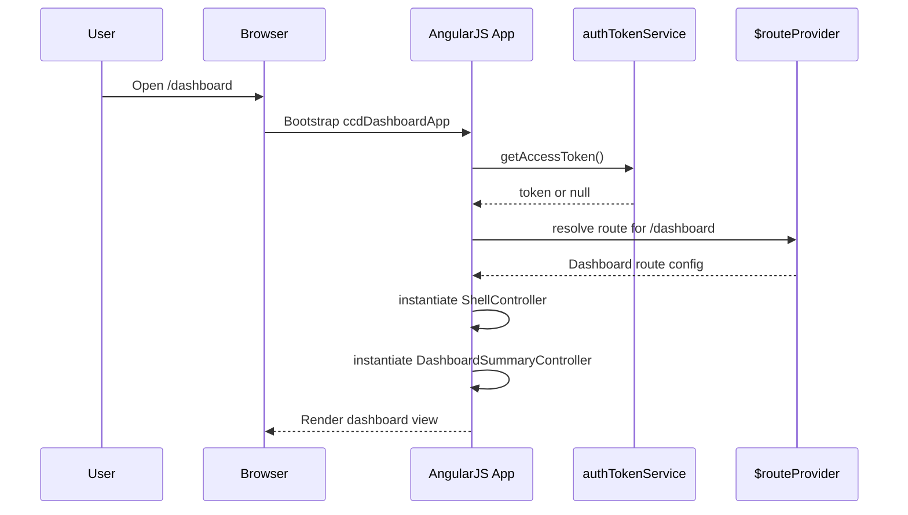
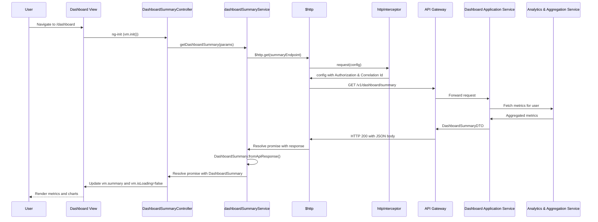

# Low-Level Design (LLD) – Credit Card Analysis Dashboard

Epic: QE-3661  
Application Name: CreditCardAnalysisDashboard

---

## 1. Application Architecture

### 1.1 Technology Stack Mapping

- **Frontend**: AngularJS 1.x, JavaScript (ES6 features transpiled where needed), HTML5, CSS3, Bootstrap 3/4.
- **Frontend Pattern**: AngularJS MVC + componentized directives.
- **Backend APIs**: REST over HTTPS (JSON), implemented outside the scope of this LLD but fully specified here as interfaces.
- **Architecture Style**: SPA consuming RESTful services via an API Gateway and Dashboard Application Service.

### 1.2 AngularJS MVC Mapping

The SPA is organized as a single AngularJS application module:

- **Root Module**: `ccdDashboardApp`
- **Feature Modules**:
  - `ccd.core` – core services, configuration, constants, logging.
  - `ccd.layout` – layout shell, navbar, footer, responsive container.
  - `ccd.dashboard` – dashboard summary view and controllers.
  - `ccd.cards` – per-card views (placeholder for future epics, minimal in this epic).
  - `ccd.shared` – reusable directives, filters, and models.

Controllers own view state and orchestrate service calls; services own business logic and API communication; directives own reusable UI components.

### 1.3 AngularJS Artifacts and Files

**Root Application Files**
- `app/app.module.js` – defines `ccdDashboardApp`, wires feature modules.
- `app/app.config.js` – configures routes, `$httpProvider`, interceptors, logging.
- `app/app.run.js` – application initialization logic (e.g., auth bootstrap, global handlers).

**Core Module (`ccd.core`)**
- `app/core/core.module.js`
- `app/core/config/env.config.js` – environment-specific settings.
- `app/core/config/api.config.js` – API base URLs and endpoint paths.
- `app/core/services/http-interceptor.factory.js` – global HTTP interceptor.
- `app/core/services/auth-token.service.js` – token storage, retrieval, refresh.
- `app/core/services/logging.service.js` – logging abstraction.
- `app/core/services/error-handler.service.js` – centralized error handling.

**Layout Module (`ccd.layout`)**
- `app/layout/layout.module.js`
- `app/layout/shell.controller.js` – root shell controller.
- `app/layout/navbar.directive.js` – top navigation bar.
- `app/layout/footer.directive.js` – footer.

**Dashboard Module (`ccd.dashboard`)**
- `app/dashboard/dashboard.module.js`
- `app/dashboard/dashboard.routes.js`
- `app/dashboard/controllers/dashboard-summary.controller.js`
- `app/dashboard/services/dashboard-summary.service.js`
- `app/dashboard/models/dashboard-summary.model.js`
- `app/dashboard/directives/kpi-tile.directive.js`
- `app/dashboard/directives/summary-chart.directive.js`

**Shared Module (`ccd.shared`)**
- `app/shared/shared.module.js`
- `app/shared/directives/loading-spinner.directive.js`
- `app/shared/directives/error-banner.directive.js`
- `app/shared/filters/currency-with-symbol.filter.js`
- `app/shared/filters/percentage.filter.js`
- `app/shared/models/card.model.js`
- `app/shared/models/transaction-aggregate.model.js`

**Assets & Config**
- `index.html` – main shell.
- `assets/css/app.css` – custom CSS.
- `assets/css/responsive.css` – responsive breakpoints.
- `assets/js/vendor/` – third-party scripts.
- `config/env/dev.json`, `config/env/test.json`, `config/env/prod.json` – environment configuration files (consumed at build-time or injected).

### 1.4 Recommended Folder Structure

```text
/
├── index.html
├── app/
│   ├── app.module.js
│   ├── app.config.js
│   ├── app.run.js
│   ├── core/
│   │   ├── core.module.js
│   │   ├── config/
│   │   │   ├── env.config.js
│   │   │   └── api.config.js
│   │   ├── services/
│   │   │   ├── http-interceptor.factory.js
│   │   │   ├── auth-token.service.js
│   │   │   ├── logging.service.js
│   │   │   └── error-handler.service.js
│   ├── layout/
│   │   ├── layout.module.js
│   │   ├── shell.controller.js
│   │   ├── navbar.directive.js
│   │   └── footer.directive.js
│   ├── dashboard/
│   │   ├── dashboard.module.js
│   │   ├── dashboard.routes.js
│   │   ├── controllers/
│   │   │   └── dashboard-summary.controller.js
│   │   ├── services/
│   │   │   └── dashboard-summary.service.js
│   │   ├── models/
│   │   │   └── dashboard-summary.model.js
│   │   └── directives/
│   │       ├── kpi-tile.directive.js
│   │       └── summary-chart.directive.js
│   ├── shared/
│   │   ├── shared.module.js
│   │   ├── directives/
│   │   │   ├── loading-spinner.directive.js
│   │   │   └── error-banner.directive.js
│   │   ├── filters/
│   │   │   ├── currency-with-symbol.filter.js
│   │   │   └── percentage.filter.js
│   │   └── models/
│   │       ├── card.model.js
│   │       └── transaction-aggregate.model.js
├── assets/
│   ├── css/
│   │   ├── app.css
│   │   └── responsive.css
│   └── js/vendor/
└── config/
    └── env/
        ├── dev.json
        ├── test.json
        └── prod.json
```

---

## 2. Component Specifications

### 2.1 Root Module – `ccdDashboardApp`

- **Type**: AngularJS Module
- **File**: `app/app.module.js`
- **Responsibility**: Root AngularJS module bootstrapping the SPA and declaring dependencies.
- **Public API**: N/A (configuration only).
- **Dependencies**:
  - `ngRoute`
  - `ngAnimate`
  - `ngSanitize`
  - `ccd.core`, `ccd.layout`, `ccd.dashboard`, `ccd.shared`.

### 2.2 App Configuration – Routing & HTTP

- **Type**: AngularJS Config Block
- **File**: `app/app.config.js`
- **Responsibility**:
  - Configure `$routeProvider` for navigation.
  - Configure `$httpProvider` interceptors.
  - Enforce secure headers and timeouts.
- **Key Methods**:
  - `configureRoutes($routeProvider)` – defines `/dashboard` route.
  - `configureHttp($httpProvider)` – attaches `httpInterceptor`.

### 2.3 App Run – Initialization

- **Type**: AngularJS Run Block
- **File**: `app/app.run.js`
- **Responsibility**:
  - Initialize auth state from token storage.
  - Set up global `$rootScope` handlers for route changes, errors.
  - Register global correlation ID per session.
- **Key Methods**:
  - `onRouteChangeStart` – guard routes requiring authentication.
  - `onRouteChangeError` – delegate to `errorHandlerService`.

### 2.4 Core Services

#### 2.4.1 `envConfig` Service

- **Type**: Service (Factory returning configuration object)
- **File**: `app/core/config/env.config.js`
- **Responsibility**:
  - Provide environment-specific properties (API base URL, logging level, feature flags).
- **Public Methods**:
  - `get(key: string): any`
  - `getAll(): Object`
- **Inputs/Outputs**:
  - Input: `key` string.
  - Output: value from loaded env configuration.
- **Dependencies**: `$window` (optional for injected env).

#### 2.4.2 `apiConfig` Constant

- **Type**: AngularJS Constant
- **File**: `app/core/config/api.config.js`
- **Responsibility**:
  - Expose endpoint paths for dashboard APIs.
- **Structure**:
  ```js
  const apiConfig = {
    baseUrl: '<to-be-injected-from-env>',
    endpoints: {
      dashboardSummary: '/v1/dashboard/summary'
    }
  };
  ```

#### 2.4.3 `httpInterceptor` Factory

- **Type**: HTTP Interceptor
- **File**: `app/core/services/http-interceptor.factory.js`
- **Responsibility**:
  - Attach auth token to outgoing requests.
  - Add correlation ID headers.
  - Handle global HTTP errors (401, 403, 5xx).
- **Public Methods**:
  - `request(config)` – mutate headers, add `Authorization` and `X-Correlation-Id`.
  - `response(response)` – logging success.
  - `responseError(rejection)` – delegate to `errorHandlerService`.
- **Dependencies**:
  - `authTokenService`, `loggingService`, `errorHandlerService`, `$q`.

#### 2.4.4 `authTokenService`

- **Type**: Service
- **File**: `app/core/services/auth-token.service.js`
- **Responsibility**:
  - Manage storage and retrieval of OAuth2/OIDC tokens.
- **Public Methods**:
  - `getAccessToken(): string|null`
  - `setAccessToken(token: string): void`
  - `clear(): void`
- **Dependencies**: `$window` (localStorage or sessionStorage), with security considerations.

#### 2.4.5 `loggingService`

- **Type**: Service
- **File**: `app/core/services/logging.service.js`
- **Responsibility**:
  - Provide unified logging API (info, warn, error, audit) to integrate with central logging.
- **Public Methods**:
  - `info(message, context?)`
  - `warn(message, context?)`
  - `error(message, context?, error?)`
  - `audit(eventType, payload)` – security/audit logs.
- **Dependencies**: `$log`, possibly external log collector.

#### 2.4.6 `errorHandlerService`

- **Type**: Service
- **File**: `app/core/services/error-handler.service.js`
- **Responsibility**:
  - Centralize client-side error handling and user-friendly messages.
- **Public Methods**:
  - `handleHttpError(rejection)` – map status codes to error models.
  - `handleClientError(error)` – non-HTTP errors.
  - `getUserMessage(errorModel)` – formatted user message.
- **Dependencies**: `loggingService`.

### 2.5 Layout Components

#### 2.5.1 `ShellController`

- **Type**: Controller
- **File**: `app/layout/shell.controller.js`
- **Responsibility**:
  - Manage high-level application chrome (loading state, global error banner visibility).
- **Scope/VM Properties**:
  - `vm.isLoading: boolean`
  - `vm.globalError: ErrorModel|null`
- **Dependencies**: `$rootScope`, `loggingService`.

#### 2.5.2 `navbar` Directive

- **Type**: Directive
- **File**: `app/layout/navbar.directive.js`
- **Responsibility**:
  - Render navigation bar with application name and links (Dashboard, Help, etc.).
- **Bindings**: none or simple config.
- **Template**: `app/layout/navbar.html`.

#### 2.5.3 `footer` Directive

- **Type**: Directive
- **File**: `app/layout/footer.directive.js`
- **Responsibility**:
  - Render footer with compliance/legal text.

### 2.6 Dashboard Components

#### 2.6.1 `DashboardSummaryController`

- **Type**: Controller
- **File**: `app/dashboard/controllers/dashboard-summary.controller.js`
- **Responsibility**:
  - Orchestrate loading of dashboard summary metrics.
  - Manage UI state (loading, success, error, degraded mode).
- **Public Methods**:
  - `vm.init()` – initial load of summary.
  - `vm.refresh()` – manual reload by user.
- **Scope/VM Properties**:
  - `vm.summary: DashboardSummary` – model instance.
  - `vm.isLoading: boolean`
  - `vm.isDegraded: boolean` – using cached/partial data.
  - `vm.error: ErrorModel|null`
- **Dependencies**:
  - `dashboardSummaryService`, `loggingService`, `errorHandlerService`.

#### 2.6.2 `dashboardSummaryService`

- **Type**: Service
- **File**: `app/dashboard/services/dashboard-summary.service.js`
- **Responsibility**:
  - Call backend REST API via API Gateway to fetch dashboard summary metrics.
  - Apply client-side business rules (e.g., derived metrics, basic validation).
- **Public Methods**:
  - `getDashboardSummary(params: SummaryQueryParams): Promise<DashboardSummary>`
- **Inputs**:
  - `params`: `{ fromDate?: Date, toDate?: Date }` with defaults to current month.
- **Outputs**:
  - Resolved `DashboardSummary` instance or rejection with error model.
- **Dependencies**:
  - `$http`, `envConfig`, `apiConfig`, `DashboardSummary`, `loggingService`.

#### 2.6.3 `DashboardSummary` Model

- **Type**: Constructor/Factory
- **File**: `app/dashboard/models/dashboard-summary.model.js`
- **Responsibility**:
  - Represent aggregated dashboard metrics.
- **Attributes**:
  - `totalCreditLimit: number`
  - `totalOutstanding: number`
  - `availableCredit: number`
  - `monthlySpend: number`
  - `currency: string`
  - `asOfDate: Date`
  - `isCached: boolean` – indicates cached metrics.
- **Methods**:
  - `fromApiResponse(apiPayload)` – static factory.
  - `computeAvailableCredit()` – verifies `totalCreditLimit - totalOutstanding`.

#### 2.6.4 `kpiTile` Directive

- **Type**: Directive (Isolated Scope)
- **File**: `app/dashboard/directives/kpi-tile.directive.js`
- **Responsibility**:
  - Render a single KPI tile (e.g., Monthly Spend, Total Credit Limit).
- **Bindings**:
  - `title: @`
  - `value: =`
  - `unit: @` (e.g., currency symbol)
  - `description: @` (tooltip)
- **Template**: `app/dashboard/directives/kpi-tile.html`
- **Dependencies**: Bootstrap grid for responsiveness.

#### 2.6.5 `summaryChart` Directive

- **Type**: Directive
- **File**: `app/dashboard/directives/summary-chart.directive.js`
- **Responsibility**:
  - Render chart (e.g., bar/line) for visualizing monthly spend trend.
- **Bindings**:
  - `data: =` – array of `{ label: string, value: number }`.
  - `title: @`.
- **Implementation**:
  - Integrates with a charting library (e.g., Chart.js) via DOM manipulation in `link` function.

### 2.7 Shared Components

#### 2.7.1 `loadingSpinner` Directive

- **Type**: Directive
- **File**: `app/shared/directives/loading-spinner.directive.js`
- **Responsibility**:
  - Display a spinner overlay during async operations.
- **Bindings**:
  - `isBusy: =`

#### 2.7.2 `errorBanner` Directive

- **Type**: Directive
- **File**: `app/shared/directives/error-banner.directive.js`
- **Responsibility**:
  - Display user-friendly error messages with optional retry action.
- **Bindings**:
  - `error: =`
  - `onRetry: &`

#### 2.7.3 `currencyWithSymbol` Filter

- **Type**: Filter
- **File**: `app/shared/filters/currency-with-symbol.filter.js`
- **Responsibility**:
  - Format numeric values as currency with symbol (respecting locale).

#### 2.7.4 `percentage` Filter

- **Type**: Filter
- **File**: `app/shared/filters/percentage.filter.js`
- **Responsibility**:
  - Format decimal (0–1) as percentage.

#### 2.7.5 `Card` Model

- **Type**: Model
- **File**: `app/shared/models/card.model.js`
- **Responsibility**:
  - Represent per-card attributes for detailed views.
- **Attributes** (aligned with HLD semantics):
  - `id: string`
  - `maskedNumber: string`
  - `creditLimit: number`
  - `outstanding: number`
  - `status: 'ACTIVE'|'BLOCKED'|'CLOSED'`
  - `utilization: number` (0–1)

#### 2.7.6 `TransactionAggregate` Model

- **Type**: Model
- **File**: `app/shared/models/transaction-aggregate.model.js`
- **Responsibility**:
  - Represent aggregated transaction metrics per period.
- **Attributes**:
  - `periodLabel: string`
  - `totalAmount: number`
  - `currency: string`

---

## 3. Component Responsibilities

### 3.1 Business Logic Ownership

- **Controllers**:
  - Handle user actions and view-specific logic (e.g., when to reload metrics, toggling filters).
  - Own no API integration code directly; they delegate to services.

- **Services**:
  - Own API calls and business rules such as:
    - Parameter validation (date ranges, etc.).
    - Transforming raw API data to models.
    - Basic client-side consistency checks.

- **Models**:
  - Encapsulate domain entities (DashboardSummary, Card) and relevant computations.

- **Directives**:
  - Own UI rendering details and DOM interactions, isolated from business logic.

- **Core Services**:
  - Own cross-cutting concerns: env configuration, logging, error handling, token management.

### 3.2 State Management

- **Global State**:
  - Minimal; stored in `$rootScope` only for:
    - `currentUser` summary (subject ID, roles).
    - `correlationId` for logging.

- **View State**:
  - Stored in controllers (`DashboardSummaryController`), not in services.
  - State transitions defined in section 5.

### 3.3 API Communication Ownership

- `dashboardSummaryService` is the sole component calling the dashboard summary REST endpoint.
- `httpInterceptor` centralizes token injection and error mapping.

### 3.4 Validation Responsibilities

- **Client-side**:
  - Simple validation of date inputs, non-negative values.
  - Basic sanitation of any user-entered filters.

- **Server-side** (referenced from HLD, implemented by backend; here as constraints):
  - Syntactic and semantic validation of requests.

---

## 4. Interface Specifications

### 4.1 External REST APIs

The SPA interacts with the backend via the API Gateway and Dashboard Application Service. All requests are HTTPS (TLS 1.3).

#### 4.1.1 Dashboard Summary API

- **Endpoint**: `${envConfig.get('apiBaseUrl')}${apiConfig.endpoints.dashboardSummary}`
  - Example: `https://api.example.com/v1/dashboard/summary`
- **HTTP Method**: `GET`
- **Headers**:
  - `Authorization: Bearer <access_token>`
  - `X-Correlation-Id: <uuid>`
  - `Accept: application/json`
- **Query Parameters**:
  - `fromDate` (optional, ISO-8601 date; default: first day of current month)
  - `toDate` (optional, ISO-8601 date; default: current date)

- **Request Example**:
  ```http
  GET /v1/dashboard/summary?fromDate=2026-08-01&toDate=2026-08-31 HTTP/1.1
  Host: api.example.com
  Authorization: Bearer eyJhbGciOi...
  X-Correlation-Id: 123e4567-e89b-12d3-a456-426614174000
  Accept: application/json
  ```

- **Successful Response (200)**:
  ```json
  {
    "totalCreditLimit": 25000.00,
    "totalOutstanding": 7500.00,
    "availableCredit": 17500.00,
    "monthlySpend": 1500.25,
    "currency": "USD",
    "asOfDate": "2026-08-31T23:59:59Z",
    "isCached": false,
    "degraded": false,
    "lineageId": "metric-dashboard-summary-2026-08"
  }
  ```

- **Degraded Response (206 Partial Content)**:
  ```json
  {
    "totalCreditLimit": 25000.00,
    "totalOutstanding": 7500.00,
    "availableCredit": 17500.00,
    "monthlySpend": null,
    "currency": "USD",
    "asOfDate": "2026-08-31T23:59:59Z",
    "isCached": true,
    "degraded": true,
    "message": "Transaction metrics unavailable; showing last known static card metrics.",
    "lineageId": "metric-dashboard-summary-2026-08"
  }
  ```

- **Error Responses**:
  - `400 Bad Request` – invalid date range, malformed params.
  - `401 Unauthorized` – missing/invalid token.
  - `403 Forbidden` – policy denies access.
  - `429 Too Many Requests` – rate limiting.
  - `500 Internal Server Error` – server issues.
  - `503 Service Unavailable` – dependency outage.

- **Error Response Body** (standardized):
  ```json
  {
    "code": "CCD-<error-code>",
    "message": "User-friendly message",
    "details": "Technical description (optional)",
    "correlationId": "123e4567-e89b-12d3-a456-426614174000"
  }
  ```

### 4.2 Internal AngularJS Interfaces

#### 4.2.1 `DashboardSummaryController` ↔ `dashboardSummaryService`

- Method call: `dashboardSummaryService.getDashboardSummary(params)`
- Return: `$q` promise resolving to `DashboardSummary`.

#### 4.2.2 Controller ↔ Directives

- `DashboardSummaryController` binds to:
  - `<kpi-tile>` for each metric.
  - `<summary-chart>` for spend trend.
  - `<loading-spinner>` tied to `vm.isLoading`.
  - `<error-banner>` bound to `vm.error` and `vm.refresh`.

---

## 5. Data Model Design

### 5.1 DashboardSummary Object

- **Name**: `DashboardSummary`
- **File**: `app/dashboard/models/dashboard-summary.model.js`
- **Attributes**:
  - `totalCreditLimit: number` – total credit limit across cards.
  - `totalOutstanding: number` – total outstanding across cards.
  - `availableCredit: number` – derived or provided by backend.
  - `monthlySpend: number|null` – monthly spend for selected period.
  - `currency: string` – ISO 4217 code.
  - `asOfDate: Date`
  - `isCached: boolean`
  - `degraded: boolean`
  - `lineageId: string` – reference to backend lineage metadata.

- **Defaults**:
  - numeric fields default to `0`.
  - `currency` defaults to `'USD'` (overridden by backend).
  - `isCached` and `degraded` default to `false`.

- **Validation Rules**:
  - `totalCreditLimit >= 0`.
  - `totalOutstanding >= 0`.
  - `availableCredit = max(totalCreditLimit - totalOutstanding, 0)`.
  - `monthlySpend >= 0` when not null.

- **State Transitions**:
  - `INITIAL` – no data loaded.
  - `LOADING` – API request in progress.
  - `READY` – metrics loaded successfully.
  - `DEGRADED` – partial metrics; `degraded=true`.
  - `ERROR` – last load failed.

### 5.2 ErrorModel Object

- **Name**: `ErrorModel` (defined in `error-handler.service.js` or separate model)
- **Attributes**:
  - `code: string`
  - `message: string`
  - `details?: string`
  - `correlationId?: string`
  - `httpStatus?: number`

### 5.3 Card Object

Described in 2.7.5, primarily for future epics, but included for completeness.

### 5.4 TransactionAggregate Object

Described in 2.7.6.

---

## 6. Data Flow

### 6.1 High-Level Flow

User Action → View → Controller → Service → REST API → Backend Services → REST Response → Service → Model → Controller → View (Directives).

### 6.2 Detailed Flow – Dashboard Summary Load

1. **User Action**:
   - User navigates to `/dashboard` URL or selects Dashboard from navbar.

2. **Routing**:
   - `$routeProvider` matches `/dashboard` and instantiates `DashboardSummaryController` with associated template.

3. **Controller Initialization**:
   - `DashboardSummaryController` executes `vm.init()` in its constructor.
   - State: `vm.isLoading = true`, `vm.error = null`.

4. **Service Call**:
   - `vm.init()` calls `dashboardSummaryService.getDashboardSummary(params)` with default date range.
   - `dashboardSummaryService` constructs request URL using `envConfig` and `apiConfig`.

5. **HTTP Request**:
   - `$http` issues `GET /v1/dashboard/summary` with query params.
   - `httpInterceptor.request` adds `Authorization` and `X-Correlation-Id` headers.

6. **Backend Processing** (per HLD):
   - API Gateway validates token and forwards to Dashboard Application Service.
   - Dashboard Application Service calls Security Services and Analytics & Aggregation Service.
   - Analytics & Aggregation Service reads Card and Transaction data, computes metrics, caches results, returns DTO.
   - Dashboard Application Service maps to DTO and returns via API Gateway.

7. **HTTP Response Handling**:
   - On `200` or `206`, `$http` resolves promise.
   - `dashboardSummaryService` invokes `DashboardSummary.fromApiResponse(response.data)`.
   - Derived fields validated; `availableCredit` recomputed as safeguard.
   - Service resolves promise with `DashboardSummary` instance.

8. **Controller Update**:
   - `DashboardSummaryController` sets `vm.summary` to returned model.
   - `vm.isLoading = false`.
   - If `summary.degraded`, `vm.isDegraded = true`.

9. **View Rendering**:
   - Template binds `vm.summary` to `<kpi-tile>` instances and `<summary-chart>` if monthlySpend trend data provided.
   - `<loading-spinner>` hides when `vm.isLoading` is false.

10. **Error Scenario**:
    - If `$http` rejects, `httpInterceptor.responseError` passes rejection to `errorHandlerService`.
    - `errorHandlerService.handleHttpError` returns `ErrorModel`.
    - `DashboardSummaryController` sets `vm.error` and `vm.isLoading = false`.
    - `<error-banner>` displays the user message and retry option.

---

## 7. Sequence Diagrams (Mermaid)

### 7.1 Application Initialization



### 7.2 Primary User Workflow – Load Dashboard Summary



### 7.3 Service/API Interaction – Error Scenario

```mermaid
sequenceDiagram
  participant C as DashboardSummaryController
  participant S as dashboardSummaryService
  participant H as $http
  participant I as httpInterceptor
  participant API as API Gateway
  participant EHS as errorHandlerService

  C->>S: getDashboardSummary(params)
  S->>H: $http.get()
  H->>I: request(config)
  I->>H: config with headers
  H->>API: GET /v1/dashboard/summary
  API-->>H: HTTP 503 Service Unavailable
  H->>I: responseError(rejection)
  I->>EHS: handleHttpError(rejection)
  EHS-->>I: ErrorModel
  I-->>H: reject(ErrorModel)
  H-->>S: reject(ErrorModel)
  S-->>C: reject(ErrorModel)
  C->>C: vm.error = ErrorModel; vm.isLoading=false
  C-->>View: Show error banner
```

### 7.4 Error Handling – Degraded Mode

```mermaid
sequenceDiagram
  participant C as DashboardSummaryController
  participant S as dashboardSummaryService
  participant H as $http
  participant API as API Gateway

  C->>S: getDashboardSummary(params)
  S->>H: $http.get()
  H->>API: GET /v1/dashboard/summary
  API-->>H: HTTP 206 Partial Content (degraded=true)
  H-->>S: response with JSON
  S->>S: DashboardSummary.fromApiResponse()
  S-->>C: DashboardSummary (degraded=true)
  C->>C: vm.summary = model; vm.isDegraded=true
  C-->>View: Show metrics with degraded indicator
```

---

## 8. Implementation Details

### 8.1 AngularJS Implementation Approach

- Use **controller-as syntax** (`vm = this`) throughout.
- Feature modules per domain area; avoid polluting global namespace.
- Use `$q` promises and `$http` for async operations.
- Include unit tests (not detailed here) for services and controllers.

### 8.2 JavaScript ES6 Patterns

- Use ES6 features where transpilation is available (Babel/Webpack):
  - `const` and `let` instead of `var`.
  - Arrow functions (except where `this` binding to AngularJS context matters).
  - Object destructuring for response payloads.
- Avoid ES6 class syntax for AngularJS services unless project build supports it consistently.

### 8.3 Dependency Injection

- Use inline array annotation for minification safety:
  ```js
  angular
    .module('ccd.dashboard')
    .controller('DashboardSummaryController', [
      'dashboardSummaryService',
      'loggingService',
      'errorHandlerService',
      DashboardSummaryController
    ]);
  ```

### 8.4 Business Logic Flow

- `dashboardSummaryService` validates `params`:
  - If `fromDate` > `toDate`, reject with client-side `ErrorModel` (code `CCD-CLI-001`).
  - If dates not provided, default to current month.
- After receiving API response:
  - Validate numeric fields; coerce non-numeric/negative to safe defaults with logging.
  - Recalculate `availableCredit` to ensure consistency.

### 8.5 Validation Logic

- **Input controls**:
  - Date pickers constrain date range.
  - Prevent selection beyond allowed historical window if required.
- **Client-side**:
  - Guard against XSS by sanitizing any user input that might be re-displayed.

### 8.6 State Management Approach

- `vm.isLoading` toggled for API calls.
- `vm.isDegraded` set based on `summary.degraded`.
- `vm.error` set when an error occurs, cleared on successful refresh.

### 8.7 DOM Interaction

- All DOM manipulation localized in directives (`kpiTile`, `summaryChart`, `loadingSpinner`, `errorBanner`).
- Do not manipulate the DOM from controllers.

### 8.8 API Integration

- Use `envConfig` to read base URLs per environment.
- All API calls must pass through `httpInterceptor` for:
  - Auth headers.
  - Correlation IDs.
  - Global error mapping.

---

## 9. Configuration

### 9.1 AngularJS Configuration Files

- `env.config.js` loads environment-specific values from `window.__CCD_ENV__` or static JSON at build time.

Example:
```js
angular
  .module('ccd.core')
  .factory('envConfig', function() {
    const env = window.__CCD_ENV__ || {
      apiBaseUrl: 'https://api.dev.example.com',
      loggingLevel: 'INFO',
      featureFlags: {
        showTrends: true
      }
    };

    return {
      get: key => env[key],
      getAll: () => Object.assign({}, env)
    };
  });
```

### 9.2 API Base URLs

- `envConfig.apiBaseUrl` configured per environment.

Examples:
- Dev: `https://api.dev.example.com`
- Test: `https://api.test.example.com`
- Prod: `https://api.example.com`

### 9.3 Feature Flags

- `envConfig.featureFlags.showTrends` – toggle spend trend chart.
- `envConfig.featureFlags.enableDegradedIndicator` – control display of degraded mode badges.

### 9.4 Logging & Telemetry

- `loggingService` uses `envConfig.loggingLevel` to filter logs.
- Optional integration with external telemetry (e.g., sending logs to central collector) via HTTP or beacon calls.

---

## 10. Error Handling and Resiliency

### 10.1 Client-side Exception Handling

- Global handler for `$exceptionHandler` overridden to delegate to `loggingService`.
- Controllers must catch and handle expected errors from services; unexpected errors bubble to global handler.

### 10.2 REST API Error Handling

- `httpInterceptor.responseError` maps response statuses to `ErrorModel`:
  - `400` – show “Invalid input; please adjust your selection.”
  - `401` – clear token, redirect to login (if applicable).
  - `403` – show “You are not authorized to view this dashboard.” and audit event.
  - `429` – show “Too many requests; please try again shortly.”
  - `5xx` – show generic error and allow retry.

### 10.3 Retry Mechanisms

- No automatic retries at the browser for non-idempotent requests.
- Optional single retry for `503` within `dashboardSummaryService` when clearly idempotent (configured via env flag):
  - Exponential backoff with jitter (e.g., 200–500ms) before a single retry.

### 10.4 Logging Strategy

- Each API call:
  - Log start and completion with `correlationId` and outcome (success, degraded, error code).
- Audit logs for:
  - Dashboard access (user subject, timestamp; pseudonymized where required).
- Error logs include `httpStatus`, `code`, and sanitized `details`.

### 10.5 Recovery & Fallback

- If Dashboard Summary API returns 206/degraded:
  - UI displays a banner: “Some data is temporarily unavailable; showing last known values.”
- If repeated 5xx errors:
  - Encourage user to retry later; no endless retry loops.

---

## 11. Security Considerations

### 11.1 Input Validation and Sanitization

- All user inputs (date filters, search fields) validated on client side for:
  - Format (dates in ISO format or using validated date pickers).
  - Range (no negative or absurd dates).
- Use AngularJS built-in input validation and custom directives where necessary.

### 11.2 XSS Prevention

- Use `ng-bind` and `ng-bind-html` (with `$sanitize`) instead of string interpolation when binding dynamic HTML.
- Escape all user-derived values before showing in the UI.
- Disable or strictly limit use of `ng-bind-html` to trusted content.

### 11.3 CSRF Protection

- API Gateway uses OAuth2/OIDC Bearer tokens; CSRF mitigated by:
  - Using `Authorization` headers instead of cookies where possible.
  - If cookies used, rely on `SameSite=strict` or `lax` and CSRF tokens.
- AngularJS `$http` supports custom CSRF headers if backend issues tokens.

### 11.4 Secure API Communication

- All API URLs use `https` scheme.
- Reject mixed-content (http) by configuration.
- Instruct users via deployment docs to serve SPA only over HTTPS with HSTS.

### 11.5 Authentication & Authorization Integration

- Tokens provided by IdP and stored via `authTokenService`.
- Route guards (run block) ensure that protected routes like `/dashboard` are only accessible when a valid token is present.
- UI hides menu items if user lacks relevant roles (role info passed in ID token or separate userinfo endpoint).

### 11.6 Sensitive Data Handling

- UI never displays full card numbers, PII beyond what is strictly required.
- Card identifiers and subject IDs used in API calls are opaque identifiers or hashed values.
- Avoid storing sensitive data in `localStorage`; prefer short-lived tokens and HTTP-only cookies where architecture allows.

### 11.7 Audit Logging

- `loggingService.audit` called when:
  - Dashboard summary successfully loaded.
  - Access denied (403).
  - Unusual errors patterns detected (e.g., many 401s).
- Audit payload excludes raw PII; uses pseudonymized user identifiers and correlation IDs.

---

## 12. Mapping HLD Components to AngularJS Artifacts

| HLD Component                        | AngularJS Artifact(s)                                                                 |
|--------------------------------------|---------------------------------------------------------------------------------------|
| Browser UI (SPA)                     | `ccdDashboardApp`, routes, `ShellController`, layout directives, views               |
| API Gateway / Backend-for-Frontend   | Consumed via `dashboardSummaryService` & `httpInterceptor`                           |
| Dashboard Application Service (AS)   | Exposed via Dashboard Summary API; mapped to `DashboardSummary` model & service      |
| Analytics & Aggregation Service (DS) | Reflected through API DTO consumed by `dashboardSummaryService`                      |
| Card Data Store (CD)                 | Abstracted via backend; surfaced through totals in `DashboardSummary` and `Card`     |
| Transaction Data Store (TD)          | Abstracted via backend; surfaced through `monthlySpend` and trends                   |
| Identity and Access Management (IdP) | `authTokenService`, route guards, HTTP Authorization header handling                 |
| Security Services (RBAC/ABAC)        | Authorization outcomes managed via HTTP status codes and error handling in UI        |
| Audit Logging & Monitoring (LOG)     | `loggingService` and telemetry integrations                                          |
| Key Management & Secrets Store (ENC) | Backend-only; UI depends on secure endpoints only                                    |
| Compliance & Reporting Service (CMP) | Backend-only; surfaced through lineageId and possible future UI features             |

This LLD provides a complete implementation blueprint for the QE-3661 Credit Card Analysis Dashboard SPA built on AngularJS, enabling developers to implement the UI and client-side logic without referring back to the HLD.
