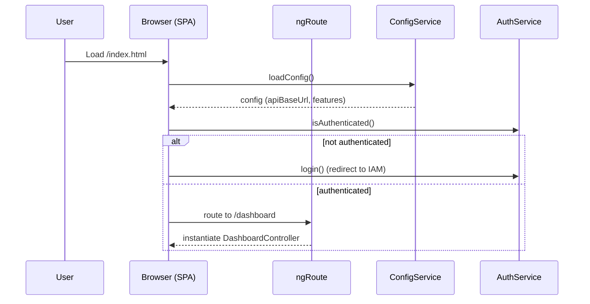
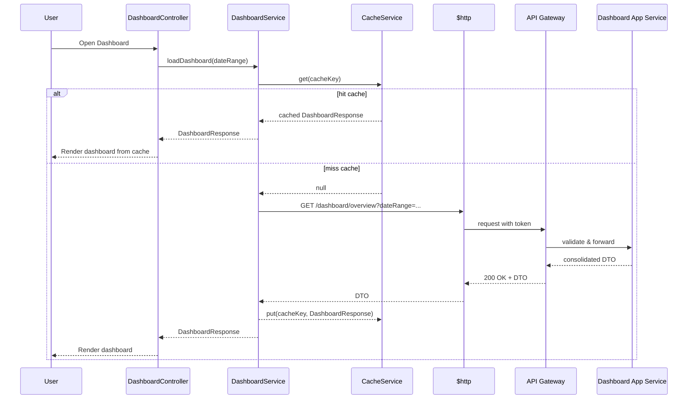
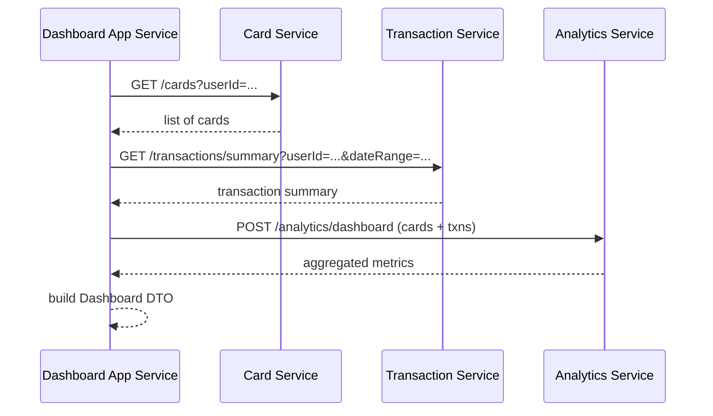
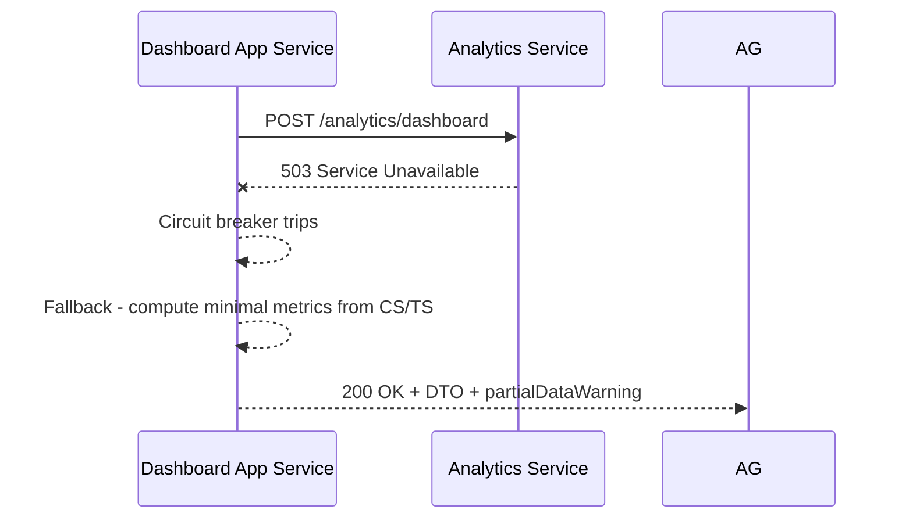

# Low-Level Design (LLD) – Credit Card Analysis Dashboard

**Epic ID:** QE-3689  
**Application Name:** CreditCardAnalysisDashboard  
**Technology Stack:**
- UI: AngularJS 1.x, JavaScript (ES6 syntax where compatible via build/transpilation), HTML5, CSS3, Bootstrap 3/4
- Architecture: MVC (AngularJS), RESTful APIs
- Integration: API Gateway, Dashboard Application Service, Card Service, Transaction Service, Analytics Service, IAM, Config/Feature Flag, Logging/Audit

---

## 1. Application Architecture

### 1.1 AngularJS MVC Architecture Mapping

The SPA is implemented as a single AngularJS application `ccDashboardApp` following MVC:

- **Model Layer (Data & State)**
  - AngularJS services/factories:
    - `CardService` – fetches card metadata and limits.
    - `TransactionService` – fetches summarized transaction data for dashboard.
    - `AnalyticsService` – fetches/prepares aggregated metrics (monthly spend, totals).
    - `DashboardService` – orchestrates calls to above services and consolidates DTO.
    - `AuthService` – manages user identity, tokens, roles.
    - `ConfigService` – loads configuration and feature flags.
    - `LoggingService` – client-side structured logging.
    - `ErrorHandlingService` – maps errors to user-friendly messages and fallback flows.
    - `CacheService` – in-memory cache for dashboard responses.

- **View Layer (HTML + Directives)**
  - Core templates:
    - `index.html` – shell, layout, root ng-view container.
    - `dashboard/dashboard.html` – main dashboard view with tiles and card list.
    - `dashboard/card-list.html` – nested template for responsive card listing.
    - `shared/error-banner.html` – reusable error and warning banner.
  - AngularJS directives/components:
    - `ccDashboardHeader` – header bar with user info and navigation.
    - `ccSummaryTiles` – renders overall summary metrics.
    - `ccCardList` – renders per-card details.
    - `ccResponsiveMetric` – handles responsive layout for metric tiles.
    - `ccLoadingSpinner` – standard loading indicator.

- **Controller Layer**
  - `DashboardController` – coordinates dashboard view lifecycle, binds data models, triggers services, manages state and errors.
  - `HeaderController` – handles header-level actions, logout, profile.

### 1.2 AngularJS Modules and Files

- Root module: `ccDashboardApp`
  - Dependencies: `ngRoute`, `ngAnimate`, `ngSanitize`, `ui.bootstrap`

- Feature modules:
  - `ccDashboard.core` – bootstrap, routes, configuration.
  - `ccDashboard.services` – shared services.
  - `ccDashboard.dashboard` – controllers, directives, and templates for dashboard.
  - `ccDashboard.shared` – shared directives, filters, components.

### 1.3 Recommended Project Folder Structure

```
CreditCardAnalysisDashboard/
  src/
    index.html
    app/
      app.module.js
      app.config.js
      app.routes.js
      app.constants.js

      core/
        core.module.js
        auth/
          auth.service.js
          auth.interceptor.js
        config/
          config.service.js
        logging/
          logging.service.js
          error-handling.service.js
        cache/
          cache.service.js

      dashboard/
        dashboard.module.js
        dashboard.controller.js
        dashboard.service.js
        dashboard.routes.js
        templates/
          dashboard.html
          card-list.html
          summary-tiles.html

      services/
        card.service.js
        transaction.service.js
        analytics.service.js

      shared/
        directives/
          header/
            header.directive.js
            header.template.html
          loading-spinner/
            loading-spinner.directive.js
            loading-spinner.template.html
          summary-tiles/
            summary-tiles.directive.js
            summary-tiles.template.html
          card-list/
            card-list.directive.js
            card-list.template.html
        filters/
          currency-compact.filter.js
          date-range.filter.js

    assets/
      css/
        main.css
        dashboard.css
      img/
        ...

  config/
    environment.dev.json
    environment.qa.json
    environment.prod.json

  test/
    unit/
    e2e/

  build/
    ... (build outputs)
```

---

## 2. Component Specifications

### 2.1 AngularJS Modules

#### 2.1.1 Module: `ccDashboardApp`
- **Type:** AngularJS module
- **File:** `app/app.module.js`
- **Responsibility:** Root module that wires all feature modules and third-party dependencies.
- **Public API:** N/A (module declaration)
- **Dependencies:** `ngRoute`, `ngAnimate`, `ngSanitize`, `ui.bootstrap`, `ccDashboard.core`, `ccDashboard.services`, `ccDashboard.dashboard`, `ccDashboard.shared`.

```js
// app/app.module.js
(function() {
  'use strict';

  angular
    .module('ccDashboardApp', [
      'ngRoute',
      'ngAnimate',
      'ngSanitize',
      'ui.bootstrap',
      'ccDashboard.core',
      'ccDashboard.services',
      'ccDashboard.dashboard',
      'ccDashboard.shared'
    ]);
})();
```

#### 2.1.2 Module: `ccDashboard.core`
- **File:** `app/core/core.module.js`
- **Responsibility:** Core cross-cutting concerns: auth, configuration, interceptors.
- **Dependencies:** `ngRoute`.

#### 2.1.3 Module: `ccDashboard.services`
- **File:** `app/services/services.module.js`
- **Responsibility:** Bundles all shared data-access services.

#### 2.1.4 Module: `ccDashboard.dashboard`
- **File:** `app/dashboard/dashboard.module.js`
- **Responsibility:** Dashboard feature logic – controllers, feature-specific services, routes.

#### 2.1.5 Module: `ccDashboard.shared`
- **File:** `app/shared/shared.module.js`
- **Responsibility:** Shared directives, filters, and UI components.

---

### 2.2 Controllers

#### 2.2.1 `DashboardController`
- **Type:** Controller
- **File:** `app/dashboard/dashboard.controller.js`
- **Responsibility:**
  - Initialize dashboard view.
  - Invoke `DashboardService` to load data.
  - Manage UI state (loading, error, partial data flags).
  - Expose metrics and card data to view.
  - Handle filter changes (e.g., date range for monthly spend) and refresh.

- **Public Methods (bound to `$scope` or `vm`):**
  - `init()` – triggers initial load.
  - `reload()` – reloads dashboard data.
  - `onDateRangeChange(range)` – updates selected period and reloads.
  - `hasPartialData()` – returns boolean for UI warnings.

- **Inputs:**
  - Route resolve data (optional), e.g., preloaded config.
  - User selections from view (date range, filters).

- **Outputs:**
  - View models:
    - `vm.summaryMetrics` – aggregated metrics object.
    - `vm.cards` – list of cards with metrics.
    - `vm.isLoading`, `vm.error`, `vm.partialDataWarning`.

- **Dependencies (DI):**
  - `DashboardService`, `ConfigService`, `LoggingService`, `ErrorHandlingService`, `$routeParams`.

```js
// app/dashboard/dashboard.controller.js
(function() {
  'use strict';

  angular
    .module('ccDashboard.dashboard')
    .controller('DashboardController', DashboardController);

  DashboardController.$inject = [
    'DashboardService',
    'ConfigService',
    'LoggingService',
    'ErrorHandlingService',
    '$routeParams'
  ];

  function DashboardController(DashboardService, ConfigService, LoggingService, ErrorHandlingService, $routeParams) {
    const vm = this;

    vm.summaryMetrics = null;
    vm.cards = [];
    vm.isLoading = false;
    vm.error = null;
    vm.partialDataWarning = null;
    vm.dateRange = $routeParams.dateRange || 'CURRENT_MONTH';

    vm.init = init;
    vm.reload = reload;
    vm.onDateRangeChange = onDateRangeChange;
    vm.hasPartialData = hasPartialData;

    init();

    function init() {
      vm.isLoading = true;
      vm.error = null;

      DashboardService
        .loadDashboard(vm.dateRange)
        .then(response => {
          vm.summaryMetrics = response.summary;
          vm.cards = response.cards;
          vm.partialDataWarning = response.partialDataWarning || null;
        })
        .catch(err => {
          vm.error = ErrorHandlingService.toUserMessage(err);
          LoggingService.error('Dashboard load failed', { err });
        })
        .finally(() => {
          vm.isLoading = false;
        });
    }

    function reload() {
      init();
    }

    function onDateRangeChange(range) {
      vm.dateRange = range;
      reload();
    }

    function hasPartialData() {
      return !!vm.partialDataWarning;
    }
  }
})();
```

#### 2.2.2 `HeaderController`
- **Type:** Controller
- **File:** `app/shared/directives/header/header.directive.js` (embedded or separated as `header.controller.js`)
- **Responsibility:** Manage header actions (logout, navigating between sections, displaying user name).
- **Dependencies:** `AuthService`, `LoggingService`.

---

### 2.3 Services / Factories

#### 2.3.1 `DashboardService`
- **Type:** Service
- **File:** `app/dashboard/dashboard.service.js`
- **Responsibility:**
  - Orchestrate REST call to Dashboard Application Service: `/dashboard/overview` via API Gateway.
  - Transform response DTO into view-ready structures.
  - Apply fallback logic when partial data is returned.

- **Public Methods:**
  - `loadDashboard(dateRange: String) : Promise<DashboardResponse>`

- **Inputs:**
  - `dateRange` – e.g., `CURRENT_MONTH`, `BILLING_CYCLE`, custom.

- **Outputs:**
  - Promise resolving to `DashboardResponse` model.

- **Dependencies:**
  - `$http`, `ConfigService`, `CacheService`, `ErrorHandlingService`, `LoggingService`.

```js
// app/dashboard/dashboard.service.js
(function() {
  'use strict';

  angular
    .module('ccDashboard.dashboard')
    .service('DashboardService', DashboardService);

  DashboardService.$inject = ['$http', 'ConfigService', 'CacheService', 'ErrorHandlingService', 'LoggingService'];

  function DashboardService($http, ConfigService, CacheService, ErrorHandlingService, LoggingService) {
    const service = {
      loadDashboard
    };

    return service;

    function loadDashboard(dateRange) {
      const cacheKey = `dashboard_${dateRange}`;
      const cached = CacheService.get(cacheKey);

      if (cached) {
        LoggingService.debug('Serving dashboard from cache', { dateRange });
        return Promise.resolve(cached);
      }

      const endpoint = `${ConfigService.getApiBaseUrl()}/dashboard/overview`;
      const params = { dateRange };

      return $http.get(endpoint, { params })
        .then(response => {
          const dto = response.data;
          const mapped = mapDashboardDto(dto);
          CacheService.put(cacheKey, mapped, 60); // cache 60s
          return mapped;
        })
        .catch(err => {
          const wrapped = ErrorHandlingService.wrapHttpError(err, 'DASHBOARD_LOAD_FAILED');
          return Promise.reject(wrapped);
        });
    }

    function mapDashboardDto(dto) {
      return {
        summary: {
          totalCreditLimit: dto.summary.totalCreditLimit,
          totalAvailableCredit: dto.summary.totalAvailableCredit,
          totalOutstandingAmount: dto.summary.totalOutstandingAmount,
          monthlySpend: dto.summary.monthlySpend,
          periodLabel: dto.summary.periodLabel
        },
        cards: dto.cards.map(card => ({
          cardId: card.cardId,
          maskedCardNumber: card.maskedCardNumber,
          productName: card.productName,
          creditLimit: card.creditLimit,
          availableCredit: card.availableCredit,
          outstandingAmount: card.outstandingAmount,
          lastUpdated: card.lastUpdated,
          status: card.status
        })),
        partialDataWarning: dto.partialDataWarning || null
      };
    }
  }
})();
```

#### 2.3.2 `CardService`
- **Type:** Service
- **File:** `app/services/card.service.js`
- **Responsibility:** Direct interaction with Card Service API where needed (e.g., rendering detailed card views, not just aggregated dashboard call).

- **Public Methods:**
  - `getUserCards() : Promise<Card[]>`
  - `getCardById(cardId: String) : Promise<Card>`

- **Dependencies:** `$http`, `ConfigService`, `ErrorHandlingService`.

#### 2.3.3 `TransactionService`
- **Type:** Service
- **File:** `app/services/transaction.service.js`
- **Responsibility:** Fetch transaction summaries used for analytics when required directly by UI (extended use cases).

- **Public Methods:**
  - `getMonthlySummary(cardId, dateRange)`

- **Dependencies:** `$http`, `ConfigService`, `ErrorHandlingService`.

#### 2.3.4 `AnalyticsService`
- **Type:** Service
- **File:** `app/services/analytics.service.js`
- **Responsibility:** Provide additional client-side analytics (e.g., chart data preparation) on top of server metrics.

- **Public Methods:**
  - `buildChartSeries(summaryMetrics, cards)` – prepare chart series for UI components.

#### 2.3.5 `AuthService`
- **Type:** Service
- **File:** `app/core/auth/auth.service.js`
- **Responsibility:**
  - Manage tokens (access, ID token) from IAM.
  - Provide user identity and roles to UI.
  - Trigger login/logout flows (delegate to IAM via redirect).

- **Public Methods:**
  - `getAccessToken()`
  - `getUser()`
  - `isAuthenticated()`
  - `hasRole(role)`
  - `login()`
  - `logout()`

#### 2.3.6 `ConfigService`
- **Type:** Service
- **File:** `app/core/config/config.service.js`
- **Responsibility:**
  - Load environment-specific configuration.
  - Provide API base URLs, feature flags, supported devices, thresholds for warnings.

- **Public Methods:**
  - `loadConfig() : Promise<void>` (called during app init)
  - `getApiBaseUrl()`
  - `getFeatureFlag(flagName)`
  - `getSupportedDevices()`
  - `getThreshold(name)`

#### 2.3.7 `LoggingService`
- **Type:** Service
- **File:** `app/core/logging/logging.service.js`
- **Responsibility:**
  - Standardized logging across the SPA.
  - Forward logs to server-side logging endpoint when enabled.

- **Public Methods:**
  - `debug(message, context)`
  - `info(message, context)`
  - `warn(message, context)`
  - `error(message, context)`

#### 2.3.8 `ErrorHandlingService`
- **Type:** Service
- **File:** `app/core/logging/error-handling.service.js`
- **Responsibility:**
  - Wrap HTTP errors with standardized structure.
  - Map technical errors to user-friendly error messages.

- **Public Methods:**
  - `wrapHttpError(err, code)`
  - `toUserMessage(err)`

#### 2.3.9 `CacheService`
- **Type:** Service
- **File:** `app/core/cache/cache.service.js`
- **Responsibility:** Client-side cache for responses to improve perceived performance.

- **Public Methods:**
  - `get(key)`
  - `put(key, value, ttlSeconds)`
  - `remove(key)`

---

### 2.4 Directives / Components

#### 2.4.1 `ccDashboardHeader`
- **Type:** Directive (element)
- **File:** `app/shared/directives/header/header.directive.js`
- **Template:** `app/shared/directives/header/header.template.html`
- **Responsibility:** Display application header with title, user info, and logout.

- **Inputs:**
  - `user` – bound from parent.

- **Outputs:**
  - `onLogout` – callback for logout.

- **Dependencies:** `AuthService`.

#### 2.4.2 `ccSummaryTiles`
- **Type:** Directive
- **File:** `app/shared/directives/summary-tiles/summary-tiles.directive.js`
- **Template:** `app/shared/directives/summary-tiles/summary-tiles.template.html`
- **Responsibility:**
  - Render summary metrics as responsive tiles (total credit limit, available credit, outstanding amount, monthly spend).

- **Inputs:**
  - `summary` – object with metrics.

#### 2.4.3 `ccCardList`
- **Type:** Directive
- **File:** `app/shared/directives/card-list/card-list.directive.js`
- **Template:** `app/shared/directives/card-list/card-list.template.html`
- **Responsibility:**
  - Render list of cards with key metrics in responsive layout.
  - Show warnings for partial data.

- **Inputs:**
  - `cards` – array of card objects.
  - `partialDataWarning` – optional string.

#### 2.4.4 `ccLoadingSpinner`
- **Type:** Directive
- **File:** `app/shared/directives/loading-spinner/loading-spinner.directive.js`
- **Template:** `app/shared/directives/loading-spinner/loading-spinner.template.html`
- **Responsibility:** Standard loading indicator for asynchronous operations.

---

### 2.5 Filters

#### 2.5.1 `currencyCompact`
- **Type:** Filter
- **File:** `app/shared/filters/currency-compact.filter.js`
- **Responsibility:** Convert large amounts to compact currency format (e.g., 1,500,000 → 1.5M).

#### 2.5.2 `dateRangeLabel`
- **Type:** Filter
- **File:** `app/shared/filters/date-range.filter.js`
- **Responsibility:** Format date range codes (`CURRENT_MONTH`, `BILLING_CYCLE`) into human-readable labels.

---

## 3. Component Responsibilities

- **DashboardController:** Orchestrates UI state and user interactions, delegates business logic to services.
- **DashboardService:** Owns business orchestration logic for dashboard data retrieval (including partial data handling and caching).
- **CardService & TransactionService:** Isolated data access logic to respective backend microservices.
- **AnalyticsService:** Client-side transformations for charts and additional aggregates.
- **AuthService:** Authentication state, tokens, roles; no business metrics inside.
- **ConfigService:** Environmental configs and feature flags. No business logic besides config interpretation.
- **LoggingService & ErrorHandlingService:** Cross-cutting concerns; do not host business logic, only error/log wrappers.
- **Directives (`ccSummaryTiles`, `ccCardList`, `ccDashboardHeader`, `ccLoadingSpinner`):** Purely presentational components; minimal logic restricted to UI composition.

This separation preserves MVC and single-responsibility principles.

---

## 4. Interface Specifications

### 4.1 Controller–Service Interactions

- `DashboardController` → `DashboardService.loadDashboard(dateRange)`
- `DashboardService` → `$http` (REST)
- `DashboardService` → `CacheService` for caching.
- `DashboardService` → `ErrorHandlingService` for wrapping errors.

### 4.2 REST API Interfaces

The SPA interacts only with the API Gateway. Downstream services (Dashboard Application Service, Card Service, Transaction Service, Analytics Service) are shielded behind it.

#### 4.2.1 `GET /dashboard/overview`

- **Endpoint:** `${API_BASE_URL}/dashboard/overview`
- **Method:** GET
- **Headers:**
  - `Authorization: Bearer <access_token>`
  - `Accept: application/json`
- **Query Parameters:**
  - `dateRange` (string) – e.g., `CURRENT_MONTH`, `BILLING_CYCLE`, or `YYYY-MM`.

- **Request Example:**

```http
GET /dashboard/overview?dateRange=CURRENT_MONTH HTTP/1.1
Host: api.example.com
Authorization: Bearer eyJhbGciOi...
Accept: application/json
```

- **Response 200 (OK):**

```json
{
  "summary": {
    "totalCreditLimit": 25000.0,
    "totalAvailableCredit": 18000.0,
    "totalOutstandingAmount": 7000.0,
    "monthlySpend": 3500.0,
    "periodLabel": "Current calendar month"
  },
  "cards": [
    {
      "cardId": "CARD123",
      "maskedCardNumber": "**** **** **** 1234",
      "productName": "Platinum Rewards",
      "creditLimit": 10000.0,
      "availableCredit": 7000.0,
      "outstandingAmount": 3000.0,
      "lastUpdated": "2025-06-15T10:30:00Z",
      "status": "ACTIVE"
    }
  ],
  "partialDataWarning": null
}
```

- **Error Responses:**
  - `401 Unauthorized` – invalid or expired token.
  - `403 Forbidden` – user not authorized (no `dashboard_viewer` role).
  - `500 Internal Server Error` – unexpected backend error.
  - `502/504` – downstream services issues.

- **Error Payload Contract:**

```json
{
  "errorCode": "DASHBOARD_SERVICE_UNAVAILABLE",
  "message": "Dashboard temporarily unavailable.",
  "correlationId": "c123-456-789"
}
```

UI uses `correlationId` to reference logs.

### 4.3 External System Interfaces

- **IAM:**
  - Implemented via browser redirects to IAM login page.
  - SPA relies on existing session or tokens stored in secure cookies/localStorage.

- **Config & Feature Flags:**
  - `GET /config/ui` – environment configuration.

```json
{
  "apiBaseUrl": "https://api.example.com",
  "features": {
    "showMonthlySpend": true,
    "enablePartialDataWarnings": true
  },
  "thresholds": {
    "highUtilizationPercentage": 0.8
  }
}
```

---

## 5. Data Model Design

### 5.1 JavaScript Models

#### 5.1.1 `DashboardSummary`

```js
class DashboardSummary {
  constructor() {
    this.totalCreditLimit = 0.0;       // Number
    this.totalAvailableCredit = 0.0;   // Number
    this.totalOutstandingAmount = 0.0; // Number
    this.monthlySpend = 0.0;           // Number
    this.periodLabel = '';             // String
  }
}
```

- **Validation Rules:**
  - All numeric fields must be ≥ 0.
  - `periodLabel` must be non-empty.

#### 5.1.2 `Card` Model

```js
class Card {
  constructor() {
    this.cardId = null;                // String, required
    this.maskedCardNumber = null;      // String, masked only
    this.productName = null;           // String
    this.creditLimit = 0.0;            // Number ≥ 0
    this.availableCredit = 0.0;        // Number ≥ 0
    this.outstandingAmount = 0.0;      // Number ≥ 0
    this.lastUpdated = null;           // ISO date string
    this.status = 'ACTIVE';            // ENUM: ACTIVE, INACTIVE, CLOSED
  }
}
```

- **State Transitions:**
  - `status` transitions: `ACTIVE → INACTIVE → CLOSED` (no reverse transitions in UI).

#### 5.1.3 `DashboardResponse`

```js
class DashboardResponse {
  constructor() {
    this.summary = new DashboardSummary();
    this.cards = [];                   // Array<Card>
    this.partialDataWarning = null;    // String | null
  }
}
```

#### 5.1.4 `ErrorModel`

```js
class ErrorModel {
  constructor() {
    this.errorCode = null;     // String
    this.message = null;       // String
    this.correlationId = null; // String
  }
}
```

### 5.2 Validation Rules & Defaults

- Use AngularJS form validation for inputs (date range selectors, filters).
- Client must not attempt to manipulate card identifiers or user ids.
- Any negative value received for limits or spend is rejected and logged.
- `monthlySpend` is computed server-side; UI ensures numeric rendering only.

---

## 6. Data Flow

### 6.1 User Action to UI Update

1. **User Action:** User opens dashboard URL or navigates to dashboard via menu.
2. **Routing:** AngularJS `ngRoute` routes `/dashboard` to `DashboardController` and `dashboard.html`.
3. **Initialization:** `DashboardController.init()` is invoked, sets `isLoading=true`.
4. **Config Load (if not loaded):** `ConfigService.loadConfig()` ensures API base URL and features are ready.
5. **API Call:** `DashboardService.loadDashboard(dateRange)` is executed.
6. **Cache Check:** `CacheService` may serve existing response; otherwise HTTP call.
7. **HTTP:** `$http.get('/dashboard/overview')` with appropriate query params and auth header.
8. **API Gateway:** Validates token, routes to Dashboard Application Service.
9. **Backend Orchestration:** Dashboard Application Service calls Card, Transaction, and Analytics Services; returns consolidated DTO.
10. **Response Handling:** DashboardService maps DTO → `DashboardResponse` model.
11. **State Update:** `DashboardController` updates view models and sets `isLoading=false`.
12. **UI Render:** Directives `ccSummaryTiles` and `ccCardList` show latest metrics and cards; errors or warnings displayed if needed.

### 6.2 Partial Data Scenario

- Backend includes `partialDataWarning` when some cards/transactions failed.
- `DashboardService` passes it through.
- `DashboardController.hasPartialData()` returns true.
- `ccCardList` shows badge/banner: “Some card data might be missing due to temporary issues.”

---

## 7. Sequence Diagrams (Mermaid)

### 7.1 Application Initialization



### 7.2 Primary User Workflow – Dashboard Load



### 7.3 Service/API Interaction – Backend Orchestration (Conceptual)



### 7.4 Error Handling Scenario – Analytics Service Down



---

## 8. Implementation Details

### 8.1 AngularJS Implementation Approach

- Use controller-as syntax (`vm`) to avoid `$scope` pollution.
- Use `ngRoute` for simple routing; ensure lazy loading via template URLs.
- Use services for all HTTP interactions; controllers never call `$http` directly.

### 8.2 JavaScript ES6 Coding Patterns

- Prefer `const` and `let` over `var` (where transpilation allows).
- Use arrow functions for internal callbacks (`.then(response => {...})`).
- Modularize via IIFEs to maintain compatibility with AngularJS 1.x and older bundlers.

### 8.3 Dependency Injection

- Rely on AngularJS DI.
- Do not use global variables for config; instead, `ConfigService`.
- Ensure minification-safe injections via `$inject` array.

### 8.4 Business Logic Flow

- All business logic involving metrics resides in backend services.
- UI uses `DashboardService` exclusively to obtain metrics and never recomputes totals from raw transactions, except for minor UI-only computations (e.g., percentage utilization = outstanding / limit).

### 8.5 Validation Logic

- Input fields (e.g., date range pickers) use AngularJS form validation.
- Any user input for filters is validated:
  - Accept only known date range types or valid `YYYY-MM` format.
  - Reject unknown filters; show user-friendly message.

### 8.6 State Management Approach

- State kept within controllers.
- No use of global event bus; multi-component coordination via shared services where necessary.
- Navigation state is route-based.

### 8.7 DOM Interaction Approach

- Use Angular directives and data binding for DOM updates.
- No direct DOM manipulation from controllers except via directives if needed.

### 8.8 API Integration Approach

- All outgoing REST calls use `$http` configured with:
  - Base URL from `ConfigService`.
  - `AuthInterceptor` to inject `Authorization` header.
  - Global error handler to intercept 401/403 and redirect to login.

---

## 9. Configuration

### 9.1 AngularJS Configuration Files

- `app.config.js` – module configuration, HTTP interceptors, route defaults.
- `app.routes.js` – route definitions.
- `app.constants.js` – static constants (e.g., route paths, error codes).

```js
// app/app.config.js
(function() {
  'use strict';

  angular
    .module('ccDashboardApp')
    .config(config);

  config.$inject = ['$httpProvider'];

  function config($httpProvider) {
    $httpProvider.interceptors.push('AuthInterceptor');
  }
})();
```

### 9.2 Environment-Specific Properties

- `config/environment.<env>.json` loaded at runtime.
- Example properties:
  - `apiBaseUrl`
  - `logLevel`
  - `featureFlags` (e.g., `enablePartialDataWarnings`)
  - `supportedDevices`

### 9.3 API Base URLs

- `ConfigService.getApiBaseUrl()` returns environment-specific API Gateway URL.
- All services build URIs based on this value.

### 9.4 Feature Flags

- Provided by server configuration.
- Examples:
  - `showMonthlySpend`
  - `enableAnalyticsCharts`
  - `enableAuditLoggingClientSide`

### 9.5 Logging & Telemetry

- `LoggingService` respects `logLevel` from configuration.
- Optional endpoint `/logs/ui` to send client logs to Audit and Monitoring Service (non-blocking, best-effort).

---

## 10. Error Handling and Resiliency

### 10.1 Client-Side Exception Handling

- Global `$exceptionHandler` override logs uncaught exceptions via `LoggingService`.
- Display generic error banner for unexpected UI errors, with correlation id when available.

### 10.2 REST API Error Handling

- `AuthInterceptor` inspects 401/403:
  - 401 → clear tokens, redirect to IAM login.
  - 403 → show “Not authorized” banner.
- `ErrorHandlingService.wrapHttpError` standardizes error payload:

```js
{
  code: 'DASHBOARD_LOAD_FAILED',
  httpStatus: 503,
  message: 'Dashboard temporarily unavailable.',
  correlationId: '...' // from header
}
```

### 10.3 Retry Mechanisms

- Client does not aggressively retry to avoid load; instead:
  - Provide manual “Retry” button on error states.
  - Optionally implement single automatic retry for certain transient statuses (e.g., 502, 503, 504) with small delay.

### 10.4 Logging Strategy

- Log levels:
  - `debug` – dev only.
  - `info` – key lifecycle events (dashboard load, filter changes).
  - `warn` – partial data, degraded mode.
  - `error` – failed dashboard loads, unexpected exceptions.

### 10.5 Recovery and Fallback Behavior

- When partial data is returned, UI still renders available metrics and cards.
- If service is fully unavailable, show error page with suggestion to retry and contact support.
- Cache may be used to display last known good snapshot with clear timestamp when backend unreachable.

---

## 11. Security Considerations

### 11.1 Input Validation & Sanitization

- Use AngularJS built-in validation for forms.
- Sanitize any user-provided text using `ngSanitize`.
- No free-text fields directly rendered without escaping.

### 11.2 XSS Prevention

- Use `ng-bind` and `{{ }}` with auto-escaping; never use `ng-bind-html` unless content is trusted and sanitized.
- Avoid `ng-include` with dynamic URLs from user input.

### 11.3 CSRF Protection

- API Gateway implements CSRF protection; SPA integrates by sending CSRF token (if applicable) via `$http` default headers.

### 11.4 Secure API Communication

- Always use HTTPS endpoints.
- Enforce HSTS at server; SPA uses `https://` URLs only.

### 11.5 Authentication & Authorization

- `AuthService` consults IAM-issued tokens.
- Role-based display:
  - Dashboard view accessible only to users with `dashboard_viewer` role.
  - UI hides unauthorized actions (if any) based on roles.

### 11.6 Sensitive Data Handling

- Only masked card numbers displayed; never full PAN.
- No storage of sensitive data in localStorage beyond tokens required for session.
- Tokens stored in secure HTTP-only cookies where possible; if using localStorage, protect via best practices (short TTL, token refresh, logout clearing).

### 11.7 Audit Logging Approach

- Client logs high-level events (e.g., dashboard viewed) via logging endpoint when enabled.
- Correlation IDs provided by backend (e.g., via `X-Correlation-Id` header) are propagated in logs.

---

## 12. Summary

This LLD defines a concrete AngularJS-based implementation of the Credit Card Analysis Dashboard consistent with the HLD. It maps each HLD component to AngularJS modules, controllers, services, and directives, specifies REST interfaces and data models, defines error handling and security, and provides sequence diagrams to guide implementation. It enables developers to implement the SPA without further reference to the HLD.
