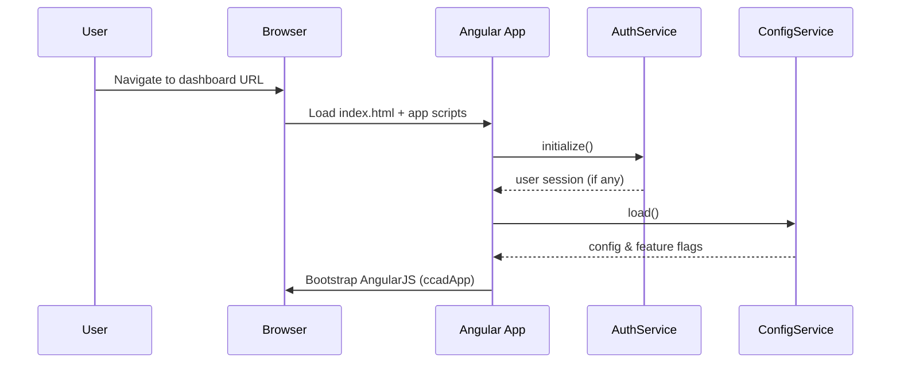
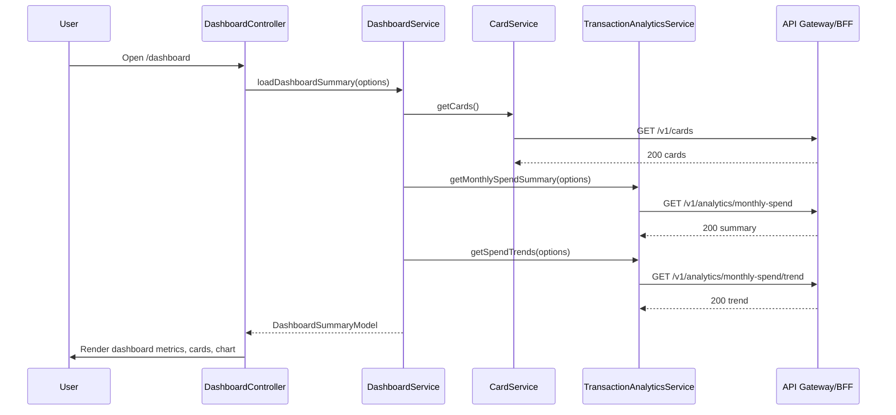
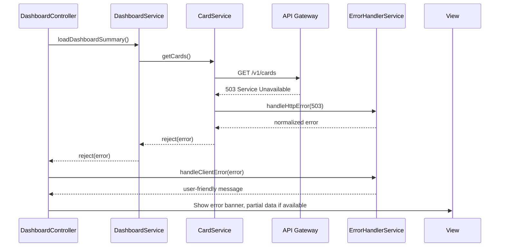
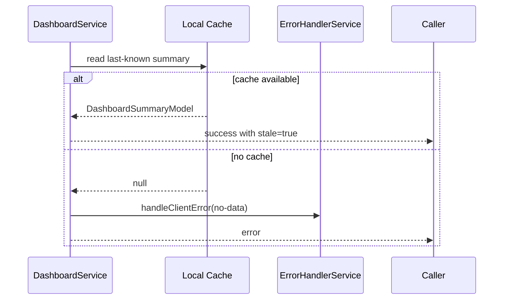

# Low-Level Design (LLD) – Credit Card Analysis Dashboard

**Epic ID:** QE-3689  
**Application Name:** CreditCardAnalysisDashboard  
**Technology Stack:**
- AngularJS 1.x (SPA, MVC pattern)
- JavaScript ES6 (transpiled as needed for legacy browsers)
- HTML5, CSS3, Bootstrap 4/5-compatible styling
- REST APIs (JSON over HTTPS)
- Backend services exposed via API Gateway / BFF

---

## 1. Application Architecture

### 1.1 AngularJS MVC Architecture Mapping

The Credit Card Analysis Dashboard is implemented as a Single Page Application (SPA) using AngularJS 1.x. It follows AngularJS MVC/MVVM patterns:

- **View (V):** HTML templates with Bootstrap-based responsive layouts for dashboard, cards list, and charts.
- **Controller (C):** AngularJS controllers that mediate between views and services, manage scope/view-model, trigger API calls, and handle UI logic.
- **Model (M):** JavaScript objects representing cards, users, analytics summaries, and charts. Models are populated by REST services.
- **Services/Factories:** Encapsulate REST API communication and shared business logic (aggregation on client, caching). 
- **Directives/Components:** Reusable UI widgets (cards list, metric tiles, charts) with isolated scopes.
- **Filters:** Formatting helpers (currency, dates, percentage).
- **Configuration:** AngularJS module configuration (routes, interceptors), environment settings, API base URLs.

### 1.2 High-Level Component Mapping

Mapping HLD components to AngularJS artifacts:

- **Browser UI (SPA)**
  - Angular module: `ccadApp`
  - Entry point: `index.html`
  - Routing: `ui-router` or `ngRoute` for dashboard and auxiliary views.

- **Dashboard Application Service (HLD)**
  - **AngularJS services:**
    - `DashboardService` – orchestrates retrieval of dashboard summary and aggregates client-side state.
    - `CardService` – integrates with Card Service REST APIs.
    - `TransactionAnalyticsService` – integrates with Transaction Analytics REST APIs.
  - **Controllers:**
    - `DashboardController` – binds aggregated metrics to the main dashboard view.
    - `CardListController` – handles per-card details, filters.

- **Card Service (HLD backend)**
  - Exposed via REST API; consumed by UI through `CardService` Angular service.

- **Transaction Analytics Service (HLD backend)**
  - Exposed via REST API; consumed by UI through `TransactionAnalyticsService` Angular service.

- **Authentication & Authorization Service + IDP**
  - Interacted with via browser redirection & JWT tokens.
  - AngularJS:
    - `AuthService` – manages token storage, login state, user roles.
    - HTTP interceptor – attaches JWT to outgoing API requests, handles 401/403.

- **Configuration / Feature Flags**
  - AngularJS:
    - `ConfigService` – fetches and caches configuration / feature flags.

- **Audit Logging**
  - AngularJS:
    - `AuditService` – posts front-end audit events to a dedicated API endpoint.

- **Monitoring & Error Handling**
  - AngularJS:
    - `ErrorHandlerService` – centralizes error processing.
    - `$exceptionHandler` decorator – logs client-side exceptions.

### 1.3 Project Folder Structure

```text
credit-card-analysis-dashboard/
├─ dist/                        # Build outputs
├─ src/
│  ├─ index.html                # SPA entry
│  ├─ app/
│  │  ├─ app.module.js          # root module
│  │  ├─ app.config.js          # routing, interceptors, constants
│  │  ├─ app.run.js             # run blocks, init logic
│  │  ├─ core/
│  │  │  ├─ services/
│  │  │  │  ├─ auth.service.js
│  │  │  │  ├─ dashboard.service.js
│  │  │  │  ├─ card.service.js
│  │  │  │  ├─ transaction-analytics.service.js
│  │  │  │  ├─ config.service.js
│  │  │  │  ├─ audit.service.js
│  │  │  │  ├─ error-handler.service.js
│  │  │  ├─ interceptors/
│  │  │  │  ├─ auth.interceptor.js
│  │  │  │  ├─ http-logger.interceptor.js
│  │  │  ├─ models/
│  │  │  │  ├─ card.model.js
│  │  │  │  ├─ user.model.js
│  │  │  │  ├─ dashboard-summary.model.js
│  │  │  │  ├─ transaction-metric.model.js
│  │  │  ├─ filters/
│  │  │  │  ├─ currency-format.filter.js
│  │  │  │  ├─ percentage.filter.js
│  │  │  │  ├─ date-range.filter.js
│  │  ├─ dashboard/
│  │  │  ├─ dashboard.controller.js
│  │  │  ├─ dashboard.state.js       # state / route config
│  │  │  ├─ dashboard.html           # main dashboard view
│  │  │  ├─ directives/
│  │  │  │  ├─ metric-tile.directive.js
│  │  │  │  ├─ card-list.directive.js
│  │  │  │  ├─ spend-chart.directive.js
│  │  │  │  ├─ loading-spinner.directive.js
│  │  ├─ cards/
│  │  │  ├─ card-list.controller.js
│  │  │  ├─ card-list.html
│  │  │  ├─ card-detail.controller.js
│  │  │  ├─ card-detail.html
│  │  ├─ auth/
│  │  │  ├─ login.controller.js
│  │  │  ├─ login.html
│  │  ├─ common/
│  │  │  ├─ directives/
│  │  │  │  ├─ responsive-container.directive.js
│  │  │  │  ├─ error-banner.directive.js
│  │  │  ├─ components/
│  │  │  │  ├─ navbar.directive.js
│  │  │  │  ├─ footer.directive.js
│  ├─ assets/
│  │  ├─ css/
│  │  │  ├─ main.css
│  │  │  ├─ themes.css
│  │  ├─ img/
│  │  ├─ fonts/
│  ├─ env/
│  │  ├─ env.local.js
│  │  ├─ env.dev.js
│  │  ├─ env.qa.js
│  │  ├─ env.prod.js
├─ test/
│  ├─ unit/
│  ├─ e2e/
├─ package.json
├─ gulpfile.js / webpack.config.js
```

---

## 2. Component Specifications

### 2.1 Root Module – `ccadApp`

- **Artifact Type:** AngularJS Module
- **File:** `src/app/app.module.js`
- **Responsibility:**
  - Declare root Angular module `ccadApp`.
  - Register core dependencies (e.g., `ui.router`, `ngAnimate`, `ngResource`).
- **Public API:** N/A (module definition only).
- **Dependencies:**
  - Angular modules: `ui.router`, `ngMessages`, `ngResource`, custom feature modules (`ccad.dashboard`, `ccad.cards`, `ccad.auth`).

### 2.2 App Configuration – Routing & Interceptors

#### 2.2.1 `app.config.js`

- **Artifact Type:** Config block
- **File:** `src/app/app.config.js`
- **Responsibility:**
  - Configure routing states using `ui-router`.
  - Configure `$httpProvider` interceptors for auth and logging.
  - Register constants for API base URLs, environment.
- **Public Methods:**
  - Angular config function: `configure($stateProvider, $urlRouterProvider, $httpProvider, API_CONFIG)`.
- **Inputs:** N/A (execute at module config phase).
- **Outputs:**
  - Sets up route-to-controller/template mappings.
- **Dependencies:** `$stateProvider`, `$urlRouterProvider`, `$httpProvider`, `API_CONFIG`.

Key routes:
- `/dashboard` → `DashboardController` + `dashboard.html`
- `/cards` → `CardListController` + `card-list.html`
- `/cards/:cardId` → `CardDetailController` + `card-detail.html`
- `/login` → `LoginController` + `login.html`

#### 2.2.2 Auth HTTP Interceptor – `auth.interceptor.js`

- **Artifact Type:** Factory (HTTP interceptor)
- **File:** `src/app/core/interceptors/auth.interceptor.js`
- **Responsibility:**
  - Attach JWT token to outgoing requests.
  - Redirect to login on 401/403.
  - Handle correlation IDs.
- **Public Methods:**
  - `request(config)` – add `Authorization` and `X-Correlation-Id` headers.
  - `responseError(rejection)` – handle auth failures, pass to `ErrorHandlerService`.
- **Inputs:**
  - `config` – HTTP config.
  - `rejection` – HTTP error response.
- **Outputs:**
  - Modified `config` or rejected promise.
- **Dependencies:**
  - `AuthService`, `$q`, `$injector`, `ErrorHandlerService`.

### 2.3 Services

#### 2.3.1 `AuthService`

- **Artifact Type:** Service
- **File:** `src/app/core/services/auth.service.js`
- **Responsibility:**
  - Manage user authentication state.
  - Store and retrieve JWT tokens (via secure cookies / session storage wrappers).
  - Provide user claims and roles.
- **Public Methods:**
  - `isAuthenticated()` → boolean.
  - `getToken()` → JWT token string.
  - `setToken(token)`.
  - `clearSession()`.
  - `getUser()` → `User` model.
- **Inputs:** token, user payload.
- **Outputs:** internal state updates, token storage.
- **Dependencies:** `$window`, `$cookies` (optional), `UserModel`.

#### 2.3.2 `DashboardService`

- **Artifact Type:** Service
- **File:** `src/app/core/services/dashboard.service.js`
- **Responsibility:**
  - Orchestrate retrieval of dashboard summary data.
  - Call Card and Transaction Analytics services, aggregate results.
  - Provide consolidated summary to controllers.
- **Public Methods:**
  - `loadDashboardSummary(options)` → Promise resolving to `DashboardSummary`.
  - `refresh()` → re-fetch with last options.
- **Inputs:**
  - `options` – date range, filters (e.g., `fromDate`, `toDate`, `includeClosedCards`).
- **Outputs:**
  - `DashboardSummary` model instance with metrics: total limit, total outstanding, available credit, monthly spend, trends, per-card metrics.
- **Dependencies:**
  - `CardService`, `TransactionAnalyticsService`, `$q`, `ConfigService`, `AuditService`.

Data aggregation rules:
- `totalCreditLimit` = sum of `card.creditLimit` across active cards.
- `totalOutstanding` = sum of `card.outstandingBalance` across cards.
- `totalAvailableCredit` = sum of `card.availableCredit`.
- `monthlySpend` = aggregated from transaction metrics for current month.

#### 2.3.3 `CardService`

- **Artifact Type:** Service
- **File:** `src/app/core/services/card.service.js`
- **Responsibility:**
  - Communicate with Card Service backend via REST.
  - Provide card list and per-card metrics.
- **Public Methods:**
  - `getCards()` → Promise<Array<Card>>.
  - `getCard(cardId)` → Promise<Card>.
  - `getCardSummary()` → Promise<{ totalCreditLimit, totalOutstanding, totalAvailable }>` (if backend supports summary endpoint).
- **Inputs:** `cardId`.
- **Outputs:** Card model objects.
- **Dependencies:** `$http`, `API_CONFIG`, `CardModel`, `ErrorHandlerService`.

#### 2.3.4 `TransactionAnalyticsService`

- **Artifact Type:** Service
- **File:** `src/app/core/services/transaction-analytics.service.js`
- **Responsibility:**
  - Communicate with Transaction Analytics Service.
  - Fetch monthly spend and trend data.
- **Public Methods:**
  - `getMonthlySpendSummary(options)` → Promise<TransactionMetric>.
  - `getSpendTrends(options)` → Promise<Array<TransactionMetric>>.
- **Inputs:**
  - `options` – date range, granularity (monthly), card filters.
- **Outputs:** transaction metrics models.
- **Dependencies:** `$http`, `API_CONFIG`, `TransactionMetricModel`, `ErrorHandlerService`.

#### 2.3.5 `ConfigService`

- **Artifact Type:** Service
- **File:** `src/app/core/services/config.service.js`
- **Responsibility:**
  - Load non-secret configuration and feature flags from Config service.
  - Cache configuration for the session.
- **Public Methods:**
  - `load()` → Promise<Config>.
  - `getFlag(flagName)` → boolean.
  - `getConfig(key)` → any.
- **Inputs:** none (initial load at app init).
- **Outputs:** internal config cache.
- **Dependencies:** `$http`, `API_CONFIG`.

#### 2.3.6 `AuditService`

- **Artifact Type:** Service
- **File:** `src/app/core/services/audit.service.js`
- **Responsibility:**
  - Send front-end audit events to Audit Log Service endpoint.
  - Include correlation ID, user, and action details.
- **Public Methods:**
  - `log(event)` where `event` includes `{ action, resource, metadata }`.
- **Inputs:** audit event object.
- **Outputs:** HTTP POST to audit API.
- **Dependencies:** `$http`, `API_CONFIG`, `AuthService`.

#### 2.3.7 `ErrorHandlerService`

- **Artifact Type:** Service
- **File:** `src/app/core/services/error-handler.service.js`
- **Responsibility:**
  - Normalize and handle errors from HTTP responses and client exceptions.
  - Show user-friendly messages and propagate error metadata.
- **Public Methods:**
  - `handleHttpError(rejection)`.
  - `handleClientError(error)`.
  - `getErrorMessage(code)`.
- **Inputs:** `rejection` or `error`.
- **Outputs:** logs, UI error banners, optional rethrows.
- **Dependencies:** `$log`, `AuditService`, `$rootScope` (for global events), `ConfigService`.

### 2.4 Controllers

#### 2.4.1 `DashboardController`

- **Artifact Type:** Controller
- **File:** `src/app/dashboard/dashboard.controller.js`
- **Responsibility:**
  - Initialize and manage dashboard view model.
  - Trigger dashboard data load via `DashboardService`.
  - Handle refresh and filters (date ranges, card filters).
- **Public Methods (on `$scope` / `vm`):**
  - `vm.init()` – called on view load.
  - `vm.refresh()` – reload dashboard data.
  - `vm.onDateRangeChange(range)`.
- **Inputs:**
  - User interactions, route parameters.
- **Outputs:**
  - View model fields: `vm.summary`, `vm.cards`, `vm.trends`, `vm.loading`, `vm.error`.
- **Dependencies:**
  - `DashboardService`, `ConfigService`, `$state`, `ErrorHandlerService`, `AuditService`.

#### 2.4.2 `CardListController`

- **Artifact Type:** Controller
- **File:** `src/app/cards/card-list.controller.js`
- **Responsibility:**
  - Retrieve and display list of cards.
  - Support filtering, basic sorting.
- **Public Methods:**
  - `vm.init()`.
  - `vm.selectCard(card)` – navigate to detail.
- **Dependencies:** `CardService`, `$state`, `ErrorHandlerService`.

#### 2.4.3 `CardDetailController`

- **Artifact Type:** Controller
- **File:** `src/app/cards/card-detail.controller.js`
- **Responsibility:**
  - Show per-card detail including limit, outstanding, available credit, and specific spend.
- **Dependencies:** `CardService`, `TransactionAnalyticsService`, `$stateParams`, `ErrorHandlerService`.

#### 2.4.4 `LoginController`

- **Artifact Type:** Controller
- **File:** `src/app/auth/login.controller.js`
- **Responsibility:**
  - Handle login initiation (redirect to IDP) and post-login state.
- **Dependencies:** `AuthService`, `$window`, `$state`.

### 2.5 Directives / Components

#### 2.5.1 `metricTile` Directive

- **Artifact Type:** Directive (component-style)
- **File:** `src/app/dashboard/directives/metric-tile.directive.js`
- **Responsibility:**
  - Reusable tile to display a metric (e.g., total limit, outstanding, available credit, monthly spend).
- **Scope Inputs:**
  - `title` (string)
  - `value` (number)
  - `currency` (optional boolean)
  - `tooltip` (string)
- **Outputs:** none (pure display).
- **Dependencies:** `currencyFormat` filter.

#### 2.5.2 `cardList` Directive

- **Artifact Type:** Directive
- **File:** `src/app/dashboard/directives/card-list.directive.js`
- **Responsibility:**
  - Render list of cards with key metrics.
- **Scope Inputs:**
  - `cards` (array of Card models)
  - `onSelect(card)` (callback).

#### 2.5.3 `spendChart` Directive

- **Artifact Type:** Directive
- **File:** `src/app/dashboard/directives/spend-chart.directive.js`
- **Responsibility:**
  - Render monthly spend trend chart using a charting library (e.g., Chart.js, D3) wrapped for AngularJS.
- **Scope Inputs:**
  - `data` – array of `{ month, amount }`.
  - `options` – chart configuration.

#### 2.5.4 `loadingSpinner` Directive

- **Artifact Type:** Directive
- **File:** `src/app/dashboard/directives/loading-spinner.directive.js`
- **Responsibility:**
  - Display loading indicator during async operations.
- **Inputs:**
  - `isLoading`.

#### 2.5.5 `errorBanner` Directive

- **Artifact Type:** Directive
- **File:** `src/app/common/directives/error-banner.directive.js`
- **Responsibility:**
  - Display application-level error messages.
- **Scope Inputs:**
  - `error` object or message.

### 2.6 Filters

- **`currencyFormat`** – wrap `$filter('currency')` to use localized settings.  
- **`percentage`** – format decimal numbers as percentages.  
- **`dateRange`** – format date range labels (e.g., `Jan 2025 - Jun 2025`).

---

## 3. Component Responsibilities

### 3.1 UI Components

- **Dashboard View (`dashboard.html`)**
  - Layout: Responsive grid with tiles for total limit, outstanding, available credit, monthly spend.
  - Contains sections for:
    - Summary metrics (metric tiles).
    - List of cards.
    - Monthly spend chart.
  - Delegates all data logic to `DashboardController`.

- **Cards Views (`card-list.html`, `card-detail.html`)**
  - `card-list.html`: Displays user cards with basic metrics, uses `cardList` directive.
  - `card-detail.html`: Detailed view for a single card including per-month spend breakdown.

### 3.2 Controllers

- **`DashboardController`**
  - Owns page-level state: loading flags, errors, summary data, filters.
  - No direct HTTP calls; uses `DashboardService` exclusively.
  - Handles user actions: filter change, manual refresh.

- **`CardListController`**
  - Manages card list state independent of dashboard summary.
  - Uses `CardService` for data; `DashboardService` not required.

- **`CardDetailController`**
  - Manages selected card details and card-specific spend trends.

### 3.3 Services

- **`DashboardService`**
  - Primary orchestrator for HLD "Dashboard Application Service" behavior on client side.
  - Responsible for combining responses from `CardService` and `TransactionAnalyticsService` consistently with backend semantics.
  - Applies client-side ABAC checks if needed (e.g., verifying UI-level visibility flags from token/claims).

- **`CardService`**
  - Encapsulates all communication with card backend APIs.
  - Ensures all requests are scoped to current user (user id from token, not from UI input).

- **`TransactionAnalyticsService`**
  - Encapsulates analytics API access.
  - Shields controllers from API detail changes.

- **`AuthService`**
  - Manages tokens and user sessions; central authority for authentication state.

- **`ConfigService`**
  - Controls feature toggles (e.g., show/hide advanced analytics section if `analyticsEnabled` flag is off or user consents not given).

- **`AuditService`**
  - Records `VIEW_DASHBOARD` and other key actions (e.g., `VIEW_CARD_DETAIL`).

- **`ErrorHandlerService`**
  - Ensures consistent user messaging and logging for failures.

---

## 4. Interface Specifications

### 4.1 REST API Interfaces

#### 4.1.1 Card Service API

Base URL: `${API_CONFIG.CARD_SERVICE_BASE_URL}` (e.g., `https://api.example.com/cards`)

1. **List User Cards**
   - **Endpoint:** `GET /v1/cards`
   - **Description:** Returns all cards for authenticated user.
   - **Request Headers:**
     - `Authorization: Bearer <JWT>`
     - `X-Correlation-Id: <uuid>`
   - **Query Params:**
     - `includeClosed` (optional, boolean)
   - **Response 200 (application/json):**
     ```json
     {
       "cards": [
         {
           "cardId": "CARD-123",
           "maskedPan": "**** **** **** 1234",
           "displayName": "Primary Card",
           "creditLimit": 10000.0,
           "outstandingBalance": 2500.0,
           "availableCredit": 7500.0,
           "currency": "USD",
           "status": "ACTIVE"
         }
       ]
     }
     ```
   - **Error Responses:**
     - `401 Unauthorized` – invalid/expired token.
     - `403 Forbidden` – user lacks entitlements.
     - `500 Internal Server Error` – general failure.

2. **Get Card by ID**
   - **Endpoint:** `GET /v1/cards/{cardId}`
   - **Description:** Retrieve specific card details.
   - **Response 200:** Same card object as above.
   - **Error Responses:** `404 Not Found` (card not owned by user or does not exist).

3. **Get Card Summary (Optional)**
   - **Endpoint:** `GET /v1/cards/summary`
   - **Description:** Returns aggregated metrics per user.
   - **Response 200:**
     ```json
     {
       "totalCreditLimit": 20000.0,
       "totalOutstanding": 4000.0,
       "totalAvailableCredit": 16000.0,
       "currency": "USD"
     }
     ```

#### 4.1.2 Transaction Analytics Service API

Base URL: `${API_CONFIG.TX_ANALYTICS_BASE_URL}` (e.g., `https://api.example.com/transactions`)

1. **Monthly Spend Summary**
   - **Endpoint:** `GET /v1/analytics/monthly-spend`
   - **Query Params:**
     - `from` (ISO date)
     - `to` (ISO date)
     - `cardIds` (optional, comma-separated)
   - **Response 200:**
     ```json
     {
       "totalMonthlySpend": 1200.0,
       "currency": "USD"
     }
     ```

2. **Monthly Spend Trends**
   - **Endpoint:** `GET /v1/analytics/monthly-spend/trend`
   - **Query Params:** same as above, plus optional `months` for last N months.
   - **Response 200:**
     ```json
     {
       "trend": [
         { "month": "2025-01", "amount": 800.0 },
         { "month": "2025-02", "amount": 1200.0 }
       ],
       "currency": "USD"
     }
     ```

#### 4.1.3 Dashboard Summary API (BFF)

In some deployments, backend may expose a single dashboard endpoint that already aggregates Card + Analytics data.

- **Endpoint:** `GET /v1/dashboard/summary`
- **Response 200:**
  ```json
  {
    "totalCreditLimit": 20000.0,
    "totalOutstanding": 4000.0,
    "totalAvailableCredit": 16000.0,
    "monthlySpend": 1200.0,
    "currency": "USD",
    "cards": [
      {
        "cardId": "CARD-123",
        "displayName": "Primary Card",
        "creditLimit": 10000.0,
        "outstandingBalance": 2500.0,
        "availableCredit": 7500.0,
        "status": "ACTIVE"
      }
    ],
    "trend": [
      { "month": "2025-01", "amount": 800.0 },
      { "month": "2025-02", "amount": 1200.0 }
    ]
  }
  ```

AngularJS implementation must be configurable to either:
- Call `/v1/dashboard/summary` directly, or
- Independently call Card + Analytics services and aggregate.

#### 4.1.4 Config & Feature Flags API

- **Endpoint:** `GET /v1/config/dashboard`
- **Response 200:**
  ```json
  {
    "analyticsEnabled": true,
    "maxTrendMonths": 12,
    "defaultTrendMonths": 6
  }
  ```

#### 4.1.5 Audit Log API

- **Endpoint:** `POST /v1/audit/events`
- **Payload:**
  ```json
  {
    "userId": "USER-123",
    "action": "VIEW_DASHBOARD",
    "resource": "CREDIT_CARD_DASHBOARD",
    "timestamp": "2025-02-01T10:00:00Z",
    "outcome": "SUCCESS",
    "correlationId": "...",
    "details": {
      "deviceType": "DESKTOP"
    }
  }
  ```

### 4.2 Controller-Service-Directive Interactions

- `DashboardController` → `DashboardService` → `CardService` + `TransactionAnalyticsService` → REST APIs.
- `CardListController` → `CardService` → Card API.
- `CardDetailController` → `CardService` + `TransactionAnalyticsService` → REST.
- `DashboardController` → view directives (`metricTile`, `cardList`, `spendChart`).

---

## 5. Data Model Design

### 5.1 Card Model

- **File:** `src/app/core/models/card.model.js`
- **Name:** `CardModel`
- **Fields:**
  - `cardId` (string, required)
  - `maskedPan` (string, required)
  - `displayName` (string, optional, default: `""`)
  - `creditLimit` (number, required, default: 0.0)
  - `outstandingBalance` (number, required, default: 0.0)
  - `availableCredit` (number, required, default: `creditLimit - outstandingBalance` when absent)
  - `currency` (string, default: `"USD"`)
  - `status` (enum: `"ACTIVE" | "CLOSED" | "BLOCKED"`, default: `"ACTIVE"`)

- **Validation Rules:**
  - `creditLimit >= 0`.
  - `outstandingBalance >= 0`.
  - `availableCredit >= 0`.
  - `outstandingBalance <= creditLimit` (soft validation; treat mismatches as data inconsistency, log via `ErrorHandlerService`).

### 5.2 Dashboard Summary Model

- **File:** `src/app/core/models/dashboard-summary.model.js`
- **Name:** `DashboardSummaryModel`
- **Fields:**
  - `totalCreditLimit` (number, default: 0)
  - `totalOutstanding` (number, default: 0)
  - `totalAvailableCredit` (number, default: 0)
  - `monthlySpend` (number, default: 0)
  - `currency` (string, default: `"USD"`)
  - `cards` (array of `CardModel`)
  - `trend` (array of `TransactionMetricModel`)

- **Validation Rules:**
  - Derived metrics should be consistent with card data; mismatches logged.

### 5.3 Transaction Metric Model

- **File:** `src/app/core/models/transaction-metric.model.js`
- **Name:** `TransactionMetricModel`
- **Fields:**
  - `month` (string, `YYYY-MM`, required)
  - `amount` (number, required)
  - `currency` (string)

- **Validation Rules:**
  - `amount >= 0`.

### 5.4 User Model

- **File:** `src/app/core/models/user.model.js`
- **Name:** `UserModel`
- **Fields:**
  - `userId` (string)
  - `displayName` (string)
  - `roles` (array of string)
  - `consentFlags` (map, e.g., `{ analytics: true }`)

### 5.5 Config Model

- **File:** `src/app/core/models/config.model.js`
- **Name:** `ConfigModel`
- **Fields:**
  - `analyticsEnabled` (boolean)
  - `maxTrendMonths` (number)
  - `defaultTrendMonths` (number)

### 5.6 State Transitions

- **DashboardSummaryModel State:**
  - `INITIAL` → `LOADING` → `READY` → `ERROR`.
- **Card List State:**
  - `INITIAL` → `LOADING` → `READY` → `EMPTY` (no cards) or `ERROR`.

State fields are maintained in controllers via flags like `vm.state`, `vm.loading`.

---

## 6. Data Flow

### 6.1 Primary Dashboard Load Flow

1. User navigates to `/dashboard`.
2. `ui-router` resolves state, instantiates `DashboardController`.
3. `DashboardController.init()` is called:
   - sets `vm.loading = true`, `vm.error = null`.
   - calls `ConfigService.load()` (if not already loaded).
   - calls `DashboardService.loadDashboardSummary()`.
4. `DashboardService`:
   - uses `CardService.getCards()` to fetch cards.
   - uses `TransactionAnalyticsService.getMonthlySpendSummary()` and `getSpendTrends()`.
   - aggregates metrics into `DashboardSummaryModel`.
5. On success, `DashboardController`:
   - assigns `vm.summary`, `vm.cards`, `vm.trend`.
   - sets `vm.loading = false`.
6. View renders metric tiles, card list, and chart.

### 6.2 User Action → UI Update Flow

- **User Action:** Clicks refresh.
  - `DashboardController.refresh()` invokes `DashboardService.refresh()`.
- **Service:** Repeats above steps, optionally using last filters.
- **View:** Updates with new summary and trends.

### 6.3 Multi-Device Responsiveness

- CSS media queries for breakpoints (desktop, tablet, phone).
- Use Bootstrap grid classes (`col-md-`, `col-sm-`, `col-xs-`).
- Directives (`responsive-container`) adjust layout based on window width.

---

## 7. Sequence Diagrams (Mermaid)

### 7.1 Application Initialization



### 7.2 Dashboard Primary Workflow



### 7.3 Service/API Interaction with Error Handling



### 7.4 Error Fallback to Cached Data



---

## 8. Implementation Details

### 8.1 AngularJS Implementation Approach

- Use component-based structure with `controllerAs` syntax; avoid `$scope` where possible.
- Use `ui-router` for stateful routing.
- Keep controllers thin; complex business logic resides in services.

### 8.2 ES6 Coding Patterns

- Use `class` syntax for models, compiled to ES5 for browser compatibility.
- Example model pattern:

```js
class CardModel {
  constructor(data = {}) {
    this.cardId = data.cardId || null;
    this.maskedPan = data.maskedPan || '';
    this.displayName = data.displayName || '';
    this.creditLimit = data.creditLimit || 0;
    this.outstandingBalance = data.outstandingBalance || 0;
    this.availableCredit = data.availableCredit != null
      ? data.availableCredit
      : Math.max(0, this.creditLimit - this.outstandingBalance);
    this.currency = data.currency || 'USD';
    this.status = data.status || 'ACTIVE';
  }
}
```

- Use arrow functions in services where context binding is required.

### 8.3 Dependency Injection

- Annotate dependencies using inline array notation or `ng-annotate` to be minification-safe.

```js
angular
  .module('ccadApp')
  .service('DashboardService', [
    'CardService',
    'TransactionAnalyticsService',
    '$q',
    'ConfigService',
    'AuditService',
    function(CardService, TransactionAnalyticsService, $q, ConfigService, AuditService) {
      // implementation
    }
  ]);
```

### 8.4 Business Logic Flow

- **Aggregation:** All arithmetic operations for total limit/outstanding/available credit executed in `DashboardService` or backend BFF.
- **Consent Handling:** `ConfigService` and `AuthService` provide consent flags. `DashboardController` hides analytics sections if consent is false.

### 8.5 Validation Logic

- Client-side validation focuses on filters (dates, ranges).
- Use `ngMessages` for form validation messages.
- For date filter:
  - enforce `from <= to`.
  - limit range as per config (`maxTrendMonths`).

### 8.6 State Management Approach

- Use controller-level view models; avoid global state.
- Use `resolve` functions in routes where preloading data improves UX.
- Use `$rootScope` events minimally (e.g., for global error notifications).

### 8.7 DOM Interaction

- Avoid direct DOM manipulation; use directives and Angular bindings.
- Use `ng-class` and `ng-show`/`ng-if` to show/hide elements based on state.

### 8.8 API Integration

- All `$http` calls centralized in services.
- Use promises and `.then/.catch` patterns; optionally wrap with `$q` for combined flows.
- Uniform HTTP header structure defined via interceptors.

---

## 9. Configuration

### 9.1 AngularJS Configuration Files

- `app.config.js` – routing, interceptors.
- `env/*.js` – environment-specific constants:

```js
angular.module('ccadApp')
  .constant('API_CONFIG', {
    BASE_URL: 'https://api.example.com',
    CARD_SERVICE_BASE_URL: 'https://api.example.com/cards',
    TX_ANALYTICS_BASE_URL: 'https://api.example.com/transactions',
    CONFIG_BASE_URL: 'https://api.example.com/config',
    AUDIT_BASE_URL: 'https://api.example.com/audit'
  });
```

### 9.2 Environment Properties

- `env.local.js` – local dev
- `env.dev.js` – dev environment
- `env.qa.js` – QA
- `env.prod.js` – production

Each file overrides `API_CONFIG` and other environment-specific flags (e.g., logging level, feature flags defaults).

### 9.3 Feature Flags

- Controlled through `ConfigService`.
- Example flags:
  - `analyticsEnabled`
  - `showSupportContactBanner`

### 9.4 Logging & Telemetry

- `http-logger.interceptor.js` intercepts responses for latency and error logging (to console in dev, to remote in prod).
- Optional integration with external monitoring JS SDK (e.g., AppInsights) via initialization in `app.run.js`.

---

## 10. Error Handling and Resiliency

### 10.1 Client-Side Exception Handling

- Override `$exceptionHandler` to log errors via `ErrorHandlerService` and optionally remote logging.

```js
angular
  .module('ccadApp')
  .factory('$exceptionHandler', ['ErrorHandlerService', function(ErrorHandlerService) {
    return function(exception, cause) {
      ErrorHandlerService.handleClientError({ exception, cause });
    };
  }]);
```

### 10.2 REST API Error Handling

- HTTP interceptor inspects status codes:
  - `401/403` → triggers logout or login redirect.
  - `429` or `5xx` → show retry suggestion or degraded mode message.
- `ErrorHandlerService` maps codes to messages (e.g., `"Service temporarily unavailable. Please try again later."`).

### 10.3 Retry Mechanisms

- For idempotent GET calls, implement limited retries with exponential backoff in services (config-driven).
- Use `ConfigService` to read `maxRetries` and `retryBackoffMs`.

### 10.4 Logging Strategy

- Log structure includes correlation ID and endpoint.
- Errors with security context (auth failures) flagged distinctly.

### 10.5 Recovery & Fallbacks

- If Transaction Analytics service fails:
  - Show card-level metrics; hide chart and monthly spend section.
  - Display banner: `"Spend analytics are temporarily unavailable."`
- If Card Service fails:
  - Show message: `"Card details are temporarily unavailable."`
  - Optionally show last-known data if cached.

---

## 11. Security Considerations

### 11.1 Input Validation & Sanitization

- All user inputs (filters, search strings) validated client-side using Angular forms:
  - Type checks (dates, numbers).
  - Length limits.
- Use `$sanitize` or dedicated sanitization for any HTML-rendered data.

### 11.2 XSS Prevention

- Disable/avoid use of `ng-bind-html` unless sanitized.
- Encode all dynamic content in templates via Angular expressions.

### 11.3 CSRF Protection

- Leverage token-based auth via `Authorization` header (JWT).
- For additional CSRF protection where cookies are used, include CSRF token header from backend.

### 11.4 Secure API Communication

- All API endpoints are HTTPS-only; enforce via configuration.
- Angular app only calls `https://` URLs.

### 11.5 Authentication & Authorization Integration

- `AuthService` obtains JWT from IDP (outside of Angular app) and injects into HTTP headers.
- Claims used to control UI visibility:
  - If role is `support-read-only`, restrict card interactions accordingly.
- UI never allows specifying user ID in query; user context derived solely from token.

### 11.6 Sensitive Data Handling

- No storage of raw PAN or sensitive identifiers in browser storage.
- Only masked PAN and non-sensitive fields shown.
- Tokens stored in HTTP-only cookies or secure storage mechanisms.

### 11.7 Audit Logging

- Every dashboard view triggers `AuditService.log({ action: 'VIEW_DASHBOARD', resource: 'CREDIT_CARD_DASHBOARD', ... })`.
- Card detail views similarly logged.

---

## 12. Summary

This LLD defines the AngularJS-based implementation of the Credit Card Analysis Dashboard. Each HLD component (Dashboard Application Service, Card Service, Transaction Analytics Service, Auth, Config, Audit, Monitoring) is mapped to concrete AngularJS modules, controllers, services, directives, and data models, with detailed API interfaces, data flows, error handling, and security measures. The design supports enterprise-grade requirements, including responsive UX, robust error handling, secure communication, and compliance-oriented logging and consent handling.
