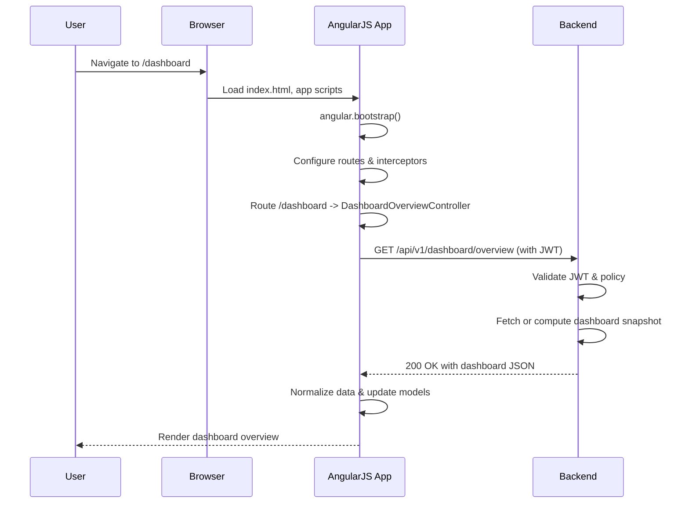
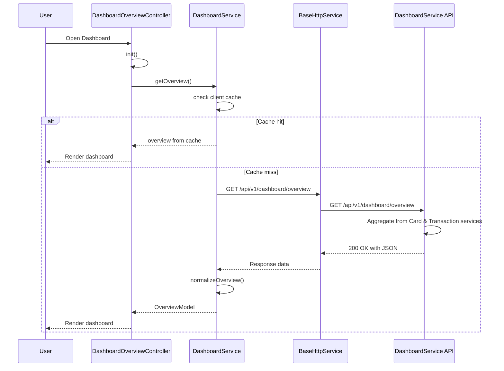
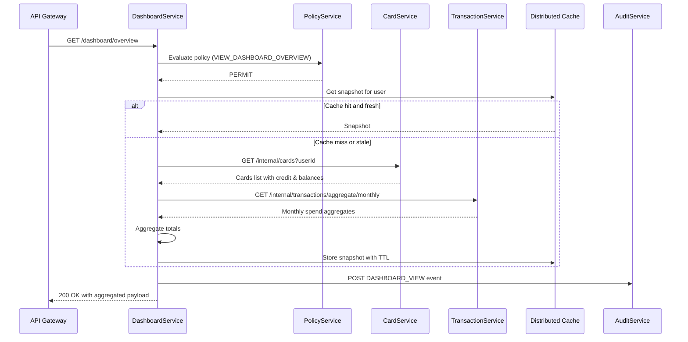
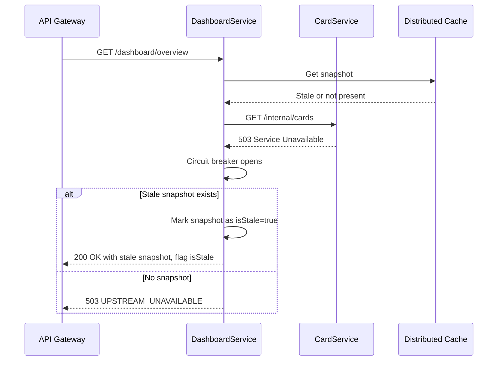

# Low-Level Design (LLD)

## Epic: QE-3720 – APPMRN25 Dashboard Overview and Credit Summary

This LLD translates the approved high-level design into an implementable solution using:
- AngularJS 1.x (AngularJS MVC)
- JavaScript (ES6 where compatible with build toolchain)
- HTML5, CSS3, Bootstrap 3/4 (per enterprise standard)
- REST APIs
- Server-side MVC (for backend services) with a Dashboard Service façade

The goal is to deliver a responsive, secure, multi-card credit dashboard that shows consolidated metrics such as total credit limit, available credit, outstanding amount, and monthly spend.

---

## 1. Application Architecture (Frontend & Backend)

### 1.1 AngularJS MVC Architecture Mapping

**Front-end SPA:**
- Single AngularJS application: `appmrn25DashboardApp`
- Uses AngularJS MVC where:
  - **View (V)**: HTML templates (dashboard layout, widgets, charts)
  - **Controller (C)**: AngularJS controllers handling view logic and user interactions
  - **Model (M)**: JavaScript objects representing cards, transactions, user dashboard metrics, and UI state
  - **Services/Factories**: Handle REST calls, caching, and shared state
  - **Directives/Components**: Encapsulate reusable UI widgets (cards list, metric tiles, spend charts)
  - **Filters**: Format currency, dates, and percentages

**Backend:** (Logical mapping; actual implementation can be Spring/Node/.NET etc.)
- REST façade: `DashboardService` exposing `/api/v1/dashboard/overview`
- Downstream services (accessed from DashboardService):
  - `CardService` (card master/balances)
  - `TransactionService` (transactions and monthly spend aggregates)
  - `AuthService` (tokens, user identity)
  - `PolicyService` (RBAC/ABAC authorization decisions)
  - `AuditService` (audit events)
- Distributed cache (e.g., Redis) used by DashboardService for snapshot caching

### 1.2 AngularJS Modules & Artifacts

**Root AngularJS module:**
- `appmrn25DashboardApp`
  - Depends on: `ngRoute` (or `ui.router`), `ngResource`, `ngAnimate`, `ngSanitize`, `ui.bootstrap`, `appmrn25.dashboard`, `appmrn25.shared`

**Feature module:**
- `appmrn25.dashboard`
  - Contains dashboard-specific controllers, services, directives, and routes

**Shared module:**
- `appmrn25.shared`
  - Shared filters, directives (spinner, error banner), interceptors, configuration

### 1.3 Recommended Project Folder Structure

**Frontend (AngularJS SPA)**
```
web/
  index.html
  assets/
    css/
      app.css
      dashboard.css
    img/
      ...
    js/
      lib/                # vendor scripts (AngularJS, Bootstrap, etc.)
      app/
        app.module.js
        app.config.js
        app.routes.js
        app.constants.js
        core/
          interceptors/
            auth.interceptor.js
            error.interceptor.js
          services/
            http.base.service.js
            logging.service.js
            auth.context.service.js
            config.service.js
          directives/
            loading-spinner.directive.js
            error-banner.directive.js
          filters/
            currency.format.filter.js
            date.range.filter.js
        dashboard/
          dashboard.module.js
          dashboard.routes.js
          controllers/
            dashboard.overview.controller.js
            dashboard.card-list.controller.js
          services/
            dashboard.service.js
            card-data.service.js
            transaction-data.service.js
          directives/
            credit-summary-tile.directive.js
            card-list-panel.directive.js
            monthly-spend-chart.directive.js
          templates/
            dashboard-overview.view.html
            partials/
              credit-summary-tile.html
              card-list-panel.html
              monthly-spend-chart.html
```

**Backend (Logical)**
```
server/
  api/
    controllers/
      DashboardOverviewController.java (or .js / .cs)
    services/
      DashboardAggregationService.java
      CardClient.java
      TransactionClient.java
      AuthorizationClient.java
      AuditClient.java
    models/
      DashboardOverviewResponse.java
      CardSummary.java
      MonthlySpendSummary.java
  config/
    application.yml
    application-prod.yml
    security-config.yml
```

---

## 2. Component Specifications (Frontend)

### 2.1 AngularJS Modules

#### 2.1.1 Module: `appmrn25DashboardApp`
- **Type:** AngularJS Module
- **File:** `web/assets/js/app/app.module.js`
- **Responsibility:** Root application module; wires core and feature modules.
- **Public API:** N/A (configuration only)
- **Dependencies:** `ngRoute` or `ui.router`, `appmrn25.dashboard`, `appmrn25.shared`

Example definition:
```js
angular.module('appmrn25DashboardApp', [
  'ngRoute',
  'ngAnimate',
  'ngSanitize',
  'ui.bootstrap',
  'appmrn25.shared',
  'appmrn25.dashboard'
]);
```

#### 2.1.2 Module: `appmrn25.dashboard`
- **Type:** AngularJS Module
- **File:** `web/assets/js/app/dashboard/dashboard.module.js`
- **Responsibility:** Encapsulate dashboard-related components.
- **Public API:** Exposes controllers, services, directives in this namespace.
- **Dependencies:** `appmrn25.shared`

---

### 2.2 Controllers

#### 2.2.1 Controller: `DashboardOverviewController`
- **Type:** Controller
- **File:** `web/assets/js/app/dashboard/controllers/dashboard.overview.controller.js`
- **Responsibility:**
  - Initialize dashboard data for logged-in user
  - Bind consolidated credit summary metrics to view
  - Handle refresh actions and error states
  - Manage loading state, stale-data indicators
- **Public Methods:**
  - `vm.init()` – initializes data
  - `vm.refresh()` – forces refresh ignoring cache where possible
  - `vm.selectCard(cardId)` – select a card to highlight per-card details
- **Inputs:**
  - Route-resolved user context (optional)
  - `$routeParams` (if cardId passed)
- **Outputs:**
  - ViewModel (`vm`) properties:
    - `vm.summary` (DashboardSummaryModel)
    - `vm.cards` (array of CardModel)
    - `vm.selectedCardId`
    - `vm.loading`, `vm.error`, `vm.isStale`
- **Dependencies (DI):**
  - `DashboardService`
  - `CardDataService`
  - `TransactionDataService`
  - `$log`
  - `LoggingService`
  - `$scope`

Pseudo-code:
```js
angular.module('appmrn25.dashboard')
  .controller('DashboardOverviewController', function(
      DashboardService,
      CardDataService,
      TransactionDataService,
      LoggingService,
      $scope
  ) {
    const vm = this;

    vm.loading = false;
    vm.error = null;
    vm.isStale = false;
    vm.summary = null;
    vm.cards = [];
    vm.selectedCardId = null;

    vm.init = function() {
      vm.loading = true;
      vm.error = null;
      DashboardService.getOverview()
        .then(response => {
          vm.summary = response.summary;
          vm.cards = response.cards;
          vm.isStale = response.isStale;
          if (!vm.selectedCardId && vm.cards.length) {
            vm.selectedCardId = vm.cards[0].cardId;
          }
        })
        .catch(err => {
          vm.error = DashboardService.toUserMessage(err);
          LoggingService.error('DashboardOverview', err);
        })
        .finally(() => {
          vm.loading = false;
        });
    };

    vm.refresh = function() {
      DashboardService.invalidateCache();
      vm.init();
    };

    vm.selectCard = function(cardId) {
      vm.selectedCardId = cardId;
    };

    $scope.$on('auth:logout', function() {
      vm.summary = null;
      vm.cards = [];
    });

    vm.init();
  });
```

#### 2.2.2 Controller: `CardListController`
- **Type:** Controller
- **File:** `web/assets/js/app/dashboard/controllers/dashboard.card-list.controller.js`
- **Responsibility:**
  - Drive the card list panel
  - Handle card selection, filtering, and possible future sorting
- **Public Methods:**
  - `vm.getCards()` – returns card list (used by directive)
  - `vm.onCardClick(card)` – notifies parent controller
- **Inputs:**
  - `cards` binding from parent scope (`DashboardOverviewController`)
- **Outputs:**
  - Emits events such as `dashboard:cardSelected`
- **Dependencies:**
  - `$scope`

---

### 2.3 Services / Factories

#### 2.3.1 Service: `DashboardService`
- **Type:** AngularJS Service
- **File:** `web/assets/js/app/dashboard/services/dashboard.service.js`
- **Responsibility:**
  - Communicate with backend DashboardService REST API (`/api/v1/dashboard/overview`)
  - Manage client-side caching of overview response to reduce latency and calls
  - Normalize response into front-end models
  - Map API errors to user-friendly messages
- **Public Methods:**
  - `getOverview(options)`
    - `options.forceRefresh` (boolean) – bypass client cache
  - `invalidateCache()` – clear client-side cached snapshot
  - `toUserMessage(error)` – map error object to translatable string key
- **Inputs:**
  - None directly (uses injected services)
- **Outputs:**
  - Promise resolving to `DashboardOverviewModel`
- **Dependencies:**
  - `BaseHttpService` (wrapper around `$http`)
  - `ConfigService` (API base url)
  - `$q`
  - `$cacheFactory`

Pseudo-code:
```js
angular.module('appmrn25.dashboard')
  .service('DashboardService', function(BaseHttpService, ConfigService, $q, $cacheFactory) {
    const cache = $cacheFactory('dashboardOverviewCache');

    this.getOverview = function(options = {}) {
      const cacheKey = 'overview';
      const cached = cache.get(cacheKey);
      if (cached && !options.forceRefresh) {
        return $q.resolve(cached);
      }

      const url = ConfigService.getApiBaseUrl() + '/dashboard/overview';

      return BaseHttpService.get(url)
        .then(response => {
          const normalized = normalizeOverview(response.data);
          cache.put(cacheKey, normalized);
          return normalized;
        });
    };

    this.invalidateCache = function() {
      cache.removeAll();
    };

    this.toUserMessage = function(error) {
      // Map backend error codes to UI messages
      const code = error && error.code;
      switch (code) {
        case 'AUTH_REQUIRED': return 'Your session has expired. Please log in again.';
        case 'ACCESS_DENIED': return 'You are not authorized to view this dashboard.';
        case 'UPSTREAM_UNAVAILABLE': return 'Some data is temporarily unavailable. Please try again later.';
        default: return 'An unexpected error occurred while loading your dashboard.';
      }
    };

    function normalizeOverview(apiPayload) {
      // Map backend payload to front-end models
      return {
        summary: {
          totalCreditLimit: apiPayload.totalCreditLimit,
          totalOutstandingAmount: apiPayload.totalOutstandingAmount,
          totalAvailableCredit: apiPayload.totalAvailableCredit,
          monthlySpend: apiPayload.monthlySpend,
          monthLabel: apiPayload.monthLabel,
          currency: apiPayload.currency,
          asOfTimestamp: apiPayload.asOfTimestamp
        },
        cards: apiPayload.cards || [],
        isStale: !!apiPayload.isStale
      };
    }
  });
```

#### 2.3.2 Service: `CardDataService`
- **Type:** AngularJS Service
- **File:** `web/assets/js/app/dashboard/services/card-data.service.js`
- **Responsibility:**
  - Provide card-level utility methods for UI (e.g., compute per-card ratios, flags)
  - Potentially fetch per-card details if separate endpoint used (extensible)
- **Public Methods:**
  - `getCardById(cards, cardId)` – filter card list
  - `computeUtilization(card)` – outstanding / creditLimit
- **Dependencies:** None (pure functions)

#### 2.3.3 Service: `TransactionDataService`
- **Type:** AngularJS Service
- **File:** `web/assets/js/app/dashboard/services/transaction-data.service.js`
- **Responsibility:**
  - Prepare monthly spend data for charts
  - Extendable to retrieve detailed monthly spend series (if separate API)
- **Public Methods:**
  - `buildMonthlySpendSeries(summary)` – create chart series object

---

### 2.4 Shared Core Services

#### 2.4.1 Service: `BaseHttpService`
- **Type:** Service
- **File:** `web/assets/js/app/core/services/http.base.service.js`
- **Responsibility:**
  - Wrap `$http` with common headers, authentication, error handling, and correlation IDs
- **Public Methods:**
  - `get(url, config)`
  - `post(url, data, config)`
  - `handleError(response)` – central error handler
- **Dependencies:** `$http`, `$q`, `AuthContextService`, `ConfigService`

#### 2.4.2 Service: `AuthContextService`
- **Type:** Service
- **File:** `web/assets/js/app/core/services/auth.context.service.js`
- **Responsibility:**
  - Maintain client-side view of authentication state (JWT token, user details)
  - Provide token for HTTP interceptors

#### 2.4.3 Service: `ConfigService`
- **Type:** Service
- **File:** `web/assets/js/app/core/services/config.service.js`
- **Responsibility:**
  - Read environment-specific properties (API base URL, feature flags)

#### 2.4.4 Service: `LoggingService`
- **Type:** Service
- **File:** `web/assets/js/app/core/services/logging.service.js`
- **Responsibility:**
  - Provide wrapper around `$log` plus server-side telemetry via REST

---

### 2.5 Directives / Components

#### 2.5.1 Directive: `creditSummaryTile`
- **Type:** Directive (component-style)
- **File:** `web/assets/js/app/dashboard/directives/credit-summary-tile.directive.js`
- **Template:** `web/assets/js/app/dashboard/templates/partials/credit-summary-tile.html`
- **Responsibility:**
  - Display total credit limit, available credit, outstanding amount, monthly spend
  - Encapsulate styling and formatting
- **Bindings:**
  - `summary` (one-way, DashboardSummaryModel)
- **Dependencies:**
  - `currencyFormat` filter

#### 2.5.2 Directive: `cardListPanel`
- **Type:** Directive
- **File:** `.../dashboard/directives/card-list-panel.directive.js`
- **Responsibility:**
  - Display list of cards with key metrics
  - Allow selection of card
- **Bindings:**
  - `cards` – array of card models
  - `selectedCardId` – string
  - `onSelect` – callback

#### 2.5.3 Directive: `monthlySpendChart`
- **Type:** Directive
- **File:** `.../dashboard/directives/monthly-spend-chart.directive.js`
- **Responsibility:**
  - Display aggregated monthly spend chart using a chart library (e.g., Chart.js)
- **Bindings:**
  - `summary` – DashboardSummaryModel

#### 2.5.4 Directive: `loadingSpinner`
- **Type:** Directive
- **Module:** `appmrn25.shared`
- **Responsibility:** Show loader overlay when `loading=true`

#### 2.5.5 Directive: `errorBanner`
- **Type:** Directive
- **Module:** `appmrn25.shared`
- **Responsibility:** Display non-technical error messages

---

### 2.6 Filters

#### 2.6.1 Filter: `currencyFormat`
- **File:** `web/assets/js/app/core/filters/currency.format.filter.js`
- **Responsibility:** Format numeric values into localized currency strings

#### 2.6.2 Filter: `percentage`
- **Responsibility:** Format utilization ratios as `XX.X%`

---

## 3. Component Responsibilities (Detailed)

### 3.1 Frontend Ownership

- **DashboardOverviewController**
  - Orchestrates data fetch for the dashboard overview
  - Owns UI state (loading, error, stale indicators)
  - Delegates business logic to services (e.g., data normalization lives in `DashboardService`)

- **DashboardService**
  - Owns front-end side of dashboard business logic:
    - Cache policies (TTL/generation) on the client
    - Transforms backend payload into UI models
    - Encapsulates REST integration

- **CardDataService**
  - Holds reusable logic for per-card derived values (utilization ratios, threshold flags)

- **TransactionDataService**
  - Holds reusable logic for building chart-friendly series

- **Directives**
  - Purely presentation + simple view logic (sorting, toggles)
  - No business logic or API calls

- **AuthContextService & HTTP Interceptors**
  - Manage tokens, attach Authorization headers, handle 401/403 responses

- **LoggingService**
  - Client-side logging (errors, performance markers) to server

### 3.2 Backend Ownership (Logical)

- **DashboardAggregationService**
  - Implements: 
    - `GET /api/v1/dashboard/overview`
  - Orchestrates CardService and TransactionService calls
  - Applies cache-first read on server side
  - Aggregates:
    - totalCreditLimit = Σ card.creditLimit
    - totalOutstandingAmount = Σ card.outstandingAmount
    - totalAvailableCredit = Σ card.availableCredit
    - monthlySpend = Σ transactionMonthlySpend (per card)

- **CardService**
  - Owns card master and balance data

- **TransactionService**
  - Owns transaction ingestion and monthly spend aggregates

- **PolicyService (RBAC/ABAC)**
  - Evaluates if caller can view given user’s cards

- **AuditService**
  - Records view events (dashboard accessed) and failures

---

## 4. Interface Specifications (REST & Component Interactions)

### 4.1 Frontend–Backend REST API

#### 4.1.1 Endpoint: Get Dashboard Overview
- **URL:** `/api/v1/dashboard/overview`
- **Method:** `GET`
- **Headers:**
  - `Authorization: Bearer <JWT>`
  - `X-Correlation-Id: <uuid>`
  - `Accept: application/json`
- **Request Parameters:**
  - Optional query params:
    - `month` (string, format `YYYY-MM`) – optional to specify which month; defaults to current
    - `refresh` (boolean) – if `true`, ignore server cache (subject to rate limits)
- **Request Payload:** None (GET)

**Response 200 (OK):**
```json
{
  "userId": "u-12345",
  "currency": "INR",
  "monthLabel": "2025-02",
  "totalCreditLimit": 350000.0,
  "totalOutstandingAmount": 120000.0,
  "totalAvailableCredit": 230000.0,
  "monthlySpend": 45000.0,
  "isStale": false,
  "asOfTimestamp": "2025-02-15T10:45:30Z",
  "cards": [
    {
      "cardId": "CARD-1",
      "cardAlias": "Primary Card",
      "last4": "1234",
      "issuer": "Bank A",
      "currency": "INR",
      "creditLimit": 200000.0,
      "outstandingAmount": 80000.0,
      "availableCredit": 120000.0,
      "monthlySpend": 30000.0,
      "status": "ACTIVE"
    },
    {
      "cardId": "CARD-2",
      "cardAlias": "Travel Card",
      "last4": "5678",
      "issuer": "Bank B",
      "currency": "INR",
      "creditLimit": 150000.0,
      "outstandingAmount": 40000.0,
      "availableCredit": 110000.0,
      "monthlySpend": 15000.0,
      "status": "ACTIVE"
    }
  ]
}
```

**Error Responses:**
- `401 UNAUTHORIZED`
  - Conditions: Token missing/expired/invalid
  - Body:
  ```json
  { "code": "AUTH_REQUIRED", "message": "Authentication required" }
  ```
- `403 FORBIDDEN`
  - Conditions: Policy denies access
  - Body:
  ```json
  { "code": "ACCESS_DENIED", "message": "Access denied" }
  ```
- `503 SERVICE_UNAVAILABLE`
  - Conditions: Downstream Card/Transaction service unavailable and cache stale/not present
  - Body:
  ```json
  { "code": "UPSTREAM_UNAVAILABLE", "message": "One or more dependent services are unavailable" }
  ```
- `500 INTERNAL_SERVER_ERROR`
  - Conditions: Unexpected errors

### 4.2 Backend Internal Service Interfaces

#### 4.2.1 CardService API
- **Endpoint:** `GET /internal/cards?userId=<userId>`
- **Description:** Returns list of cards for given user with credit and balance details.

#### 4.2.2 TransactionService API
- **Endpoint:** `GET /internal/transactions/aggregate/monthly?userId=<userId>&month=YYYY-MM`
- **Description:** Returns per-card and total monthly spend for user/month.

#### 4.2.3 PolicyService API
- **Endpoint:** `POST /internal/authorization/evaluate`
- **Payload:**
```json
{
  "subjectId": "u-12345",
  "action": "VIEW_DASHBOARD_OVERVIEW",
  "resource": "DASHBOARD_OVERVIEW",
  "attributes": {
    "ipAddress": "203.0.113.10",
    "deviceId": "device-xyz",
    "consent.analytics": true
  }
}
```
- **Response:**
```json
{ "decision": "PERMIT", "obligations": [] }
```

#### 4.2.4 AuditService API
- **Endpoint:** `POST /internal/audit/events`
- **Payload:**
```json
{
  "eventType": "DASHBOARD_VIEW",
  "userId": "u-12345",
  "timestamp": "2025-02-15T10:45:30Z",
  "details": {
    "resource": "DASHBOARD_OVERVIEW",
    "clientIp": "203.0.113.10",
    "deviceId": "device-xyz"
  }
}
```

---

## 5. Data Model Design (Frontend Models)

### 5.1 DashboardSummaryModel
- **Object Name:** `DashboardSummaryModel`
- **Definition:**
```js
class DashboardSummaryModel {
  constructor({
    totalCreditLimit = 0.0,
    totalOutstandingAmount = 0.0,
    totalAvailableCredit = 0.0,
    monthlySpend = 0.0,
    monthLabel = null,
    currency = 'INR',
    asOfTimestamp = null
  } = {}) {
    this.totalCreditLimit = totalCreditLimit;
    this.totalOutstandingAmount = totalOutstandingAmount;
    this.totalAvailableCredit = totalAvailableCredit;
    this.monthlySpend = monthlySpend;
    this.monthLabel = monthLabel;
    this.currency = currency;
    this.asOfTimestamp = asOfTimestamp;
  }
}
```
- **Attributes & Types:**
  - `totalCreditLimit`: number (float)
  - `totalOutstandingAmount`: number
  - `totalAvailableCredit`: number
  - `monthlySpend`: number
  - `monthLabel`: string (`YYYY-MM`)
  - `currency`: string (ISO 4217)
  - `asOfTimestamp`: string (ISO-8601)
- **Validation Rules:**
  - `totalCreditLimit >= 0`
  - `totalAvailableCredit >= 0`
  - `totalOutstandingAmount >= 0`
  - `monthlySpend >= 0`
  - `totalCreditLimit >= totalOutstandingAmount`
- **State Transitions:**
  - `INITIAL` → `LOADED` when data returned
  - `LOADED` → `STALE` when backend indicates `isStale=true`

### 5.2 CardModel
- **Object Name:** `CardModel`
- **Definition:**
```js
class CardModel {
  constructor({
    cardId,
    cardAlias,
    last4,
    issuer,
    currency = 'INR',
    creditLimit = 0.0,
    outstandingAmount = 0.0,
    availableCredit = 0.0,
    monthlySpend = 0.0,
    status = 'ACTIVE'
  } = {}) {
    this.cardId = cardId;
    this.cardAlias = cardAlias;
    this.last4 = last4;
    this.issuer = issuer;
    this.currency = currency;
    this.creditLimit = creditLimit;
    this.outstandingAmount = outstandingAmount;
    this.availableCredit = availableCredit;
    this.monthlySpend = monthlySpend;
    this.status = status;
  }
}
```
- **Attributes:**
  - `cardId`: string (non-empty)
  - `cardAlias`: string (optional, max length 50)
  - `last4`: string (exactly 4 digits – no PAN storage)
  - `issuer`: string
  - `currency`: string
  - `creditLimit`: number
  - `outstandingAmount`: number
  - `availableCredit`: number
  - `monthlySpend`: number
  - `status`: enum [`ACTIVE`, `BLOCKED`, `CLOSED`]
- **Validation Rules:**
  - `cardId` must be present
  - `creditLimit >= 0`
  - `availableCredit = creditLimit - outstandingAmount` (as informational check)
  - `last4` must NOT be used to reconstruct full card number

### 5.3 DashboardOverviewModel
- **Object Name:** `DashboardOverviewModel`
- **Definition:**
```js
class DashboardOverviewModel {
  constructor({ summary, cards = [], isStale = false } = {}) {
    this.summary = summary;
    this.cards = cards;
    this.isStale = isStale;
  }
}
```

### 5.4 UI State Model
- **Object Name:** `DashboardUiState`
- **Fields:**
  - `loading`: boolean
  - `error`: string | null
  - `selectedCardId`: string | null

---

## 6. Data Flow

### 6.1 Primary Data Flow (User opens Dashboard)

1. **User Action:**
   - User navigates to `/dashboard` route in SPA.
2. **View:**
   - AngularJS router loads `dashboard-overview.view.html` and binds `DashboardOverviewController`.
3. **Controller:**
   - `DashboardOverviewController.init()` is called.
   - Sets `vm.loading = true` and clears error.
4. **Service (DashboardService):**
   - `getOverview()` checks client cache.
   - If cache miss → perform HTTP `GET /api/v1/dashboard/overview`.
5. **Model/API:**
   - Backend DashboardService validates JWT and policy.
   - Reads from server-side cache; if miss:
     - Calls CardService and TransactionService to compute metrics.
     - Persists snapshot to cache.
   - Returns aggregated dashboard payload.
6. **Response:**
   - `DashboardService` normalizes payload into `DashboardOverviewModel`.
   - Resolves Promise; `DashboardOverviewController` sets `vm.summary`, `vm.cards`, `vm.isStale`.
7. **UI Update:**
   - Angular digest cycle updates view:
     - `creditSummaryTile` shows numbers.
     - `cardListPanel` shows list.
     - `monthlySpendChart` renders chart.
     - `loadingSpinner` hides.

### 6.2 Error Handling Data Flow

- If API call fails (e.g., 503):
  - `BaseHttpService` intercepts and wraps error.
  - `DashboardService.getOverview` rejects Promise.
  - `DashboardOverviewController` sets `vm.error` using `DashboardService.toUserMessage(err)` and `vm.loading=false`.
  - `errorBanner` directive displays message.

### 6.3 State Changes & Events

- On `auth:logout` event:
  - `DashboardOverviewController` clears `vm.summary` and `vm.cards`.
  - `DashboardService.invalidateCache()` may be called by an auth listener.

---

## 7. Sequence Diagrams (Mermaid)

### 7.1 Application Initialization



### 7.2 Primary User Workflow (View Dashboard Overview)



### 7.3 Service/API Interactions (Backend Perspective)



### 7.4 Error Handling Scenario (Downstream Failure)



---

## 8. Implementation Details

### 8.1 AngularJS Implementation Approach

- Use component-style directives for UI widgets
- Follow controller-as syntax (`controllerAs: 'vm'`)
- Use dependency injection via array notation to be minification-safe
- Use `$http` interceptors for auth and error handling

### 8.2 JavaScript ES6 Coding Patterns

- Use `const` and `let` instead of `var` in code where transpilation is available
- Use arrow functions inside services for callbacks, avoiding `this` confusion
- Use classes for front-end model definitions (with transpilation if needed)

### 8.3 Dependency Injection Details

- Controllers and services defined as:
```js
angular.module('appmrn25.dashboard')
  .controller('DashboardOverviewController', [
    'DashboardService',
    'CardDataService',
    'TransactionDataService',
    'LoggingService',
    '$scope',
    DashboardOverviewController
  ]);
```

- All AngularJS components must declare dependencies to avoid runtime injection errors.

### 8.4 Business Logic Flow

- All credit summary computations on the frontend are limited to formatting and minor validation (no authoritative aggregation).
- Authoritative aggregation of totals happens on backend DashboardService.

### 8.5 Validation Logic

- Client-side validation:
  - Check response numeric fields are non-negative; fallback to 0 if invalid
  - Defensive checks to avoid rendering `NaN`/`undefined`
- Server-side validation:
  - Validate request parameters (month, refresh) using strong typing and whitelisting

### 8.6 State Management Approach

- Use controller-local state and shared services for cross-component state
- No global `$rootScope` usage except for auth events

### 8.7 DOM Interaction Approach

- Direct DOM manipulation is not allowed in controllers; use directives and AngularJS bindings
- Use Bootstrap classes for layout and responsiveness

### 8.8 API Integration Approach

- All REST calls go through `BaseHttpService`
- `AuthInterceptor` attaches `Authorization` header with JWT
- `ErrorInterceptor` centralizes handling of HTTP errors and shows global messages where needed

---

## 9. Configuration

### 9.1 AngularJS Configuration Files

- `app.config.js`
  - Registers routes
  - Configures `$httpProvider` interceptors
- `app.constants.js`
  - Defines constants such as `ENV`, `VERSION`

### 9.2 Environment-specific Properties

- `config.service.js` reads from a JSON file or embedded constants like:
```js
const ENV_CONFIG = {
  apiBaseUrl: '/api/v1',
  featureFlags: {
    showMonthlySpendChart: true,
    showStaleDataBanner: true
  }
};
```

### 9.3 API Base URLs

- For all dashboards: `/api/v1/dashboard`
- Configured via `ConfigService` to support different base URLs per environment

### 9.4 Feature Flags

- `featureFlags.showMonthlySpendChart`
- `featureFlags.enableClientCache`

### 9.5 Logging & Telemetry Configuration

- `LoggingService` reads log level from config
- Log events sent to `/api/v1/telemetry/logs` (if enabled)

---

## 10. Error Handling and Resiliency (Client-Side View)

### 10.1 Client-side Exception Handling

- Use `$exceptionHandler` override to capture unhandled exceptions and route them through `LoggingService`
- Show generic error banner when unhandled exception occurs

### 10.2 REST API Error Handling

- `ErrorInterceptor` inspects response codes:
  - `401`: redirect to login page, broadcast `auth:logout`
  - `403`: show access denied message
  - `503`: show service unavailable banner
- `DashboardService.toUserMessage()` converts backend error codes into friendly messages

### 10.3 Retry Mechanisms

- Client does not auto-retry by default to avoid overload
- Provides **manual** retry via `Refresh` button which calls `DashboardOverviewController.refresh()`

### 10.4 Logging Strategy

- Log key events:
  - Dashboard loaded successfully (info)
  - API errors and HTTP status codes (error)
  - Client-side JS exceptions (error)
- Attach correlation ID to logs when available

### 10.5 Recovery and Fallback Behaviour

- If server returns `isStale=true`, UI shows banner: “Some data may be outdated. Last updated at <timestamp>.”
- If overview fails completely, UI hides metrics and shows error banner with retry option.

---

## 11. Security Considerations

### 11.1 Input Validation and Sanitization

- Client:
  - Any user-provided input (when introduced, e.g., filters) validated with regex/pattern checks
- Server:
  - Strong type checking for request parameters
  - Reject unexpected query params

### 11.2 XSS Prevention

- Use AngularJS auto-escaping in templates
- Avoid using `ng-bind-html` unless content is sanitized by `$sanitize`
- No raw HTML from backend is rendered

### 11.3 CSRF Protection

- For cookie-based auth, include CSRF tokens in headers using a standard header (e.g., `X-XSRF-TOKEN`)
- For token-based auth (JWT), avoid CSRF by storing tokens in memory/session storage (not cookies) and using HTTPS

### 11.4 Secure API Communication

- All endpoints accessed via HTTPS with TLS 1.3
- Hardcode `https` in API base URLs for production

### 11.5 Authentication & Authorization Integration Points

- Frontend assumes JWT token is present in storage when app initializes
- `AuthInterceptor` reads token from `AuthContextService` and adds it to requests
- Backend uses gateway/PolicyService to enforce RBAC/ABAC decisions

### 11.6 Sensitive Data Handling

- PAN and full card numbers are never exposed to frontend; only last4 and alias
- No sensitive cardholder data is logged
- Local storage is not used for storing sensitive data; tokens limited to short-lived JWTs

### 11.7 Audit Logging Approach

- Backend sends `DASHBOARD_VIEW` events to AuditService
- Frontend may capture additional events (e.g., UI analytics) only if user consents and per policy

---

## 12. Summary

This LLD provides complete mapping from the high-level dashboard architecture to a concrete AngularJS-based implementation. Every major HLD component – dashboard overview, card summary, transaction aggregation, security controls, caching, and audit – is mapped to specific AngularJS modules, controllers, services, directives, and backend REST APIs. Developers can implement the enterprise-grade APPMRN25 credit dashboard without referencing the HLD, using this LLD as the primary design artifact.
