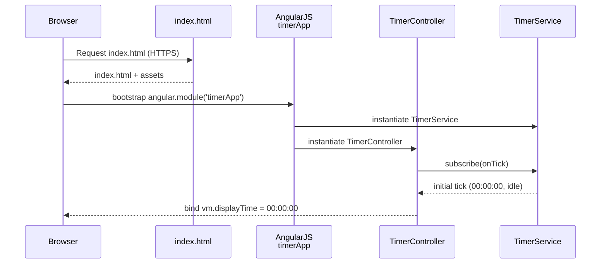
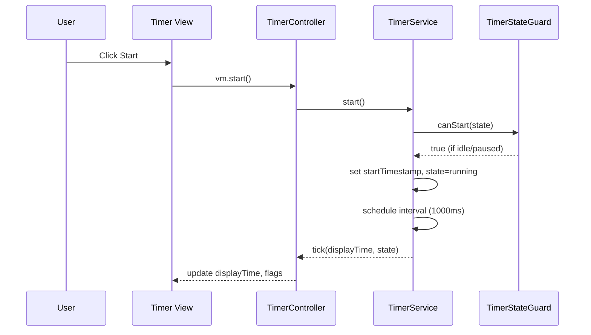
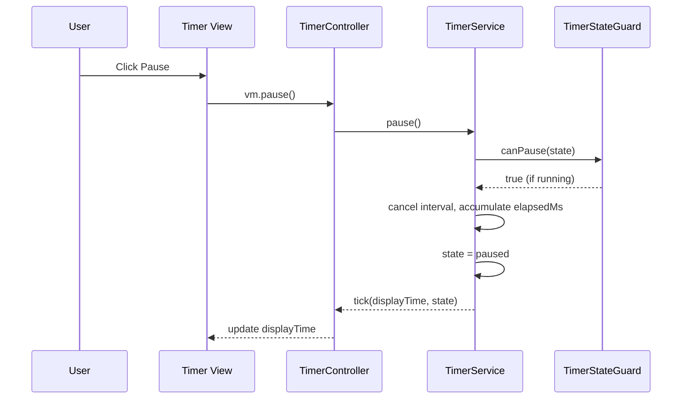
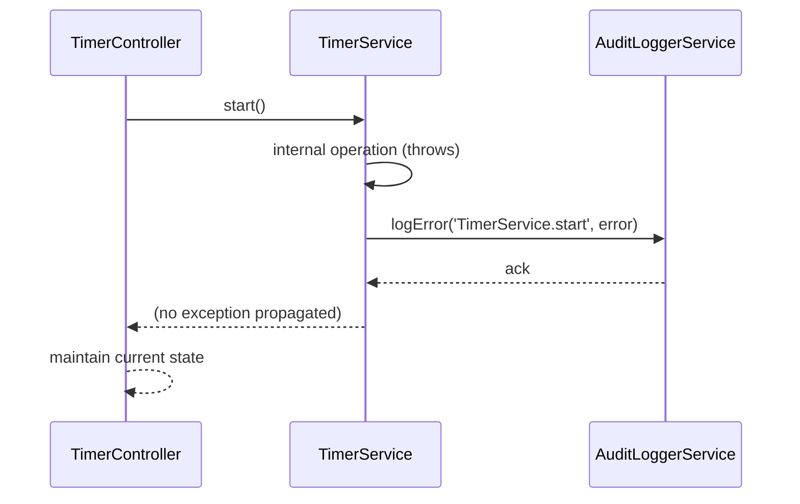

# Low-Level Design (LLD) – Timer Web Application (Epic QE-3724)

## 1. Application Architecture

### 1.1 Technology Stack
- **Frontend Framework:** AngularJS 1.x
- **Language:** JavaScript (ES6 where compatible, transpiled to ES5 for browser support if needed)
- **Markup & Styling:** HTML5, CSS3, Bootstrap 4/5 (CSS-only usage)
- **Architecture Pattern:** MVC within AngularJS
- **APIs:** No mandatory backend APIs in current scope; designed to support future REST integrations
- **Storage:** In-memory state; optional `sessionStorage` integration for future resilience

### 1.2 AngularJS MVC Mapping

The HLD components are mapped to AngularJS artifacts as follows:

| HLD Component                    | AngularJS Artifact(s)                                                                 |
|----------------------------------|---------------------------------------------------------------------------------------|
| Timer UI (HTML/CSS/JS)          | Module, main layout template, timer directive, Bootstrap-based view                   |
| Timer Service (JS Logic)        | AngularJS service (`TimerService`), controller (`TimerController`)                    |
| Time Management Module          | Internal helper within `TimerService` encapsulating `setInterval`/`clearInterval`     |
| Validation & State Guard        | State machine logic inside `TimerService`; directive-level guards for button states   |
| Security & Compliance Layer     | Angular configuration, `$httpProvider` interceptors (future), safe DOM binding rules  |
| Audit & Analytics Logger        | AngularJS service (`AuditLoggerService`)                                              |
| In-Browser Storage              | AngularJS service (`StorageService`) wrapping `sessionStorage` (optional, feature flag)|

### 1.3 AngularJS Modules and Configuration

- **Root Module:** `timerApp`
  - Declared in `app.module.js`.
  - Depends on built-in Angular modules: `ngRoute` (if routing needed later), `ngAnimate` (optional), and custom modules.

- **Feature Module:** `timerModule`
  - Declared in `timer.module.js`.
  - Encapsulates timer-specific controllers, services, directives.

- **Configuration:**
  - `app.config.js`: Application-wide configuration (routes, logging level constants, environment config, API base URLs placeholder).
  - `app.run.js`: Runtime initialization (global exception handler, initial logging, feature-flag registration).

### 1.4 Recommended Project Folder Structure

```text
root/
  index.html
  /app
    app.module.js
    app.config.js
    app.run.js
    /core
      constants.config.js        # ENV, feature flags, log levels
      http-interceptor.config.js # Future REST security, logging
      exception-handler.factory.js
    /timer
      timer.module.js
      timer.controller.js
      timer.service.js
      timer.directive.js
      timer.state-guard.service.js
      timer.templates.html       # ng-templates or partials (optional)
    /services
      audit-logger.service.js
      storage.service.js
  /assets
    /css
      styles.css
    /js
      libs.js                    # AngularJS, Bootstrap JS (if used)
    /fonts
    /img
```

## 2. Component Specifications

### 2.1 `timerApp` Module
- **Type:** AngularJS Module
- **File:** `app/app.module.js`
- **Responsibility:** Root application container; wires core and feature modules.
- **Public API:** N/A
- **Dependencies:** `ngRoute`, `ngAnimate` (optional), `timerModule`.

**Implementation Sketch:**
```javascript
(function() {
  'use strict';

  angular
    .module('timerApp', ['ngRoute', 'timerModule'])
    .constant('APP_VERSION', '1.0.0');
})();
```

### 2.2 `timerModule` Module
- **Type:** AngularJS Module
- **File:** `app/timer/timer.module.js`
- **Responsibility:** Encapsulate all timer-related artifacts.
- **Dependencies:** none (relies on root `timerApp`).

```javascript
(function() {
  'use strict';

  angular
    .module('timerModule', []);
})();
```

### 2.3 `TimerController`
- **Type:** Controller
- **File:** `app/timer/timer.controller.js`
- **Selector:** Used via `ng-controller="TimerController as vm"` or bound in directive.
- **Responsibility:**
  - Mediate between the Timer view and `TimerService`.
  - Expose view model for current time, state, and UI actions.
  - Orchestrate interactions with `AuditLoggerService` for user actions.
- **Public Methods/Bindings:**
  - `vm.start()`
  - `vm.pause()`
  - `vm.stop()`
  - `vm.displayTime` (string `HH:MM:SS`)
  - `vm.state` (`'idle' | 'running' | 'paused'`)
- **Inputs:** User button clicks (Start, Pause, Stop).
- **Outputs:**
  - Updated time display.
  - State info to enable/disable buttons.
- **Dependencies (DI):**
  - `TimerService`
  - `AuditLoggerService`
  - `$scope` (if using `$scope`-based pattern; otherwise controller-as).

**Key Behaviors:**
- Calls corresponding `TimerService` methods.
- On successful service call, updates local `vm.state` and `vm.displayTime` (or binds via callback).
- Logs actions via `AuditLoggerService.logEvent`.

### 2.4 `TimerService`
- **Type:** Service (AngularJS Service or Factory)
- **File:** `app/timer/timer.service.js`
- **Responsibility:**
  - Core timer state machine and time computation logic.
  - Encapsulation of `setInterval` / `clearInterval` operations.
  - Provide reactive hooks for controllers/directives (callbacks or `$rootScope` events).
- **Public Methods:**
  - `start()` – start or resume timer.
  - `pause()` – pause running timer.
  - `stop()` – stop and reset timer.
  - `getState()` – get current state.
  - `getDisplayTime()` – get formatted `HH:MM:SS`.
  - `subscribe(onTickCallback)` – optional: register UI callback for each tick.
- **Internal State:**
  - `state` – `'idle' | 'running' | 'paused'`.
  - `intervalId` – active interval reference or null.
  - `startTimestamp` – `number` (epoch ms).
  - `elapsedMs` – accumulated milliseconds when paused or stopped.
- **Inputs:**
  - Commands from controllers (`start`, `pause`, `stop`).
- **Outputs:**
  - Tick callbacks or events with updated display time.

- **Dependencies:**
  - `$interval` (Angular wrapper for `setInterval`).
  - `$rootScope` (for event broadcasting, if used).
  - `TimerStateGuard` (Validation & State Guard service).
  - `AuditLoggerService` (for internal error logs).

**Implementation Outline:**
```javascript
(function() {
  'use strict';

  angular
    .module('timerModule')
    .service('TimerService', TimerService);

  TimerService.$inject = ['$interval', '$rootScope', 'TimerStateGuard', 'AuditLoggerService'];

  function TimerService($interval, $rootScope, TimerStateGuard, AuditLoggerService) {
    const TICK_MS = 1000;

    let state = 'idle';
    let intervalPromise = null;
    let startTimestamp = null;
    let elapsedMs = 0;
    let onTickHandlers = [];

    const service = {
      start,
      pause,
      stop,
      getState,
      getDisplayTime,
      subscribe
    };

    return service;

    function start() {
      if (!TimerStateGuard.canStart(state)) {
        return;
      }

      try {
        if (intervalPromise) {
          $interval.cancel(intervalPromise);
        }
        const now = Date.now();
        startTimestamp = now;
        state = 'running';

        intervalPromise = $interval(onTick, TICK_MS);

        onTick(); // immediate update
      } catch (err) {
        AuditLoggerService.logError('TimerService.start', err);
      }
    }

    function pause() {
      if (!TimerStateGuard.canPause(state)) {
        return;
      }

      try {
        if (intervalPromise) {
          $interval.cancel(intervalPromise);
          intervalPromise = null;
        }
        if (startTimestamp) {
          elapsedMs += Date.now() - startTimestamp;
        }
        startTimestamp = null;
        state = 'paused';
        notifyTick();
      } catch (err) {
        AuditLoggerService.logError('TimerService.pause', err);
      }
    }

    function stop() {
      if (!TimerStateGuard.canStop(state)) {
        return;
      }

      try {
        if (intervalPromise) {
          $interval.cancel(intervalPromise);
          intervalPromise = null;
        }
        state = 'idle';
        elapsedMs = 0;
        startTimestamp = null;
        notifyTick();
      } catch (err) {
        AuditLoggerService.logError('TimerService.stop', err);
      }
    }

    function onTick() {
      const now = Date.now();
      let currentElapsedMs = elapsedMs;
      if (state === 'running' && startTimestamp) {
        currentElapsedMs += (now - startTimestamp);
      }
      notifyTick(currentElapsedMs);
    }

    function notifyTick(currentMs = elapsedMs) {
      const displayTime = formatTime(currentMs);
      onTickHandlers.forEach(h => h(displayTime, state));
      $rootScope.$broadcast('timer:tick', { displayTime, state });
    }

    function getState() {
      return state;
    }

    function getDisplayTime() {
      return formatTime(elapsedMs);
    }

    function subscribe(handler) {
      if (typeof handler === 'function') {
        onTickHandlers.push(handler);
      }
    }

    function formatTime(ms) {
      const totalSeconds = Math.floor(ms / 1000);
      const hours = Math.floor(totalSeconds / 3600);
      const minutes = Math.floor((totalSeconds % 3600) / 60);
      const seconds = totalSeconds % 60;

      return [hours, minutes, seconds]
        .map(v => v.toString().padStart(2, '0'))
        .join(':');
    }
  }
})();
```

### 2.5 `TimerStateGuard`
- **Type:** Service
- **File:** `app/timer/timer.state-guard.service.js`
- **Responsibility:** Centralized validation of state transitions.
- **Public Methods:**
  - `canStart(currentState)` -> boolean.
  - `canPause(currentState)` -> boolean.
  - `canStop(currentState)` -> boolean.
- **Inputs:** Current state string.
- **Outputs:** Boolean decisions driving UI enable/disable and service behavior.
- **Dependencies:** None.

```javascript
(function() {
  'use strict';

  angular
    .module('timerModule')
    .service('TimerStateGuard', TimerStateGuard);

  function TimerStateGuard() {
    this.canStart = state => state === 'idle' || state === 'paused';
    this.canPause = state => state === 'running';
    this.canStop  = state => state === 'running' || state === 'paused';
  }
})();
```

### 2.6 `timerDisplay` Directive
- **Type:** Directive
- **File:** `app/timer/timer.directive.js`
- **Responsibility:**
  - Encapsulate timer UI (display + buttons).
  - Bind to `TimerController` and respond to controller state.
- **Public API (Attributes):**
  - `timer-theme` (future use for themes).
- **Template:** Inline in directive or external `timer.templates.html`.
- **Dependencies:** `TimerController`.

```javascript
(function() {
  'use strict';

  angular
    .module('timerModule')
    .directive('timerDisplay', timerDisplay);

  function timerDisplay() {
    return {
      restrict: 'E',
      templateUrl: 'app/timer/timer-display.tpl.html',
      controller: 'TimerController',
      controllerAs: 'vm',
      bindToController: true,
      scope: {}
    };
  }
})();
```

### 2.7 `AuditLoggerService`
- **Type:** Service
- **File:** `app/services/audit-logger.service.js`
- **Responsibility:**
  - Client-side logging and diagnostics.
  - Provide hooks for future server-side logging via REST.
- **Public Methods:**
  - `logEvent(eventName, details)`
  - `logError(context, error)`
- **Inputs:** Event names and payloads.
- **Outputs:** Console logs and optional buffer for future transmission.
- **Dependencies:** `$log` (Angular logging), `$http` (future use), `ENV_CONFIG` (for log levels).

```javascript
(function() {
  'use strict';

  angular
    .module('timerApp')
    .service('AuditLoggerService', AuditLoggerService);

  AuditLoggerService.$inject = ['$log'];

  function AuditLoggerService($log) {
    const buffer = [];

    this.logEvent = function(eventName, details) {
      const entry = { ts: new Date().toISOString(), eventName, details };
      buffer.push(entry);
      $log.info('[EVENT]', entry);
    };

    this.logError = function(context, error) {
      const entry = { ts: new Date().toISOString(), context, error: error && error.message };
      buffer.push(entry);
      $log.error('[ERROR]', entry);
    };
  }
})();
```

### 2.8 `StorageService` (Optional)
- **Type:** Service
- **File:** `app/services/storage.service.js`
- **Responsibility:**
  - Abstract `sessionStorage` operations.
  - Allow feature-flagged persistence of timer state.
- **Public Methods:**
  - `saveTimerState(stateObj)`
  - `loadTimerState()`
  - `clearTimerState()`
- **Dependencies:** `$window`.

```javascript
(function() {
  'use strict';

  angular
    .module('timerApp')
    .service('StorageService', StorageService);

  StorageService.$inject = ['$window'];

  function StorageService($window) {
    const KEY = 'timerState';

    this.saveTimerState = function(state) {
      $window.sessionStorage.setItem(KEY, JSON.stringify(state));
    };

    this.loadTimerState = function() {
      const raw = $window.sessionStorage.getItem(KEY);
      return raw ? JSON.parse(raw) : null;
    };

    this.clearTimerState = function() {
      $window.sessionStorage.removeItem(KEY);
    };
  }
})();
```

### 2.9 View Template – Timer Display
- **File:** `app/timer/timer-display.tpl.html`
- **Responsibility:** Render UI with white background, timer display, and control buttons.

```html
<div class="container-fluid timer-container bg-white text-center py-5">
  <div class="row justify-content-center">
    <div class="col-12">
      <h1 class="display-4">Timer</h1>
    </div>
    <div class="col-12 my-4">
      <span class="timer-display h2">{{ vm.displayTime }}</span>
    </div>
    <div class="col-12">
      <button type="button" class="btn btn-success mx-2"
              ng-click="vm.start()" ng-disabled="!vm.canStart">
        Start
      </button>
      <button type="button" class="btn btn-warning mx-2"
              ng-click="vm.pause()" ng-disabled="!vm.canPause">
        Pause
      </button>
      <button type="button" class="btn btn-danger mx-2"
              ng-click="vm.stop()" ng-disabled="!vm.canStop">
        Stop
      </button>
    </div>
  </div>
</div>
```

## 3. Component Responsibilities in Detail

### 3.1 Controller Responsibilities
- Handle UI events from buttons.
- Consult `TimerStateGuard` via `TimerService` to determine allowed actions.
- Maintain and expose state flags `canStart`, `canPause`, `canStop` based on current state.
- Update `displayTime` based on `TimerService` callbacks or `timer:tick` events.
- Ensure no business logic related to timing exists in controller (delegated to `TimerService`).

### 3.2 Service Responsibilities

- **TimerService**
  - Owns and manages business logic related to time computation.
  - Maintains authoritative timer state.
  - Enforces singleton timer (`intervalPromise` is single source of truth).
  - Delegates validation to `TimerStateGuard`.
  - Notifies listeners of every tick and state transitions.

- **TimerStateGuard**
  - Purely functional rule engine for state transitions.
  - Single place to change rules if new states are added.

- **AuditLoggerService**
  - Non-intrusive logging of user actions and errors.
  - Future extension point for sending data to back-end.

- **StorageService**
  - Optional module for resilience; not used by default.

### 3.3 UI/Directive Responsibilities
- Render the timer and controls with white background.
- Provide accessible labels and semantics.
- Bind to controller methods and state properties.
- Do not hold timing logic or business rules.

## 4. Interface Specifications

### 4.1 Internal Interfaces

#### 4.1.1 `TimerController` ↔ `TimerService`

- **Methods:**
  - `TimerService.start()`
  - `TimerService.pause()`
  - `TimerService.stop()`
  - `TimerService.subscribe(onTick)`

- **Contract:**
  - `start` will start/resume timer only if allowed; otherwise a no-op.
  - `pause` and `stop` will be no-op when invalid, ensuring idempotent calls.
  - `subscribe` accepts a function of shape `(displayTime: string, state: string) => void`.

#### 4.1.2 `TimerService` ↔ `TimerStateGuard`

- **Methods:**
  - `TimerStateGuard.canStart(state)`
  - `TimerStateGuard.canPause(state)`
  - `TimerStateGuard.canStop(state)`

- **Contract:**
  - State guard is authoritative; service must not bypass it.

#### 4.1.3 `TimerController` ↔ `AuditLoggerService`

- **Methods:**
  - `AuditLoggerService.logEvent('timer:start', { state })`
  - `AuditLoggerService.logEvent('timer:pause', { state })`
  - `AuditLoggerService.logEvent('timer:stop', { state })`


### 4.2 REST API Interfaces (Future Use)

Current epic does not require external APIs. However, to be future-ready, define a placeholder interface for logging events.

#### 4.2.1 Event Logging API (Optional / Future)
- **Endpoint:** `/api/v1/timer/log`
- **Method:** `POST`
- **Request Payload (JSON):**
```json
{
  "eventName": "timer:start|timer:pause|timer:stop|timer:error",
  "timestamp": "2024-01-01T12:00:00Z",
  "state": "idle|running|paused",
  "details": {
    "browser": "Chrome 126",
    "elapsedMs": 120000
  }
}
```
- **Response (200):**
```json
{
  "status": "ok",
  "id": "event-uuid"
}
```
- **Error Responses:**
  - `400` – invalid payload.
  - `401`/`403` – unauthorized/forbidden when auth is added.
  - `500` – server error.


## 5. Data Model Design

### 5.1 Timer State Model

**Object Name:** `TimerState`

**Attributes:**

| Attribute        | Type    | Default      | Description                                         | Validation                          |
|------------------|---------|-------------|-----------------------------------------------------|-------------------------------------|
| `state`          | string  | `'idle'`     | Current state of the timer                          | One of `'idle'`, `'running'`, `'paused'` |
| `elapsedMs`      | number  | `0`         | Elapsed time in ms                                  | `>= 0` integer                      |
| `startTimestamp` | number? | `null`      | Epoch ms when last started/resumed                 | `null` or valid epoch number       |

**State Transitions:**
- `idle` → `running` via `start()`
- `running` → `paused` via `pause()`
- `paused` → `running` via `start()`
- `running` → `idle` via `stop()`
- `paused` → `idle` via `stop()`

Invalid transitions are blocked by `TimerStateGuard`.

### 5.2 Audit Event Model

**Object Name:** `AuditEvent`

| Attribute    | Type   | Default           | Description                          |
|-------------|--------|-------------------|--------------------------------------|
| `ts`        | string | `new Date().toISOString()` | ISO timestamp                |
| `eventName` | string | none              | Event identifier                     |
| `details`   | object | `{}`              | Contextual information               |

Validation: `eventName` must be non-empty string; `details` must be serializable.

## 6. Data Flow

### 6.1 Core User Flow

1. **User Action (Start):**
   - User clicks Start.
2. **View → Controller:**
   - `ng-click="vm.start()"` triggers `TimerController.start()`.
3. **Controller → Service:**
   - `TimerController` calls `TimerService.start()`.
4. **Service → State Guard:**
   - `TimerService.start()` calls `TimerStateGuard.canStart(state)`.
5. **Service → Time Management:**
   - If allowed, set `startTimestamp = Date.now()` and schedule `$interval(onTick, 1000)`.
6. **Time Management → Model:**
   - Each tick computes `elapsedMs` via `Date.now() - startTimestamp + existingElapsed`.
7. **Service → Controller/UI:**
   - `TimerService` invokes `onTick` handlers with formatted `displayTime`.
   - Controller updates `vm.displayTime` and state flags.
8. **UI Update:**
   - Angular digest updates the bound template.

### 6.2 Pause Flow

1. User clicks Pause.
2. View triggers `vm.pause()`.
3. Controller calls `TimerService.pause()`.
4. Service calls `TimerStateGuard.canPause(state)`.
5. If allowed:
   - Cancel `$interval`.
   - Accumulate `elapsedMs`.
   - Set `state = 'paused'`.
   - Notify UI via `notifyTick`.

### 6.3 Stop Flow

1. User clicks Stop.
2. View triggers `vm.stop()`.
3. Controller calls `TimerService.stop()`.
4. Service calls `TimerStateGuard.canStop(state)`.
5. If allowed:
   - Cancel `$interval`.
   - Reset `elapsedMs = 0`, `state = 'idle'`.
   - Notify UI; UI shows `00:00:00`.

## 7. Sequence Diagrams (Mermaid)

### 7.1 Application Initialization



### 7.2 Start Timer Workflow



### 7.3 Pause Timer Workflow



### 7.4 Error Handling Scenario



## 8. Implementation Details

### 8.1 AngularJS Implementation Approach
- Use **controller-as** syntax for better readability and to avoid `$scope` where possible.
- Use services for shared business logic and state.
- Use directives to encapsulate reusable UI widgets (timer display + controls).

### 8.2 JavaScript ES6 Patterns
- Use `const`/`let` instead of `var` in code base (transpiled for compatibility if necessary).
- Use arrow functions within services where appropriate, except where binding `this` is required.
- Encapsulate helper functions within IIFEs to avoid global namespace pollution.

### 8.3 Dependency Injection
- Annotate dependencies using `$inject` arrays to ensure minification safety.
- Group DI registrations by module (`timerModule` vs `timerApp`).

### 8.4 Business Logic Flow
- All state mutation logic resides in `TimerService`.
- Controllers remain thin and only orchestrate UI actions.
- Validation is centralized in `TimerStateGuard`.

### 8.5 Validation Logic
- Guard all state transitions via `TimerStateGuard`.
- UI also disables invalid actions via bindings:
  - `vm.canStart = TimerStateGuard.canStart(vm.state)`.
  - `vm.canPause = TimerStateGuard.canPause(vm.state)`.
  - `vm.canStop  = TimerStateGuard.canStop(vm.state)`.

### 8.6 State Management Approach
- Single source of truth in `TimerService` for timer state.
- Controllers subscribe to tick updates, not vice versa.
- Optional persistence: `StorageService` to persist snapshots when feature flag is enabled.

### 8.7 DOM Interaction Approach
- Use Angular binding for text updates (no direct DOM manipulation).
- Use `textContent` rendering via interpolation to avoid XSS (`{{ vm.displayTime }}`).
- Buttons use `ng-disabled` for state-dependent interactivity.

### 8.8 API Integration Approach (Future)
- Use `$http` or `$httpClient` (if wrapper) with base URL from environment configuration.
- Configure `$httpProvider` interceptors for:
  - Authorization headers.
  - CSRF tokens.
  - Unified error handling and logging.

## 9. Configuration

### 9.1 AngularJS Configuration Files

#### `app.config.js`
- Define routes (if multiple views later).
- Configure `$logProvider.debugEnabled` based on environment.
- Register HTTP interceptors (future).

```javascript
(function() {
  'use strict';

  angular
    .module('timerApp')
    .config(appConfig);

  appConfig.$inject = ['$logProvider'];

  function appConfig($logProvider) {
    $logProvider.debugEnabled(true); // disabled in production
  }
})();
```

#### `constants.config.js`
- Environment-specific settings.

```javascript
(function() {
  'use strict';

  angular
    .module('timerApp')
    .constant('ENV_CONFIG', {
      env: 'dev',
      apiBaseUrl: 'https://api.example.com',
      enableStorage: false,
      logLevel: 'info'
    });
})();
```

### 9.2 Environment-specific Properties
- Use build-time configuration (e.g., different `constants.config.js` per environment) or environment injection from server.
- Properties include:
  - `apiBaseUrl` (future use for logging/analytics).
  - `enableStorage` (toggle session storage).
  - `logLevel` (controls verbosity).

### 9.3 Feature Flags
- `enableStorage` – toggles `StorageService` usage.
- `enableRemoteLogging` – toggles server-side logging (future).

### 9.4 Logging & Telemetry Configuration
- Use `AuditLoggerService` as central logging abstraction.
- In production, connect `AuditLoggerService` to back-end logging via REST when enabled.

## 10. Error Handling and Resiliency

### 10.1 Client-side Exception Handling
- Wrap critical methods in `TimerService` (`start`, `pause`, `stop`) with try/catch.
- Use centralized exception handler (`exception-handler.factory.js`) for global Angular errors.

```javascript
(function() {
  'use strict';

  angular
    .module('timerApp')
    .factory('$exceptionHandler', exceptionHandler);

  exceptionHandler.$inject = ['AuditLoggerService'];

  function exceptionHandler(AuditLoggerService) {
    return function(exception, cause) {
      AuditLoggerService.logError('Global', exception);
    };
  }
})();
```

### 10.2 REST API Error Handling (Future)
- HTTP interceptor to transform backend errors into user-friendly messages.
- Retry policy (exponential backoff) for transient errors on logging endpoints.

### 10.3 Retry Mechanisms
- Not required for in-browser timer logic.
- For remote calls, build a retry utility with configurable maximum attempts.

### 10.4 Logging Strategy
- All unexpected errors are logged via `AuditLoggerService`.
- Non-critical errors in timer operations should not break UI; fail gracefully and reset to `idle` when necessary.

### 10.5 Recovery & Fallback
- On detected inconsistency (e.g., interval exists but state != `running`), perform a safe reset:
  - Cancel interval.
  - Reset state to `idle` and `elapsedMs` = 0.
  - Notify UI.

## 11. Security Considerations

### 11.1 Input Validation and Sanitization
- No direct user text input in current epic.
- When future inputs are added:
  - Validate length and allowed characters.
  - Avoid using `ng-bind-html` without `$sanitize`.

### 11.2 XSS Prevention
- Use interpolation (`{{ }}`) instead of manually building HTML.
- Avoid `ng-bind-html` unless sanitized.
- Do not use `innerHTML` from untrusted sources.

### 11.3 CSRF Protection
- For future REST APIs:
  - Integrate CSRF tokens via HTTP interceptor.
  - Leverage server-set anti-CSRF cookies and headers.

### 11.4 Secure API Communication
- All external calls must use HTTPS with TLS 1.3.
- Enforce HSTS at web server level.

### 11.5 Authentication and Authorization (Future)
- Current scope: no auth.
- Future integration points:
  - Pluggable authentication service injected into `AuditLoggerService` or higher-level components.
  - RBAC/ABAC enforced server-side on API endpoints.

### 11.6 Sensitive Data Handling
- No sensitive data presently.
- If identifiers or user data are added:
  - Never store secrets in front-end.
  - Use token-based auth with short-lived tokens.

### 11.7 Audit Logging Approach
- Log minimal necessary data.
- Anonymize or pseudonymize identifiers where feasible.
- Define log retention policy on back-end (e.g., 30–90 days) when implemented.

## 12. Summary of Files and Locations

| File Path                                | Purpose                                             |
|-----------------------------------------|-----------------------------------------------------|
| `index.html`                            | Entry HTML with `timer-display` directive           |
| `app/app.module.js`                    | Root Angular module                                 |
| `app/app.config.js`                    | Global configuration                                |
| `app/core/constants.config.js`        | Environment & feature flags                         |
| `app/core/exception-handler.factory.js`| Global exception handler                            |
| `app/timer/timer.module.js`           | Timer feature module                                |
| `app/timer/timer.service.js`          | Timer logic and state machine                       |
| `app/timer/timer.state-guard.service.js`| State validation rules                            |
| `app/timer/timer.controller.js`       | Timer view controller                               |
| `app/timer/timer.directive.js`        | Timer UI directive                                  |
| `app/timer/timer-display.tpl.html`    | Timer UI template                                   |
| `app/services/audit-logger.service.js`| Audit logging service                               |
| `app/services/storage.service.js`     | Optional session storage abstraction                |
| `assets/css/styles.css`              | Timer-specific and global CSS styles                |
