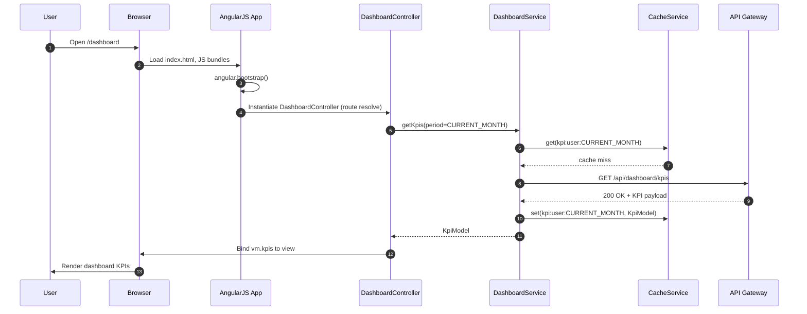
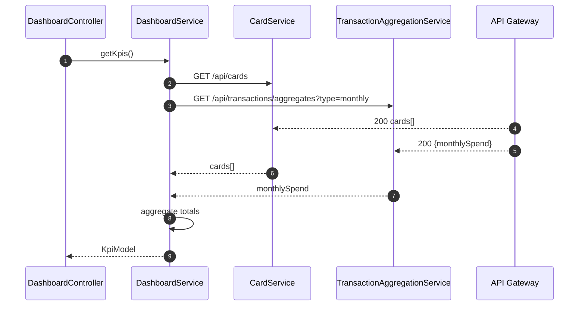

# Low-Level Design (LLD) – Credit Card Analysis Dashboard KPIs (Epic QE-3762)

## 1. Application Architecture

### 1.1 Architectural Style

- Client-side Single Page Application (SPA) built with:
  - AngularJS 1.x (AngularJS MVC pattern)
  - JavaScript ES6 (transpiled where necessary for browser support)
  - HTML5, CSS3, Bootstrap 3/4 (as per enterprise standard)
- Backend exposed via REST APIs hosted behind an API Gateway / BFF.
- MVC separation enforced:
  - **Model**: JavaScript objects and AngularJS services handling data and business logic.
  - **View**: HTML templates with AngularJS directives and Bootstrap styling.
  - **Controller**: AngularJS controllers coordinating views, user actions, and services.

### 1.2 AngularJS Module Structure

```text
app/
  core/
    core.module.js
    core.config.js
    core.routes.js
    core.constants.js
    core.run.js
  dashboard/
    dashboard.module.js
    dashboard.routes.js
    controllers/
      dashboard.controller.js
      kpiSummary.controller.js
    services/
      dashboard.service.js
      card.service.js
      transactionAggregation.service.js
      cache.service.js
      auth.service.js
      logging.service.js
      config.service.js
    directives/
      kpiTile.directive.js
      kpiLayout.directive.js
      loadingSpinner.directive.js
      errorBanner.directive.js
  shared/
    models/
      card.model.js
      kpi.model.js
      userSession.model.js
    filters/
      currencyAbbrev.filter.js
      dateRangeLabel.filter.js
    components/
      navbar.directive.js
      footer.directive.js
  assets/
    css/
      main.css
      dashboard.css
    js/
      polyfills.js
  index.html
```

- Root AngularJS module: `creditCardDashboardApp` (defined in `core.module.js`).
- Feature module: `ccd.dashboard` for dashboard KPIs.

### 1.3 Mapping HLD Components to AngularJS Artifacts

| HLD Component                     | AngularJS Artifact(s)                                                                                              |
|-----------------------------------|---------------------------------------------------------------------------------------------------------------------|
| Browser UI / SPA                  | `index.html`, `core.module.js`, routing, Bootstrap-based responsive layout                                         |
| API Gateway / BFF (external)      | Wrapped by `DashboardService`, `CardService`, `TransactionAggregationService`, `AuthService`                       |
| Dashboard Service (backend)       | `DashboardService` (frontend abstraction over `/api/dashboard/kpis`)                                               |
| Card Service (backend)            | `CardService` (frontend abstraction over `/api/cards`)                                                              |
| Transaction Aggregation Service   | `TransactionAggregationService` (frontend abstraction over `/api/transactions/aggregates`)                         |
| Relational Database               | Represented via `CardModel`, `KpiModel` JavaScript models and REST responses                                       |
| Cache Layer                       | `CacheService` to cache frontend data and use HTTP cache headers where available                                   |
| Identity Provider                 | `AuthService`, `UserSessionModel`, HTTP interceptor for tokens                                                     |
| Audit and Logging Service         | `LoggingService` sending structured logs to `/api/logs` or console, correlation IDs in headers                    |
| Configuration and Secrets Store   | `ConfigService`, `core.constants.js` (non-secret config only)                                                      |
| Compliance and Reporting Service  | Event hooks via `LoggingService` and `DashboardService` (e.g., view events)                                        |


## 2. Component Specifications

### 2.1 Core Module (`core.module.js`)

- **Component Name**: Core Module
- **Type**: AngularJS Module
- **File**: `app/core/core.module.js`
- **Responsibility**: Declare root AngularJS module, inject dependencies, bootstrap app.
- **Definition**:
  ```js
  angular.module('creditCardDashboardApp', [
    'ngRoute',
    'ccd.dashboard'
  ]);
  ```
- **Public API**: N/A (module definition only).
- **Dependencies**: `ngRoute`, `ccd.dashboard`.

### 2.2 Core Configuration (`core.config.js`)

- **Type**: Config block
- **File**: `app/core/core.config.js`
- **Responsibility**:
  - Configure `$httpProvider` for default headers, interceptors (auth, logging, error handling).
  - Configure global `$log` settings.
- **Key Methods**:
  - Config function `coreConfig($httpProvider, $logProvider)`.
- **Inputs**:
  - Angular `$httpProvider` for adding interceptors.
  - `$logProvider` for enabling/disabling debug logs.
- **Outputs**:
  - Configured HTTP behavior.
- **Dependencies**:
  - `AuthInterceptor`, `ErrorInterceptor` (factory/interceptor definitions inside `dashboard` module or shared core).

### 2.3 Core Routes (`core.routes.js`)

- **Type**: Route configuration
- **File**: `app/core/core.routes.js`
- **Responsibility**: Define default route to dashboard.
- **Methods**:
  - `configureRoutes($routeProvider)`.
- **Route Example**:
  ```js
  $routeProvider
    .when('/dashboard', {
      templateUrl: 'app/dashboard/views/dashboard.html',
      controller: 'DashboardController',
      controllerAs: 'vm',
      resolve: {
        initialKpis: function(DashboardService) {
          return DashboardService.getKpis();
        }
      }
    })
    .otherwise({ redirectTo: '/dashboard' });
  ```

### 2.4 Dashboard Module (`dashboard.module.js`)

- **Component Name**: Dashboard Module
- **Type**: AngularJS Module
- **File**: `app/dashboard/dashboard.module.js`
- **Responsibility**: Feature module for KPI dashboard.
- **Definition**:
  ```js
  angular.module('ccd.dashboard', []);
  ```
- **Dependencies**: None by default (optional `ngAnimate`, etc., if needed).

### 2.5 Dashboard Controller (`dashboard.controller.js`)

- **Component Name**: DashboardController
- **Type**: Controller
- **File**: `app/dashboard/controllers/dashboard.controller.js`
- **Responsibility**:
  - Orchestrate retrieval and display of KPIs.
  - Manage view state (loading, error, last updated timestamp).
  - Trigger refresh of KPIs.
- **Public Methods**:
  - `init(initialKpis)` – initialize controller with resolved KPIs.
  - `refresh()` – fetch latest KPIs from `DashboardService`.
  - `onPeriodChange(period)` – change KPI period (e.g., current month, last month).
- **Inputs**:
  - `initialKpis` (resolved data).
  - User interactions (button clicks, dropdown selection).
- **Outputs**:
  - `vm.kpis` – bound to view for rendering.
  - `vm.error`, `vm.isLoading`, `vm.lastUpdated`.
- **Dependencies (DI)**:
  - `DashboardService`, `LoggingService`, `$q`, `$scope`, `ConfigService`.

### 2.6 KPI Summary Controller (`kpiSummary.controller.js`)

- **Component Name**: KpiSummaryController
- **Type**: Controller
- **File**: `app/dashboard/controllers/kpiSummary.controller.js`
- **Responsibility**:
  - Manage subset of KPIs for summary tiles when used independently.
  - Support reuse in other views.
- **Public Methods**:
  - `loadKpiSummary()` – load summary metrics only (without detailed breakdowns).
- **Dependencies**:
  - `DashboardService`.

### 2.7 Dashboard Service (`dashboard.service.js`)

- **Component Name**: DashboardService
- **Type**: Service (AngularJS service)
- **File**: `app/dashboard/services/dashboard.service.js`
- **Responsibility**:
  - Communicate with backend Dashboard Service via API Gateway.
  - Apply frontend-level business rules and mapping to `KpiModel`.
  - Coordinate calls to `CardService` and `TransactionAggregationService` for composite flows if backend is decomposed.
- **Public Methods**:
  - `getKpis(options)` – returns a promise resolving to `KpiModel` instance.
  - `getCachedKpis(key)` – read KPIs from `CacheService`.
  - `invalidateKpiCache(key)` – clear cache entry.
  - `auditKpiView(kpiModel)` – send audit event via `LoggingService`.
- **Inputs**:
  - `options` with fields: `period`, `includeCardDetails` (boolean), `forceRefresh`.
- **Outputs**:
  - Normalized `KpiModel` containing:
    - `totalCreditLimit`
    - `availableCredit`
    - `outstandingAmount`
    - `monthlySpend`
    - `period`
    - `cardSummaries[]`
- **Dependencies**:
  - `$http`, `$q`, `CacheService`, `ConfigService`, `AuthService`, `LoggingService`, `CardService`, `TransactionAggregationService`.

### 2.8 Card Service (`card.service.js`)

- **Component Name**: CardService
- **Type**: Service
- **File**: `app/dashboard/services/card.service.js`
- **Responsibility**:
  - Retrieve per-card metadata and balances for the authenticated user.
- **Public Methods**:
  - `getUserCards()` – GET `/api/cards`.
  - `getCardById(cardId)` – GET `/api/cards/{cardId}` (if needed later).
- **Dependencies**:
  - `$http`, `$q`, `ConfigService`, `AuthService`.

### 2.9 Transaction Aggregation Service (`transactionAggregation.service.js`)

- **Component Name**: TransactionAggregationService
- **Type**: Service
- **File**: `app/dashboard/services/transactionAggregation.service.js`
- **Responsibility**:
  - Retrieve monthly aggregated spend for current user across all cards.
- **Public Methods**:
  - `getMonthlySpend(period)` – GET `/api/transactions/aggregates?type=monthly&period={period}`.
- **Dependencies**:
  - `$http`, `$q`, `ConfigService`, `AuthService`.

### 2.10 Cache Service (`cache.service.js`)

- **Component Name**: CacheService
- **Type**: Service
- **File**: `app/dashboard/services/cache.service.js`
- **Responsibility**:
  - Frontend cache for KPIs and card metadata.
- **Public Methods**:
  - `get(key)` – return value or null.
  - `set(key, value, ttlInSeconds)` – store value with expiry.
  - `remove(key)`.
- **Dependencies**:
  - `$window` (for sessionStorage/localStorage), `$timeout`.

### 2.11 Auth Service (`auth.service.js`)

- **Component Name**: AuthService
- **Type**: Service
- **File**: `app/dashboard/services/auth.service.js`
- **Responsibility**:
  - Manage user session token retrieval, storage and injection into HTTP headers.
  - Expose current user identity and roles.
- **Public Methods**:
  - `getAccessToken()` – returns token from secure storage.
  - `isAuthenticated()` – returns boolean.
  - `getUserContext()` – returns `UserSessionModel`.
- **Dependencies**:
  - `$window`, `UserSessionModel`.

### 2.12 Logging Service (`logging.service.js`)

- **Component Name**: LoggingService
- **Type**: Service
- **File**: `app/dashboard/services/logging.service.js`
- **Responsibility**:
  - Send structured logs and audit events to backend.
  - Wrap `$log` with correlation ID enrichment.
- **Public Methods**:
  - `info(eventName, payload)`
  - `error(eventName, payload, error)`
  - `audit(eventName, payload)` – specifically for audit events.
- **Dependencies**:
  - `$log`, `$http`, `ConfigService`.

### 2.13 Config Service (`config.service.js`)

- **Component Name**: ConfigService
- **Type**: Service
- **File**: `app/dashboard/services/config.service.js`
- **Responsibility**:
  - Expose environment-specific configuration (API base URLs, feature flags).
- **Public Methods**:
  - `getApiBaseUrl()`
  - `getFeatureFlag(flagName)`
  - `getEnvironmentName()`
- **Dependencies**:
  - `ENV_CONFIG` constant (injected via `core.constants.js`).

### 2.14 Directives

#### 2.14.1 KPI Tile Directive (`kpiTile.directive.js`)

- **Component Name**: kpiTile
- **Type**: Directive (element)
- **File**: `app/dashboard/directives/kpiTile.directive.js`
- **Responsibility**:
  - Render a single KPI tile (e.g., Total Credit Limit) with label, value, and tooltip.
- **Attributes**:
  - `kpi-title` (string)
  - `kpi-value` (number/string)
  - `kpi-unit` (string)
  - `kpi-icon` (string, CSS class)
- **Scope**:
  - Isolated scope binding to attributes.

#### 2.14.2 KPI Layout Directive (`kpiLayout.directive.js`)

- **Component Name**: kpiLayout
- **Type**: Directive
- **File**: `app/dashboard/directives/kpiLayout.directive.js`
- **Responsibility**:
  - Responsive layout container for KPI tiles using Bootstrap grid.
- **Inputs**:
  - `kpis` – array of KPI models.
- **Outputs**:
  - Emits events on tile click (if needed for drill-down).

#### 2.14.3 Loading Spinner Directive (`loadingSpinner.directive.js`)

- Renders loading indicator overlay during HTTP requests.

#### 2.14.4 Error Banner Directive (`errorBanner.directive.js`)

- Displays non-intrusive error message bar tied to `vm.error`.


## 3. Component Responsibilities

### 3.1 Controllers

- **DashboardController**:
  - Owns presentation logic for main dashboard view.
  - Owns UI state: loading, error, lastUpdated, selectedPeriod.
  - Delegates business logic to services.
  - Does not perform direct `$http` calls.

- **KpiSummaryController**:
  - Slim controller for summary panels reused across modules.
  - Delegates entirely to `DashboardService`.

### 3.2 Services

- **DashboardService**:
  - Primary orchestrator for KPI retrieval.
  - Implements:
    - Cache lookup by user + period.
    - Call to `/api/dashboard/kpis` or, if configured, calls `CardService` and `TransactionAggregationService` and aggregates client-side.
    - Basic data normalization and mapping to `KpiModel`.
    - Audit event emission on successful KPI retrieval.

- **CardService**:
  - Owns card list retrieval and per-card fields.
  - Avoids storing any sensitive card data (enforces masking via server contract, validated client-side).

- **TransactionAggregationService**:
  - Owns retrieval of aggregated transaction KPIs, e.g. monthly spend.

- **CacheService**:
  - Owns short-lived client cache with TTL.
  - Avoids caching any PII beyond masked identifiers.

- **AuthService**:
  - Owns token storage, retrieval, and header injection.

- **LoggingService**:
  - Owns client-side logging and AUDIT events.

- **ConfigService**:
  - Owns resolution of environment config and feature flags.

### 3.3 Directives

- **kpiTile**:
  - Owns markup and formatting for a single KPI.
  - No business logic.

- **kpiLayout**:
  - Owns responsive layout logic for arranging KPI tiles in grid.

- **loadingSpinner**:
  - Owns overlay display toggled via scope boolean or events.

- **errorBanner**:
  - Presents error messages from controllers consistently.


## 4. Interface Specifications

### 4.1 REST API Interfaces (Frontend perspective)

#### 4.1.1 Get Dashboard KPIs

- **Endpoint**: `/api/dashboard/kpis`
- **HTTP Method**: GET
- **Headers**:
  - `Authorization: Bearer <access_token>`
  - `X-Correlation-Id: <uuid>` (optional, generated client-side if not provided by gateway)
- **Query Parameters**:
  - `period` (string, required; e.g., `CURRENT_MONTH`, `LAST_MONTH`)
  - `includeCardDetails` (boolean, default `true`)
- **Request Payload**: None (GET).
- **Response 200 (JSON)**:
  ```json
  {
    "period": "CURRENT_MONTH",
    "totalCreditLimit": 25000.0,
    "availableCredit": 12000.0,
    "outstandingAmount": 13000.0,
    "monthlySpend": 3500.0,
    "currency": "USD",
    "lastUpdated": "2024-07-15T10:12:45Z",
    "cards": [
      {
        "cardId": "card_1",
        "cardAlias": "Travel Card",
        "maskedNumber": "**** 1234",
        "creditLimit": 10000.0,
        "availableCredit": 6000.0,
        "outstandingAmount": 4000.0
      }
    ]
  }
  ```
- **Error Responses**:
  - `401 Unauthorized` – invalid token.
  - `403 Forbidden` – user not allowed to access this dashboard.
  - `429 Too Many Requests` – gateway rate limiting.
  - `500 Internal Server Error` – generic server error.

#### 4.1.2 Get User Cards

- **Endpoint**: `/api/cards`
- **Method**: GET
- **Headers**: Same auth headers.
- **Response 200**:
  ```json
  [
    {
      "cardId": "card_1",
      "cardAlias": "Travel Card",
      "maskedNumber": "**** 1234",
      "creditLimit": 10000.0,
      "availableCredit": 6000.0,
      "outstandingAmount": 4000.0
    }
  ]
  ```

#### 4.1.3 Get Monthly Spend Aggregate

- **Endpoint**: `/api/transactions/aggregates`
- **Method**: GET
- **Query Params**:
  - `type=monthly`
  - `period` (string; `CURRENT_MONTH` etc.)
- **Response 200**:
  ```json
  {
    "period": "CURRENT_MONTH",
    "monthlySpend": 3500.0,
    "currency": "USD"
  }
  ```

#### 4.1.4 Logging / Audit

- **Endpoint**: `/api/logs/audit`
- **Method**: POST
- **Payload**:
  ```json
  {
    "eventName": "DashboardKpiViewed",
    "userId": "anon-uuid",
    "timestamp": "2024-07-15T10:12:45Z",
    "context": {
      "period": "CURRENT_MONTH",
      "tenantId": "tenant-1"
    }
  }
  ```


## 5. Data Model Design

### 5.1 KpiModel

- **File**: `app/shared/models/kpi.model.js`
- **Definition**:
  ```js
  function KpiModel(data = {}) {
    this.period = data.period || 'CURRENT_MONTH';
    this.totalCreditLimit = Number(data.totalCreditLimit || 0);
    this.availableCredit = Number(data.availableCredit || 0);
    this.outstandingAmount = Number(data.outstandingAmount || 0);
    this.monthlySpend = Number(data.monthlySpend || 0);
    this.currency = data.currency || 'USD';
    this.lastUpdated = data.lastUpdated ? new Date(data.lastUpdated) : null;
    this.cards = (data.cards || []).map(function(card) { return new CardModel(card); });
  }
  ```

- **Attributes & Types**:
  - `period`: `string` (Enum: `CURRENT_MONTH`, `LAST_MONTH`, `CUSTOM`) – default `CURRENT_MONTH`.
  - `totalCreditLimit`: `number` – non-negative.
  - `availableCredit`: `number` – non-negative.
  - `outstandingAmount`: `number` – non-negative.
  - `monthlySpend`: `number` – non-negative.
  - `currency`: `string` – 3-letter currency code.
  - `lastUpdated`: `Date|null`.
  - `cards`: `Array<CardModel>`.

- **Validation Rules**:
  - `totalCreditLimit >= 0`.
  - `availableCredit >= 0`.
  - `outstandingAmount >= 0`.
  - `monthlySpend >= 0`.

- **State Transitions**:
  - `INITIAL` – model created with default values.
  - `LOADED` – values populated from API.
  - `STALE` – flagged when lastUpdated > TTL threshold.

### 5.2 CardModel

- **File**: `app/shared/models/card.model.js`

```js
function CardModel(data = {}) {
  this.cardId = data.cardId || null;
  this.cardAlias = data.cardAlias || '';
  this.maskedNumber = data.maskedNumber || '';
  this.creditLimit = Number(data.creditLimit || 0);
  this.availableCredit = Number(data.availableCredit || 0);
  this.outstandingAmount = Number(data.outstandingAmount || 0);
}
```

- **Attributes**:
  - `cardId`: string (non-PII ID).
  - `cardAlias`: string (user-friendly name, sanitized).
  - `maskedNumber`: string (e.g., `**** 1234`).
  - `creditLimit`: number.
  - `availableCredit`: number.
  - `outstandingAmount`: number.

- **Validation**:
  - All amounts non-negative.
  - `maskedNumber` matches pattern `^\*{4} \d{4}$` or configured masked format.

### 5.3 UserSessionModel

- **File**: `app/shared/models/userSession.model.js`

```js
function UserSessionModel(data = {}) {
  this.userId = data.userId || null;
  this.roles = data.roles || [];
  this.tenantId = data.tenantId || null;
  this.consentStatus = data.consentStatus || 'UNKNOWN';
}
```

- **Attributes**:
  - `userId`: string (pseudonymized ID).
  - `roles`: array of strings.
  - `tenantId`: string.
  - `consentStatus`: enum `GRANTED|REVOKED|UNKNOWN`.


## 6. Data Flow

### 6.1 End-to-End KPI Retrieval

**Flow**: User Action → View → Controller → Service → API → Response → UI Update

1. User navigates to `/dashboard`.
2. AngularJS routing resolves `initialKpis` via `DashboardService.getKpis()`.
3. `DashboardService.getKpis()`:
   - Builds cache key `kpi:<userId>:<period>`.
   - Calls `CacheService.get(key)`.
   - If cache hit and not stale → returns cached `KpiModel`.
   - If miss:
     - Constructs URL: `${ConfigService.getApiBaseUrl()}/dashboard/kpis?period=${period}`.
     - Uses `$http.get` with `Authorization` header set by interceptor.
     - Maps response payload to `KpiModel`.
     - Saves to cache.
     - Calls `LoggingService.audit('DashboardKpiViewed', { period })`.
4. Route resolve passes `initialKpis` to `DashboardController`.
5. `DashboardController.init(initialKpis)`:
   - Sets `vm.kpis`, `vm.lastUpdated` and clears `vm.error`.
   - Marks `vm.isLoading = false`.
6. View binds `vm.kpis` to various `kpiTile` directives, each showing a KPI.
7. On “Refresh” button click:
   - `DashboardController.refresh()` sets `vm.isLoading = true`.
   - Calls `DashboardService.getKpis({ period: vm.period, forceRefresh: true })`.
   - On success: update `vm.kpis`, set `vm.isLoading = false`.
   - On error: update `vm.error`, show `errorBanner`.

### 6.2 Card and Transaction Aggregation (Optional Client-Orchestrated)

If backend does not provide a single KPI endpoint:

1. `DashboardService.getKpis()` calls `CardService.getUserCards()` and `TransactionAggregationService.getMonthlySpend(period)` in parallel using `$q.all`.
2. After both promises resolve, `DashboardService` aggregates:
   - `totalCreditLimit = sum(card.creditLimit)`.
   - `availableCredit = sum(card.availableCredit)`.
   - `outstandingAmount = sum(card.outstandingAmount)`.
   - `monthlySpend = respMonthlySpend.monthlySpend`.
3. Creates `KpiModel` with computed values and card array.
4. Remaining flow identical to above.


## 7. Sequence Diagrams (Mermaid)

### 7.1 Application Initialization



### 7.2 Primary User Workflow – Refresh KPIs

```mermaid
sequenceDiagram
  autonumber
  participant U as User
  participant DC as DashboardController
  participant DS as DashboardService
  participant CS as CacheService
  participant API as API Gateway

  U->>DC: Click Refresh
  DC->>DC: vm.isLoading = true
  DC->>DS: getKpis(period, forceRefresh=true)
  DS->>CS: invalidate cache key
  DS->>API: GET /api/dashboard/kpis?period=CURRENT_MONTH
  API-->>DS: 200 OK + KPI payload
  DS->>CS: set(cacheKey, KpiModel)
  DS-->>DC: KpiModel
  DC->>DC: vm.kpis = KpiModel; vm.isLoading = false
  DC->>U: Updated KPIs displayed
```

### 7.3 Service/API Interaction – Client Aggregation



### 7.4 Error Handling Scenario – Backend Failure

```mermaid
sequenceDiagram
  autonumber
  participant DC as DashboardController
  participant DS as DashboardService
  participant CS as CacheService
  participant API as API Gateway
  participant LOG as LoggingService

  DC->>DS: getKpis()
  DS->>CS: get(cacheKey)
  CS-->>DS: cache miss
  DS->>API: GET /api/dashboard/kpis
  API-->>DS: 503 Service Unavailable
  DS->>LOG: error("KpiFetchFailed", details)
  alt cached fallback available
    DS->>CS: get(lastKnownKey)
    CS-->>DS: lastKpi
    DS-->>DC: lastKpi (flagged stale)
    DC->>DC: vm.error = "Showing last known data";
  else no fallback
    DS-->>DC: reject(error)
    DC->>DC: vm.error = "Unable to load KPIs"; vm.isLoading=false
  end
```


## 8. Implementation Details

### 8.1 AngularJS Implementation Approach

- Use `controllerAs` syntax (e.g., `vm`) to avoid `$scope` where possible.
- Use services for HTTP calls; controllers remain thin.
- Use dependency injection annotations safe for minification (e.g., `['$http', function($http) {...}]`).

### 8.2 JavaScript ES6 Patterns

- Use ES6 features (arrow functions, `const`, `let`) within services and controllers, transpiled with Babel if IE support is required.
- Example pattern:
  ```js
  angular.module('ccd.dashboard')
    .service('DashboardService', ['$http', '$q', 'CacheService', 'ConfigService',
      function($http, $q, CacheService, ConfigService) {
        const service = this;
        service.getKpis = function(options = {}) {
          // implementation
        };
      }
    ]);
  ```

### 8.3 Dependency Injection

- All services/controllers registered via `angular.module(...).service()/controller()`.
- HTTP interceptors registered in `core.config.js`:
  ```js
  $httpProvider.interceptors.push('AuthInterceptor');
  $httpProvider.interceptors.push('ErrorInterceptor');
  ```

### 8.4 Business Logic Flow

- Compute aggregated KPIs only in service layer (either backend or `DashboardService`).
- Ensure all calculations are consistent with backend: unit tests comparing mock responses to expected `KpiModel`.

### 8.5 Validation Logic

- Client-side validation for period selection:
  - Allow only known enum values.
- Validate numeric fields from API:
  - Treat non-numeric values as error; log and fallback to zero.

### 8.6 State Management

- Use simple controller-level state for view.
- Use `UserSessionModel` for user-level data and store in memory; tokens in secure storage.
- TTL-based caching in `CacheService`.

### 8.7 DOM Interaction

- Avoid direct DOM manipulation; rely on Angular bindings and directives.
- Use Bootstrap classes for responsiveness; CSS media queries for breakpoints.

### 8.8 API Integration

- All API calls centralised in services.
- Base URL from `ConfigService` to support multiple environments.
- Use correlation IDs via header for tracing.


## 9. Configuration

### 9.1 AngularJS Configuration Files

- `core.constants.js`:
  ```js
  angular.module('creditCardDashboardApp')
    .constant('ENV_CONFIG', {
      env: 'dev',
      apiBaseUrl: 'https://api-dev.example.com',
      loggingEnabled: true,
      featureFlags: {
        clientAggregationFallback: true
      }
    });
  ```

- `core.run.js`:
  - Listen to `$routeChangeError` and log.
  - Initialize correlation IDs if required.

### 9.2 Environment-specific Properties

- Separate `env.dev.js`, `env.test.js`, `env.prod.js` files that override `ENV_CONFIG` at build time.

### 9.3 API Base URLs

- `ConfigService.getApiBaseUrl()` returns environment-specific base URL.

### 9.4 Feature Flags

- `clientAggregationFallback` – whether to orchestrate client-side aggregation when unified KPI endpoint fails.

### 9.5 Logging and Telemetry

- `ENV_CONFIG.loggingEnabled` toggles verbose logs.
- Telemetry headers (e.g., `X-Client-Version`) set in `AuthInterceptor`.


## 10. Error Handling and Resiliency

### 10.1 Client-side Exception Handling

- Global `$exceptionHandler` override in core module:
  - Logs errors via `LoggingService`.
  - Displays user-friendly message via `errorBanner` when critical.

### 10.2 REST API Error Handling

- `ErrorInterceptor` inspects HTTP responses:
  - On `401` – redirect to login/SSO page.
  - On `403` – show access denied message.
  - On `429` – display throttling message, advise retry later.
  - On `5xx` – show generic error and optionally fallback to cached data.

### 10.3 Retry Mechanisms

- Limited retries (e.g., 2) for idempotent GET requests implemented within `DashboardService` using exponential backoff; configured via `ENV_CONFIG`.

### 10.4 Logging Strategy

- All service errors log event name, correlation ID, and sanitized error message.
- No secrets or card PAN logged.

### 10.5 Recovery and Fallback

- If KPI API fails:
  - Attempt to load last cached KPIs.
  - Show banner indicating data may be stale.
- If cache empty, show fallback UI suggesting to retry.


## 11. Security Considerations

### 11.1 Input Validation and Sanitization

- Use Angular form validation to ensure period selection and any filters are limited to allowed values.
- Sanitize any user-provided labels (e.g., card aliases) before display.

### 11.2 XSS Prevention

- Use AngularJS auto-escaping by default.
- Avoid `ng-bind-html` unless absolutely necessary; if used, pass through `$sanitize`.

### 11.3 CSRF Protection

- Use same-site cookies (if cookies are used by gateway) and CSRF tokens configured at gateway/backend level.
- Angular `$http` configured to include CSRF token header if required.

### 11.4 Secure API Communication

- All endpoints accessed via `https://` only.
- Reject mixed content by enforcing secure CSP meta tags.

### 11.5 Authentication and Authorization Integration

- `AuthService` ensures `Authorization` header present for all API calls.
- Backend enforces RBAC/ABAC; client does not attempt to bypass.
- Conditionally show UI features based on roles from `UserSessionModel` (e.g., admin analytics vs. end-user dashboard).

### 11.6 Sensitive Data Handling

- No full card numbers, CVV, or raw transaction details shown.
- Masked numbers only.
- KPIs and identifiers cleared from memory on logout route (clear caches, session models).

### 11.7 Audit Logging

- `LoggingService.audit('DashboardKpiViewed', ...)` called on each successful KPI retrieval.
- Include anonymized `userId`, `tenantId`, `period`, and timestamp.


## 12. Summary

This LLD defines a complete AngularJS-based frontend implementation for the credit card KPI dashboard. Every HLD component is mapped to concrete AngularJS artifacts, REST contracts, data models, and control flows, enabling developers to implement the feature without re-reading the HLD. All enterprise concerns—security, resiliency, observability, and configuration—are addressed at the client interaction layer while relying on the existing API Gateway and backend microservices for core data and authentication.
