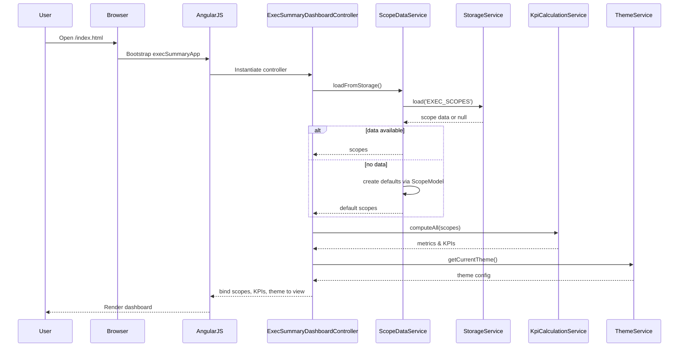
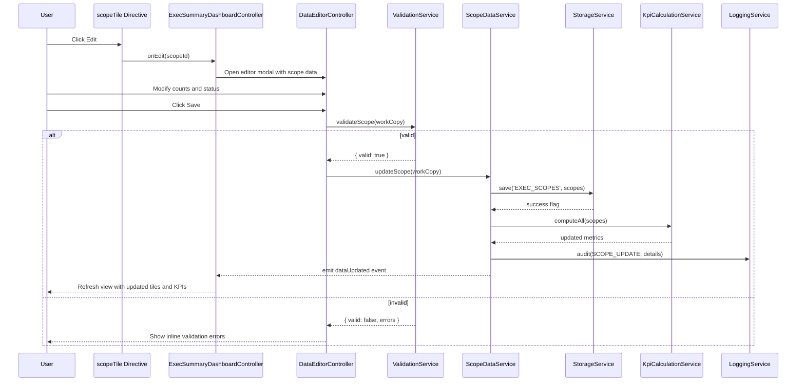
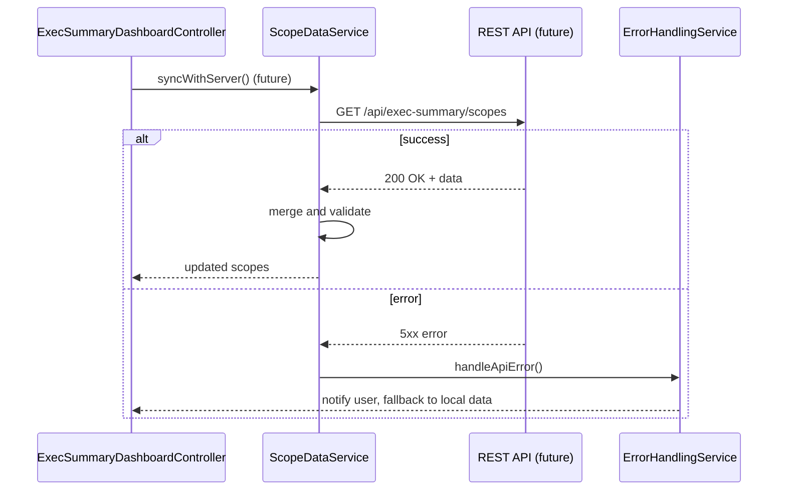
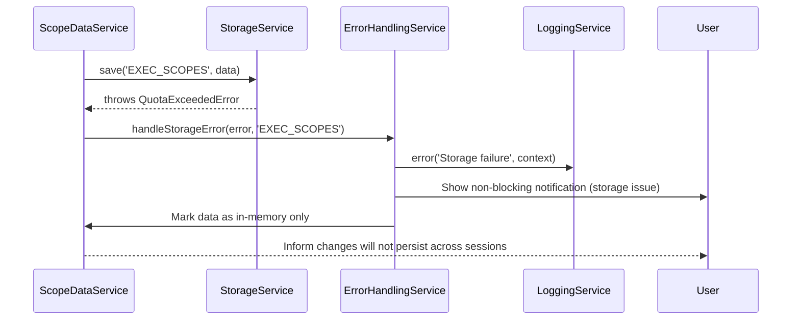

# Low-Level Design (LLD) – Executive Testing Summary Dashboard

**Epic ID:** QE-3887  
**Application Name / Branch:** APPMRN39  
**Technology Stack:**
- AngularJS 1.x (AngularJS MVC)
- JavaScript ES6 (transpiled where necessary)
- HTML5, CSS3, Bootstrap 4/5
- REST APIs (future-ready – current scope is client-side only)
- MVC architecture (client-side)

---

## 1. Application Architecture

### 1.1 High-Level AngularJS MVC Mapping

The Executive Testing Summary Dashboard is implemented as a single-page AngularJS application using a modular MVC structure.

- **AngularJS Module:** `execSummaryApp`
- **Primary View:** `exec-summary-dashboard.html`
- **Controllers:**
  - `ExecSummaryDashboardController` – orchestrates the dashboard view.
  - `DataEditorController` – manages editor dialogs and inline edit state.
  - `ThemeController` – manages theme selection and application.
- **Services / Factories:**
  - `ScopeDataService` – core data model, encapsulates per-scope metrics.
  - `StorageService` – abstraction over `localStorage` / IndexedDB.
  - `KpiCalculationService` – KPI & scope calculation engine.
  - `ValidationService` – validation & sanitization rules.
  - `AccessControlService` – front-end RBAC/ABAC.
  - `ThemeService` – theme & presentation rules.
  - `LoggingService` – client-side logging & audit buffer.
  - `ErrorHandlingService` – global error and resiliency handler.
  - `ConfigService` – environment-specific configuration, feature flags, API base URLs.
- **Directives / Components:**
  - `scopeTile` – directive for each testing scope tile.
  - `kpiSummary` – directive for executive summary KPI bar.
  - `progressBar` – directive wrapping Bootstrap progress bar.
  - `readinessGroup` – directive rendering grouped scopes by readiness status.
  - `notificationBanner` – directive for non-blocking alerts and warnings.
  - `themePreview` – directive for displaying theme colors.
- **Filters:**
  - `percentage` – formats numeric values as percent with fixed decimals.
  - `statusLabel` – human-readable labels for readiness statuses.

### 1.2 Project Folder Structure

```text
APPMRN39/
└── exec-summary-dashboard/
    ├── index.html
    ├── app/
    │   ├── app.module.js
    │   ├── app.config.js
    │   ├── app.routes.js (future)
    │   ├── controllers/
    │   │   ├── execSummaryDashboard.controller.js
    │   │   ├── dataEditor.controller.js
    │   │   └── theme.controller.js
    │   ├── services/
    │   │   ├── scopeData.service.js
    │   │   ├── storage.service.js
    │   │   ├── kpiCalculation.service.js
    │   │   ├── validation.service.js
    │   │   ├── accessControl.service.js
    │   │   ├── theme.service.js
    │   │   ├── logging.service.js
    │   │   └── errorHandling.service.js
    │   ├── directives/
    │   │   ├── scopeTile.directive.js
    │   │   ├── kpiSummary.directive.js
    │   │   ├── progressBar.directive.js
    │   │   ├── readinessGroup.directive.js
    │   │   └── notificationBanner.directive.js
    │   ├── filters/
    │   │   ├── percentage.filter.js
    │   │   └── statusLabel.filter.js
    │   ├── models/
    │   │   └── scope.model.js
    │   └── config/
    │       ├── env.config.js
    │       ├── featureFlags.config.js
    │       └── logging.config.js
    ├── views/
    │   ├── exec-summary-dashboard.html
    │   ├── data-editor-modal.html
    │   └── theme-settings.html
    ├── assets/
    │   ├── css/
    │   │   ├── main.css
    │   │   └── theme.css
    │   ├── js/
    │   └── img/
    └── test/
        ├── unit/
        └── e2e/
```

### 1.3 Mapping HLD Components to AngularJS Artifacts

| HLD Component                                | AngularJS Artifact(s)                                                                 |
|----------------------------------------------|---------------------------------------------------------------------------------------|
| Browser UI (Executive Testing Summary)       | `exec-summary-dashboard.html`, `ExecSummaryDashboardController`, `scopeTile`, `kpiSummary` |
| Data Editor Module                           | `DataEditorController`, `data-editor-modal.html`, `scopeTile` (edit mode)             |
| KPI & Scope Calculation Engine               | `KpiCalculationService`, utilized by controllers                                      |
| Client-Side Storage Abstraction              | `StorageService`                                                                      |
| Theme & Presentation Layer                   | `ThemeService`, `ThemeController`, `theme.css`, `themePreview`                       |
| Access Control & Policy Layer (Front-End)    | `AccessControlService`, consumed by controllers and directives                        |
| Validation & Sanitization Layer              | `ValidationService`                                                                   |
| Client-Side Logging & Audit Event Buffer     | `LoggingService`                                                                      |
| Error Handling & Resiliency Layer            | `ErrorHandlingService`, global `$exceptionHandler` config                             |


---

## 2. Component Specifications

### 2.1 Module: `execSummaryApp`

- **Type:** AngularJS Module
- **File:** `app/app.module.js`
- **Responsibility:** Root AngularJS module definition and wiring of dependencies.
- **Public API:** N/A (module definition only)
- **Dependencies:** `ngRoute` (future), `ngAnimate`, custom sub-modules.

```js
(function () {
  'use strict';

  angular
    .module('execSummaryApp', [
      'ngAnimate',
      'execSummary.controllers',
      'execSummary.services',
      'execSummary.directives',
      'execSummary.filters'
    ]);
})();
```

---

### 2.2 Controller: `ExecSummaryDashboardController`

- **Type:** Controller
- **File:** `app/controllers/execSummaryDashboard.controller.js`
- **Responsibilities:**
  - Initialize dashboard data.
  - Load scope data from `ScopeDataService`.
  - Trigger recalculation of KPIs using `KpiCalculationService`.
  - Bind scope tiles and KPIs to view.
  - Handle user actions such as opening editor, applying filters, and triggering theme changes.
- **Public Methods (on `$scope` or `vm`):**
  - `init()` – performs initial data load and KPI computation.
  - `refreshData()` – reloads scope data from storage and recomputes KPIs.
  - `openEditor(scopeId)` – open editor modal for a given scope.
  - `applyTheme(themeId)` – delegate to `ThemeService`.
  - `resetDashboard()` – resets data to defaults (with confirmation).
- **Inputs:**
  - None on construction; uses injected services.
- **Outputs:**
  - ViewModel object containing:
    - `vm.scopes` – array of scope objects.
    - `vm.kpis` – aggregated KPI values.
    - `vm.readinessGroups` – scopes grouped by readiness.
    - `vm.notifications` – messages for `notificationBanner`.
- **Dependencies / Injected Services:**
  - `ScopeDataService`
  - `KpiCalculationService`
  - `ThemeService`
  - `LoggingService`
  - `ErrorHandlingService`
  - `AccessControlService`
  - `$uibModal` (Bootstrap modal integration)

---

### 2.3 Controller: `DataEditorController`

- **Type:** Controller
- **File:** `app/controllers/dataEditor.controller.js`
- **Responsibilities:**
  - Manage view-model for inline and modal editors.
  - Validate user-entered counts, statuses, and agentification metrics with `ValidationService`.
  - Persist changes via `ScopeDataService` and `StorageService`.
  - Push audit events to `LoggingService`.
- **Public Methods:**
  - `save()` – validate and persist data.
  - `cancel()` – revert unsaved changes.
  - `onFieldChange(fieldName)` – perform immediate validation on changed field.
- **Inputs:**
  - Initial scope object (resolved and injected via `$uibModal` resolve or directive binding).
- **Outputs:**
  - Updated scope object, emitted to parent controller on success.
- **Dependencies:**
  - `ScopeDataService`
  - `ValidationService`
  - `LoggingService`
  - `ErrorHandlingService`
  - `$uibModalInstance`

---

### 2.4 Controller: `ThemeController`

- **Type:** Controller
- **File:** `app/controllers/theme.controller.js`
- **Responsibilities:**
  - Manage theme selection UI.
  - Invoke `ThemeService` to apply and persist theme.
- **Public Methods:**
  - `loadThemes()` – retrieve available themes.
  - `selectTheme(themeId)` – select and apply theme.
- **Dependencies:**
  - `ThemeService`
  - `LoggingService`

---

### 2.5 Service: `ScopeDataService`

- **Type:** Service (singleton)
- **File:** `app/services/scopeData.service.js`
- **Responsibility:** Single source of truth for per-scope metrics and state.
- **Public Methods:**
  - `getAllScopes()` – returns all scope objects.
  - `getScopeById(scopeId)` – returns specific scope.
  - `updateScope(scope)` – validate model structure, update and persist.
  - `resetToDefaults()` – set up default scope dataset.
  - `loadFromStorage()` – hydrate from `StorageService`.
  - `saveToStorage()` – persist current dataset.
- **Inputs:**
  - Data from `StorageService` or defaults from model definitions.
- **Outputs:**
  - Normalized scope array with strongly typed fields.
- **Dependencies:**
  - `StorageService`
  - `ValidationService`
  - `LoggingService`

---

### 2.6 Service: `StorageService`

- **Type:** Service
- **File:** `app/services/storage.service.js`
- **Responsibility:** Abstract access to browser storage with schema versioning and integrity checking.
- **Public Methods:**
  - `load(key)` – returns parsed JSON data or `null`.
  - `save(key, data)` – serialize and persist data; returns success flag.
  - `clear(key)` – remove stored item.
  - `getSchemaVersion()` – current schema version.
- **Inputs:**
  - `key` (string), `data` (object)
- **Outputs:**
  - Stored data and metadata (e.g., checksum, schema version).
- **Dependencies:**
  - `$window.localStorage`
  - `ErrorHandlingService`
  - `LoggingService`

Implementation sketch:

```js
(function () {
  'use strict';

  angular
    .module('execSummary.services')
    .service('StorageService', StorageService);

  StorageService.$inject = ['$window', 'LoggingService', 'ErrorHandlingService'];

  function StorageService($window, LoggingService, ErrorHandlingService) {
    const SCHEMA_VERSION = 1;

    this.load = function (key) {
      try {
        const raw = $window.localStorage.getItem(key);
        if (!raw) return null;
        const payload = JSON.parse(raw);
        if (payload.schemaVersion !== SCHEMA_VERSION) {
          LoggingService.warn('Schema version mismatch', { key, payload });
          return null;
        }
        return payload.data;
      } catch (e) {
        ErrorHandlingService.handleStorageError(e, key);
        return null;
      }
    };

    this.save = function (key, data) {
      try {
        const payload = {
          schemaVersion: SCHEMA_VERSION,
          timestamp: new Date().toISOString(),
          data
        };
        $window.localStorage.setItem(key, JSON.stringify(payload));
        return true;
      } catch (e) {
        ErrorHandlingService.handleStorageError(e, key);
        return false;
      }
    };

    this.clear = function (key) {
      $window.localStorage.removeItem(key);
    };

    this.getSchemaVersion = function () {
      return SCHEMA_VERSION;
    };
  }
})();
```

---

### 2.7 Service: `KpiCalculationService`

- **Type:** Service
- **File:** `app/services/kpiCalculation.service.js`
- **Responsibility:** Encapsulate all KPI and per-scope metric calculation logic.
- **Public Methods:**
  - `computeScopeMetrics(scope)` – returns derived metrics for a single scope (completion %, agentification %).
  - `computeAll(scopes)` – iterate scopes, compute metrics, and aggregated KPIs.
  - `groupByReadiness(scopes)` – return mapping `{ readinessStatus: [scopes...] }`.
- **Inputs:**
  - Array of scope objects.
- **Outputs:**
  - `{ scopesWithMetrics, kpiSummary, readinessGroups }`.
- **Dependencies:**
  - `ValidationService`
  - `LoggingService`

---

### 2.8 Service: `ValidationService`

- **Type:** Service
- **File:** `app/services/validation.service.js`
- **Responsibility:** Centralized validation and sanitization.
- **Public Methods:**
  - `validateScope(scope)` – validate counts, ranges, enums.
  - `validateCounts(total, completed, pending)` – ensure logical relationships.
  - `sanitizeText(input)` – encode HTML entities, strip scripts.
  - `validateReadinessStatus(status)` – ensure allowed values.
- **Dependencies:**
  - None external; pure logic.

---

### 2.9 Service: `AccessControlService`

- **Type:** Service
- **File:** `app/services/accessControl.service.js`
- **Responsibility:** UI-level RBAC/ABAC enforcement (view vs edit mode).
- **Public Methods:**
  - `getCurrentRole()` – returns `VIEWER` or `EDITOR` (from env or injected metadata).
  - `canEditScope(scopeId)` – returns boolean, optionally based on ABAC attributes.
  - `isViewer()` / `isEditor()` helpers.
- **Dependencies:**
  - `ConfigService` (for role config)

---

### 2.10 Service: `ThemeService`

- **Type:** Service
- **File:** `app/services/theme.service.js`
- **Responsibility:** Manage theme configuration and application.
- **Public Methods:**
  - `getAvailableThemes()` – list of predefined themes.
  - `getCurrentTheme()` – current theme settings.
  - `applyTheme(themeId)` – apply classes to `<body>` or root container.
  - `validateThemeColors(theme)` – enforce contrast rules.
- **Dependencies:**
  - `StorageService`
  - `ValidationService`

---

### 2.11 Service: `LoggingService`

- **Type:** Service
- **File:** `app/services/logging.service.js`
- **Responsibility:** Client-side logging and audit buffer.
- **Public Methods:**
  - `info(message, context)`
  - `warn(message, context)`
  - `error(message, context)`
  - `audit(eventType, payload)` – push structured audit events.
  - `getAuditBuffer()` – returns current buffer.
  - `clearAuditBuffer()` – clear logs.
- **Dependencies:**
  - `StorageService` (optional persistence of logs; configurable)

---

### 2.12 Service: `ErrorHandlingService`

- **Type:** Service
- **File:** `app/services/errorHandling.service.js`
- **Responsibility:** Central error capturing, user-friendly messages, resiliency patterns.
- **Public Methods:**
  - `handleStorageError(error, key)` – categorize and act.
  - `handleValidationError(error, field)` – surface inline.
  - `handleUnexpectedError(error)` – log and show generic message.
  - `registerGlobalHandlers()` – hook into `$exceptionHandler` and possibly window events.
- **Dependencies:**
  - `LoggingService`
  - `$rootScope`

---

### 2.13 Directive: `scopeTile`

- **Type:** Directive (Element)
- **File:** `app/directives/scopeTile.directive.js`
- **Responsibility:** Render a single testing scope tile.
- **Attributes / Bindings:**
  - `scopeData` – scope object with metrics.
  - `onEdit` – callback when edit requested.
  - `readonly` – flag to disable edit actions.
- **Dependencies:**
  - `AccessControlService`
  - `ThemeService`

---

### 2.14 Directive: `kpiSummary`

- **Type:** Directive
- **File:** `app/directives/kpiSummary.directive.js`
- **Responsibility:** Render top-level executive KPIs.
- **Bindings:**
  - `kpiData` – aggregated KPI object.

---

### 2.15 Directive: `progressBar`

- **Type:** Directive
- **File:** `app/directives/progressBar.directive.js`
- **Responsibility:** Standardized progress bar UI using Bootstrap with theme-aware colors.
- **Bindings:**
  - `value` – percentage (0–100).
  - `label` – optional label.
  - `status` – readiness status to derive color.

---

### 2.16 Directive: `readinessGroup`

- **Type:** Directive
- **File:** `app/directives/readinessGroup.directive.js`
- **Responsibility:** Render a group of scopes under a specific readiness status (e.g., In Progress).
- **Bindings:**
  - `groupName` – label.
  - `scopes` – array of scope objects.

---

### 2.17 Directive: `notificationBanner`

- **Type:** Directive
- **File:** `app/directives/notificationBanner.directive.js`
- **Responsibility:** Display non-blocking alerts and warnings (validation and storage issues).
- **Bindings:**
  - `notifications` – array of messages `{ type, text }`.

---

### 2.18 Filter: `percentage`

- **Type:** Filter
- **File:** `app/filters/percentage.filter.js`
- **Responsibility:** Format numeric values as percentage with fixed decimal places.

### 2.19 Filter: `statusLabel`

- **Type:** Filter
- **File:** `app/filters/statusLabel.filter.js`
- **Responsibility:** Map readiness status codes to human-readable labels (e.g., `IN_PROGRESS` → `In Progress`).


---

## 3. Component Responsibilities

### 3.1 Business Logic Ownership

- **Business Logic:**
  - Housed primarily in `KpiCalculationService`, `ScopeDataService`, and `ValidationService`.
  - Controllers orchestrate services but do not contain complex logic.
- **UI Handling:**
  - Controllers set view models.
  - Directives encapsulate reusable UI components.
- **State Management:**
  - `ScopeDataService` is the central in-memory state container.
  - Durable state persisted via `StorageService`.
- **API Communication:**
  - No backend APIs in initial scope, but `ConfigService` and `ErrorHandlingService` will support future REST integration.
- **Validation:**
  - `ValidationService` used by `DataEditorController`, `ScopeDataService`, and `KpiCalculationService`.


---

## 4. Interface Specifications

### 4.1 Controller–Service Interactions

- **`ExecSummaryDashboardController` ↔ `ScopeDataService`:**
  - `ScopeDataService.getAllScopes()` returns array of scope objects.
  - `ScopeDataService.updateScope(scope)` updates a scope and persists.

- **`ExecSummaryDashboardController` ↔ `KpiCalculationService`:**
  - `KpiCalculationService.computeAll(scopes)` returns `{ scopesWithMetrics, kpiSummary, readinessGroups }`.

- **`DataEditorController` ↔ `ValidationService`:**
  - `ValidationService.validateScope(scope)` returns `{ valid: boolean, errors: { field: message } }`.

- **`DataEditorController` ↔ `LoggingService`:**
  - `LoggingService.audit('SCOPE_UPDATE', { scopeId, field, oldValue, newValue })`.

- **`ThemeController` ↔ `ThemeService`:**
  - `ThemeService.applyTheme(themeId)` updates CSS.

### 4.2 REST API Interfaces (Future-ready)

Even though current scope is client-only, interfaces are defined for future integration.

#### 4.2.1 Fetch Scope Data (Future)

- **Endpoint:** `/api/exec-summary/scopes`
- **HTTP Method:** `GET`
- **Request Payload:** None.
- **Response:**

```json
{
  "schemaVersion": 1,
  "scopes": [
    {
      "id": "SPRINT",
      "name": "Sprint",
      "totalUseCases": 100,
      "completedUseCases": 80,
      "pendingUseCases": 20,
      "agentificationPercent": 60,
      "readinessStatus": "IN_PROGRESS"
    }
  ]
}
```

- **Error Responses:**
  - `500` – Internal server error.
  - `503` – Service unavailable.

#### 4.2.2 Submit Updated Scope Data (Future)

- **Endpoint:** `/api/exec-summary/scopes`
- **HTTP Method:** `PUT`
- **Request Payload:** Same structure as above.
- **Response:**

```json
{
  "status": "SUCCESS",
  "updatedAt": "2025-01-01T12:00:00Z"
}
```

- **Error Responses:**
  - `400` – Invalid payload.
  - `401` – Unauthorized.
  - `409` – Conflict due to concurrent update.


---

## 5. Data Model Design

### 5.1 JavaScript Models

#### 5.1.1 `Scope` Model

- **Object Name:** `Scope`
- **Definition File:** `app/models/scope.model.js`

```js
(function () {
  'use strict';

  angular
    .module('execSummary.models', [])
    .factory('ScopeModel', function () {
      function createDefaults() {
        return [
          createScope('SPRINT', 'Sprint'),
          createScope('REGRESSION', 'Regression'),
          createScope('API', 'API'),
          createScope('UI', 'UI'),
          createScope('PERFORMANCE', 'Performance'),
          createScope('DEPLOYMENT', 'Deployment'),
          createScope('ROLLBACK', 'Roll Back'),
          createScope('BACKWARD_COMP', 'Backward Compatibility'),
          createScope('INTEGRATION', 'Integration'),
          createScope('USABILITY', 'Usability'),
          createScope('CONTRACT', 'Contract'),
          createScope('GUARDRAIL', 'Guardrail')
        ];
      }

      function createScope(id, name) {
        return {
          id,
          name,
          totalUseCases: 0,
          completedUseCases: 0,
          pendingUseCases: 0,
          agentificationPercent: 0,
          readinessStatus: 'IN_PROGRESS',
          notes: ''
        };
      }

      return {
        createDefaults,
        createScope
      };
    });
})();
```

- **Attributes & Types:**
  - `id: string` – immutable identifier.
  - `name: string` – display name.
  - `totalUseCases: number` – integer ≥ 0.
  - `completedUseCases: number` – integer ≥ 0.
  - `pendingUseCases: number` – integer ≥ 0.
  - `agentificationPercent: number` – 0–100.
  - `readinessStatus: string` – enum: `IN_PROGRESS`, `DESIGN_IN_PROGRESS`, `COMPLETED`.
  - `notes: string` – sanitized text.

- **Default Values:**
  - All numeric fields default to `0`.
  - `readinessStatus` defaults to `IN_PROGRESS`.
  - `notes` default to empty string.

- **Validation Rules:**
  - `totalUseCases >= 0`.
  - `completedUseCases >= 0`.
  - `pendingUseCases >= 0`.
  - `completedUseCases + pendingUseCases == totalUseCases`.
  - `agentificationPercent` between 0 and 100.
  - `readinessStatus` must be one of allowed enums.

- **State Transitions:**
  - `IN_PROGRESS` → `DESIGN_IN_PROGRESS` → `COMPLETED`.
  - Transition only allowed if validation passes and necessary completion thresholds are met (e.g., completedUseCases > 0 for `DESIGN_IN_PROGRESS`, completedUseCases == totalUseCases for `COMPLETED`).

### 5.2 KPI Model

- **Object Name:** `KpiSummary`
- **Attributes:**
  - `totalUseCases`
  - `totalCompletedUseCases`
  - `totalPendingUseCases`
  - `overallCompletionPercent`
  - `avgAgentificationPercent`
  - `scopeCountsByStatus` – map: status → count


---

## 6. Data Flow

### 6.1 Primary Flow: Dashboard Load

1. Browser loads `index.html` over HTTPS.
2. AngularJS bootstraps `execSummaryApp`.
3. `ExecSummaryDashboardController.init()` executes:
   - Calls `ScopeDataService.loadFromStorage()`.
   - If `null`, uses `ScopeModel.createDefaults()`.
   - Invokes `KpiCalculationService.computeAll(scopes)`.
   - Binds resulting scopes, KPIs, and readiness groups to the view.
4. `scopeTile`, `kpiSummary`, and `readinessGroup` directives render the dashboard.
5. Theme config is retrieved from `ThemeService.getCurrentTheme()` and applied.

### 6.2 Editing Flow

1. User clicks "Edit" on a scope tile.
2. `scopeTile` invokes `onEdit(scope.id)`.
3. `ExecSummaryDashboardController.openEditor(scopeId)` opens `data-editor-modal.html` controlled by `DataEditorController`.
4. `DataEditorController` copies the current scope object into a working copy.
5. User modifies fields (numeric inputs, dropdowns).
6. On `Save`:
   - `ValidationService.validateScope(workCopy)`.
   - If errors: show inline messages; do not dismiss modal.
   - If valid:
     - `ScopeDataService.updateScope(workCopy)`.
     - `StorageService.save('EXEC_SCOPES', scopes)`.
     - `LoggingService.audit()` records changes.
     - `KpiCalculationService.computeAll(scopes)` recomputes metrics.
     - Modal closed; view rebinds to updated data.

### 6.3 State Changes & Events

- `$rootScope` events:
  - `execSummary:dataUpdated` – fired by `ScopeDataService` when dataset changes; listeners recompute KPIs.
  - `execSummary:themeChanged` – fired by `ThemeService` when theme changes; directives update CSS classes.
  - `execSummary:error` – fired by `ErrorHandlingService` on critical errors.


---

## 7. Sequence Diagrams (Mermaid)

### 7.1 Application Initialization



### 7.2 Primary User Workflow – Editing Scope Data



### 7.3 Service/API Interactions (Future)



### 7.4 Error Handling Scenario – Storage Failure




---

## 8. Implementation Details

### 8.1 AngularJS Implementation Approach

- Use **controller-as** syntax (`vm`) to avoid `$scope` pollution.
- Separate modules: `execSummary.controllers`, `execSummary.services`, `execSummary.directives`, `execSummary.filters`, `execSummary.models`.
- Utilize `$rootScope` events sparingly; prefer service callbacks.

### 8.2 JavaScript ES6 Patterns

- Use `const` and `let` for block-scoped variables in services.
- Use arrow functions inside services where compatible, avoiding them where AngularJS DI relies on `this`.
- Modularize code files and use IIFEs to prevent leaking to global scope.

### 8.3 Dependency Injection

- Use explicit array annotation for minification safety:

```js
angular.module('execSummary.controllers')
  .controller('ExecSummaryDashboardController', [
    'ScopeDataService',
    'KpiCalculationService',
    'ThemeService',
    'LoggingService',
    'ErrorHandlingService',
    'AccessControlService',
    '$uibModal',
    ExecSummaryDashboardController
  ]);
```

### 8.4 Business Logic Flow

- `ScopeDataService` ensures model integrity before delegating to `KpiCalculationService`.
- All derived values (percentages, groupings) computed in the service layer, not controllers.
- Client uses computed properties only; raw counts remain in the model.

### 8.5 Validation Logic

- `ValidationService` returns structured errors to allow per-field messages.
- Numeric inputs use HTML5 `type="number"` with `min="0"` and custom directives to prevent invalid characters.
- Readiness dropdown uses fixed options bound to enum values.

### 8.6 State Management

- `ScopeDataService` maintains in-memory array; modifications performed through service methods only.
- Immutable update pattern: create new objects for updated scopes to simplify change detection.

### 8.7 DOM Interaction

- Avoid direct DOM manipulation in controllers; all DOM updates via directives.
- If needed, use `$element` and `$compile` within directives only, not in services.

### 8.8 API Integration Approach (Future)

- `ConfigService` will expose `apiBaseUrl`.
- HTTP interactions will use `$http` or `$httpBackend` (for tests) with interceptors defined in `app.config.js` for authentication, logging, and error translation.


---

## 9. Configuration

### 9.1 AngularJS Configuration Files

- `app/app.config.js`:
  - Register `$httpProvider` interceptors.
  - Configure `$logProvider` for log levels.
  - Setup `$exceptionHandler` delegate to `ErrorHandlingService`.

- `app/config/env.config.js`:
  - Environment constants (`ENV`, `API_BASE_URL`, `DEFAULT_ROLE`).

- `app/config/featureFlags.config.js`:
  - Feature flags: `enableServerSync`, `enableAuditPersistence`, `enableExperimentalThemes`.

- `app/config/logging.config.js`:
  - Logging thresholds and persistence toggle (e.g., persist audit logs in storage or memory only).

### 9.2 Environment-Specific Properties

- Example `env.config.js`:

```js
angular.module('execSummary.config', [])
  .constant('ENV_CONFIG', {
    env: 'APP_MRN39_EXEC_SUMMARY',
    apiBaseUrl: '', // empty for client-only mode
    defaultRole: 'EDITOR',
    storageKeyScopes: 'EXEC_SCOPES',
    storageKeyTheme: 'EXEC_THEME',
    storageKeyLogs: 'EXEC_LOGS'
  });
```

### 9.3 API Base URLs

- For future server integration, `apiBaseUrl` (e.g., `https://api.company.com`) will prefix REST endpoints.

### 9.4 Feature Flags

- `enableServerSync` – when `true`, `ScopeDataService` syncs with backend.
- `enableAuditPersistence` – when `true`, `LoggingService` persists audit logs in `StorageService`.
- `enableExperimentalThemes` – toggles additional theme options.

### 9.5 Logging & Telemetry

- `LoggingService` writes in-memory logs; if `enableAuditPersistence` is true, logs are persisted with rotation.
- Optionally integrate with browser `console` log for dev, suppressed in production via config.


---

## 10. Error Handling and Resiliency

### 10.1 Client-Side Exception Handling

- `$exceptionHandler` redirected to `ErrorHandlingService.handleUnexpectedError`.
- Critical errors logged at error level and surfaced via `notificationBanner`.

### 10.2 REST API Error Handling (Future)

- HTTP interceptor normalizes error responses to a standard structure `{ code, message, details }`.
- `ErrorHandlingService` categorizes errors as validation, connectivity, or server.

### 10.3 Retry Mechanisms

- Storage failures:
  - `StorageService.save()` performs limited retry (e.g., up to 2 retries) on transient errors.
  - On repeated failure, falls back to in-memory mode and informs user.

- Future REST calls:
  - Circuit breaker pattern to prevent repeated failing calls (maintain counts and cooldown periods).

### 10.4 Logging Strategy

- All errors and warnings go through `LoggingService` with structured context.
- Audit events for any change in scope data (old vs new values). Limited retention in client storage as per data retention policies.

### 10.5 Recovery & Fallback

- On schema mismatch or corrupt storage data:
  - Discard invalid data.
  - Log error.
  - Initialize defaults.
  - Notify user that data was reset.

- On theme configuration issues:
  - Fallback to default theme with safe contrast.


---

## 11. Security Considerations

### 11.1 Input Validation & Sanitization

- All numeric fields validated both via HTML attributes and `ValidationService`.
- `notes` and similar free-text fields sanitized via `ValidationService.sanitizeText`.

### 11.2 XSS Prevention

- AngularJS templating with automatic output encoding.
- `ng-bind` used instead of raw `innerHTML` where possible.
- Where HTML content is necessary, use `$sanitize` and strict whitelisting.

### 11.3 CSRF Protection

- For future REST calls, leverage AngularJS `$http` built-in XSRF token handling.
- Server must set CSRF cookies and validate headers.

### 11.4 Secure API Communication

- Application must be served only over HTTPS with TLS 1.3.
- Future API calls must use `https://` endpoints; mixed content disallowed.

### 11.5 Authentication & Authorization Integration Points

- `AccessControlService.getCurrentRole()` can integrate with:
  - JWT tokens decoded client-side.
  - SSO or identity provider metadata stored in session.
- UI controls (edit buttons, inputs) disabled/hidden based on role.

### 11.6 Sensitive Data Handling

- Dashboard stores only program/test metrics, not personal data.
- No API keys or secrets stored in client-side storage.
- Any future confidential configuration must be provided from secure backend or environment and not persisted in browser.

### 11.7 Audit Logging

- `LoggingService.audit` events contain:
  - `scopeId`
  - `fieldName`
  - `oldValue`, `newValue` (when allowed)
  - `timestamp`
  - `userId` (if available from identity context)
- Audit logs are intended for export to enterprise logging when backend integration is added.


---

## 12. Summary

This LLD defines a complete client-side AngularJS application for the Executive Testing Summary Dashboard. It maps all HLD components to concrete AngularJS artifacts, defines data models, flows, interfaces, and security rules, and provides enough detail for implementation without referring back to the HLD document.