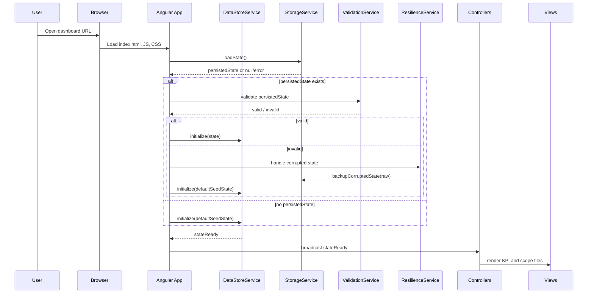
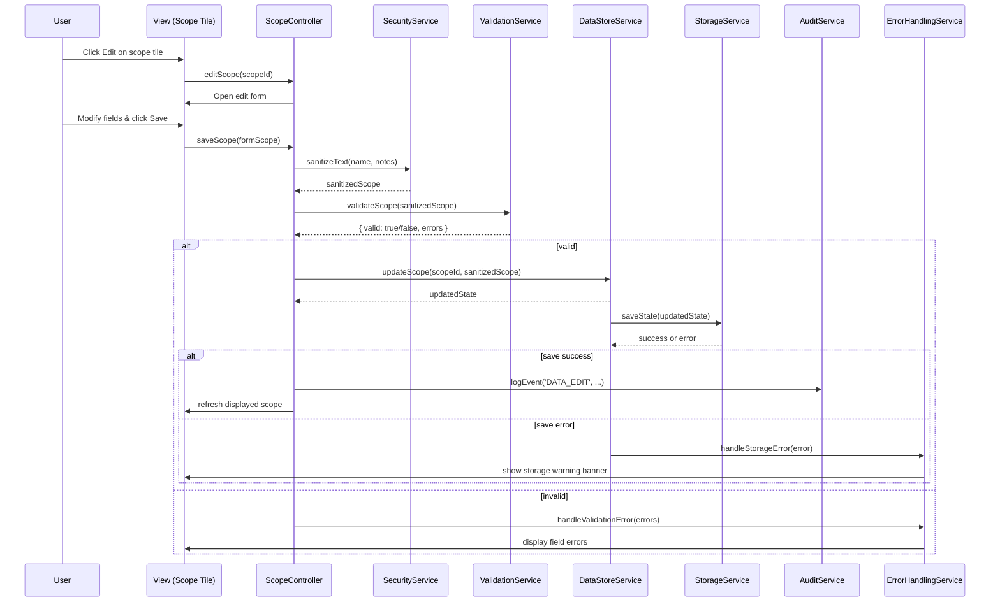

# Low-Level Design (LLD) – Executive KPI & Testing Scope Dashboard

Epic ID: QE-3925  
Technology Stack: AngularJS 1.x, JavaScript (ES6 style where compatible), HTML5, CSS3, Bootstrap, Browser Storage (localStorage/indexedDB), MVC Architecture

---

## 1. Application Architecture

### 1.1 AngularJS MVC Architecture Mapping

The application is a single-page dashboard implemented as an AngularJS 1.x application named `execDashboardApp`. It follows a classical AngularJS MVC pattern:

- **Module Layer**: Defines the main AngularJS module and sub-modules for features and shared capabilities.
- **Controller Layer**: Manages view state for each major UI region (KPI tiles, testing scope tiles, agentification progress, configuration, and errors).
- **Service Layer**: Encapsulates business logic for data management, persistence, validation, configuration, security, resiliency, and logging.
- **Directive Layer**: Provides reusable UI components such as tiles, progress bars, scope lists, and banners.
- **Model Layer**: Uses JavaScript objects/POJOs to represent KPIs, scopes, ETAs, statuses, and configuration.
- **View Layer**: HTML5 templates styled with Bootstrap and custom CSS, binding to controllers via AngularJS directives (`ng-controller`, `ng-repeat`, `ng-bind`, etc.).

### 1.2 AngularJS Modules

1. **Root Module**: `execDashboardApp`
   - Depends on: `ngRoute` (if routing is used), `ngAnimate`, `ngSanitize` (for safe output), `execDashboard.core`, `execDashboard.kpi`, `execDashboard.scope`, `execDashboard.config`, `execDashboard.resilience`.

2. **Core Module**: `execDashboard.core`
   - Contains shared services: `DataStoreService`, `StorageService`, `ValidationService`, `SecurityService`, `LoggingService`, `ErrorHandlingService`, `ThemeService`, `ConfigService`, `AuditService`.

3. **KPI Module**: `execDashboard.kpi`
   - Contains controllers and directives for KPI tiles and global KPI metrics: `KpiController`, `kpiTile` directive.

4. **Testing Scope Module**: `execDashboard.scope`
   - Contains controllers and directives for testing scope tiles: `ScopeController`, `scopeTile` directive, `scopeList` directive.

5. **Configuration Module**: `execDashboard.config`
   - Contains controllers and directives for configuration and theme management: `ConfigController`, `themeSelector` directive.

6. **Resilience Module**: `execDashboard.resilience`
   - Contains services and directives tied to resiliency and error UI: `ResilienceService`, `ErrorBannerController`, `errorBanner` directive.

### 1.3 Project Folder Structure

```text
app/
  index.html
  app.js                        // Root module & app bootstrap
  app.routes.js                 // (Optional) Route config

  core/
    core.module.js
    services/
      data-store.service.js
      storage.service.js
      validation.service.js
      security.service.js
      logging.service.js
      audit.service.js
      error-handling.service.js
      theme.service.js
      config.service.js
    models/
      kpi.model.js
      scope.model.js
      config.model.js
      audit-event.model.js

  kpi/
    kpi.module.js
    kpi.controller.js
    kpiTile.directive.js
    views/
      kpi-dashboard.html

  scope/
    scope.module.js
    scope.controller.js
    scopeTile.directive.js
    scopeList.directive.js
    views/
      scope-dashboard.html

  config/
    config.module.js
    config.controller.js
    themeSelector.directive.js
    views/
      config-panel.html

  resilience/
    resilience.module.js
    resilience.service.js
    errorBanner.controller.js
    errorBanner.directive.js

  shared/
    directives/
      progressBar.directive.js
      statusBadge.directive.js
      manualDataSourceBanner.directive.js

assets/
  css/
    styles.css                  // custom styles over Bootstrap
    themes.css                  // theme definitions
  js/
    vendor/                     // AngularJS, Bootstrap JS, polyfills
  img/
    icons/                      // tile icons, status icons

config/
  env.config.js                 // environment-specific config (API base URL, flags)

index.html                      // entry point
```

---

## 2. Component Specifications

### 2.1 Modules

#### 2.1.1 `execDashboardApp` (Module)
- **File**: `app/app.js`
- **Responsibility**: Application bootstrap, module wiring, global configuration.
- **Public Interface**: N/A (Angular module configuration).
- **Dependencies**:
  - Angular modules: `ngRoute`, `ngAnimate`, `ngSanitize`.
  - Internal modules: `execDashboard.core`, `execDashboard.kpi`, `execDashboard.scope`, `execDashboard.config`, `execDashboard.resilience`.

#### 2.1.2 `execDashboard.core` (Module)
- **File**: `app/core/core.module.js`
- **Responsibility**: Provide core services, shared models, and utilities.

#### 2.1.3 `execDashboard.kpi` (Module)
- **File**: `app/kpi/kpi.module.js`
- **Responsibility**: Feature-specific artifacts for KPI visualization.

#### 2.1.4 `execDashboard.scope` (Module)
- **File**: `app/scope/scope.module.js`
- **Responsibility**: Feature-specific artifacts for testing scope visualization.

#### 2.1.5 `execDashboard.config` (Module)
- **File**: `app/config/config.module.js`
- **Responsibility**: Configuration & theme management feature.

#### 2.1.6 `execDashboard.resilience` (Module)
- **File**: `app/resilience/resilience.module.js`
- **Responsibility**: Resiliency & error handling feature.

---

### 2.2 Core Services

#### 2.2.1 `DataStoreService` (Service)
- **File**: `app/core/services/data-store.service.js`
- **Responsibility**: In-memory data store; single source of truth for KPIs, testing scopes, statuses, ETAs, planned completion dates, configuration, and audit events.
- **Public Methods**:
  - `getState()` → returns entire application state (read-only clone).
  - `getKpis()` → list of KPI objects.
  - `getScopes()` → list of testing scope objects.
  - `getConfig()` → configuration object.
  - `updateKpi(kpiId, partialKpi)` → updates a KPI and emits change event.
  - `addScope(scope)` → adds a new testing scope.
  - `updateScope(scopeId, partialScope)` → updates scope attributes (status, ETAs, etc.).
  - `removeScope(scopeId)` → deletes a scope.
  - `setConfig(config)` → replaces configuration.
  - `onChange(callback)` → subscribe to state changes.
- **Inputs**:
  - Domain models (`Kpi`, `Scope`, `Config`) provided by controllers and services.
- **Outputs**:
  - Emits change events used by controllers and persistence.
- **Dependencies**:
  - `ValidationService` (to validate updates before applying).
  - `$rootScope` for emitting/broadcasting events.

#### 2.2.2 `StorageService` (Service)
- **File**: `app/core/services/storage.service.js`
- **Responsibility**: Encapsulates browser storage operations for localStorage and IndexedDB.
- **Public Methods**:
  - `loadState()` → Promise resolving to persisted state or null.
  - `saveState(state)` → Promise resolving when state is saved.
  - `backupCorruptedState(raw)` → persist corrupted payload under backup key.
  - `clearState()` → clear stored state.
  - `isStorageAvailable()` → checks availability & quota status.
- **Inputs**:
  - Serialized state objects.
- **Outputs**:
  - Deserialized state objects or error codes.
- **Dependencies**:
  - `$window` for storage APIs.
  - `$q` for promises.
  - `ErrorHandlingService` for error reporting.
  - `LoggingService` for debug logs.

#### 2.2.3 `ValidationService` (Service)
- **File**: `app/core/services/validation.service.js`
- **Responsibility**: Field-level and object-level validation rules.
- **Public Methods**:
  - `validateKpi(kpi)` → { valid: boolean, errors: [...] }.
  - `validateScope(scope)` → { valid: boolean, errors: [...] }.
  - `validateConfig(config)` → { valid: boolean, errors: [...] }.
  - `isNonNegativeInteger(value)`.
  - `isPercentage(value)`.
  - `isValidDate(value)`.
  - `isValidStatus(status)` (In Progress, Design in Progress, Not Started, Completed).
  - `validateEtaRequired(scope)` → ensures ETAs where required.
- **Inputs**:
  - Primitive fields or model objects.
- **Outputs**:
  - Boolean flags and error messages, consumed by controllers and `DataStoreService`.

#### 2.2.4 `SecurityService` (Service)
- **File**: `app/core/services/security.service.js`
- **Responsibility**: Input sanitization and output filtering.
- **Public Methods**:
  - `sanitizeText(text)` → returns sanitized string (strip HTML tags, escape scripts).
  - `stripHtml(text)`.
  - `enforceSafeBinding(text)` → ensures content is safe for `ng-bind`.
  - `maskSensitive(text)` → placeholder for future sensitive data handling.
- **Inputs**:
  - User-entered text fields (labels, notes, data-source notes).
- **Outputs**:
  - Sanitized strings.
- **Dependencies**:
  - `ngSanitize` module.

#### 2.2.5 `LoggingService` (Service)
- **File**: `app/core/services/logging.service.js`
- **Responsibility**: Client-side logging utility.
- **Public Methods**:
  - `info(message, context)`.
  - `warn(message, context)`.
  - `error(message, context)`.
  - `debug(message, context)` (enabled only in non-prod environments).
- **Inputs**:
  - Log messages and contextual data.
- **Outputs**:
  - Writes logs to console; hooks for future telemetry.

#### 2.2.6 `AuditService` (Service)
- **File**: `app/core/services/audit.service.js`
- **Responsibility**: Audit & event logging within the client.
- **Public Methods**:
  - `logEvent(eventType, details)`.
  - `getEvents()` → returns in-memory list.
  - `persistRecentEvents()` → optional persistence via `StorageService` under audit key.
- **Inputs**:
  - Event descriptors, e.g., data edits, theme changes.
- **Outputs**:
  - In-memory audit trail.
- **Dependencies**:
  - `StorageService` (optional persistence).
  - `LoggingService`.

#### 2.2.7 `ErrorHandlingService` (Service)
- **File**: `app/core/services/error-handling.service.js`
- **Responsibility**: Centralized error handling for validation, storage, and rendering errors.
- **Public Methods**:
  - `handleStorageError(error)` → classify and route to `ResilienceService`.
  - `handleValidationError(errors)` → notify controllers.
  - `notifyUserFriendly(message, severity)`.
- **Inputs**:
  - Error objects.
- **Outputs**:
  - Events for `ErrorBannerController`, logs.
- **Dependencies**:
  - `$rootScope` (broadcast events like `error:storage`, `error:validation`).
  - `LoggingService`.

#### 2.2.8 `ThemeService` (Service)
- **File**: `app/core/services/theme.service.js`
- **Responsibility**: Theme and contrast management.
- **Public Methods**:
  - `getCurrentTheme()`.
  - `setTheme(themeId)`.
  - `getAvailableThemes()`.
  - `validateContrast(theme)` → ensure contrast thresholds.
- **Inputs**:
  - Theme configurations.
- **Outputs**:
  - Applied theme info; error messages if invalid.
- **Dependencies**:
  - `ConfigService`, `ValidationService`.

#### 2.2.9 `ConfigService` (Service)
- **File**: `app/core/services/config.service.js`
- **Responsibility**: Application configuration & environment-specific values.
- **Public Methods**:
  - `getConfig()` → global config (feature flags, API base URLs for future integration, environment labels).
  - `isFeatureEnabled(featureKey)`.
- **Inputs**:
  - `env.config.js` configuration object.
- **Outputs**:
  - Configuration primitives.

---

### 2.3 Feature Controllers

#### 2.3.1 `KpiController` (Controller)
- **File**: `app/kpi/kpi.controller.js`
- **Responsibility**: Manage KPI tile display and editing.
- **Public Methods (on $scope or controller-as)**:
  - `vm.kpis` → bound list of KPIs.
  - `vm.editKpi(kpi)` → opens edit form.
  - `vm.saveKpi(kpi)` → validates and persists changes.
  - `vm.recalculateAggregates()` → recompute global metrics.
- **Inputs**:
  - `DataStoreService.getKpis()`.
  - Form-bound user input.
- **Outputs**:
  - Updated KPI state.
- **Dependencies**:
  - `DataStoreService`, `ValidationService`, `AuditService`, `SecurityService`.

#### 2.3.2 `ScopeController` (Controller)
- **File**: `app/scope/scope.controller.js`
- **Responsibility**: Manage testing scope tiles (including statuses, ETAs, readiness).
- **Public Methods**:
  - `vm.scopes` → list of scope objects.
  - `vm.addScope()`.
  - `vm.editScope(scope)`.
  - `vm.saveScope(scope)`.
  - `vm.filterByStatus(status)`.
  - `vm.calculateReadiness(scope)` → compute readiness indicators.
- **Inputs**:
  - `DataStoreService.getScopes()`.
- **Outputs**:
  - Updated scope data and derived readiness metrics.
- **Dependencies**:
  - `DataStoreService`, `ValidationService`, `AuditService`, `SecurityService`.

#### 2.3.3 `ConfigController` (Controller)
- **File**: `app/config/config.controller.js`
- **Responsibility**: Manage configuration panel including theme selection, layout options, and manual data source notes.
- **Public Methods**:
  - `vm.config` → current configuration object.
  - `vm.themes` → available themes.
  - `vm.selectTheme(themeId)`.
  - `vm.saveConfig()`.
- **Inputs**:
  - `ConfigService.getConfig()`.
- **Outputs**:
  - Updated config in `DataStoreService` and `StorageService`.
- **Dependencies**:
  - `ConfigService`, `DataStoreService`, `ThemeService`, `AuditService`, `SecurityService`.

#### 2.3.4 `ErrorBannerController` (Controller)
- **File**: `app/resilience/errorBanner.controller.js`
- **Responsibility**: Manage the error banner UI.
- **Public Methods**:
  - `vm.messages` → active messages.
  - `vm.dismiss(messageId)`.
- **Inputs**:
  - `$rootScope` events (`error:storage`, `error:validation`, `resilience:state`).
- **Outputs**:
  - Visible error/info banners.
- **Dependencies**:
  - `$rootScope`.

---

### 2.4 Directives

#### 2.4.1 `kpiTile` (Directive)
- **File**: `app/kpi/kpiTile.directive.js`
- **Type**: Element directive.
- **Responsibility**: Render a single KPI tile with title, value, percent, and planned completion date.
- **Attributes/Scope**:
  - `kpi` (two-way binding).
  - `editable` (boolean).
- **Dependencies**:
  - Template: `kpi/views/kpi-tile.html`.

#### 2.4.2 `scopeTile` (Directive)
- **File**: `app/scope/scopeTile.directive.js`
- **Responsibility**: Render a tile for a single testing scope with status, progress bar, ETAs, readiness flags.
- **Attributes/Scope**:
  - `scopeItem` (two-way binding).
  - `onEdit` (callback binding).

#### 2.4.3 `scopeList` (Directive)
- **File**: `app/scope/scopeList.directive.js`
- **Responsibility**: Group scopes by status and render lists/rows.
- **Attributes**:
  - `scopes`.
  - `filterStatus`.

#### 2.4.4 `progressBar` (Directive)
- **File**: `app/shared/directives/progressBar.directive.js`
- **Responsibility**: Reusable progress bar component.
- **Attributes**:
  - `value` (0–100).
  - `label`.

#### 2.4.5 `statusBadge` (Directive)
- **File**: `app/shared/directives/statusBadge.directive.js`
- **Responsibility**: Display status with appropriate color and label.
- **Attributes**:
  - `status`.

#### 2.4.6 `themeSelector` (Directive)
- **File**: `app/config/themeSelector.directive.js`
- **Responsibility**: Dropdown or tile selector for themes.
- **Attributes**:
  - `themes`.
  - `selectedTheme`.
  - `onSelect`.

#### 2.4.7 `manualDataSourceBanner` (Directive)
- **File**: `app/shared/directives/manualDataSourceBanner.directive.js`
- **Responsibility**: Show a fixed banner indicating data is manually entered, with optional lineage note.
- **Attributes**:
  - `sourceNote`.

#### 2.4.8 `errorBanner` (Directive)
- **File**: `app/resilience/errorBanner.directive.js`
- **Responsibility**: Show error and resilience status messages.
- **Attributes**:
  - Bound to `ErrorBannerController`.

---

## 3. Component Responsibilities

### 3.1 Ownership of Business Logic

- **DataStoreService**: Owns core business state and ensures consistency (e.g., total scope counts vs. global KPI totals). Contains logic for recalculating derived metrics (percentages, readiness flags) whenever base data changes.
- **KpiController**: Handles KPI-specific business rules such as aggregation across scopes and consistency checks.
- **ScopeController**: Owns logic related to scope categorization (sprint/regression/etc.), status grouping, and readiness calculation.
- **ConfigController & ConfigService**: Manage configuration, including toggling visibility of widgets, setting default themes, and controlling feature flags.
- **ValidationService**: Owns validation rules for numeric ranges, percentages, date formats, statuses, ETAs, and mandatory fields.
- **SecurityService**: Owns input cleansing, ensuring no unsafe content is bound to the DOM.
- **ResilienceService & ErrorHandlingService**: Own resiliency logic: retries, circuit breaker, fallbacks, and user notifications.

### 3.2 UI Handling

- Controllers expose view models (via `controllerAs` pattern) and respond to user actions such as clicking edit icons, saving forms, changing themes, and filtering scopes.
- Directives encapsulate specific UI behavior (e.g., animate progress bar changes, apply theme classes, adjust layout on window resize via pure CSS/Bootstrap where possible).

### 3.3 State Management

- Application state is maintained centrally in `DataStoreService`.
- Controllers subscribe to state changes via `DataStoreService.onChange()` and update their local view model copies.
- Persistence writes (`StorageService.saveState`) are triggered on state change but guarded by `ResilienceService` to avoid excessive writes.

### 3.4 API Communication

- Current release has **no backend API calls** by requirement.
- An `ApiService` stub can be added in `core/services/api.service.js` for future integration with REST APIs.

### 3.5 Validation

- Validation is executed in controllers before updates are sent to `DataStoreService`.
- Validation errors are propagated via `ErrorHandlingService` to show field-level error messages and global banners.

---

## 4. Interface Specifications

### 4.1 Internal Interfaces

#### 4.1.1 Controller ↔ DataStoreService

- **Pattern**: Controllers call `DataStoreService` methods to read/update state.
- Example:
  - `vm.saveKpi(kpi)` → `ValidationService.validateKpi(kpi)` → `DataStoreService.updateKpi(kpi.id, kpi)`.

#### 4.1.2 DataStoreService ↔ StorageService

- **Pattern**: On state changes, `DataStoreService` delegates persistence to `StorageService.saveState(state)`.
- `StorageService` may reject with an error, which is handled by `ErrorHandlingService` and `ResilienceService`.

#### 4.1.3 Controllers ↔ ValidationService

- Controllers or `DataStoreService` call `ValidationService` to validate domain objects.
- Validation results include machine-readable codes and human-readable messages.

#### 4.1.4 Controllers ↔ SecurityService

- Before writing user-entered labels or notes into `DataStoreService`, controllers call `SecurityService.sanitizeText`.

#### 4.1.5 Controllers ↔ AuditService

- On successful updates, controllers call `AuditService.logEvent('DATA_EDIT', { ... })`.

### 4.2 REST API Interfaces (Future Extension)

Although no current REST API integration is required, the design reserves a placeholder service (`ApiService`) for future use.

#### 4.2.1 `ApiService` (Stub)
- **File**: `app/core/services/api.service.js`
- **Responsibility**: Handle future communications with backend.
- **Public Methods (planned)**:
  - `syncStateToServer(state)` → POST future endpoint.
  - `loadStateFromServer()` → GET future endpoint.

##### Example Future REST Endpoint (Non-Implemented)

- **Endpoint**: `/api/dashboard/state`
- **Method**: `GET`
- **Request**: No payload.
- **Response**:
  ```json
  {
    "kpis": [ ... ],
    "scopes": [ ... ],
    "config": { ... }
  }
  ```
- **Error Responses** (planned):
  - `500` – Internal server error.
  - `401` – Unauthorized.
  - `403` – Forbidden.

This stub will remain unused until backend integration is in scope.

---

## 5. Data Model Design

### 5.1 KPI Model

- **Object Name**: `Kpi`
- **File**: `app/core/models/kpi.model.js`
- **Structure**:
  ```js
  const Kpi = {
    id: null,                // string, non-empty
    name: '',                // string, sanitized
    description: '',         // string, optional, sanitized
    value: 0,                // number, non-negative integer
    unit: '%',               // string, e.g., '%', 'count'
    targetValue: null,       // number, optional (for goal comparison)
    plannedCompletionDate: null, // string, ISO date 'YYYY-MM-DD' or null
    lastUpdated: null,       // string, ISO timestamp
    category: 'EXEC',        // string, e.g., EXEC, TESTING, AGENT
    status: 'On Track',      // string: 'On Track', 'At Risk', 'Off Track'
    metadata: {              // free-form metadata
      sourceSystem: null,    // e.g., 'ADO', 'Jira', 'Manual'
      lastSourceSync: null   // string, ISO timestamp
    }
  };
  ```
- **Validation Rules**:
  - `id` – required, non-empty string.
  - `name` – required, max length 100, sanitized.
  - `value` – non-negative integer.
  - `unit` – in allowed set (`%`, `count`, `ratio`).
  - `plannedCompletionDate` – if present, must be valid date and not `0000-00-00`.
  - `status` – `On Track`, `At Risk`, `Off Track`.

### 5.2 Testing Scope Model

- **Object Name**: `Scope`
- **File**: `app/core/models/scope.model.js`
- **Structure**:
  ```js
  const Scope = {
    id: null,                    // string
    name: '',                    // string, sanitized
    type: 'sprint',              // 'sprint', 'regression', 'workflow', 'apb', 'usecase'
    status: 'Not Started',       // 'Not Started', 'In Progress', 'Design in Progress', 'Completed'
    totalCases: 0,               // number, non-negative integer
    executedCases: 0,            // number, 0 <= executedCases <= totalCases
    passedCases: 0,              // number, 0 <= passedCases <= executedCases
    agentificationRequired: false, // boolean
    agentificationEta: null,     // string, ISO date or null
    plannedCompletionDate: null, // string, ISO date or null
    readinessFlag: 'Unknown',    // 'Ready', 'Not Ready', 'Blocked', 'Unknown'
    lastUpdated: null,           // string ISO timestamp
    notes: '',                   // string, sanitized
    grouping: {                  // grouping attributes
      portfolio: null,
      program: null,
      team: null
    }
  };
  ```
- **Validation Rules**:
  - `totalCases` ≥ 0.
  - `executedCases` between 0 and `totalCases`.
  - `passedCases` between 0 and `executedCases`.
  - `status` limited to allowed list.
  - `agentificationEta` required if `agentificationRequired === true`.
  - Dates validated as ISO date strings.

### 5.3 Configuration Model

- **Object Name**: `Config`
- **File**: `app/core/models/config.model.js`
- **Structure**:
  ```js
  const Config = {
    themeId: 'default',
    showAgentificationTiles: true,
    showWorkflowTiles: true,
    showApbTiles: true,
    enableConsistencyChecks: true,
    dataSourceNote: '',        // manual data lineage note, sanitized
    featureFlags: {
      futureApiIntegration: false
    }
  };
  ```
- **Validation Rules**:
  - `themeId` must be in `ThemeService.getAvailableThemes()`.
  - `dataSourceNote` sanitized and max length 500.

### 5.4 Audit Event Model

- **Object Name**: `AuditEvent`
- **File**: `app/core/models/audit-event.model.js`
- **Structure**:
  ```js
  const AuditEvent = {
    id: null,                // UUID-like string
    type: '',                // 'DATA_EDIT', 'THEME_CHANGE', etc.
    timestamp: null,         // ISO timestamp
    actor: 'LOCAL_USER',     // placeholder, as no auth in scope
    payload: {}              // generic details JSON
  };
  ```

---

## 6. Data Flow

### 6.1 Initialization Flow

1. `index.html` loads AngularJS, app modules, and `env.config.js`.
2. Angular bootstraps `execDashboardApp`.
3. `app.run` block:
   - Invokes `StorageService.loadState()`.
   - If data exists and valid, loads into `DataStoreService`.
   - Else, seeds default KPIs/scopes/config.
4. Controllers (`KpiController`, `ScopeController`, `ConfigController`) subscribe to `DataStoreService` and render current state.

### 6.2 Editing KPI Data

1. User clicks edit icon on KPI tile.
2. `KpiController.editKpi(kpi)` opens a modal/form.
3. User modifies fields; AngularJS two-way binding updates form model.
4. On save:
   - `SecurityService.sanitizeText` applied to `name` and `description`.
   - `ValidationService.validateKpi` executed.
   - If valid, `DataStoreService.updateKpi` updates state.
   - `DataStoreService` emits change; controllers refresh.
   - `StorageService.saveState` triggered.
   - `AuditService.logEvent('DATA_EDIT', ...)` logs change.

### 6.3 Editing Testing Scope Data

1. User selects a scope tile and clicks edit.
2. `ScopeController.editScope(scope)` opens a side panel or modal.
3. User updates status, cases, ETAs, etc.
4. On save:
   - Sanitization on `name` and `notes`.
   - `ValidationService.validateScope` ensures statuses and ETAs are valid.
   - `DataStoreService.updateScope` persists changes.
   - Derived metrics (percent executed, percent passed) recalculated.
   - Readiness flag updated based on rules (e.g., `status === 'Completed'` and `passedCases/totalCases >= 0.95` → `Ready`).
   - State persisted via `StorageService` with resiliency guards.

### 6.4 Configuration & Theme Changes

1. User opens configuration panel via UI button.
2. `ConfigController` displays available themes and settings.
3. User selects a new theme.
4. `ThemeService.validateContrast` validates theme; if invalid, user notified.
5. On success, `ConfigController.saveConfig` updates `DataStoreService`.
6. `ThemeService` applies CSS classes; UI updates instantly.
7. `AuditService.logEvent('THEME_CHANGE', ...)` records event.

### 6.5 Consistency Checks

1. After state changes, `DataStoreService` optionally runs consistency check:
   - Sum of `totalCases` across scopes vs. a specific KPI value.
2. If discrepancy beyond threshold, a warning is emitted via `ErrorHandlingService` and displayed as non-blocking banner.

### 6.6 User Action to UI Update Flow

Overall flow from user action:

- **User Action** → View (Angular template) → Controller → Services (Validation, Security, DataStore, Storage, Audit) → Model Update → State Change Event → Controller (updated view model) → View Re-render.

---

## 7. Sequence Diagrams (Mermaid)

### 7.1 Application Initialization



### 7.2 Primary Workflow – Editing a Scope



### 7.3 Service / Storage Error Handling

```mermaid
sequenceDiagram
  participant DS as DataStoreService
  participant SS as StorageService
  participant RH as ResilienceService
  participant EH as ErrorHandlingService
  participant EB as ErrorBannerController

  DS->>SS: saveState(state)
  SS-->>DS: error(quotaExceeded)
  DS->>EH: handleStorageError(error)
  EH->>RH: notifyStorageFailure(error)
  RH->>RH: increment failure count
  alt failures < threshold
    RH->>SS: retry saveState()
  else failures >= threshold
    RH->>RH: open circuit breaker
    RH->>EB: broadcast 'persistence disabled'
    EB->>View: show banner 'Persistence unavailable; in-memory only'
  end
```

### 7.4 Error Handling Scenario – Corrupted State

```mermaid
sequenceDiagram
  participant A as Angular App
  participant SS as StorageService
  participant VS as ValidationService
  participant RH as ResilienceService
  participant EB as ErrorBannerController

  A->>SS: loadState()
  SS-->>A: rawState
  A->>VS: validate rawState
  VS-->>A: { valid: false, reason: 'schema mismatch' }
  A->>RH: handleCorruptedState(rawState)
  RH->>SS: backupCorruptedState(rawState)
  RH->>EB: broadcast warning
  EB->>View: show 'Using default dashboard; persisted data invalid'
  A->>DS: initialize(defaultState)
```

---

## 8. Implementation Details

### 8.1 AngularJS Implementation Approach

- Use **controller-as syntax** (e.g., `ng-controller="KpiController as vm"`).
- All business logic resides in services; controllers remain thin and focus on orchestration.
- Directives use isolated scopes and, where needed, one-way (`<`) and two-way (`=`) bindings.

### 8.2 JavaScript ES6 Patterns

- Use ES6-style syntax where AngularJS compatibility allows:
  - `const` and `let` instead of `var`.
  - Arrow functions in non-Angular DI contexts.
  - Modules (with build tooling) or IIFEs wrapping each file.
- Avoid ES6 classes for Angular components; use standard Angular factory functions to keep DI simple.

### 8.3 Dependency Injection Details

- All services registered via `angular.module('execDashboard.core').service('ServiceName', ServiceFn)`.
- Annotate dependencies explicitly for minification:
  ```js
  DataStoreService.$inject = ['ValidationService', '$rootScope'];
  function DataStoreService(ValidationService, $rootScope) { ... }
  ```

### 8.4 Business Logic Flow

- KPI and scope updates always pass through validation and sanitization layers.
- Derived metrics calculated within `DataStoreService` to maintain a single source of truth, not in controllers.
- Consistency checks executed after each major update when `enableConsistencyChecks` flag is true.

### 8.5 Validation Logic

- Utilize reusable validators for integers, percentages, and date formats.
- For date validation, rely on `Date.parse` plus additional custom checks to avoid `0000-00-00`.
- Provide user-friendly error messages mapped from internal error codes.

### 8.6 State Management Approach

- `DataStoreService` maintains a plain JavaScript object representing state.
- On every update, a copy is created for immutability-like behavior, then broadcast via `$rootScope.$broadcast('state:changed', state)`.
- Controllers listen for `state:changed` and update their view models.

### 8.7 DOM Interaction Approach

- Prefer AngularJS data binding and directives; avoid direct DOM manipulation.
- Any necessary DOM interactions (e.g., focusing an input after modal open) handled via directives using `$timeout` and element references.
- Use `ng-bind` instead of raw `innerHTML` to prevent XSS; when HTML is required, ensure content passes through `SecurityService` and `$sanitize`.

### 8.8 API Integration Approach

- No live APIs currently; all data stored in browser.
- For future integration, `ApiService` will centralize HTTP calls using `$http` with interceptors for auth headers, logging, and retry policies.

---

## 9. Configuration

### 9.1 AngularJS Configuration Files

- `config/env.config.js` defines environment-specific constants:
  ```js
  (function() {
    'use strict';
    angular
      .module('execDashboardApp')
      .constant('ENV_CONFIG', {
        envName: 'LOCAL',
        apiBaseUrl: null,          // null because no backend in scope
        loggingLevel: 'INFO',
        featureFlags: {
          futureApiIntegration: false
        }
      });
  })();
  ```

- `app/app.routes.js` (optional) configures routes if we later split views.

### 9.2 Environment-Specific Properties

- `ENV_CONFIG.envName` can be `LOCAL`, `DEV`, `QA`, `PROD`.
- `loggingLevel` controls verbosity of `LoggingService`.

### 9.3 API Base URLs

- `ENV_CONFIG.apiBaseUrl` reserved for future use; remains `null` in current scope.

### 9.4 Feature Flags

- `futureApiIntegration` controls enabling of any UI elements related to backend sync.
- Additional flags can be added for experimental features.

### 9.5 Logging & Telemetry Configuration

- Logging verbosity controlled by `loggingLevel`.
- Future hooks for sending logs to an external endpoint can be toggled via feature flags.

---

## 10. Error Handling and Resiliency

### 10.1 Client-Side Exception Handling

- Global `$exceptionHandler` overridden to log exceptions via `LoggingService` and show user-friendly error when appropriate.
- Try/catch around storage operations and JSON parsing.

### 10.2 Storage Error Handling

- `ErrorHandlingService.handleStorageError` distinguishes:
  - Quota exceeded.
  - Storage unavailable (e.g., disabled in browser).
  - Data corruption.
- These map to unique user messages and resilience actions.

### 10.3 Retry Mechanisms

- `ResilienceService` maintains counters for consecutive storage failures.
- For each failure, a limited number of retries (2–3) occurs with small delays.
- Exceeding threshold triggers circuit breaker.

### 10.4 Circuit Breaker Behavior

- Once open, persistence attempts are skipped for a cooldown period (e.g., session or timed window).
- User sees banner: "Persistence unavailable; changes will not survive refresh".
- In-memory state continues functioning.

### 10.5 Fallback Behavior

- On corrupted persisted state, backup under a distinct key, initialize defaults, and notify user.
- On validation errors, fields are highlighted and messages shown inline and in banner.

### 10.6 Logging Strategy

- All notable events (errors, significant state transitions) logged via `LoggingService`.
- Audit-specific events captured via `AuditService` for user actions.

---

## 11. Security Considerations

### 11.1 Input Validation & Sanitization

- All user inputs pass through `ValidationService` and `SecurityService` before acceptance.
- Fields like `name`, `description`, `notes`, and `dataSourceNote` are stripped of HTML tags and script content.

### 11.2 XSS Prevention

- Use `ng-bind` and `{{ }}` interpolation rather than `ng-bind-html` unless necessary.
- When HTML binding is needed, use `$sanitize` and whitelisting.

### 11.3 CSRF Protection

- No backend calls presently; CSRF is not applicable in current scope.
- Future `ApiService` will include CSRF tokens in headers or cookies when integrated.

### 11.4 Secure API Communication

- The application assumes hosting over HTTPS/TLS 1.3.
- Future `ApiService` will enforce `https://` base URLs and reject non-secure configurations.

### 11.5 Authentication & Authorization Integration Points

- No authentication in current scope.
- Design supports future integration with a parent host app that injects user/role context through a global object or Angular constant.
- Config panel can disable editing features for read-only roles.

### 11.6 Sensitive Data Handling

- The dashboard is designed to avoid PII/PHI. Any text fields are intended for test entities and KPIs only.
- `SecurityService.maskSensitive` can be extended if future requirements introduce sensitive fields.

### 11.7 Audit Logging Approach

- `AuditService` maintains a per-session log of actions.
- Optional persistence via `StorageService` controlled by feature flag.
- For regulated environments, design supports future integration to send audit events to a backend.

---

## 12. Compliance & NFR Implementation Notes

- **Performance**: Minimal dependencies, pre-bundled scripts, lazy initialization of non-critical modules to target <2s load on typical hardware.
- **Usability**: Information architecture optimized for minimal scroll and clear grouping (KPI row, scope section, agentification section, workflows/APB section).
- **Responsiveness**: Bootstrap grid used for layout, with breakpoints for desktop, tablet, and large screens (presentation mode).
- **Accessibility**: Theme Manager enforces contrast thresholds; ARIA labels added to tiles and progress bars; keyboard navigation supported via standard HTML semantics.

This LLD provides all necessary details for developers to implement the Executive KPI & Testing Scope Dashboard in AngularJS 1.x without referring back to the HLD.