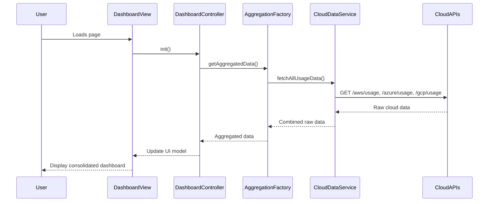

# Low-Level Design: Epic QE-3969 - Consolidated AI Dashboard

### a. Architecture Mapping
- Data Ingestion Service: Maps to `cloudDataService` (AngularJS Service).
- Data Aggregation Layer: Maps to `aggregationFactory` (AngularJS Factory).
- Visualization Dashboard: Maps to `DashboardController` and `dashboard.html`.
- **Folder Structure:**
  - `/app/services/cloudDataService.js`
  - `/app/factories/aggregationFactory.js`
  - `/app/controllers/dashboardController.js`
  - `/app/views/dashboard.html`

### b. Component Specifications
| Name                  | Artifact Type | Responsibility (1 line)                        | Key Dependencies      |
|-----------------------|---------------|------------------------------------------------|-----------------------|
| `cloudDataService`    | Service       | Fetches AI usage data from cloud provider APIs.| `$http`, `$q`         |
| `aggregationFactory`  | Factory       | Aggregates raw data from multiple sources.     | `cloudDataService`    |
| `DashboardController` | Controller    | Manages data binding for the dashboard view.   | `aggregationFactory`  |

### c. Data Model
- `cloudUsageData`: `{ provider: 'AWS' | 'Azure' | 'GCP', service: string, cost: number, usageDate: Date }`
- `aggregatedData`: `{ companyId: string, totalSpend: number, spendByProvider: object }`

### d. Data Flow
A user loads the dashboard, triggering the `DashboardController` to request data from the `aggregationFactory`. This factory then calls the `cloudDataService` to make parallel REST API calls to AWS, Azure, and GCP endpoints. Once all data is fetched, it is aggregated into a unified model and passed back to the controller, which updates the view for the user.

### e. Primary Sequence Diagram

### f. Implementation Notes
- Use ES6 Promises (`$q`) for handling asynchronous API calls in `cloudDataService`.
- Employ dependency injection to provide `aggregationFactory` to `DashboardController`.
- Use Bootstrap for a responsive grid layout in the dashboard view.
- Cache aggregated data in the factory to prevent redundant API calls on view switches.

### g. Error Handling
Implement a global `$http` interceptor to handle API errors, displaying a non-intrusive notification to the user.

### h. Security Notes
Requires token-based authentication provided by the existing SSO infrastructure.
