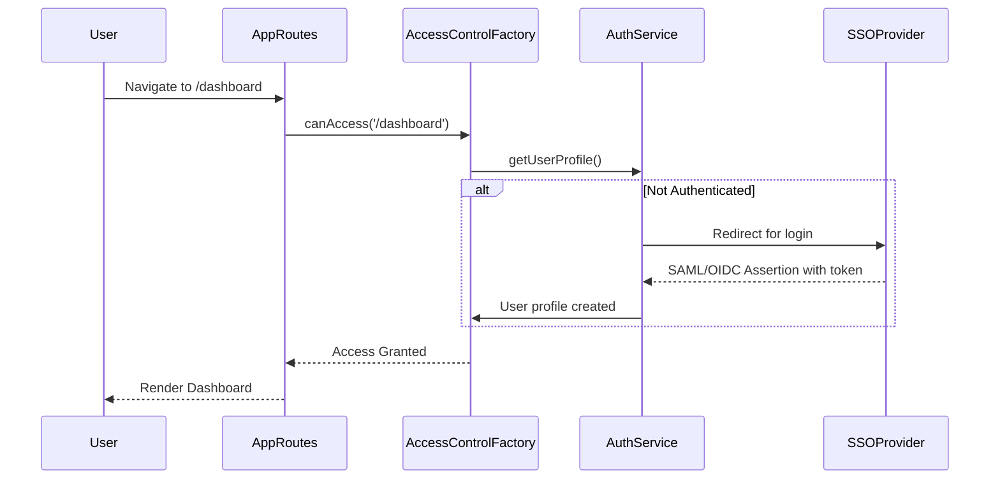

# Low-Level Design: Epic QE-3970 - Secure Access Framework

### a. Architecture Mapping
- SSO Provider Integration: Maps to `authService` (AngularJS Service).
- Access Control Service: Maps to `accessControlFactory` (AngularJS Factory).
- Dashboard View Protection: Maps to a route-change event listener in the main app module.
- **Folder Structure:**
  - `/app/services/authService.js`
  - `/app/factories/accessControlFactory.js`
  - `/app/app.js` (for route handling)

### b. Component Specifications
| Name                   | Artifact Type | Responsibility (1 line)                        | Key Dependencies        |
|------------------------|---------------|------------------------------------------------|-------------------------|
| `authService`          | Service       | Handles SSO authentication flow (SAML/OIDC).   | `$http`, `$window`      |
| `accessControlFactory` | Factory       | Checks user roles and permissions for a route. | `authService`           |
| `app.run()`            | Module Runner | Intercepts route changes to validate user access.| `$rootScope`, `accessControlFactory` |

### c. Data Model
- `userProfile`: `{ userId: string, email: string, roles: ['Partner Admin', 'Portfolio Viewer'], token: string }`

### d. Data Flow
A user attempts to access a protected route. The `$routeChangeStart` event fires, calling the `accessControlFactory` to verify the user's role, which it gets from the `authService`. If the user is not authenticated, `authService` redirects to the SSO provider. Upon successful login, the SSO provider returns a token, `authService` stores the user profile, and the user is allowed to proceed to the requested route.

### e. Primary Sequence Diagram

### f. Implementation Notes
- Use the `$routeProvider`'s `resolve` property to enforce role checks before a view is rendered.
- Store the JWT token in `sessionStorage` to persist the session for the duration of the tab.
- Configure an `$httpProvider` interceptor to attach the auth token to all outgoing API requests.

### g. Error Handling
The `$http` interceptor will listen for 401/403 responses and redirect the user to the login page.

### h. Security Notes
Standard input validation and secure API calls assumed.
