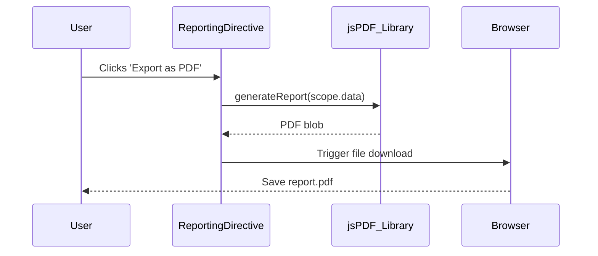

# Low-Level Design: Epic QE-3971 - Alerts and Reporting

### a. Architecture Mapping
- Monitoring Service: Maps to `monitoringService` (AngularJS Service).
- Alerting Engine: Logic resides in the backend; triggered by the `monitoringService`.
- Reporting Engine: Maps to `reportingDirective` (AngularJS Directive).
- **Folder Structure:**
  - `/app/services/monitoringService.js`
  - `/app/directives/reportingDirective/reportingDirective.js`
  - `/app/directives/reportingDirective/reportingDirective.html`

### b. Component Specifications
| Name                  | Artifact Type | Responsibility (1 line)                                     | Key Dependencies         |
|-----------------------|---------------|-------------------------------------------------------------|--------------------------|
| `monitoringService`   | Service       | Periodically checks data and triggers backend alert API.    | `$interval`, `$http`     |
| `reportingDirective`  | Directive     | Renders an export button and generates PDF/Excel on click.  | `jsPDF`, `SheetJS` libs  |

### c. Data Model
- `alertCondition`: `{ metric: 'budget' | 'staleness', threshold: number, lastChecked: Date }`
- `reportData`: `{ title: string, data: object[], format: 'PDF' | 'Excel' }`

### d. Data Flow
The `monitoringService` runs on a background `$interval`, fetching data and calling a backend `/api/alerts` endpoint if a condition is met. For reporting, a user clicks an "Export" button rendered by the `reportingDirective`. The directive takes the current scope data, formats it using a third-party library like jsPDF, and triggers a browser download.

### e. Primary Sequence Diagram

### f. Implementation Notes
- Use `$interval` in the `monitoringService` for efficient, periodic background checks.
- Integrate pre-built, vetted libraries like `jsPDF` and `SheetJS` for client-side report generation.
- The `reportingDirective` should be isolated and reusable, accepting data as a parameter.
- Ensure the monitoring service is only initiated once in the application's run cycle.

### g. Error Handling
Use `try/catch` blocks within the report generation logic to handle potential library errors gracefully.

### h. Security Notes
Standard input validation and secure API calls assumed.
