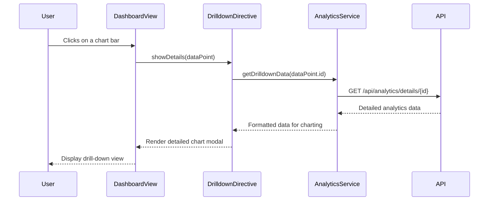

# Low-Level Design: Epic QE-3972 - Advanced Analytics

### a. Architecture Mapping
- Analytics Engine: Maps to `analyticsService` (AngularJS Service).
- Recommendation AI: Maps to `recommendationFactory` (AngularJS Factory).
- Dashboard Frontend Drill-down: Maps to `drilldownDirective` (AngularJS Directive).
- **Folder Structure:**
  - `/app/services/analyticsService.js`
  - `/app/factories/recommendationFactory.js`
  - `/app/directives/drilldown/drilldownDirective.js`
  - `/app/directives/drilldown/drilldown.html`

### b. Component Specifications
| Name                    | Artifact Type | Responsibility (1 line)                               | Key Dependencies     |
|-------------------------|---------------|-------------------------------------------------------|----------------------|
| `analyticsService`      | Service       | Performs complex data queries for comparisons via API.| `$http`              |
| `recommendationFactory` | Factory       | Generates optimization recommendations from data.     | `analyticsService`   |
| `drilldownDirective`    | Directive     | Renders a detailed, graphical view of a data point.   | `D3.js` or a chart lib |

### c. Data Model
- `analyticsQuery`: `{ companyIds: string[], metrics: string[], timePeriod: string }`
- `recommendation`: `{ type: 'cost' | 'performance', suggestion: string, estimatedImpact: number }`

### d. Data Flow
A user clicks on a chart element, invoking the `drilldownDirective`. This directive calls the `analyticsService` with a specific query for that data point. The service fetches detailed data from the backend `/api/analytics` endpoint. Concurrently, the `recommendationFactory` uses data from the `analyticsService` to generate and display relevant optimization tips in the UI.

### e. Primary Sequence Diagram

### f. Implementation Notes
- Use a robust charting library like D3.js or Chart.js within the `drilldownDirective` for rich visualizations.
- Cache results in the `analyticsService` using `$cacheFactory` to improve performance of repeated queries.
- Recommendations should be displayed in a dedicated, non-intrusive section of the UI.
- Ensure API endpoints for analytics are optimized for fast query responses.

### g. Error Handling
Use an interceptor-based approach, with specific user-friendly messages for analytics query failures.

### h. Security Notes
Standard input validation and secure API calls assumed.
