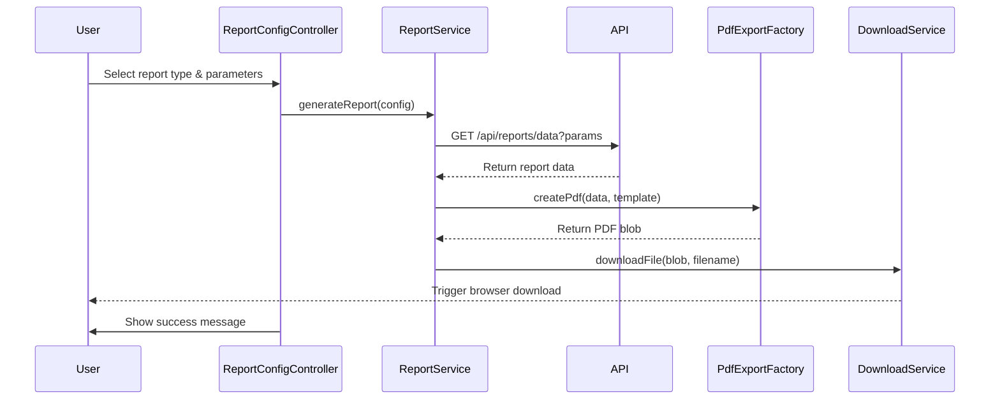

# Low-Level Design: Reporting and Export Capabilities
**Epic ID:** QE-3993

## a. Architecture Mapping

- **Report Generator Module** → AngularJS Module (`app.reporting`)
- **Report Configuration Controller** → AngularJS Controller (`ReportConfigController`)
- **Report Service** → AngularJS Service (`ReportService`)
- **PDF Export Service** → AngularJS Factory (`PdfExportFactory`)
- **Excel Export Service** → AngularJS Factory (`ExcelExportFactory`)
- **Download Handler** → AngularJS Service (`DownloadService`)

**Recommended Folder Structure:**
```
/app
  /reporting
    /controllers
    /services
    /factories
    /views
    /templates
```

## b. Component Specifications

| Name | Artifact Type | Responsibility | Key Dependencies |
|------|---------------|----------------|------------------|
| ReportConfigController | Controller | Manages report type selection, date range, and company filters | ReportService, $scope |
| ReportService | Service | Orchestrates report generation workflow and API calls | $http, PdfExportFactory, ExcelExportFactory |
| PdfExportFactory | Factory | Transforms dashboard data into PDF format using external library | DashboardDataService, $http |
| ExcelExportFactory | Factory | Converts data to Excel format with formatting | DashboardDataService |
| DownloadService | Service | Handles file download and browser compatibility | $window |
| ReportTemplateDirective | Directive | Renders report preview in UI | ReportService |

## c. Data Model

**ReportConfig Object:**
```javascript
{
  reportType: String,        // 'executive' | 'ai-adoption' | 'cost-savings' | 'pre-post-investment'
  format: String,            // 'pdf' | 'excel'
  dateRange: {
    startDate: Date,
    endDate: Date
  },
  companyIds: Array<Number>,
  includeCharts: Boolean,
  generatedAt: Date
}
```

**ReportData Object:**
```javascript
{
  metadata: Object,          // title, author, timestamp
  companies: Array<Object>,  // portfolio company data
  metrics: Object,           // aggregated metrics
  charts: Array<Object>      // chart configurations
}
```

## d. Data Flow

User selects report type and parameters in the UI → ReportConfigController captures inputs and validates → Controller calls ReportService.generateReport() → Service fetches data from DashboardDataService via REST API → Based on format selection, service delegates to PdfExportFactory or ExcelExportFactory → Factory transforms data using external library (jsPDF/ExcelJS) → Generated file blob returned to DownloadService → DownloadService triggers browser download → UI displays success notification.

## e. Primary Sequence Diagram



## f. Implementation Notes

- Use AngularJS DI to inject services and factories; follow single responsibility principle for each artifact
- Implement async/await pattern in services for REST API calls; use $q promises for AngularJS compatibility
- Leverage jsPDF for PDF generation and ExcelJS for Excel exports; load libraries via CDN or npm
- Use $http interceptor to add authentication tokens and handle API errors globally
- Implement progress indicator using $timeout to update UI during 10-second generation window

## g. Error Handling

Implement $http interceptor for API errors; use try/catch in factories with user-friendly notifications via toastr or custom modal service.

## h. Security Notes

Requires token-based auth via existing SSO; validate user permissions for company data access before report generation.