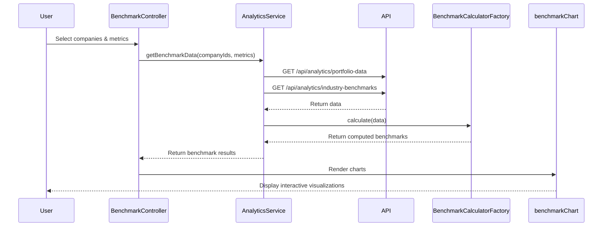

# Low-Level Design: Benchmarking and Analytics
**Epic ID:** QE-3994

## a. Architecture Mapping

- **Analytics Module** → AngularJS Module (`app.analytics`)
- **Benchmark Controller** → AngularJS Controller (`BenchmarkController`)
- **Analytics Service** → AngularJS Service (`AnalyticsService`)
- **Benchmark Calculator** → AngularJS Factory (`BenchmarkCalculatorFactory`)
- **Trend Analysis Service** → AngularJS Service (`TrendAnalysisService`)
- **Chart Directive** → AngularJS Directive (`benchmarkChart`)

**Recommended Folder Structure:**
```
/app
  /analytics
    /controllers
    /services
    /factories
    /directives
    /views
```

## b. Component Specifications

| Name | Artifact Type | Responsibility | Key Dependencies |
|------|---------------|----------------|------------------|
| BenchmarkController | Controller | Manages benchmark view, filters, and comparison selection | AnalyticsService, $scope |
| AnalyticsService | Service | Fetches historical data and industry benchmarks via REST API | $http, BenchmarkCalculatorFactory |
| BenchmarkCalculatorFactory | Factory | Performs statistical calculations for benchmarking and outlier detection | TrendAnalysisService |
| TrendAnalysisService | Service | Analyzes 24-month historical trends and generates insights | $q |
| IndustryDataService | Service | Integrates external industry benchmark data | $http |
| benchmarkChart | Directive | Renders interactive comparison charts using D3.js or Chart.js | AnalyticsService |

## c. Data Model

**BenchmarkData Object:**
```javascript
{
  companyId: Number,
  metrics: {
    aiAdoptionScore: Number,
    totalSpend: Number,
    toolCount: Number
  },
  industryAverage: Object,
  percentile: Number,
  trend: String              // 'increasing' | 'decreasing' | 'stable'
}
```

**HistoricalData Object:**
```javascript
{
  companyId: Number,
  dataPoints: Array<{
    month: String,           // 'YYYY-MM'
    metrics: Object
  }>,
  timeRange: Number          // months
}
```

## d. Data Flow

User selects companies and metrics for comparison → BenchmarkController captures selections → Controller calls AnalyticsService.getBenchmarkData() → Service fetches portfolio data and industry benchmarks via parallel REST API calls → BenchmarkCalculatorFactory processes data to compute percentiles, outliers, and rankings → TrendAnalysisService analyzes historical patterns → Results returned to controller → benchmarkChart directive renders visualizations → User interacts with charts to drill down into specific companies or time periods.

## e. Primary Sequence Diagram



## f. Implementation Notes

- Use AngularJS $q.all() to parallelize API calls for portfolio and industry data to meet 5-second performance target
- Implement caching strategy in AnalyticsService using $cacheFactory for frequently accessed historical data
- Use Web Workers for heavy statistical calculations in BenchmarkCalculatorFactory to avoid blocking UI thread
- Integrate Chart.js or D3.js via directive for responsive and interactive visualizations
- Apply ES6 array methods (map, filter, reduce) for data transformation and aggregation

## g. Error Handling

Use $http interceptor with retry logic for API failures; display user-friendly error messages via notification service on calculation errors.

## h. Security Notes

Standard input validation and secure API calls assumed; ensure industry data API keys are stored securely in backend configuration.