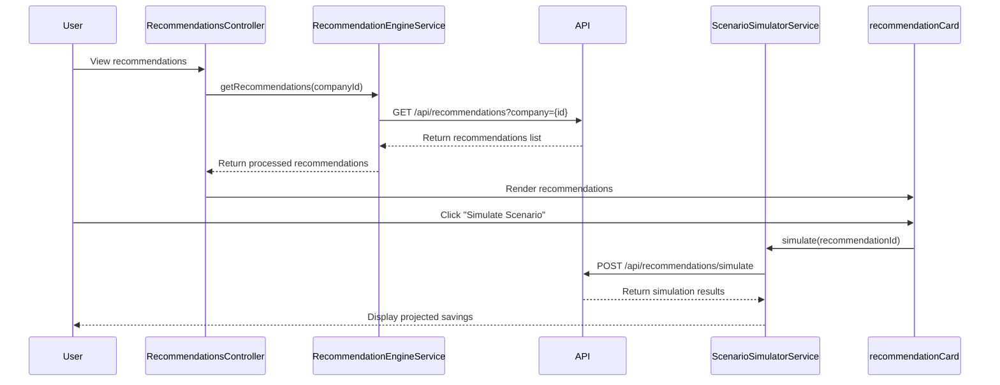

# Low-Level Design: AI-Driven Recommendations
**Epic ID:** QE-3995

## a. Architecture Mapping

- **Recommendations Module** → AngularJS Module (`app.recommendations`)
- **Recommendations Controller** → AngularJS Controller (`RecommendationsController`)
- **Recommendation Engine Service** → AngularJS Service (`RecommendationEngineService`)
- **Usage Analysis Factory** → AngularJS Factory (`UsageAnalysisFactory`)
- **Scenario Simulator Service** → AngularJS Service (`ScenarioSimulatorService`)
- **Recommendation Card Directive** → AngularJS Directive (`recommendationCard`)

**Recommended Folder Structure:**
```
/app
  /recommendations
    /controllers
    /services
    /factories
    /directives
    /views
```

## b. Component Specifications

| Name | Artifact Type | Responsibility | Key Dependencies |
|------|---------------|----------------|------------------|
| RecommendationsController | Controller | Displays recommendations list and manages user interactions | RecommendationEngineService, $scope |
| RecommendationEngineService | Service | Fetches and processes AI-generated recommendations from backend | $http, UsageAnalysisFactory |
| UsageAnalysisFactory | Factory | Analyzes usage patterns to identify redundancies and consolidation opportunities | $q |
| ScenarioSimulatorService | Service | Simulates cost impact of applying recommendations | $http |
| RecommendationFilterService | Service | Filters recommendations by company, category, and potential savings | - |
| recommendationCard | Directive | Renders individual recommendation with details and action buttons | ScenarioSimulatorService |

## c. Data Model

**Recommendation Object:**
```javascript
{
  id: Number,
  companyId: Number,
  type: String,              // 'vendor-consolidation' | 'redundancy' | 'rightsizing'
  title: String,
  description: String,
  potentialSavings: Number,
  confidence: Number,        // 0-100
  status: String,            // 'pending' | 'accepted' | 'rejected'
  createdAt: Date
}
```

**ScenarioSimulation Object:**
```javascript
{
  recommendationId: Number,
  currentCost: Number,
  projectedCost: Number,
  savingsAmount: Number,
  savingsPercentage: Number,
  implementationEffort: String  // 'low' | 'medium' | 'high'
}
```

## d. Data Flow

User navigates to recommendations dashboard → RecommendationsController calls RecommendationEngineService.getRecommendations() → Service fetches AI-generated recommendations from backend REST API → UsageAnalysisFactory enriches recommendations with usage context → Controller displays recommendations in UI via recommendationCard directive → User selects a recommendation to simulate → Controller calls ScenarioSimulatorService.simulate() → Service returns projected cost savings → User reviews scenario and accepts/rejects recommendation → Controller sends decision to backend API for tracking.

## e. Primary Sequence Diagram



## f. Implementation Notes

- Use AngularJS service pattern for RecommendationEngineService to maintain singleton state across views
- Implement lazy loading for recommendation details using $ocLazyLoad to improve initial page load performance
- Use ES6 template literals for dynamic recommendation descriptions and formatting
- Apply AngularJS filters for currency formatting and percentage display in recommendation cards
- Implement batch API calls for multiple scenario simulations using $q.all() to reduce latency

## g. Error Handling

Use try/catch blocks in services with fallback to cached recommendations; notify users via toastr on API failures.

## h. Security Notes

Requires token-based auth via existing SSO; validate user permissions to view and accept recommendations for specific companies.