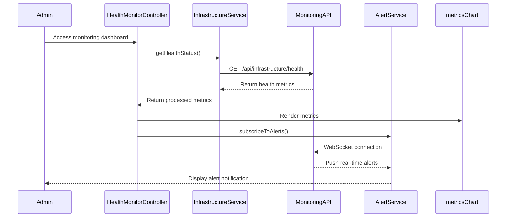

# Low-Level Design: Cloud Infrastructure and Deployment
**Epic ID:** QE-3996

## a. Architecture Mapping

- **Infrastructure Module** → AngularJS Module (`app.infrastructure`) - for admin monitoring UI
- **Health Monitor Controller** → AngularJS Controller (`HealthMonitorController`)
- **Infrastructure Service** → AngularJS Service (`InfrastructureService`)
- **Metrics Dashboard Directive** → AngularJS Directive (`metricsChart`)
- **Alert Service** → AngularJS Service (`AlertService`)

**Recommended Folder Structure:**
```
/app
  /admin
    /infrastructure
      /controllers
      /services
      /directives
      /views
```

## b. Component Specifications

| Name | Artifact Type | Responsibility | Key Dependencies |
|------|---------------|----------------|------------------|
| HealthMonitorController | Controller | Displays system health metrics and alerts for admin users | InfrastructureService, $scope, $interval |
| InfrastructureService | Service | Fetches infrastructure metrics and health status from monitoring API | $http |
| MetricsCollectorFactory | Factory | Aggregates performance metrics (response time, error rate, uptime) | $q |
| AlertService | Service | Manages real-time alerts for infrastructure issues via WebSocket | $websocket |
| metricsChart | Directive | Renders real-time infrastructure metrics using Chart.js | InfrastructureService |
| DeploymentStatusService | Service | Tracks deployment status and version information | $http |

## c. Data Model

**InfrastructureMetrics Object:**
```javascript
{
  timestamp: Date,
  uptime: Number,            // percentage
  activeUsers: Number,
  responseTime: Number,      // milliseconds
  errorRate: Number,         // percentage
  cpuUsage: Number,
  memoryUsage: Number,
  dbConnections: Number
}
```

**HealthStatus Object:**
```javascript
{
  status: String,            // 'healthy' | 'degraded' | 'critical'
  services: Array<{
    name: String,
    status: String,
    lastChecked: Date
  }>,
  alerts: Array<Object>
}
```

## d. Data Flow

Admin user accesses infrastructure monitoring dashboard → HealthMonitorController initializes and calls InfrastructureService.getHealthStatus() → Service fetches real-time metrics from backend monitoring API → MetricsCollectorFactory aggregates data → Controller updates UI via metricsChart directive → AlertService establishes WebSocket connection for real-time alerts → When infrastructure issues occur, AlertService receives notifications and displays alerts → Admin reviews metrics and takes corrective action if needed.

## e. Primary Sequence Diagram



## f. Implementation Notes

- Use AngularJS $interval service to poll InfrastructureService every 30 seconds for updated metrics
- Implement WebSocket connection using angular-websocket library for real-time alert notifications
- Use Chart.js with streaming plugin for live metric visualization in metricsChart directive
- Apply ES6 destructuring for clean metric data extraction and transformation
- Implement connection retry logic with exponential backoff for WebSocket failures

## g. Error Handling

Use $http interceptor for API errors; implement WebSocket reconnection logic with user notification on persistent connection failures.

## h. Security Notes

Requires token-based auth via existing SSO with admin role validation; restrict infrastructure monitoring endpoints to authorized admin users only.