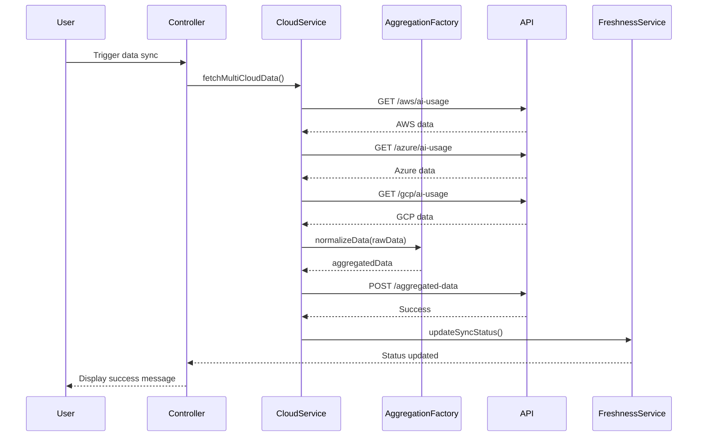

# Low-Level Design: Multi-Cloud AI Data Integration and Aggregation

**Epic ID:** QE-3997

## a. Architecture Mapping

- **API Integration Layer** → AngularJS Service (`cloudIntegrationService`)
- **Data Aggregation Engine** → AngularJS Factory (`dataAggregationFactory`)
- **Data Storage** → REST API endpoint (backend service)
- **Data Freshness Monitor** → AngularJS Service (`dataFreshnessService`)
- **Main Module** → `aiPortfolio.integration` (AngularJS module)

**Recommended Folder Structure:**
```
/app
  /modules
    /integration
      /services
        cloudIntegrationService.js
        dataFreshnessService.js
      /factories
        dataAggregationFactory.js
      /controllers
        integrationController.js
  /shared
    /interceptors
      apiInterceptor.js
```

## b. Component Specifications

| Name | Artifact Type | Responsibility | Key Dependencies |
|------|---------------|----------------|------------------|
| cloudIntegrationService | Service | Orchestrates API calls to AWS, Azure, GCP for usage/spend data retrieval | $http, $q, authService |
| dataAggregationFactory | Factory | Normalizes and aggregates multi-cloud data into unified schema | cloudIntegrationService |
| dataFreshnessService | Service | Monitors data age and triggers alerts for stale data | $interval, dataAggregationFactory |
| integrationController | Controller | Manages integration status UI and manual refresh triggers | cloudIntegrationService, dataFreshnessService |
| apiInterceptor | Interceptor | Handles authentication tokens and retry logic for API calls | $q, authService |

## c. Data Model

```javascript
// CloudUsageData model
{
  companyId: String,
  cloudProvider: String, // 'AWS' | 'Azure' | 'GCP'
  serviceName: String,
  usageMetrics: {
    apiCalls: Number,
    computeHours: Number,
    dataProcessedGB: Number
  },
  costData: {
    amount: Number,
    currency: String
  },
  timestamp: Date,
  lastUpdated: Date
}

// DataFreshnessStatus model
{
  companyId: String,
  lastSyncTime: Date,
  status: String, // 'current' | 'stale' | 'error'
  nextScheduledSync: Date
}
```

## d. Data Flow

User triggers data sync or scheduled job initiates → integrationController calls cloudIntegrationService → Service makes parallel REST API calls to AWS/Azure/GCP endpoints with authentication → Raw responses passed to dataAggregationFactory for schema normalization → Aggregated data posted to backend REST API for persistence → dataFreshnessService polls aggregation status and updates UI with sync timestamp → Dashboard components consume aggregated data via shared data service.

## e. Primary Sequence Diagram



## f. Implementation Notes

- Use $q.all() for parallel API calls to AWS, Azure, GCP to minimize total sync time
- Implement factory pattern for data aggregation to maintain stateless transformation logic
- Use AngularJS $http interceptor for automatic token injection and exponential backoff retry (3 attempts)
- Store API credentials securely in backend; frontend only passes company selection parameters
- Use $interval service for periodic freshness checks every 5 minutes with automatic cleanup on scope destroy

## g. Error Handling

HTTP interceptor captures API failures, logs to backend, displays user-friendly error toast, and marks company sync status as 'error' with retry option.

## h. Security Notes

Requires token-based auth via existing SSO; all cloud provider API credentials stored backend-only; frontend uses read-only session tokens.