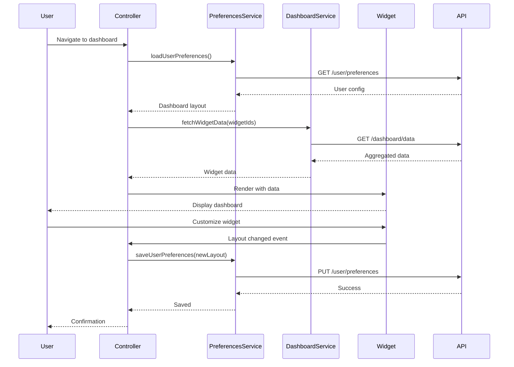

# Low-Level Design: AI Portfolio Dashboard Visualization

**Epic ID:** QE-3998

## a. Architecture Mapping

- **Web Application Frontend** → AngularJS Module (`aiPortfolio.dashboard`)
- **Dashboard Service** → AngularJS Service (`dashboardService`)
- **Widget Components** → AngularJS Directives (`chartWidget`, `metricWidget`, `tableWidget`)
- **User Preferences** → AngularJS Service (`userPreferencesService`)
- **Main Controller** → AngularJS Controller (`dashboardController`)

**Recommended Folder Structure:**
```
/app
  /modules
    /dashboard
      /controllers
        dashboardController.js
      /services
        dashboardService.js
        userPreferencesService.js
      /directives
        chartWidget.js
        metricWidget.js
        tableWidget.js
      /views
        dashboard.html
  /assets
    /css
      dashboard.css
```

## b. Component Specifications

| Name | Artifact Type | Responsibility | Key Dependencies |
|------|---------------|----------------|------------------|
| dashboardController | Controller | Manages dashboard layout, widget placement, and user interactions | dashboardService, userPreferencesService |
| dashboardService | Service | Fetches aggregated AI usage/spend data from backend REST API | $http, $q |
| userPreferencesService | Service | Loads/saves user dashboard configurations and widget settings | $http, localStorageService |
| chartWidget | Directive | Renders customizable charts (bar/line/pie) with drill-down capability | dashboardService, Chart.js |
| metricWidget | Directive | Displays KPI metrics with trend indicators and data freshness timestamp | dashboardService |
| tableWidget | Directive | Renders tabular data with sorting, filtering, and export functionality | dashboardService |

## c. Data Model

```javascript
// DashboardConfig model
{
  userId: String,
  layout: Array, // [{widgetId, type, position, size, config}]
  defaultView: String,
  lastModified: Date
}

// WidgetData model
{
  widgetId: String,
  type: String, // 'chart' | 'metric' | 'table'
  title: String,
  dataSource: String,
  refreshInterval: Number,
  data: Object,
  lastUpdated: Date
}

// MetricData model
{
  metricName: String,
  currentValue: Number,
  previousValue: Number,
  unit: String,
  trend: String // 'up' | 'down' | 'stable'
}
```

## d. Data Flow

User navigates to dashboard → dashboardController loads user preferences via userPreferencesService → Controller fetches widget data using dashboardService REST calls → Service returns aggregated metrics and usage data → Controller binds data to scope → Widget directives render visualizations using Chart.js and Bootstrap grid → User customizes widget (resize/reorder) → Controller saves updated layout via userPreferencesService to backend → User drills down on chart → Directive emits event to controller which navigates to detailed view with filtered parameters.

## e. Primary Sequence Diagram



## f. Implementation Notes

- Use AngularJS ui-grid or ng-table directive for table widgets with built-in sorting/filtering
- Integrate Chart.js via angular-chart.js wrapper for reactive chart rendering with two-way binding
- Implement drag-and-drop using angular-gridster for responsive widget layout management
- Use $scope.$watch on widget data with debouncing to prevent excessive re-renders during rapid updates
- Leverage Bootstrap responsive grid (col-md-*, col-lg-*) for mobile-friendly dashboard layout with WCAG 2.1 AA compliance

## g. Error Handling

Service-level try/catch blocks with $q.reject for promise chains; global error interceptor displays user-friendly toast notifications for API failures.

## h. Security Notes

Requires token-based auth via existing SSO; role-based widget visibility enforced by backend API; XSS prevention via AngularJS built-in sanitization.