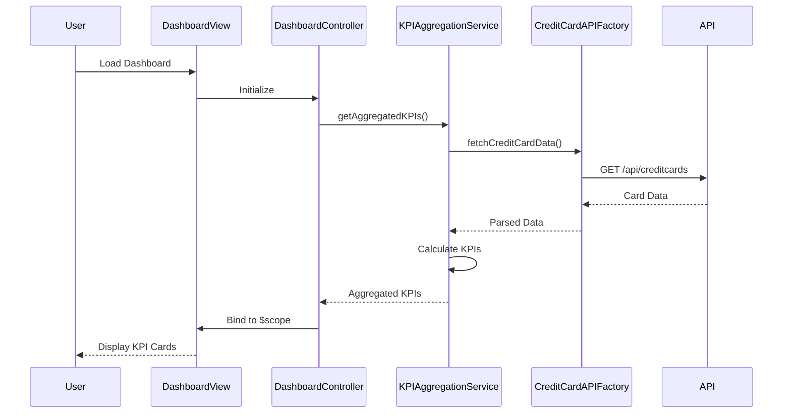

# Low-Level Design: Credit Card Analysis Dashboard

**Epic ID:** QE-4014

**Technology Stack:** AngularJS 1.x, JavaScript ES6, HTML5, CSS3, Bootstrap, REST APIs, MVC Architecture

---

## a. Architecture Mapping

- **Dashboard Module** → AngularJS Module (`creditCardDashboard`)
- **Dashboard Controller** → AngularJS Controller (`DashboardController`)
- **KPI Aggregation Service** → AngularJS Service (`KPIAggregationService`)
- **Data Refresh Service** → AngularJS Service (`DataRefreshService`)
- **Credit Card API Service** → AngularJS Factory (`CreditCardAPIFactory`)
- **Dashboard View** → HTML5 Template with Bootstrap responsive grid

**Recommended Folder Structure:**
```
/app
  /modules
    /dashboard
      dashboard.module.js
      dashboard.controller.js
      dashboard.html
  /services
    kpi-aggregation.service.js
    data-refresh.service.js
  /factories
    credit-card-api.factory.js
```

---

## b. Component Specifications

| Component Name | Artifact Type | Responsibility | Key Dependencies |
|----------------|---------------|----------------|------------------|
| DashboardController | Controller | Orchestrates dashboard view, binds KPI data to UI, handles refresh actions | KPIAggregationService, DataRefreshService |
| KPIAggregationService | Service | Calculates and caches KPIs (monthly spend, total limit, available credit, outstanding) | CreditCardAPIFactory |
| DataRefreshService | Service | Manages real-time data refresh intervals and triggers | KPIAggregationService, $interval |
| CreditCardAPIFactory | Factory | Handles REST API calls to credit card data source | $http, $q |
| DashboardView | HTML Template | Renders responsive KPI cards using Bootstrap grid | Bootstrap CSS, AngularJS directives |

---

## c. Data Model

**CreditCardKPI Object:**
```javascript
{
  monthlySpend: Number,
  totalCreditLimit: Number,
  availableCredit: Number,
  outstandingAmount: Number,
  cards: Array<CreditCard>,
  lastUpdated: Date
}
```

**CreditCard Object:**
```javascript
{
  cardId: String,
  cardNumber: String,
  cardType: String,
  creditLimit: Number,
  availableCredit: Number,
  outstandingBalance: Number
}
```

---

## d. Data Flow

User loads dashboard → DashboardView renders → DashboardController initializes and calls KPIAggregationService → Service fetches data via CreditCardAPIFactory REST calls → API returns card data → Service aggregates KPIs (sum limits, calculate available credit, compute outstanding) and caches result → Controller binds aggregated data to $scope → View updates with KPI cards → DataRefreshService polls for updates at intervals → UI reflects real-time changes.

---

## e. Primary Sequence Diagram



---

## f. Implementation Notes

- Use AngularJS dependency injection for all services and factories to ensure testability and modularity
- Implement KPI caching in KPIAggregationService with TTL to meet sub-2-second load requirement
- Use $http interceptors for centralized API error handling and loading state management
- Apply Bootstrap responsive grid (col-xs/sm/md/lg) for mobile-first responsive KPI card layout
- Use $interval service in DataRefreshService for periodic polling with configurable refresh intervals

---

## g. Error Handling

HTTP interceptor-based approach with global error handler displaying user-friendly notifications via Bootstrap alerts.

---

## h. Security Notes

Requires token-based auth via existing SSO; all API calls include authorization headers.