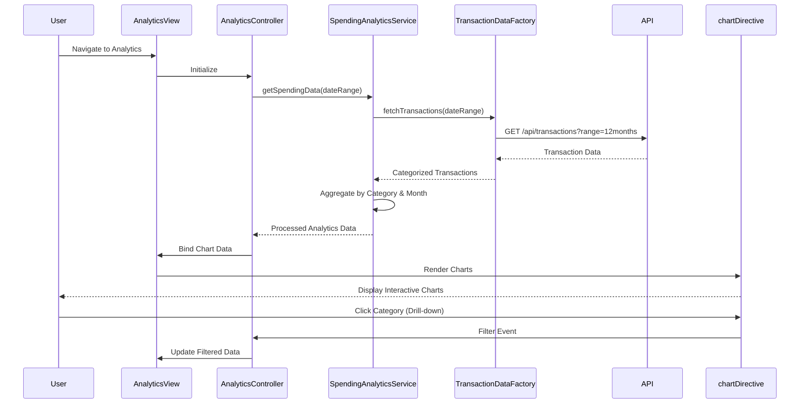

# Low-Level Design: Spending Analytics with Interactive Charts

**Epic ID:** QE-4015

**Technology Stack:** AngularJS 1.x, JavaScript ES6, HTML5, CSS3, Bootstrap, REST APIs, MVC Architecture

---

## a. Architecture Mapping

- **Analytics Module** → AngularJS Module (`spendingAnalytics`)
- **Analytics Controller** → AngularJS Controller (`AnalyticsController`)
- **Analytics Service** → AngularJS Service (`SpendingAnalyticsService`)
- **Visualization Engine** → AngularJS Directive (`chartDirective`)
- **Transaction Data Service** → AngularJS Factory (`TransactionDataFactory`)
- **Analytics View** → HTML5 Template with Bootstrap layout and Chart.js integration

**Recommended Folder Structure:**
```
/app
  /modules
    /analytics
      analytics.module.js
      analytics.controller.js
      analytics.html
  /services
    spending-analytics.service.js
  /factories
    transaction-data.factory.js
  /directives
    chart.directive.js
```

---

## b. Component Specifications

| Component Name | Artifact Type | Responsibility | Key Dependencies |
|----------------|---------------|----------------|------------------|
| AnalyticsController | Controller | Manages analytics view state, handles category/card filters, binds chart data | SpendingAnalyticsService |
| SpendingAnalyticsService | Service | Aggregates transaction data by category, calculates monthly trends, prepares chart datasets | TransactionDataFactory |
| TransactionDataFactory | Factory | Fetches categorized transaction data from REST API for specified date ranges | $http, $q |
| chartDirective | Directive | Renders interactive charts using Chart.js, handles drill-down events | Chart.js library |
| AnalyticsView | HTML Template | Displays category filters, card selector, and chart containers with responsive layout | Bootstrap CSS, chartDirective |

---

## c. Data Model

**SpendingAnalytics Object:**
```javascript
{
  categories: Array<CategorySpending>,
  monthlyTrends: Array<MonthlyTrend>,
  cardWiseAnalysis: Array<CardSpending>,
  dateRange: { startDate: Date, endDate: Date }
}
```

**CategorySpending Object:**
```javascript
{
  categoryName: String,
  totalAmount: Number,
  transactionCount: Number,
  percentage: Number
}
```

**MonthlyTrend Object:**
```javascript
{
  month: String,
  categoryBreakdown: Object<String, Number>
}
```

---

## d. Data Flow

User navigates to analytics page → AnalyticsView loads → AnalyticsController initializes with default 12-month range → Calls SpendingAnalyticsService.getSpendingData() → Service requests data via TransactionDataFactory REST call → API returns categorized transactions → Service aggregates by nine categories, calculates monthly trends and card-wise totals → Controller receives processed datasets → Binds to $scope → chartDirective renders interactive Chart.js visualizations → User interacts (drill-down, filter) → Controller updates data subset → Charts re-render with filtered view.

---

## e. Primary Sequence Diagram



---

## f. Implementation Notes

- Use Chart.js library integrated via custom AngularJS directive for reusable chart components
- Implement data aggregation and caching in SpendingAnalyticsService to meet 3-second rendering NFR
- Use ES6 Array methods (map, reduce, filter) for efficient category and monthly trend calculations
- Apply AngularJS $watch on filter selections to trigger reactive chart updates
- Leverage Chart.js onClick events in directive for drill-down functionality with two-way data binding

---

## g. Error Handling

Interceptor-based with try/catch blocks in service layer; user notifications via Bootstrap toast/alert components.

---

## h. Security Notes

Standard input validation and secure API calls assumed; requires existing authentication token in API requests.