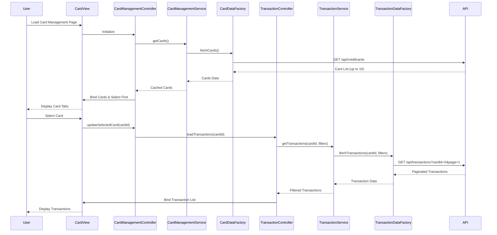

# Low-Level Design: Multi-Card Management with Transaction History

**Epic ID:** QE-4016

**Technology Stack:** AngularJS 1.x, JavaScript ES6, HTML5, CSS3, Bootstrap, REST APIs, MVC Architecture

---

## a. Architecture Mapping

- **Card Management Module** → AngularJS Module (`cardManagement`)
- **Card Management Controller** → AngularJS Controller (`CardManagementController`)
- **Transaction Controller** → AngularJS Controller (`TransactionController`)
- **Card Management Service** → AngularJS Service (`CardManagementService`)
- **Transaction Service** → AngularJS Service (`TransactionService`)
- **Card Data Factory** → AngularJS Factory (`CardDataFactory`)
- **Transaction Data Factory** → AngularJS Factory (`TransactionDataFactory`)
- **Card View** → HTML5 Template with Bootstrap card components and tabs

**Recommended Folder Structure:**
```
/app
  /modules
    /card-management
      card-management.module.js
      card-management.controller.js
      card-management.html
      transaction.controller.js
      transaction.html
  /services
    card-management.service.js
    transaction.service.js
  /factories
    card-data.factory.js
    transaction-data.factory.js
```

---

## b. Component Specifications

| Component Name | Artifact Type | Responsibility | Key Dependencies |
|----------------|---------------|----------------|------------------|
| CardManagementController | Controller | Manages card list display, handles card selection/switching, binds card details to UI | CardManagementService |
| TransactionController | Controller | Manages transaction list view, handles filtering (date, amount, merchant), pagination | TransactionService |
| CardManagementService | Service | Retrieves and caches up to 10 credit cards, manages selected card state | CardDataFactory |
| TransactionService | Service | Fetches and filters transaction history for selected card, handles pagination logic | TransactionDataFactory |
| CardDataFactory | Factory | REST API calls to retrieve credit card details and metadata | $http, $q |
| TransactionDataFactory | Factory | REST API calls to fetch transaction history with filtering and pagination support | $http, $q |
| CardView | HTML Template | Displays card selector (tabs/dropdown), card details panel, and transaction list with filters | Bootstrap tabs/cards, AngularJS ng-repeat |

---

## c. Data Model

**CreditCard Object:**
```javascript
{
  cardId: String,
  cardNumber: String,
  cardHolderName: String,
  cardType: String,
  expiryDate: String,
  creditLimit: Number,
  availableCredit: Number,
  outstandingBalance: Number,
  isActive: Boolean
}
```

**Transaction Object:**
```javascript
{
  transactionId: String,
  cardId: String,
  date: Date,
  merchantName: String,
  category: String,
  amount: Number,
  status: String
}
```

**TransactionFilter Object:**
```javascript
{
  dateRange: { startDate: Date, endDate: Date },
  minAmount: Number,
  maxAmount: Number,
  merchantName: String,
  pageNumber: Number,
  pageSize: Number
}
```

---

## d. Data Flow

User navigates to card management page → CardView loads → CardManagementController initializes and calls CardManagementService.getCards() → Service fetches cards via CardDataFactory REST call → API returns up to 10 cards → Service caches cards and sets first as selected → Controller binds card list and selected card to $scope → View displays card tabs and details → User selects different card → Controller updates selected card state → TransactionController calls TransactionService.getTransactions(cardId, filters) → Service fetches via TransactionDataFactory with pagination → API returns paginated transactions → Controller binds to view → User applies filters → Controller updates filter object → Service re-fetches with new criteria → View updates transaction list.

---

## e. Primary Sequence Diagram



---

## f. Implementation Notes

- Use AngularJS $rootScope or shared service to maintain selected card state across controllers
- Implement card switching with instant UI update using cached data; no API call on switch
- Use Bootstrap tabs or nav-pills for card selector with ng-repeat for dynamic card list rendering
- Apply server-side pagination via TransactionDataFactory with page/size query parameters
- Use AngularJS filters for client-side transaction filtering when dataset is small; otherwise delegate to API

---

## g. Error Handling

HTTP interceptor for API errors with try/catch in service methods; user-friendly error messages via Bootstrap modals or alerts.

---

## h. Security Notes

Requires token-based auth via existing SSO; mask card numbers in UI (show last 4 digits only).