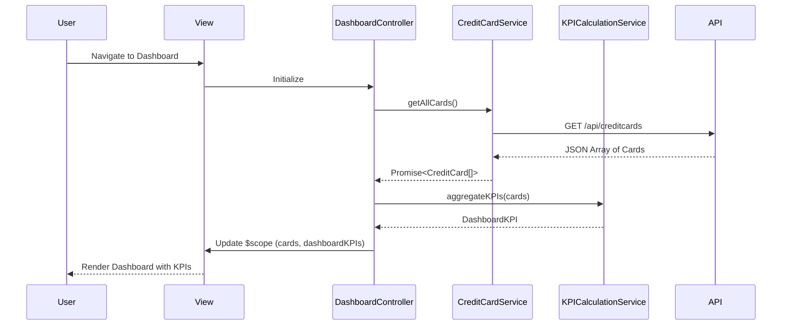

# Low-Level Design: Credit Card Analysis Dashboard

## Epic ID: QE-4033

---

## a. Architecture Mapping

- **Dashboard Module** (`app.dashboard`) → AngularJS Module containing all dashboard-related artifacts
- **Dashboard Controller** (`DashboardController`) → Manages dashboard view state and coordinates data retrieval
- **Credit Card Service** (`CreditCardService`) → Handles REST API calls to fetch credit card data
- **KPI Calculation Service** (`KPICalculationService`) → Computes aggregated metrics (total limit, available credit, outstanding)
- **Card Summary Directive** (`cardSummary`) → Reusable component to display individual card KPIs

**Recommended Folder Structure:**
```
app/
├── modules/
│   └── dashboard/
│       ├── dashboard.module.js
│       ├── dashboard.controller.js
│       ├── dashboard.html
│       ├── services/
│       │   ├── credit-card.service.js
│       │   └── kpi-calculation.service.js
│       └── directives/
│           └── card-summary.directive.js
└── shared/
    └── interceptors/
        └── http-error.interceptor.js
```

---

## b. Component Specifications

| Component Name | Artifact Type | Responsibility | Key Dependencies |
|----------------|---------------|----------------|------------------|
| `app.dashboard` | Module | Dashboard feature module registration | `ngRoute`, `app.shared` |
| `DashboardController` | Controller | Orchestrates dashboard data loading and view state management | `CreditCardService`, `KPICalculationService`, `$scope` |
| `CreditCardService` | Service | Fetches credit card data from REST API endpoint `/api/creditcards` | `$http`, `$q` |
| `KPICalculationService` | Service | Aggregates and calculates KPIs (total limit, available credit, outstanding, monthly spend) | None |
| `cardSummary` | Directive | Renders individual card KPI summary with responsive layout | None |
| `HttpErrorInterceptor` | Factory | Intercepts HTTP errors and displays user notifications | `$q`, `NotificationService` |

---

## c. Data Model

**CreditCard Model:**
```javascript
{
  cardId: String,
  cardNumber: String (masked),
  cardHolderName: String,
  creditLimit: Number,
  currentBalance: Number,
  availableCredit: Number,
  monthlySpend: Number,
  outstandingAmount: Number,
  lastUpdated: Date
}
```

**DashboardKPI Model:**
```javascript
{
  totalCreditLimit: Number,
  totalAvailableCredit: Number,
  totalOutstanding: Number,
  totalMonthlySpend: Number,
  cardCount: Number
}
```

---

## d. Data Flow

User navigates to dashboard → `DashboardController` initializes and calls `CreditCardService.getAllCards()` → Service makes GET request to `/api/creditcards` → Response containing array of credit card objects is returned → `KPICalculationService.aggregateKPIs(cards)` computes totals and derived metrics → Controller updates `$scope.cards` and `$scope.dashboardKPIs` → View renders card summaries using `cardSummary` directive and displays aggregated KPIs with Bootstrap responsive grid → User sees complete dashboard within 2 seconds.

---

## e. Primary Sequence Diagram



---

## f. Implementation Notes

- Use AngularJS 1.x dependency injection for all services and controllers with explicit array notation for minification safety
- Implement ES6 classes for services wrapped in IIFE patterns for compatibility
- Use `$http` service with promise chaining; implement caching strategy for credit card data with 5-minute TTL
- Apply Bootstrap grid system (col-xs/sm/md/lg) for responsive layout; use CSS3 flexbox for card summary components
- Implement one-time binding (`::`) in view templates for static data to optimize digest cycle performance

---

## g. Error Handling

HTTP interceptor-based error handling with user-friendly toast notifications for API failures and network errors.

---

## h. Security Notes

Requires token-based authentication via existing SSO; credit card numbers must remain masked in all client-side operations.