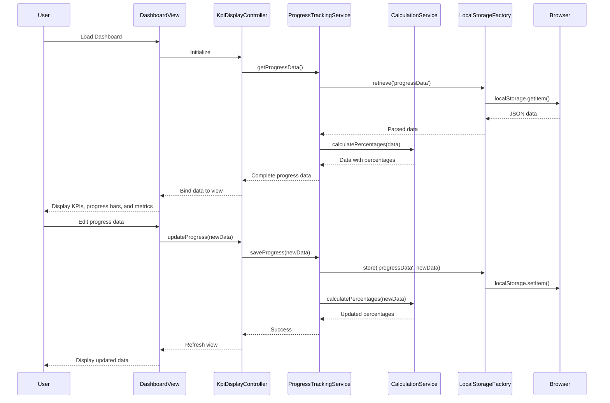

# Low-Level Design: Executive Testing Summary Dashboard

**Epic ID:** QE-4042

## a. Architecture Mapping

- **Dashboard Module** → AngularJS Module (`executiveDashboardModule`)
- **KPI Display Module** → AngularJS Controller (`KpiDisplayController`) + Directive (`kpiTile`)
- **Progress Tracking Engine** → AngularJS Service (`ProgressTrackingService`)
- **Data Management Interface** → AngularJS Controller (`DataManagementController`) + Service (`DataStorageService`)
- **Browser Local Storage** → AngularJS Factory (`LocalStorageFactory`)
- **Calculation Engine** → AngularJS Service (`CalculationService`)

**Recommended Folder Structure:**
```
app/
├── modules/executive-dashboard/
│   ├── controllers/
│   ├── services/
│   ├── directives/
│   ├── factories/
│   └── views/
└── shared/
    └── utils/
```

## b. Component Specifications

| Component Name | Artifact Type | Responsibility | Key Dependencies |
|---|---|---|---|
| executiveDashboardModule | Module | Main module registration and routing configuration | angular, ngRoute |
| KpiDisplayController | Controller | Manages KPI tile rendering and data binding | ProgressTrackingService, CalculationService |
| ProgressTrackingController | Controller | Handles progress bar display and updates for 12 testing scopes | ProgressTrackingService, CalculationService |
| DataManagementController | Controller | Manages editable data interface and CRUD operations | DataStorageService, LocalStorageFactory |
| ProgressTrackingService | Service | Retrieves and updates progress data for testing scopes | LocalStorageFactory |
| DataStorageService | Service | Handles data persistence operations | LocalStorageFactory |
| CalculationService | Service | Computes percentage values from completed/total counts | None |
| LocalStorageFactory | Factory | Wrapper for browser localStorage API with JSON serialization | $window |
| kpiTile | Directive | Reusable KPI tile component with data binding | None |
| progressBar | Directive | Reusable progress bar with automatic percentage display | CalculationService |

## c. Data Model

```javascript
// Executive KPI Model
const ExecutiveKpi = {
  id: String,
  title: String,
  value: Number,
  unit: String,
  trend: String // 'up', 'down', 'neutral'
};

// Testing Scope Progress Model
const TestingScopeProgress = {
  scopeId: String, // 'sprint', 'regression', 'api', 'ui', 'performance', 'deployment', 'rollback', 'backwardCompatibility', 'integration', 'usability', 'contract', 'guardrail'
  scopeName: String,
  completed: Number,
  total: Number,
  percentage: Number // auto-calculated
};

// Agent Progress Model
const AgentProgress = {
  agentId: String,
  agentName: String,
  completed: Number,
  total: Number,
  percentage: Number // auto-calculated
};

// Workflow/APB Flow Model
const WorkflowProgress = {
  workflowId: String,
  workflowName: String,
  type: String, // 'workflow' or 'apbFlow'
  completed: Number,
  total: Number,
  percentage: Number // auto-calculated
};

// Use Case Readiness Model
const UseCaseReadiness = {
  useCaseId: String,
  useCaseName: String,
  readinessStatus: String, // 'ready', 'inProgress', 'notStarted'
  percentage: Number
};
```

## d. Data Flow

User loads the Executive Dashboard view → DashboardController initializes and requests data from ProgressTrackingService → ProgressTrackingService retrieves stored data via LocalStorageFactory from browser localStorage → CalculationService computes percentage values from completed/total counts → Controller binds calculated data to view models → View renders KPI tiles, progress bars for 12 testing scopes, agent progress, workflow/APB flow progress, and use case readiness → User edits data via DataManagementController → DataStorageService persists updates to localStorage via LocalStorageFactory → CalculationService recalculates percentages → View automatically updates with new values.

## e. Primary Sequence Diagram



## f. Implementation Notes

- Use AngularJS dependency injection for all services, factories, and controllers to maintain testability and modularity
- Implement ES6 classes for service definitions with constructor-based DI pattern
- Use AngularJS directives with isolated scope for reusable KPI tiles and progress bars to ensure component encapsulation
- Leverage $watch on data models to trigger automatic recalculation when completed/total values change
- Use RESTful API pattern for future backend integration; current implementation uses localStorage as persistence layer

## g. Error Handling

Client-side error handling via try/catch blocks in service methods with user notification through AngularJS toaster service for localStorage failures or calculation errors.

## h. Security Notes

Standard input validation and secure API calls assumed; localStorage data is client-side only with no sensitive information stored.