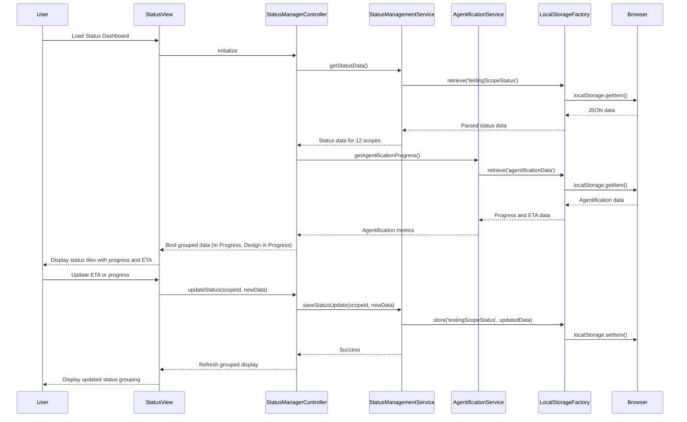

# Low-Level Design: Testing Scope Status Dashboard

**Epic ID:** QE-4043

## a. Architecture Mapping

- **Status Dashboard UI** → AngularJS Module (`testingScopeStatusModule`)
- **Testing Scope Status Manager** → AngularJS Controller (`StatusManagerController`) + Service (`StatusManagementService`)
- **Agentification Progress Tracker** → AngularJS Controller (`AgentificationController`) + Service (`AgentificationService`)
- **Data Management System** → AngularJS Service (`StatusDataService`) + Factory (`LocalStorageFactory`)
- **Visual Grouping Engine** → AngularJS Directive (`statusGroupTile`) + Filter (`groupByStatus`)

**Recommended Folder Structure:**
```
app/
├── modules/testing-scope-status/
│   ├── controllers/
│   ├── services/
│   ├── directives/
│   ├── filters/
│   └── views/
└── shared/
    └── factories/
```

## b. Component Specifications

| Component Name | Artifact Type | Responsibility | Key Dependencies |
|---|---|---|---|
| testingScopeStatusModule | Module | Main module registration and routing for status dashboard | angular, ngRoute |
| StatusManagerController | Controller | Manages testing scope status display and categorization | StatusManagementService, groupByStatus |
| AgentificationController | Controller | Handles agentification progress and ETA display | AgentificationService, StatusDataService |
| StatusManagementService | Service | Retrieves and updates status data for 12 testing types | LocalStorageFactory |
| AgentificationService | Service | Manages agentification progress tracking and ETA calculations | LocalStorageFactory |
| StatusDataService | Service | Handles CRUD operations for status and ETA data | LocalStorageFactory |
| LocalStorageFactory | Factory | Browser localStorage wrapper with JSON serialization | $window |
| statusGroupTile | Directive | Reusable tile component for status-grouped testing scopes | None |
| groupByStatus | Filter | Groups testing scopes by status ('inProgress', 'designInProgress') | None |
| etaDisplay | Directive | Displays and formats ETA dates with visual indicators | None |

## c. Data Model

```javascript
// Testing Scope Status Model
const TestingScopeStatus = {
  scopeId: String, // 'sprint', 'regression', 'api', 'ui', 'performance', 'deployment', 'rollback', 'backwardCompatibility', 'integration', 'usability', 'contract', 'guardrail'
  scopeName: String,
  status: String, // 'inProgress', 'designInProgress', 'completed', 'notStarted'
  agentificationProgress: Number, // percentage 0-100
  eta: Date, // Expected Time of Arrival for agentification
  lastUpdated: Date
};

// Status Group Model
const StatusGroup = {
  groupName: String, // 'In Progress', 'Design in Progress'
  scopes: Array // Array of TestingScopeStatus
};

// Agentification Timeline Model
const AgentificationTimeline = {
  scopeId: String,
  milestones: Array, // Array of {name: String, date: Date, completed: Boolean}
  overallProgress: Number
};
```

## d. Data Flow

User navigates to Status Dashboard view → StatusManagerController initializes and requests status data from StatusManagementService → StatusManagementService retrieves data via LocalStorageFactory from browser localStorage → groupByStatus filter organizes scopes into "In Progress" and "Design in Progress" groups → Controller binds grouped data to view → View renders status-grouped tiles with agentification progress and ETA → User edits status or ETA via inline editing → AgentificationController captures changes and calls StatusDataService → StatusDataService persists updates to localStorage → View automatically refreshes with updated status grouping and progress indicators.

## e. Primary Sequence Diagram



## f. Implementation Notes

- Use AngularJS custom filter (groupByStatus) to dynamically organize scopes by status for visual grouping
- Implement ES6 arrow functions in service methods for cleaner async handling and data transformations
- Use AngularJS directive with two-way binding for inline ETA editing with date picker integration
- Leverage ng-repeat with track by scopeId for efficient DOM updates when status changes
- Apply CSS classes dynamically based on status values for visual contrast and accessibility compliance

## g. Error Handling

Interceptor-based error handling for data retrieval failures with fallback to default status values and user notification via toast messages.

## h. Security Notes

Standard input validation and secure API calls assumed; ETA date inputs validated to prevent invalid date entries.