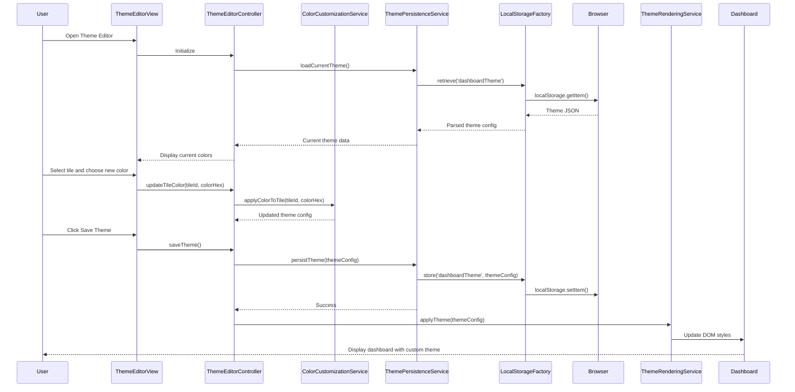

# Low-Level Design: Dashboard Theme Editor

**Epic ID:** QE-4044

## a. Architecture Mapping

- **Theme Editor UI** → AngularJS Module (`themeEditorModule`)
- **Color Customization Engine** → AngularJS Controller (`ThemeEditorController`) + Service (`ColorCustomizationService`)
- **Theme Persistence Layer** → AngularJS Service (`ThemePersistenceService`) + Factory (`LocalStorageFactory`)
- **Browser Local Storage** → AngularJS Factory (`LocalStorageFactory`)
- **Dashboard Rendering Engine** → AngularJS Directive (`themeApplicator`) + Service (`ThemeRenderingService`)

**Recommended Folder Structure:**
```
app/
├── modules/theme-editor/
│   ├── controllers/
│   ├── services/
│   ├── directives/
│   └── views/
└── shared/
    └── factories/
```

## b. Component Specifications

| Component Name | Artifact Type | Responsibility | Key Dependencies |
|---|---|---|---|
| themeEditorModule | Module | Main module registration for theme customization functionality | angular, ngRoute |
| ThemeEditorController | Controller | Manages theme editor UI, color selection, and save/reset actions | ColorCustomizationService, ThemePersistenceService |
| ColorCustomizationService | Service | Handles individual tile, status, and group color customization logic | ThemeRenderingService |
| ThemePersistenceService | Service | Manages theme save, load, and reset operations | LocalStorageFactory |
| ThemeRenderingService | Service | Applies custom themes to dashboard elements dynamically | None |
| LocalStorageFactory | Factory | Browser localStorage wrapper for theme data persistence | $window |
| themeApplicator | Directive | Applies theme colors to DOM elements based on theme configuration | ThemeRenderingService |
| colorPicker | Directive | Reusable color picker component for tile and status color selection | None |
| bulkColorApplicator | Directive | Handles bulk color application to multiple tiles or groups | ColorCustomizationService |

## c. Data Model

```javascript
// Theme Configuration Model
const ThemeConfig = {
  themeId: String,
  themeName: String,
  createdDate: Date,
  kpiTileColors: Object, // {kpiId: colorHex}
  testingScopeTileColors: Object, // {scopeId: colorHex}
  statusColors: Object, // {status: colorHex} e.g., {'inProgress': '#4CAF50', 'designInProgress': '#FFC107'}
  groupBackgroundColors: Object, // {groupName: colorHex}
  isActive: Boolean
};

// Color Preset Model
const ColorPreset = {
  presetId: String,
  presetName: String,
  colors: Array // Array of hex color codes
};

// Tile Color Mapping Model
const TileColorMapping = {
  tileId: String,
  tileType: String, // 'kpi', 'testingScope'
  backgroundColor: String, // hex code
  textColor: String, // hex code
  borderColor: String // hex code
};
```

## d. Data Flow

User opens Theme Editor interface → ThemeEditorController initializes and loads current theme from ThemePersistenceService → ThemePersistenceService retrieves theme data via LocalStorageFactory from browser localStorage → Controller displays current color settings in editor UI → User selects tile/status/group and chooses new color via colorPicker directive → ColorCustomizationService updates theme configuration object → User applies bulk colors or individual changes → User clicks Save → ThemePersistenceService persists updated theme to localStorage via LocalStorageFactory → ThemeRenderingService applies new theme to dashboard → themeApplicator directive updates DOM element styles → Dashboard re-renders with custom colors; User can click Reset to restore default theme.

## e. Primary Sequence Diagram



## f. Implementation Notes

- Use AngularJS directive with ng-style for dynamic CSS application based on theme configuration
- Implement ES6 Map objects for efficient color lookup by tile ID or status type
- Use AngularJS $broadcast event to notify dashboard components when theme changes are applied
- Leverage HTML5 color input type for native color picker integration with fallback to custom picker
- Store theme data as JSON in localStorage with versioning for future theme migration support

## g. Error Handling

Try/catch blocks in theme persistence methods with user notification for localStorage quota exceeded or invalid color format errors.

## h. Security Notes

Standard input validation and secure API calls assumed; color hex values validated using regex pattern to prevent XSS via CSS injection.