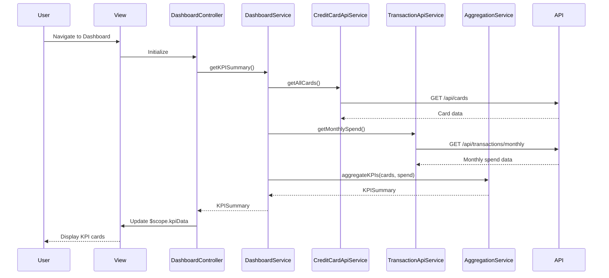

# Low-Level Design: QE-4051 - Analytics1-Dashboard KPIs and Credit Card Overview

## a. Architecture Mapping

**HLD Component → AngularJS Artifact Mapping:**

- User Dashboard UI → DashboardController + dashboard.html view
- Dashboard Service → DashboardService (orchestration layer)
- Data Aggregation Layer → AggregationService (business logic for KPI calculations)
- Credit Card Data Service integration → CreditCardApiService (REST API wrapper)
- Transaction Service integration → TransactionApiService (REST API wrapper)
- Real-time refresh mechanism → $interval service + polling logic in DashboardController

**Recommended Folder Structure:**
```
app/
  dashboard/
    dashboard.module.js
    dashboard.controller.js
    dashboard.service.js
    dashboard.routes.js
    views/dashboard.html
  shared/
    services/
      creditCardApi.service.js
      transactionApi.service.js
      aggregation.service.js
    interceptors/
      error.interceptor.js
```

## b. Component Specifications

| Name | Artifact Type | Responsibility | Key Dependencies |
|------|---------------|----------------|------------------|
| DashboardController | Controller | Manages dashboard state, triggers KPI refresh, handles user interactions | DashboardService, $interval, $scope |
| DashboardService | Service | Orchestrates data aggregation, coordinates API calls, caches KPI data | AggregationService, CreditCardApiService, TransactionApiService |
| AggregationService | Service | Calculates total credit limit, available credit, outstanding amounts, monthly spend | None (pure calculation logic) |
| CreditCardApiService | Service | Fetches credit card details, balances, and limits from Credit Card Data Service API | $http |
| TransactionApiService | Service | Retrieves monthly transaction data and spend totals from Transaction Service API | $http |
| dashboard.html | View | Displays KPI cards (monthly spend, credit limit, available credit, outstanding), responsive grid layout | Bootstrap grid, AngularJS directives |

## c. Data Model

```js
CreditCard = {
  cardId: String,
  cardNumber: String,
  cardType: String,
  creditLimit: Number,
  currentBalance: Number,
  availableCredit: Number,
  outstandingAmount: Number
}

KPISummary = {
  totalCreditLimit: Number,
  totalAvailableCredit: Number,
  totalOutstanding: Number,
  monthlySpend: Number,
  cardCount: Number,
  lastUpdated: Date
}

MonthlySpend = {
  month: String,
  year: Number,
  totalAmount: Number,
  transactionCount: Number
}
```

## d. Data Flow

User navigates to the dashboard view, triggering DashboardController initialization. The controller invokes DashboardService.getKPISummary(), which concurrently calls CreditCardApiService.getAllCards() and TransactionApiService.getMonthlySpend(). Once both API responses return, AggregationService aggregates credit limits, calculates available credit (creditLimit - currentBalance), sums outstanding amounts across all cards, and compiles monthly spend totals. The aggregated KPISummary object is returned to the controller, which updates $scope.kpiData, causing the view to re-render with updated KPI cards. A $interval timer triggers DashboardService.refreshKPIs() every 45 seconds to poll for updated data and refresh the UI automatically.

## e. Primary Sequence Diagram



## f. Implementation Notes

- Use constructor injection with $inject array annotation for all services and controllers (minification-safe)
- API calls centralized in CreditCardApiService and TransactionApiService; controllers never call $http directly
- Leverage ES6 arrow functions, const/let, and template literals with Babel transpilation
- Use $q.all() to parallelize API calls in DashboardService for faster load times (<2s NFR)
- Implement responsive Bootstrap grid (col-xs-12, col-md-6, col-lg-3) for KPI cards to support desktop/tablet/mobile

## g. Error Handling

HTTP interceptor captures API errors, displays user-friendly notifications via toastr/alert service, and logs errors to console; service methods return rejected promises with error context.

## h. Security Notes

Standard input validation and secure API calls assumed; authentication token passed via $http interceptor for all API requests.