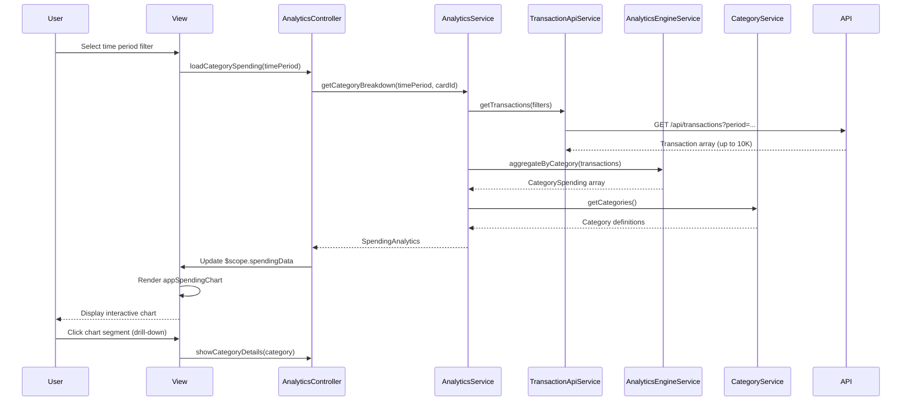

# Low-Level Design: QE-4052 - Analytics1-Category-wise Spending Analytics

## a. Architecture Mapping

**HLD Component → AngularJS Artifact Mapping:**

- Analytics UI → AnalyticsController + analytics.html view
- Analytics Service → AnalyticsService (orchestration and data preparation)
- Transaction Service integration → TransactionApiService (REST API wrapper)
- Analytics Engine integration → AnalyticsEngineService (aggregation and computation)
- Category Mapping Service → CategoryService (category logic and mappings)
- Interactive charts/graphs → appSpendingChart directive (wraps Chart.js/D3.js)

**Recommended Folder Structure:**
```
app/
  analytics/
    analytics.module.js
    analytics.controller.js
    analytics.service.js
    analytics.routes.js
    views/analytics.html
  shared/
    services/
      transactionApi.service.js
      analyticsEngine.service.js
      category.service.js
    directives/
      spendingChart.directive.js
```

## b. Component Specifications

| Name | Artifact Type | Responsibility | Key Dependencies |
|------|---------------|----------------|------------------|
| AnalyticsController | Controller | Manages analytics view state, handles time period filters, triggers category breakdown refresh | AnalyticsService, $scope, $filter |
| AnalyticsService | Service | Orchestrates category-wise spending retrieval, coordinates transaction and analytics engine calls | TransactionApiService, AnalyticsEngineService, CategoryService |
| AnalyticsEngineService | Service | Aggregates transaction data by category, computes spending totals with 2 decimal precision | None (pure computation) |
| CategoryService | Service | Provides category definitions (9 predefined categories), maps transactions to categories | None (static mappings) |
| TransactionApiService | Service | Fetches transaction data with category mappings from Transaction Service API | $http |
| appSpendingChart | Directive | Renders interactive pie/bar charts for category-wise spending, supports drill-down interactions | Chart.js or D3.js library |
| analytics.html | View | Displays category filter controls, time period selectors, and spending chart visualizations | Bootstrap, appSpendingChart directive |

## c. Data Model

```js
Transaction = {
  transactionId: String,
  cardId: String,
  amount: Number,
  category: String,
  merchant: String,
  date: Date,
  description: String
}

CategorySpending = {
  category: String,
  totalAmount: Number,
  transactionCount: Number,
  percentage: Number
}

SpendingAnalytics = {
  categories: Array<CategorySpending>,
  totalSpend: Number,
  timePeriod: Object,
  cardId: String
}

Category = {
  name: String,
  code: String,
  color: String
}
```

## d. Data Flow

User selects a time period filter (e.g., current month, last 3 months) in the analytics view, triggering AnalyticsController.loadCategorySpending(). The controller calls AnalyticsService.getCategoryBreakdown(timePeriod, cardId), which invokes TransactionApiService.getTransactions(filters) to retrieve up to 10,000 transactions for the selected period. The raw transaction data is passed to AnalyticsEngineService.aggregateByCategory(), which groups transactions by their pre-assigned category field, sums amounts per category with 2 decimal precision, and calculates percentage distribution. CategoryService.getCategories() provides the 9 predefined category definitions (Food & Dining, Fuel, Shopping, Travel, Entertainment, Utilities, Healthcare, Education, Miscellaneous) for display labels and color coding. The resulting SpendingAnalytics object is returned to the controller, which updates $scope.spendingData, triggering the appSpendingChart directive to render an interactive pie chart. User clicks on a chart segment to drill down into that category's transaction details.

## e. Primary Sequence Diagram



## f. Implementation Notes

- Use constructor injection with $inject array for all components (minification-safe)
- API calls centralized in TransactionApiService; AnalyticsController never calls $http directly
- Leverage ES6 const/let, arrow functions, and Array.reduce() for category aggregation logic
- Implement appSpendingChart directive with Chart.js for <3s rendering; use ng-click for drill-down interactivity
- Cache category definitions in CategoryService factory (singleton) to avoid repeated lookups

## g. Error Handling

HTTP interceptor captures API errors, displays user notifications, and returns rejected promises; AnalyticsEngineService validates transaction data structure before aggregation.

## h. Security Notes

Standard input validation and secure API calls assumed; authentication token included in all API requests via interceptor.