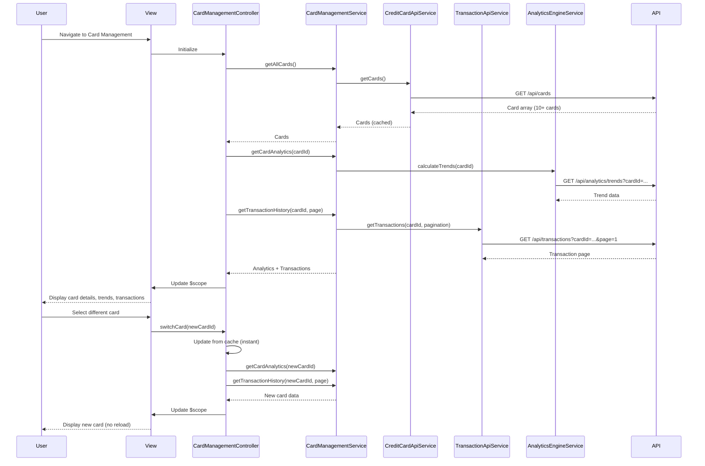

# Low-Level Design: QE-4053 - Analytics1-Multi-Card Management and Transaction Tracking

## a. Architecture Mapping

**HLD Component → AngularJS Artifact Mapping:**

- Multi-Card UI → CardManagementController + cardManagement.html view
- Card Management Service → CardManagementService (orchestration layer)
- Credit Card Data Service integration → CreditCardApiService (REST API wrapper)
- Transaction Service integration → TransactionApiService (REST API wrapper)
- Analytics Engine integration → AnalyticsEngineService (trend analysis and computations)
- Card switching interface → appCardSelector directive (card switcher component)
- Transaction history display → appTransactionList directive (paginated list component)

**Recommended Folder Structure:**
```
app/
  cardManagement/
    cardManagement.module.js
    cardManagement.controller.js
    cardManagement.service.js
    cardManagement.routes.js
    views/cardManagement.html
  shared/
    services/
      creditCardApi.service.js
      transactionApi.service.js
      analyticsEngine.service.js
    directives/
      cardSelector.directive.js
      transactionList.directive.js
```

## b. Component Specifications

| Name | Artifact Type | Responsibility | Key Dependencies |
|------|---------------|----------------|------------------|
| CardManagementController | Controller | Manages multi-card state, handles card selection, coordinates transaction history display | CardManagementService, $scope |
| CardManagementService | Service | Orchestrates card data retrieval, transaction fetching, trend analysis; caches card data for instant switching | CreditCardApiService, TransactionApiService, AnalyticsEngineService |
| CreditCardApiService | Service | Fetches card information, details, and metadata from Credit Card Data Service API | $http |
| TransactionApiService | Service | Retrieves transaction records and history in chronological order from Transaction Service API | $http |
| AnalyticsEngineService | Service | Computes monthly spend trends and card-wise spend analysis | None (pure computation) |
| appCardSelector | Directive | Renders card switcher UI, handles card selection events, updates controller state | None |
| appTransactionList | Directive | Displays paginated transaction history (20-50 per page), supports chronological sorting | None |
| cardManagement.html | View | Displays card selector, card-specific metrics, monthly spend trends chart, transaction history list | Bootstrap, appCardSelector, appTransactionList |

## c. Data Model

```js
CreditCard = {
  cardId: String,
  cardNumber: String,
  cardType: String,
  cardHolderName: String,
  expiryDate: String,
  creditLimit: Number,
  currentBalance: Number,
  availableCredit: Number
}

Transaction = {
  transactionId: String,
  cardId: String,
  amount: Number,
  merchant: String,
  category: String,
  date: Date,
  status: String,
  description: String
}

MonthlyTrend = {
  month: String,
  year: Number,
  totalSpend: Number,
  transactionCount: Number
}

CardAnalytics = {
  cardId: String,
  monthlyTrends: Array<MonthlyTrend>,
  totalSpend: Number,
  averageMonthlySpend: Number
}
```

## d. Data Flow

User navigates to the card management view, triggering CardManagementController initialization. The controller invokes CardManagementService.getAllCards(), which calls CreditCardApiService.getCards() to fetch all user credit cards (minimum 10 supported). The service caches card data in a factory singleton for instant switching. The controller displays the first card by default and calls CardManagementService.getCardAnalytics(cardId) and CardManagementService.getTransactionHistory(cardId, page=1). These methods invoke AnalyticsEngineService.calculateTrends() and TransactionApiService.getTransactions(cardId, pagination) respectively. The aggregated CardAnalytics and paginated Transaction array are returned to the controller, which updates $scope.selectedCard, $scope.analytics, and $scope.transactions. The view renders card-specific metrics, monthly spend trends chart, and transaction history list. When the user clicks a different card in the appCardSelector directive, the directive emits a card-selected event, the controller updates $scope.selectedCard from cached data (no API call), and re-fetches analytics and transactions for the new card, achieving instantaneous card switching with no page reload.

## e. Primary Sequence Diagram



## f. Implementation Notes

- Use constructor injection with $inject array for all services and controllers (minification-safe)
- API calls centralized in CreditCardApiService and TransactionApiService; controller never calls $http directly
- Leverage ES6 const/let, arrow functions, and template literals with Babel transpilation
- Implement CardManagementService as factory (singleton) to cache card data for instant switching without page reload
- Use ui-router state management for card selection; appTransactionList directive handles pagination logic with ng-click for page navigation

## g. Error Handling

HTTP interceptor captures API errors, displays user-friendly notifications, and returns rejected promises; service methods validate pagination parameters before API calls.

## h. Security Notes

Standard input validation and secure API calls assumed; authentication token passed via $http interceptor for all API requests.