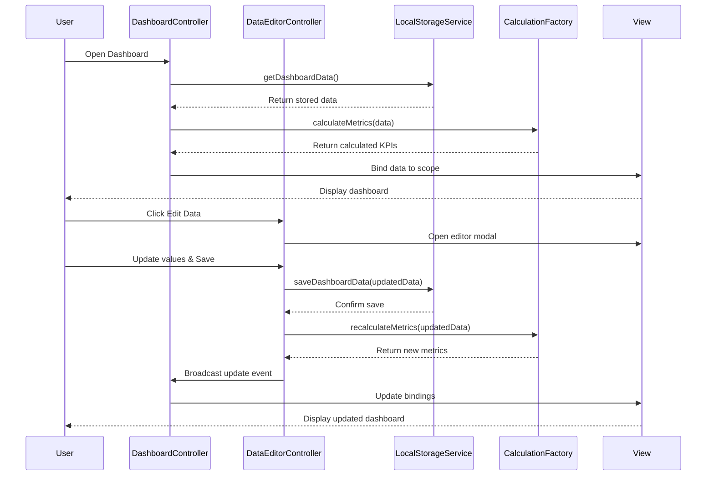

# Low-Level Design: Executive Testing Summary Dashboard
**Epic ID:** QE-4057

## a. Architecture Mapping

- **Dashboard Module** (`app.dashboard`) → AngularJS Module containing all dashboard components
- **Dashboard Controller** (`DashboardController`) → Manages dashboard state, KPI display, and user interactions
- **KPI Service** (`KpiService`) → Handles KPI calculations and data transformations
- **Testing Scope Service** (`TestingScopeService`) → Manages 12 testing types data and progress tracking
- **Data Editor Controller** (`DataEditorController`) → Manages data editing interface and validation
- **Storage Service** (`LocalStorageService`) → Handles browser local storage operations
- **Calculation Factory** (`CalculationFactory`) → Performs automatic percentage and progress calculations

**Recommended Folder Structure:**
```
app/
├── modules/dashboard/
│   ├── controllers/
│   ├── services/
│   ├── directives/
│   ├── views/
│   └── dashboard.module.js
├── shared/services/
└── assets/css/
```

## b. Component Specifications

| Name | Artifact Type | Responsibility | Key Dependencies |
|------|---------------|----------------|------------------|
| DashboardController | Controller | Orchestrates dashboard display, coordinates KPI and testing scope modules | KpiService, TestingScopeService, LocalStorageService |
| KpiService | Service | Fetches and calculates executive KPIs, provides data to views | LocalStorageService, CalculationFactory |
| TestingScopeService | Service | Manages 12 testing types data, agent progress, workflow/APB flow completion | LocalStorageService, CalculationFactory |
| DataEditorController | Controller | Handles data editor UI, validates input, triggers recalculations | LocalStorageService, KpiService, TestingScopeService |
| LocalStorageService | Service | Abstracts browser local storage CRUD operations, handles serialization | $window.localStorage |
| CalculationFactory | Factory | Provides reusable calculation methods for percentages and progress | None |
| ProgressBarDirective | Directive | Renders visual progress bars with dynamic width and color | None |
| StatusGroupDirective | Directive | Displays grouped status visualization for testing types | None |

## c. Data Model

```javascript
// Executive KPIs
const ExecutiveKPIs = {
  totalUseCases: Number,
  readyUseCases: Number,
  agentsInProgress: Number,
  workflowsCompleted: Number,
  apbFlowsCompleted: Number,
  agentificationETA: String,
  overallCompletionPercentage: Number
};

// Testing Type
const TestingType = {
  id: String,
  name: String,
  status: String, // 'Not Started', 'In Progress', 'Completed'
  progress: Number, // 0-100
  useCasesCount: Number,
  readyCount: Number
};

// Dashboard Data
const DashboardData = {
  kpis: ExecutiveKPIs,
  testingTypes: Array<TestingType>, // 12 testing types
  lastUpdated: Date
};
```

## d. Data Flow

User opens dashboard → DashboardController initializes and calls KpiService and TestingScopeService → Services retrieve data from LocalStorageService (browser storage) → CalculationFactory computes percentages and progress metrics → Controller binds data to view models → AngularJS renders KPI tiles, progress bars, and status groups → User clicks Data Editor → DataEditorController opens modal with editable fields → User updates values and saves → DataEditorController validates input, calls services to update storage → CalculationFactory recalculates derived metrics → View updates automatically via two-way binding.

## e. Primary Sequence Diagram



## f. Implementation Notes

- Use AngularJS 1.x module pattern with dependency injection for all services and controllers
- Implement LocalStorageService as singleton with JSON serialization/deserialization for complex objects
- Use $scope.$watch for reactive updates when data changes in Data Editor
- Leverage ng-repeat with track by for efficient rendering of 12 testing type tiles
- Apply ES6 arrow functions and const/let in services for cleaner code

## g. Error Handling

Use try/catch blocks in LocalStorageService for storage quota errors with user notification via AngularJS toast/alert service; validate all numeric inputs in DataEditorController before saving.

## h. Security Notes

Standard input validation and secure API calls assumed; access control managed at deployment/hosting level as authentication is out of scope for initial release.