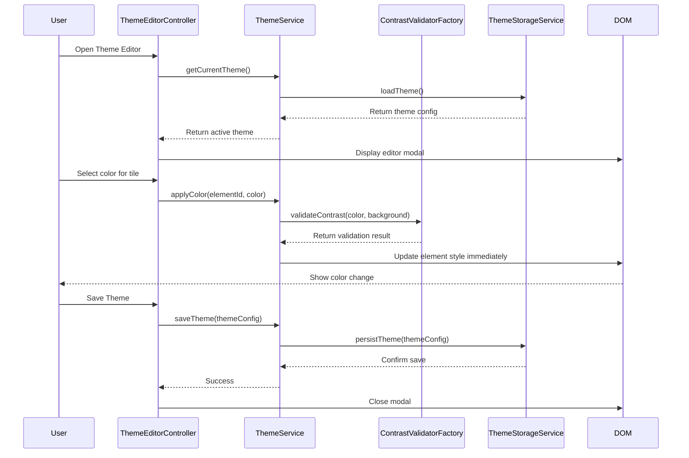

# Low-Level Design: Theme Customization System
**Epic ID:** QE-4058

## a. Architecture Mapping

- **Theme Module** (`app.theme`) → AngularJS Module for theme customization functionality
- **Theme Editor Controller** (`ThemeEditorController`) → Manages theme editor UI and user interactions
- **Theme Service** (`ThemeService`) → Handles theme application, validation, and CRUD operations
- **Color Picker Directive** (`colorPickerDirective`) → Provides color selection interface for individual elements
- **Theme Storage Service** (`ThemeStorageService`) → Persists theme preferences to browser local storage
- **Contrast Validator Factory** (`ContrastValidatorFactory`) → Validates WCAG 2.1 contrast ratios for accessibility

**Recommended Folder Structure:**
```
app/
├── modules/theme/
│   ├── controllers/
│   ├── services/
│   ├── directives/
│   ├── views/
│   └── theme.module.js
├── shared/services/
└── assets/css/
```

## b. Component Specifications

| Name | Artifact Type | Responsibility | Key Dependencies |
|------|---------------|----------------|------------------|
| ThemeEditorController | Controller | Manages theme editor modal, handles color selection events, triggers save/reset | ThemeService, ThemeStorageService |
| ThemeService | Service | Applies theme changes to DOM elements, manages active theme state, validates colors | ThemeStorageService, ContrastValidatorFactory |
| ThemeStorageService | Service | Persists and retrieves theme data from browser local storage | $window.localStorage |
| colorPickerDirective | Directive | Renders color picker UI, emits color change events | None |
| ContrastValidatorFactory | Factory | Calculates contrast ratios, validates WCAG 2.1 AA compliance | None |
| bulkColorApplicatorDirective | Directive | Provides UI for applying colors to multiple tiles simultaneously | ThemeService |

## c. Data Model

```javascript
// Theme Configuration
const ThemeConfig = {
  id: String,
  name: String,
  dashboardBackground: String, // Hex color
  tiles: Object, // Key: tileId, Value: color hex
  statusGroups: {
    notStarted: String,
    inProgress: String,
    completed: String
  },
  indicators: {
    progress: String,
    warning: String,
    success: String
  },
  createdAt: Date,
  isDefault: Boolean
};

// Active Theme State
const ActiveTheme = {
  current: ThemeConfig,
  modified: Boolean
};
```

## d. Data Flow

User clicks Theme Editor button → ThemeEditorController opens modal and loads current theme from ThemeService → ThemeService retrieves active theme from ThemeStorageService → User selects element to customize (tile, background, status group) → colorPickerDirective displays color picker → User selects color → ThemeEditorController receives color change event → ThemeService applies color immediately to DOM using Angular's $element manipulation → ContrastValidatorFactory validates contrast ratio and warns if below WCAG AA threshold → User saves theme → ThemeStorageService persists theme to browser local storage → View updates reflect saved theme across all dashboard elements.

## e. Primary Sequence Diagram



## f. Implementation Notes

- Use AngularJS directive with isolated scope for colorPickerDirective to ensure reusability across multiple elements
- Implement ThemeService with immediate DOM manipulation using angular.element() for real-time preview without page reload
- Store theme as JSON string in localStorage with key 'dashboard.theme.active'
- Use ng-style directive for dynamic color binding to dashboard elements
- Implement ContrastValidatorFactory using WCAG 2.1 formula: (L1 + 0.05) / (L2 + 0.05) where L is relative luminance

## g. Error Handling

Use try/catch in ThemeStorageService for localStorage quota errors with fallback to default theme; validate hex color format using regex before applying to DOM.

## h. Security Notes

Standard input validation and secure API calls assumed; sanitize color input to prevent CSS injection attacks using AngularJS $sanitize service.