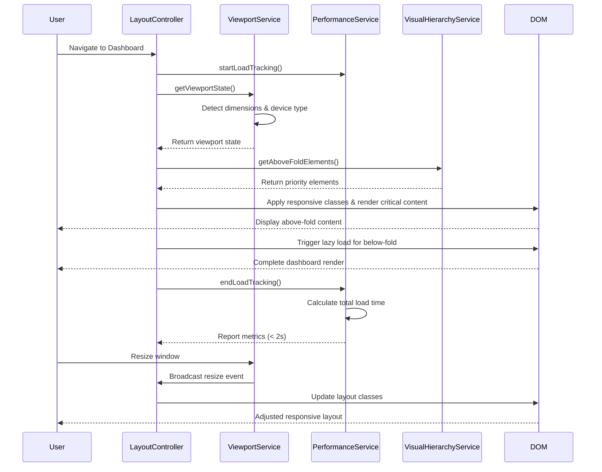

# Low-Level Design: Dashboard Optimization for Presentation
**Epic ID:** QE-4059

## a. Architecture Mapping

- **Responsive Layout Module** (`app.layout`) → AngularJS Module managing responsive design logic
- **Layout Controller** (`LayoutController`) → Detects device type and adjusts layout accordingly
- **Viewport Service** (`ViewportService`) → Monitors viewport dimensions and orientation changes
- **Performance Service** (`PerformanceService`) → Tracks and optimizes load time metrics
- **Lazy Load Directive** (`lazyLoadDirective`) → Defers loading of non-critical visual components
- **Visual Hierarchy Service** (`VisualHierarchyService`) → Manages information priority and visibility

**Recommended Folder Structure:**
```
app/
├── modules/layout/
│   ├── controllers/
│   ├── services/
│   ├── directives/
│   └── layout.module.js
├── shared/services/
└── assets/
    ├── css/responsive/
    └── js/
```

## b. Component Specifications

| Name | Artifact Type | Responsibility | Key Dependencies |
|------|---------------|----------------|------------------|
| LayoutController | Controller | Detects device type, applies responsive layout classes, manages viewport state | ViewportService, VisualHierarchyService |
| ViewportService | Service | Monitors window resize events, provides breakpoint detection (desktop/tablet/presentation) | $window |
| PerformanceService | Service | Measures load time, implements lazy loading strategy, tracks performance metrics | $timeout |
| lazyLoadDirective | Directive | Defers rendering of below-fold content until viewport proximity | ViewportService |
| VisualHierarchyService | Service | Determines element visibility priority, manages fold-above content | None |
| responsiveGridDirective | Directive | Applies CSS Grid layout with breakpoint-specific column configurations | ViewportService |

## c. Data Model

```javascript
// Viewport State
const ViewportState = {
  width: Number,
  height: Number,
  deviceType: String, // 'desktop', 'tablet', 'presentation'
  orientation: String, // 'portrait', 'landscape'
  breakpoint: String // 'sm', 'md', 'lg', 'xl'
};

// Performance Metrics
const PerformanceMetrics = {
  loadStartTime: Number,
  domContentLoadedTime: Number,
  totalLoadTime: Number,
  renderTime: Number,
  targetLoadTime: Number // 2000ms
};

// Visual Element Priority
const ElementPriority = {
  elementId: String,
  priority: Number, // 1 (highest) to 5 (lowest)
  visibleAboveFold: Boolean
};
```

## d. Data Flow

User navigates to dashboard → LayoutController initializes and calls ViewportService to detect device type and dimensions → ViewportService determines breakpoint (desktop: >1200px, tablet: 768-1199px, presentation: >1920px) → LayoutController applies responsive CSS classes to root element → PerformanceService starts load time tracking → VisualHierarchyService identifies above-fold critical content (KPIs, top 6 testing types) → lazyLoadDirective defers rendering of below-fold elements → Dashboard renders with optimized layout → PerformanceService measures total load time and logs if exceeds 2 seconds → ViewportService listens for window resize events → On resize, LayoutController re-evaluates breakpoint and adjusts layout without page reload.

## e. Primary Sequence Diagram



## f. Implementation Notes

- Use CSS Grid with media queries for breakpoints: @media (min-width: 768px), (min-width: 1200px), (min-width: 1920px)
- Implement ViewportService using $window.addEventListener('resize') with debounce (250ms) to prevent excessive recalculations
- Use AngularJS $timeout service in PerformanceService to measure load time from controller initialization to view render complete
- Apply ng-if with lazyLoadDirective for below-fold content to prevent initial DOM bloat
- Leverage CSS Flexbox for tile arrangement within grid cells for flexible content flow

## g. Error Handling

Use try/catch in ViewportService for window object access errors; log performance metrics exceeding 2s threshold to console for debugging without blocking user experience.

## h. Security Notes

Standard input validation and secure API calls assumed; no additional security considerations for responsive layout implementation.