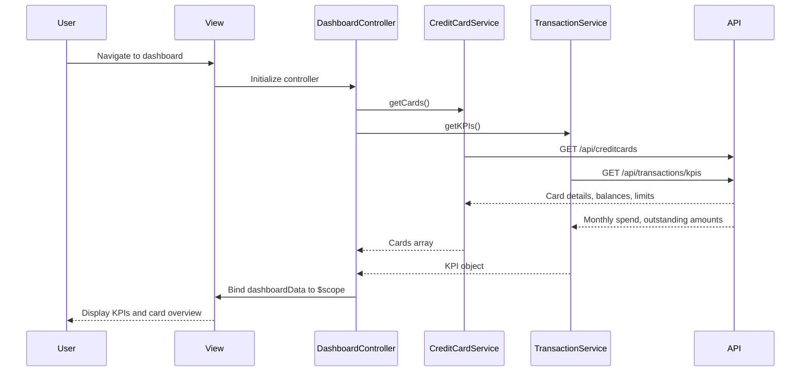

# Low-Level Design: QE-4060 - Dashboard KPIs and Credit Card Overview

## a. Architecture Mapping

**HLD Component → AngularJS Artifact:**
- Dashboard UI Component → DashboardController + dashboard.html view
- Credit Card Data Service → CreditCardService (Factory)
- Transaction Service → TransactionService (Factory)
- API Gateway → $http interceptor for auth/error handling
- Responsive Layout → Bootstrap grid + custom directives for card display

**Folder Structure:**
```
app/
  dashboard/
    dashboard.module.js
    dashboard.controller.js
    dashboard.service.js
    dashboard.routes.js
    views/dashboard.html
  shared/
    services/creditCard.service.js
    services/transaction.service.js
    interceptors/api.interceptor.js
```

## b. Component Specifications

| Name | Artifact Type | Responsibility | Key Dependencies |
|------|---------------|----------------|------------------|
| DashboardModule | Module | Groups dashboard feature components | ui-router |
| DashboardController | Controller | Orchestrates KPI data retrieval and view binding | CreditCardService, TransactionService, $scope |
| CreditCardService | Factory | Fetches card details, balances, limits via REST API | $http, $q |
| TransactionService | Factory | Calculates monthly spend and outstanding amounts via REST API | $http, $q |
| ApiInterceptor | Interceptor | Handles auth tokens and global error responses | $httpProvider |
| appKpiCard | Directive | Reusable KPI display card component | None |
| appCardList | Directive | Renders multiple credit cards in responsive grid | None |

## c. Data Model

```js
CreditCard = {
  id: String,
  cardNumber: String,
  cardType: String,
  creditLimit: Number,
  availableCredit: Number,
  outstandingAmount: Number,
  cardHolderName: String,
  expiryDate: String
}

KPI = {
  monthlySpend: Number,
  totalCreditLimit: Number,
  totalAvailableCredit: Number,
  totalOutstanding: Number
}

DashboardData = {
  kpis: KPI,
  cards: Array<CreditCard>
}
```

## d. Data Flow

User navigates to dashboard → dashboard.html view loads → DashboardController initializes and calls CreditCardService.getCards() and TransactionService.getKPIs() → Services make parallel $http calls to REST APIs via API Gateway → API responses return card details and calculated KPIs → Controller aggregates data into $scope.dashboardData → View binds KPI values to appKpiCard directives and card list to appCardList directive → UI renders responsive layout with Bootstrap grid, completing within 2-second NFR.

## e. Primary Sequence Diagram



## f. Implementation Notes

- DI via constructor injection with `$inject` array annotation for minification safety
- API calls centralized in CreditCardService and TransactionService; controllers never call $http directly
- Use $q.all() to parallelize card and KPI API calls for sub-2-second load time
- Bootstrap responsive grid (col-xs/sm/md/lg) ensures mobile/tablet/desktop viewport support
- WCAG 2.1 compliance via semantic HTML5, ARIA labels on KPI cards, and keyboard navigation support

## g. Error Handling

Centralized $http interceptor catches API failures; user-facing errors surfaced via shared NotificationService displaying toast messages.

## h. Security Notes

Requires token-based auth via existing SSO; API interceptor injects bearer token in request headers for secure API calls.