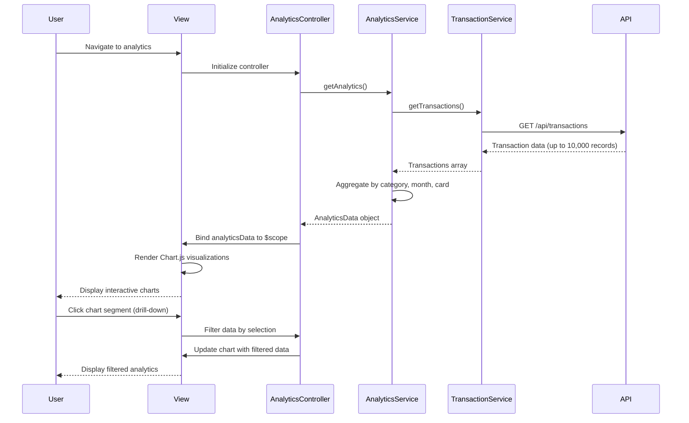

# Low-Level Design: QE-4061 - Spending Analytics and Visualization

## a. Architecture Mapping

**HLD Component → AngularJS Artifact:**
- Analytics UI Component → AnalyticsController + analytics.html view
- Transaction Service → TransactionService (Factory)
- Category Classification Service → CategoryService (Factory)
- Data Analytics Engine → AnalyticsService (Factory)
- Interactive charting library → Chart.js wrapped in appChart directive

**Folder Structure:**
```
app/
  analytics/
    analytics.module.js
    analytics.controller.js
    analytics.service.js
    analytics.routes.js
    views/analytics.html
  shared/
    services/transaction.service.js
    services/category.service.js
    directives/chart.directive.js
```

## b. Component Specifications

| Name | Artifact Type | Responsibility | Key Dependencies |
|------|---------------|----------------|------------------|
| AnalyticsModule | Module | Groups analytics feature components | ui-router, chart.js |
| AnalyticsController | Controller | Orchestrates analytics data retrieval and chart rendering | AnalyticsService, TransactionService, CategoryService, $scope |
| AnalyticsService | Factory | Aggregates transaction data, computes trends and category breakdowns | $http, $q |
| TransactionService | Factory | Retrieves raw transaction data for analysis via REST API | $http, $q |
| CategoryService | Factory | Provides category classification and mapping for 9 categories | $http |
| appChart | Directive | Renders interactive Chart.js visualizations with drill-down | Chart.js |
| appCategoryFilter | Directive | Provides UI controls for filtering by category, card, date range | None |

## c. Data Model

```js
Transaction = {
  id: String,
  cardId: String,
  merchant: String,
  amount: Number,
  date: String,
  category: String
}

CategorySpend = {
  category: String,
  amount: Number,
  percentage: Number
}

MonthlyTrend = {
  month: String,
  totalSpend: Number
}

CardSpend = {
  cardId: String,
  cardType: String,
  totalSpend: Number
}

AnalyticsData = {
  categoryBreakdown: Array<CategorySpend>,
  monthlyTrends: Array<MonthlyTrend>,
  cardWiseSpend: Array<CardSpend>,
  categories: Array<String>
}

Categories = ["Food & Dining", "Fuel", "Shopping", "Travel", "Entertainment", "Utilities", "Healthcare", "Education", "Miscellaneous"]
```

## d. Data Flow

User navigates to analytics page → analytics.html view loads → AnalyticsController initializes and calls AnalyticsService.getAnalytics() → AnalyticsService internally calls TransactionService.getTransactions() to fetch raw transaction data → CategoryService classifies transactions into 9 predefined categories → AnalyticsService aggregates data into category breakdowns, monthly trends, and card-wise spend → Controller binds analytics data to $scope.analyticsData → appChart directives render interactive Chart.js visualizations (pie chart for categories, line chart for trends, bar chart for card comparison) → User interacts with charts via drill-down, triggering controller methods to filter and re-render data, completing within 1.5-second NFR.

## e. Primary Sequence Diagram



## f. Implementation Notes

- DI via constructor injection with `$inject` array annotation for minification safety
- Server-side aggregation via AnalyticsService API endpoint reduces client-side processing for 10,000+ transactions
- Chart.js integrated via appChart directive with two-way data binding for drill-down interactivity
- Use $q promises for async transaction retrieval and category classification
- Client-side caching of analytics data in AnalyticsService factory (singleton) to avoid redundant API calls on filter changes

## g. Error Handling

Centralized $http interceptor catches API failures; user-facing errors surfaced via shared NotificationService displaying toast messages.

## h. Security Notes

Standard input validation and secure API calls assumed; token-based auth via existing SSO.