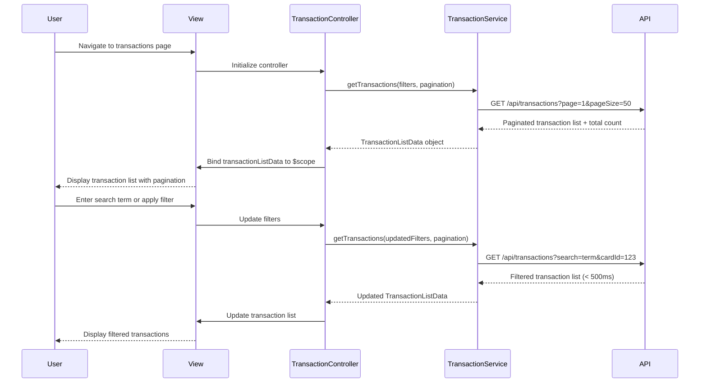

# Low-Level Design: QE-4062 - Transaction Management and Display

## a. Architecture Mapping

**HLD Component → AngularJS Artifact:**
- Transaction UI Component → TransactionController + transactions.html view
- Transaction Service → TransactionService (Factory)
- Credit Card Data Service → CreditCardService (Factory)
- Category Classification Service → CategoryService (Factory)
- Pagination component → appPagination directive
- Search/Filter component → appTransactionFilter directive

**Folder Structure:**
```
app/
  transactions/
    transactions.module.js
    transactions.controller.js
    transactions.service.js
    transactions.routes.js
    views/transactions.html
  shared/
    services/creditCard.service.js
    services/category.service.js
    directives/pagination.directive.js
    directives/transactionFilter.directive.js
```

## b. Component Specifications

| Name | Artifact Type | Responsibility | Key Dependencies |
|------|---------------|----------------|------------------|
| TransactionsModule | Module | Groups transaction management feature components | ui-router |
| TransactionController | Controller | Orchestrates transaction retrieval, search, filter, sort, and pagination | TransactionService, CreditCardService, CategoryService, $scope |
| TransactionService | Factory | Fetches transaction data with search/filter/pagination via REST API | $http, $q |
| CreditCardService | Factory | Links transactions to specific credit cards | $http |
| CategoryService | Factory | Provides transaction categorization | $http |
| appPagination | Directive | Handles pagination controls and page navigation | None |
| appTransactionFilter | Directive | Provides UI controls for filtering by date range, card, category | None |
| appTransactionRow | Directive | Renders individual transaction row with merchant, amount, date, category | None |

## c. Data Model

```js
Transaction = {
  id: String,
  cardId: String,
  merchant: String,
  amount: Number,
  date: String,
  category: String,
  description: String
}

TransactionFilter = {
  cardId: String,
  category: String,
  startDate: String,
  endDate: String,
  searchTerm: String
}

PaginationParams = {
  page: Number,
  pageSize: Number,
  totalCount: Number
}

TransactionListData = {
  transactions: Array<Transaction>,
  pagination: PaginationParams,
  filters: TransactionFilter
}
```

## d. Data Flow

User navigates to transactions page → transactions.html view loads → TransactionController initializes with default pagination (page 1, pageSize 50) and calls TransactionService.getTransactions(filters, pagination) → Service makes $http GET request to /api/transactions with query params for filters and pagination → API returns paginated transaction list with total count → Controller binds data to $scope.transactionListData → View renders transaction rows via appTransactionRow directive and pagination controls via appPagination directive → User applies filters or search term via appTransactionFilter directive → Controller updates filters and calls TransactionService.getTransactions() with new params → API returns filtered results within 500ms → View updates transaction list, completing within 2-second NFR for up to 1,000 transactions.

## e. Primary Sequence Diagram



## f. Implementation Notes

- DI via constructor injection with `$inject` array annotation for minification safety
- Cursor-based pagination implemented in TransactionService for efficient handling of large transaction sets
- API calls include query params for filters (cardId, category, dateRange, searchTerm) and pagination (page, pageSize)
- Database indexing on transaction date, cardId, and merchant fields ensures sub-500ms search response
- Use $timeout debouncing (300ms) on search input to reduce API calls during typing

## g. Error Handling

Centralized $http interceptor catches API failures; user-facing errors surfaced via shared NotificationService displaying toast messages.

## h. Security Notes

Standard input validation and secure API calls assumed; token-based auth via existing SSO.