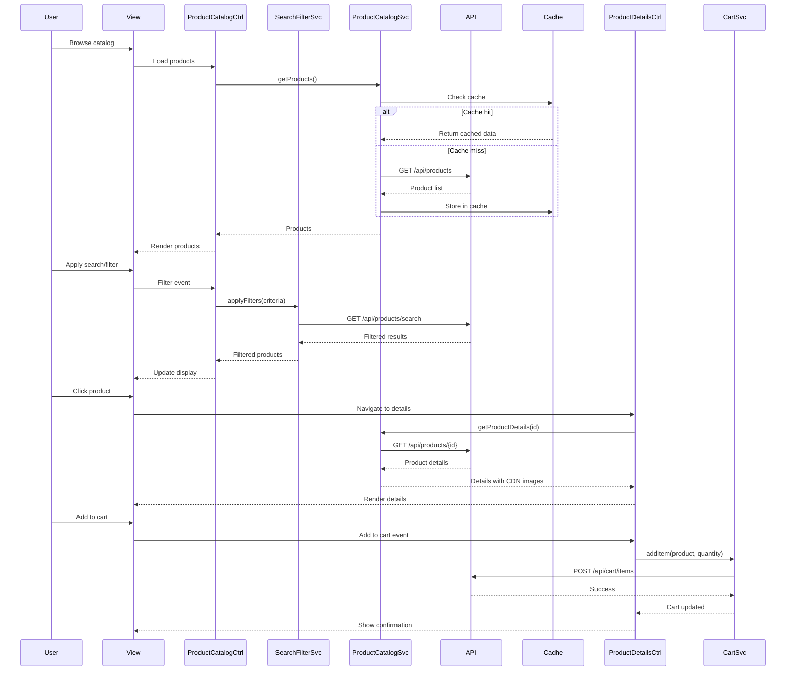

# Low-Level Design: Consumer Shopping Journey

## Epic ID: QE-4069

---

## a. Architecture Mapping

- **Product Catalog Service** → AngularJS Module: `productCatalog`, Controller: `ProductCatalogController`, Service: `ProductCatalogService`
- **Search & Filter Engine** → Service: `SearchFilterService`, Directive: `searchFilterDirective`
- **Product Details Service** → Controller: `ProductDetailsController`, Service: `ProductDetailsService`
- **Shopping Cart Service** → Controller: `ShoppingCartController`, Service: `CartService`, Factory: `CartFactory`
- **Wishlist Service** → Controller: `WishlistController`, Service: `WishlistService`
- **Reviews & Ratings Service** → Controller: `ReviewsController`, Service: `ReviewsService`, Directive: `ratingStarsDirective`
- **Authentication Service** → Service: `AuthService`, Factory: `AuthInterceptor`

**Recommended Folder Structure:**
```
app/
├── modules/
│   ├── catalog/
│   ├── cart/
│   ├── wishlist/
│   └── reviews/
├── services/
├── controllers/
├── directives/
├── factories/
└── config/
```

---

## b. Component Specifications

| Component Name | Artifact Type | Responsibility | Key Dependencies |
|----------------|---------------|----------------|------------------|
| ProductCatalogController | Controller | Manages product listing display, pagination, and user interactions | ProductCatalogService, SearchFilterService, $scope |
| ProductCatalogService | Service | Fetches product data from REST API, handles caching | $http, $q, CacheService |
| SearchFilterService | Service | Processes search queries, applies filters and sorting | $http, $filter |
| searchFilterDirective | Directive | Renders search/filter UI component with two-way binding | SearchFilterService |
| ProductDetailsController | Controller | Displays detailed product view with images, reviews, and actions | ProductDetailsService, CartService, WishlistService, ReviewsService |
| ProductDetailsService | Service | Retrieves product details including images from CDN | $http, CDN_CONFIG |
| ShoppingCartController | Controller | Manages cart UI, item updates, and checkout navigation | CartService, CartFactory |
| CartService | Service | Handles cart CRUD operations via REST API | $http, $localStorage |
| CartFactory | Factory | Provides cart state management and business logic | $rootScope |
| WishlistController | Controller | Manages wishlist display and item operations | WishlistService |
| WishlistService | Service | Performs wishlist CRUD via REST API | $http, AuthService |
| ReviewsController | Controller | Handles review submission and display | ReviewsService |
| ReviewsService | Service | Fetches and submits reviews/ratings via REST API | $http, AuthService |
| ratingStarsDirective | Directive | Renders interactive star rating component | none |
| AuthService | Service | Manages user authentication state and token | $http, $localStorage, $window |
| AuthInterceptor | Factory | Intercepts HTTP requests to attach auth tokens | AuthService, $q |

---

## c. Data Model

**Product Model:**
```javascript
{
  id: Number,
  name: String,
  description: String,
  price: Number,
  currency: String,
  images: Array<String>,
  category: String,
  stock: Number,
  averageRating: Number,
  reviewCount: Number
}
```

**CartItem Model:**
```javascript
{
  productId: Number,
  quantity: Number,
  price: Number,
  productName: String,
  imageUrl: String
}
```

**WishlistItem Model:**
```javascript
{
  productId: Number,
  addedDate: Date,
  productName: String,
  price: Number
}
```

**Review Model:**
```javascript
{
  id: Number,
  productId: Number,
  userId: Number,
  rating: Number,
  comment: String,
  createdDate: Date
}
```

---

## d. Data Flow

User navigates to product catalog where ProductCatalogController loads data via ProductCatalogService from REST API (cached for performance). User applies search/filters through searchFilterDirective which invokes SearchFilterService to query the search index and update the view. Clicking a product navigates to ProductDetailsController which fetches detailed data including CDN-hosted images via ProductDetailsService. User adds item to cart triggering CartService to persist via REST API and update CartFactory state, or adds to wishlist via WishlistService. User submits review through ReviewsController which posts to ReviewsService REST endpoint. All services use AuthInterceptor to attach tokens, and responses update controllers via $scope to refresh the UI.

---

## e. Primary Sequence Diagram



---

## f. Implementation Notes

- Use AngularJS dependency injection for all services, controllers, and factories; register components via module.config() and module.run()
- Implement $http interceptor (AuthInterceptor) to attach bearer tokens to all API requests and handle 401 responses
- Leverage $localStorage for cart persistence across sessions and $sessionStorage for anonymous cart with 24-hour expiry
- Use ng-repeat with track by for product lists to optimize rendering; implement lazy loading with infinite scroll directive
- Apply ES6 classes for services and controllers where possible; use arrow functions for callbacks to preserve context

---

## g. Error Handling

HTTP interceptor captures API errors (4xx/5xx), displays user-friendly notifications via toastr/notification service, and logs errors to console for debugging.

---

## h. Security Notes

Requires token-based auth via existing SSO; all API calls secured with bearer tokens attached by AuthInterceptor.