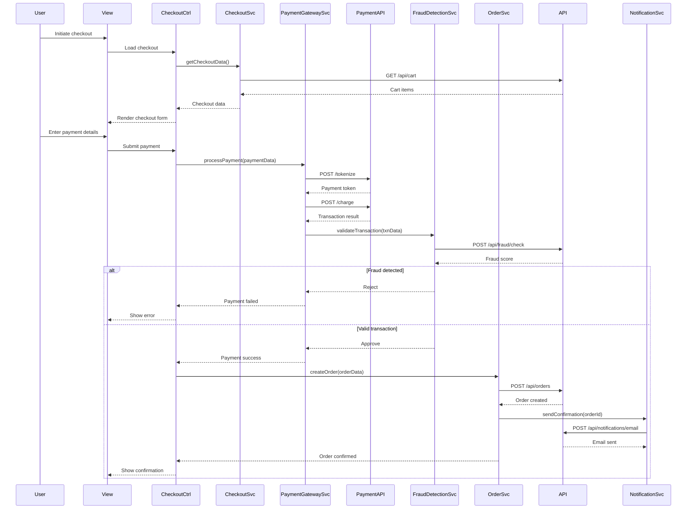

# Low-Level Design: Secure Transaction Processing and Order Management

## Epic ID: QE-4070

---

## a. Architecture Mapping

- **Checkout Service** → AngularJS Module: `checkout`, Controller: `CheckoutController`, Service: `CheckoutService`
- **Payment Gateway Integration** → Service: `PaymentGatewayService`, Factory: `PaymentFactory`
- **Payment Validation Service** → Service: `PaymentValidationService`
- **Order Processing Service** → Controller: `OrderController`, Service: `OrderService`
- **Order Tracking Service** → Controller: `OrderTrackingController`, Service: `OrderTrackingService`
- **Notification Service** → Service: `NotificationService`, Factory: `NotificationFactory`
- **Refund Processing Service** → Service: `RefundService`
- **Fraud Detection Service** → Service: `FraudDetectionService`

**Recommended Folder Structure:**
```
app/
├── modules/
│   ├── checkout/
│   ├── orders/
│   └── payment/
├── services/
├── controllers/
├── factories/
└── config/
```

---

## b. Component Specifications

| Component Name | Artifact Type | Responsibility | Key Dependencies |
|----------------|---------------|----------------|------------------|
| CheckoutController | Controller | Manages checkout flow UI, payment method selection, and form validation | CheckoutService, PaymentGatewayService, CartService, $scope |
| CheckoutService | Service | Orchestrates checkout process, validates cart, calculates totals | $http, CartService, $q |
| PaymentGatewayService | Service | Integrates with third-party payment APIs (Stripe, PayPal) | $http, PaymentFactory, PAYMENT_CONFIG |
| PaymentFactory | Factory | Tokenizes payment data, manages payment state | $window |
| PaymentValidationService | Service | Validates payment details client-side before submission | none |
| OrderController | Controller | Displays order confirmation and manages order actions | OrderService, NotificationService |
| OrderService | Service | Creates orders, submits to REST API, handles order lifecycle | $http, $q, AuthService |
| OrderTrackingController | Controller | Displays order status, tracking info, and history | OrderTrackingService, $interval |
| OrderTrackingService | Service | Fetches order status from REST API and logistics providers | $http, $interval |
| NotificationService | Service | Sends email/SMS notifications via backend API | $http |
| NotificationFactory | Factory | Manages in-app notification state and display | $rootScope |
| RefundService | Service | Initiates refund requests via payment gateway API | $http, PaymentGatewayService |
| FraudDetectionService | Service | Validates transactions against fraud rules, flags suspicious activity | $http |

---

## c. Data Model

**Order Model:**
```javascript
{
  orderId: String,
  userId: Number,
  items: Array<CartItem>,
  totalAmount: Number,
  currency: String,
  paymentMethod: String,
  paymentStatus: String,
  orderStatus: String,
  shippingAddress: Object,
  trackingNumber: String,
  createdDate: Date,
  updatedDate: Date
}
```

**Payment Model:**
```javascript
{
  paymentId: String,
  orderId: String,
  amount: Number,
  currency: String,
  paymentMethod: String,
  token: String,
  status: String,
  transactionId: String,
  timestamp: Date
}
```

**Refund Model:**
```javascript
{
  refundId: String,
  orderId: String,
  amount: Number,
  reason: String,
  status: String,
  initiatedDate: Date,
  completedDate: Date
}
```

**TrackingInfo Model:**
```javascript
{
  orderId: String,
  trackingNumber: String,
  carrier: String,
  status: String,
  estimatedDelivery: Date,
  events: Array<{timestamp: Date, status: String, location: String}>
}
```

---

## d. Data Flow

User initiates checkout from cart where CheckoutController loads cart summary via CheckoutService. User selects payment method and enters details; PaymentValidationService validates input client-side. CheckoutController invokes PaymentGatewayService which tokenizes card data via PaymentFactory and submits to third-party gateway API. Gateway response flows to PaymentValidationService and FraudDetectionService for risk assessment. Upon approval, OrderService creates order via POST to REST API which persists to database and triggers NotificationService to send confirmation email/SMS. User navigates to OrderTrackingController which polls OrderTrackingService at intervals to fetch status updates from logistics API. For cancellations, user triggers RefundService which posts refund request to payment gateway and updates order status via OrderService. All status changes trigger notifications through NotificationFactory for real-time UI updates.

---

## e. Primary Sequence Diagram



---

## f. Implementation Notes

- Use AngularJS $http interceptor to encrypt sensitive payment data before transmission; implement HTTPS-only policy in app config
- Integrate payment gateway SDK (e.g., Stripe.js) via PaymentFactory; tokenize card data client-side to avoid PCI scope
- Implement $interval in OrderTrackingService for polling logistics API every 30 seconds; use WebSocket for real-time updates if available
- Apply form validation using ng-messages and custom validators for card number, CVV, and expiry date
- Use ES6 Promises ($q) for async payment processing; chain validation → tokenization → charge → order creation

---

## g. Error Handling

HTTP interceptor captures payment/order API errors, displays user-friendly messages via modal dialogs, retries failed requests once, and logs to backend for audit.

---

## h. Security Notes

Requires PCI DSS compliance via tokenization; all transaction data encrypted in transit (TLS 1.2+) and at rest; fraud detection with account lockout after 3 failed attempts.