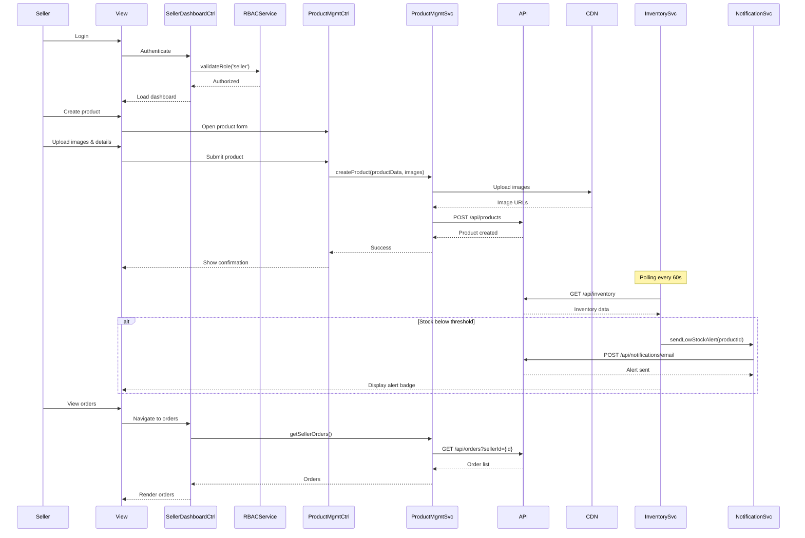

# Low-Level Design: Platform Management for Sellers and Administrators

## Epic ID: QE-4071

---

## a. Architecture Mapping

- **Authentication Service** → Service: `AuthService`, Factory: `AuthInterceptor`
- **Role-Based Access Control** → Service: `RBACService`, Factory: `PermissionFactory`
- **Seller Dashboard** → AngularJS Module: `sellerDashboard`, Controller: `SellerDashboardController`
- **Admin Dashboard** → AngularJS Module: `adminDashboard`, Controller: `AdminDashboardController`
- **Product Management Service** → Controller: `ProductManagementController`, Service: `ProductManagementService`
- **Inventory Management Service** → Controller: `InventoryController`, Service: `InventoryService`, Directive: `inventoryAlertDirective`
- **Order Management Service** → Controller: `OrderManagementController`, Service: `OrderManagementService`
- **Analytics & Reporting Service** → Controller: `AnalyticsController`, Service: `AnalyticsService`, Directive: `chartDirective`
- **User Management Service** → Controller: `UserManagementController`, Service: `UserManagementService`
- **Fraud Detection Service** → Service: `FraudMonitoringService`

**Recommended Folder Structure:**
```
app/
├── modules/
│   ├── seller/
│   ├── admin/
│   └── shared/
├── services/
├── controllers/
├── directives/
├── factories/
└── config/
```

---

## b. Component Specifications

| Component Name | Artifact Type | Responsibility | Key Dependencies |
|----------------|---------------|----------------|------------------|
| AuthService | Service | Manages authentication, stores tokens, validates sessions | $http, $localStorage, $window |
| AuthInterceptor | Factory | Attaches auth tokens to requests, handles 401/403 responses | AuthService, $q, $location |
| RBACService | Service | Validates user permissions based on role (seller/admin) | AuthService, PermissionFactory |
| PermissionFactory | Factory | Defines role-permission mappings and access control logic | none |
| SellerDashboardController | Controller | Displays seller-specific metrics, navigation, and quick actions | AnalyticsService, OrderManagementService, $scope |
| AdminDashboardController | Controller | Displays platform-wide metrics, user stats, and admin tools | AnalyticsService, UserManagementService, FraudMonitoringService |
| ProductManagementController | Controller | Manages product CRUD operations, image uploads, and categorization | ProductManagementService, $scope, FileUploadService |
| ProductManagementService | Service | Handles product API calls, image storage via CDN | $http, CDN_CONFIG |
| InventoryController | Controller | Displays inventory levels, handles stock updates | InventoryService, NotificationService |
| InventoryService | Service | Fetches/updates inventory via REST API, triggers low-stock alerts | $http, $interval |
| inventoryAlertDirective | Directive | Renders low-stock warning badges and notifications | InventoryService |
| OrderManagementController | Controller | Displays seller orders, updates fulfillment status | OrderManagementService |
| OrderManagementService | Service | Fetches seller orders, updates order status via API | $http, AuthService |
| AnalyticsController | Controller | Renders sales/platform analytics with charts and KPIs | AnalyticsService, chartDirective |
| AnalyticsService | Service | Fetches analytics data from REST API, processes metrics | $http, $filter |
| chartDirective | Directive | Renders charts using D3.js or Chart.js library | AnalyticsService |
| UserManagementController | Controller | Manages user accounts, roles, permissions, and disputes | UserManagementService |
| UserManagementService | Service | Performs user CRUD, role assignment, account suspension via API | $http, RBACService |
| FraudMonitoringService | Service | Fetches fraud alerts, flags suspicious accounts | $http, NotificationService |

---

## c. Data Model

**Product Model:**
```javascript
{
  id: Number,
  sellerId: Number,
  name: String,
  description: String,
  price: Number,
  category: String,
  images: Array<String>,
  stock: Number,
  status: String,
  createdDate: Date
}
```

**Inventory Model:**
```javascript
{
  productId: Number,
  currentStock: Number,
  lowStockThreshold: Number,
  lastUpdated: Date,
  alertStatus: Boolean
}
```

**Order Model:**
```javascript
{
  orderId: String,
  sellerId: Number,
  buyerId: Number,
  items: Array<Object>,
  totalAmount: Number,
  status: String,
  fulfillmentStatus: String,
  orderDate: Date
}
```

**User Model:**
```javascript
{
  userId: Number,
  email: String,
  role: String,
  status: String,
  registrationDate: Date,
  lastLogin: Date,
  permissions: Array<String>
}
```

**Analytics Model:**
```javascript
{
  metric: String,
  value: Number,
  period: String,
  timestamp: Date,
  breakdown: Object
}
```

---

## d. Data Flow

Seller/admin authenticates via AuthService which stores token and role. RBACService validates permissions before routing to SellerDashboardController or AdminDashboardController. Seller creates/updates products through ProductManagementController which posts to ProductManagementService; images upload to CDN via FileUploadService. InventoryService polls REST API every 60 seconds; when stock falls below threshold, inventoryAlertDirective displays warning and NotificationService sends email/SMS. Orders flow to OrderManagementController where seller updates fulfillment status via OrderManagementService. AnalyticsController fetches metrics from AnalyticsService which aggregates data from backend; chartDirective renders visualizations. Admin accesses UserManagementController to modify roles/permissions via UserManagementService which validates changes through RBACService. FraudMonitoringService polls fraud detection API and displays alerts in AdminDashboardController. All API calls use AuthInterceptor to attach tokens and handle authorization failures.

---

## e. Primary Sequence Diagram



---

## f. Implementation Notes

- Implement RBAC using AngularJS route resolvers to check permissions before loading seller/admin views; redirect unauthorized users to login
- Use ng-file-upload directive for product image uploads; validate file types (jpg, png) and size (<5MB) client-side before CDN upload
- Apply $interval in InventoryService for 60-second polling; implement WebSocket fallback for real-time inventory updates if available
- Leverage Chart.js or D3.js in chartDirective for analytics visualization; bind data updates via $scope.$watch for reactive charts
- Store user role and permissions in $localStorage after login; validate on every route change using $routeChangeStart event

---

## g. Error Handling

AuthInterceptor captures 401/403 errors, redirects to login, and displays "Access Denied" messages; all other API errors handled via global error service with user notifications.

---

## h. Security Notes

Requires token-based auth with role-based access control; admin actions require elevated permissions validated server-side; all user management operations logged for audit compliance.