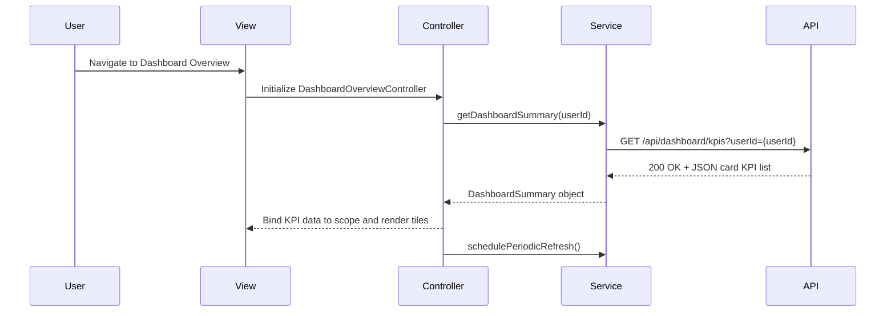

# QE-4084 - DavMetricsTesting1-Dashboard KPIs and Credit Card Overview LLD

## a. Architecture Mapping (brief)
- Dashboard UI Component → `DashboardOverviewController` + `dashboard-overview.html` view, backed by `DashboardKpiService` for KPI retrieval and aggregation.
- KPI Aggregation Engine → `DashboardKpiService` (business logic + REST calls to Credit Card Data Service) and optional `DashboardKpiFactory` for shared cached KPI state.
- User Authentication integration → `AuthService` in `shared/services` + HTTP `AuthInterceptor` for attaching auth tokens on API requests.
- API Gateway integration → REST endpoints consumed via `DashboardKpiService` using `$http`.

Recommended folder structure (short):
- `app/dashboard/`
  - `dashboard.module.js`
  - `dashboard.controller.js`
  - `dashboard.service.js`
  - `dashboard.routes.js`
  - `views/dashboard-overview.html`
- `app/shared/services/auth.service.js`
- `app/shared/interceptors/auth.interceptor.js`

## b. Component Specifications
| Name                     | Artifact Type | Responsibility                                                           | Key Dependencies                      |
|--------------------------|--------------|---------------------------------------------------------------------------|---------------------------------------|
| DashboardOverviewModule  | Module       | Group all dashboard KPI overview artifacts under `app.dashboard`         | `ui.router`, shared `AuthService`     |
| DashboardOverviewController | Controller   | Manage dashboard KPI view state, trigger refresh, and handle user actions | `DashboardKpiService`, `$scope`, `$interval`, `$state` |
| DashboardKpiService      | Service      | Fetch credit card KPI data and aggregate monthly spend, limits, balances | `$http`, API Gateway, Credit Card Data Service |
| DashboardKpiFactory      | Factory      | Maintain shared KPI cache and last refresh timestamp across views        | `DashboardKpiService`                 |
| AuthService              | Service      | Provide user authentication status and token retrieval for API calls     | Auth backend API, `$http`             |
| AuthInterceptor          | Interceptor  | Attach auth tokens and handle 401 responses from KPI API calls           | `$httpProvider`, `AuthService`        |
| dashboard-overview.html  | View (HTML)  | Render responsive KPI tiles for monthly spend, limits, available and outstanding amounts | `DashboardOverviewController`, Bootstrap CSS |

## c. Data Model (brief)
```js
CreditCardKpi = {
  cardId: String,
  cardName: String,
  monthlySpend: Number,
  totalCreditLimit: Number,
  availableCredit: Number,
  outstandingAmount: Number
}

DashboardSummary = {
  userId: String,
  cards: Array<CreditCardKpi>,
  totalMonthlySpend: Number,
  totalCreditLimit: Number,
  totalAvailableCredit: Number,
  totalOutstandingAmount: Number,
  lastRefreshedAt: Date
}
```

## d. Data Flow (one paragraph)
When the user opens the dashboard, `dashboard-overview.html` is loaded via `ui-router` and bound to `DashboardOverviewController`, which on initialization calls `DashboardKpiService.getDashboardSummary()`; the service invokes the API Gateway with an authenticated request to the Credit Card Data Service, receives JSON card KPI data, aggregates totals into a `DashboardSummary` object, stores it in `DashboardKpiFactory` if caching is enabled, and updates the controller scope so the view re-renders responsive KPI tiles, with periodic refresh triggered via `$interval` for near real-time updates.

## e. Primary Sequence Diagram (ONE only)


## f. Implementation Notes (brief)
- Use `DashboardOverviewModule` with `$stateProvider` in `dashboard.routes.js` to register the dashboard route and template.
- Apply `$inject` arrays on controller, services, and factories for DI safety under minification.
- Implement all REST calls in `DashboardKpiService` using `$http` with ES6 `let`/`const` and arrow functions where transpiled.
- Use `DashboardKpiFactory` to cache aggregated KPI data and avoid redundant API calls within the 2-second load constraint.
- Leverage Bootstrap grid classes in `dashboard-overview.html` to ensure responsive KPI layout across desktop, tablet, and mobile.

## g. Error Handling (ONE line)
Errors from KPI API calls are handled in `DashboardKpiService` with basic logging and user-friendly dashboard messages, with simple retry on initial load failures.

## h. Security Notes (ONE line)
All dashboard API interactions require authenticated requests via `AuthInterceptor` using existing user tokens, and no sensitive card data is stored in plain text on the client.
