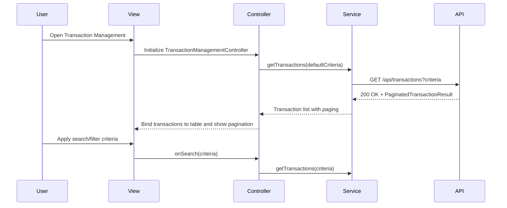

# QE-4085 - DavMetricsTesting1-Transaction Management and Monitoring LLD

## a. Architecture Mapping (brief)
- Transaction UI Component → `TransactionManagementController` + `transaction-management.html` view, backed by `TransactionService` for listing and filtering transactions.
- Search and Filter Engine → Logic implemented in `TransactionService` plus client-side filtering helpers within `TransactionManagementController` for search criteria and pagination.
- Credit Card Data integration → `CreditCardMetaService` to resolve card metadata and link transactions to specific cards.
- API Gateway integration → REST endpoints consumed via `TransactionService` for transaction history and paging.

Recommended folder structure (short):
- `app/transactions/`
  - `transactions.module.js`
  - `transactions.controller.js`
  - `transactions.service.js`
  - `transactions.routes.js`
  - `views/transaction-management.html`
- `app/shared/services/credit-card-meta.service.js`

## b. Component Specifications
| Name                        | Artifact Type | Responsibility                                                           | Key Dependencies                            |
|-----------------------------|--------------|---------------------------------------------------------------------------|---------------------------------------------|
| TransactionsModule          | Module       | Group transaction management artifacts under `app.transactions`          | `ui.router`, `CreditCardMetaService`        |
| TransactionManagementController | Controller   | Manage transaction list state, search/filter criteria, pagination, and card selection | `TransactionService`, `$scope`, `$stateParams` |
| TransactionService          | Service      | Retrieve paginated transaction data for up to 12 months and apply server-side filters | `$http`, Transaction Data Service, API Gateway |
| CreditCardMetaService       | Service      | Fetch and cache basic credit card metadata used to tag transactions by card | `$http`, Credit Card Data Service           |
| transaction-management.html | View (HTML)  | Render transaction table, search filters, card selection, and pagination controls | `TransactionManagementController`, Bootstrap CSS |

## c. Data Model (brief)
```js
Transaction = {
  transactionId: String,
  cardId: String,
  cardName: String,
  date: Date,
  amount: Number,
  merchantName: String,
  category: String,
  currency: String
}

TransactionSearchCriteria = {
  cardId: String,
  fromDate: Date,
  toDate: Date,
  minAmount: Number,
  maxAmount: Number,
  category: String,
  textQuery: String,
  pageNumber: Number,
  pageSize: Number
}

PaginatedTransactionResult = {
  items: Array<Transaction>,
  totalCount: Number,
  pageNumber: Number,
  pageSize: Number
}
```

## d. Data Flow (one paragraph)
When the user navigates to the transaction management screen, `transaction-management.html` loads via `ui-router` and binds to `TransactionManagementController`, which initializes default `TransactionSearchCriteria` and calls `TransactionService.getTransactions(criteria)`; the service issues a REST request to the Transaction Data Service through the API Gateway, receives a paginated `PaginatedTransactionResult` JSON payload, enriches items with card metadata from `CreditCardMetaService` if necessary, returns the result to the controller, and the controller updates the scope so the view renders the transaction table, with subsequent user actions on search, filters, card selection, or pagination triggering repeat calls to `getTransactions` and updating the UI.

## e. Primary Sequence Diagram (ONE only)


## f. Implementation Notes (brief)
- Configure `TransactionsModule` routes in `transactions.routes.js` using `$stateProvider` with URL parameters for cardId and paging.
- Annotate `TransactionManagementController` and services with `$inject` arrays and implement controller logic with ES6 `const`/`let` and arrow functions.
- Implement server-side pagination and filtering in `TransactionService` REST calls, passing criteria as query parameters while keeping client logic lightweight.
- Use Bootstrap table and responsive grid in `transaction-management.html` to handle different screen sizes and large transaction lists.
- Implement local caching of recent card metadata in `CreditCardMetaService` to reduce calls when switching card-wise views.

## g. Error Handling (ONE line)
Errors from transaction APIs are handled within `TransactionService` using basic logging, user-facing notification banners, and simple retry for transient failures.

## h. Security Notes (ONE line)
All transaction API calls are authenticated and scoped to the logged-in user’s portfolio, with no full card numbers or sensitive details exposed in the client-side models.
