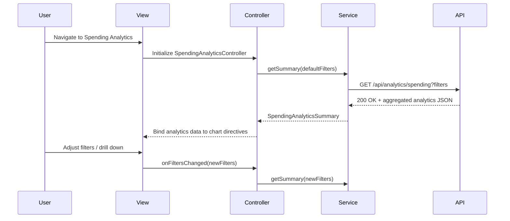

# QE-4086 - DavMetricsTesting1-Spending Analytics and Insights LLD

## a. Architecture Mapping (brief)
- Analytics UI Component → `SpendingAnalyticsController` + `spending-analytics.html` view, backed by `SpendingAnalyticsService` for chart data and insight retrieval.
- Analytics Engine → `SpendingAnalyticsService` encapsulating aggregation logic for monthly trends, card-wise breakdowns, and category distributions over up to 24 months.
- Category Classification integration → `CategoryClassificationService` to ensure transactions are tagged into the nine predefined categories before analytics aggregation.
- Visualization Renderer → Charting directives such as `appSpendingChart` and `appCategoryBreakdownChart` wrapping the chosen chart library.

Recommended folder structure (short):
- `app/analytics/`
  - `analytics.module.js`
  - `analytics.controller.js`
  - `analytics.service.js`
  - `analytics.routes.js`
  - `views/spending-analytics.html`
  - `directives/spending-chart.directive.js`
  - `directives/category-breakdown.directive.js`
- `app/shared/services/category-classification.service.js`

## b. Component Specifications
| Name                          | Artifact Type | Responsibility                                                           | Key Dependencies                                  |
|-------------------------------|--------------|---------------------------------------------------------------------------|---------------------------------------------------|
| AnalyticsModule               | Module       | Group spending analytics artifacts under `app.analytics`                | `ui.router`, `CategoryClassificationService`      |
| SpendingAnalyticsController   | Controller   | Manage analytics view state, filters, and drill-down interactions       | `SpendingAnalyticsService`, `$scope`, `$stateParams` |
| SpendingAnalyticsService      | Service      | Aggregate transaction data into trend, card-wise, and category-wise metrics | `$http`, Transaction Data Service, Analytics Engine API |
| CategoryClassificationService | Service      | Provide category tags for transactions across nine predefined categories | `$http`, Category Classification Service          |
| appSpendingChart              | Directive    | Render monthly spend trend chart with interactive filters and tooltips   | `SpendingAnalyticsController`, chart library       |
| appCategoryBreakdownChart     | Directive    | Render category-wise spend distribution charts                           | `SpendingAnalyticsController`, chart library       |
| spending-analytics.html       | View (HTML)  | Compose analytics filters, charts, and summary tiles in a responsive layout | `SpendingAnalyticsController`, Bootstrap CSS       |

## c. Data Model (brief)
```js
MonthlySpendPoint = {
  month: String,        // e.g., "2025-01"
  totalAmount: Number
}

CardSpendSummary = {
  cardId: String,
  cardName: String,
  totalAmount: Number,
  transactionCount: Number
}

CategorySpendSummary = {
  category: String,     // Food & Dining, Fuel, Shopping, Travel, Entertainment, Utilities, Healthcare, Education, Miscellaneous
  totalAmount: Number,
  transactionCount: Number
}

SpendingAnalyticsSummary = {
  userId: String,
  periodFrom: Date,
  periodTo: Date,
  monthlyTrend: Array<MonthlySpendPoint>,
  cardWiseSummary: Array<CardSpendSummary>,
  categoryWiseSummary: Array<CategorySpendSummary>
}
```

## d. Data Flow (one paragraph)
When the user opens the spending analytics screen, `spending-analytics.html` is loaded via `ui-router` and bound to `SpendingAnalyticsController`, which initializes default filters (date range, card selection) and calls `SpendingAnalyticsService.getSummary(filters)`; the service requests raw transaction data from the Transaction Data Service and category tags from `CategoryClassificationService` through the API Gateway, aggregates results into `SpendingAnalyticsSummary` including monthly trend, card-wise totals, and category-wise distributions, returns this summary to the controller, and the controller binds the data to chart directives `appSpendingChart` and `appCategoryBreakdownChart`, causing the view to render interactive charts and update immediately when the user changes filters or drills down.

## e. Primary Sequence Diagram (ONE only)


## f. Implementation Notes (brief)
- Register analytics routes in `analytics.routes.js` with states supporting optional filter parameters for deep-linking to specific views.
- Use `$inject` arrays for controller and services, and structure controller logic with ES6 arrow functions and `const`/`let` where transpiled.
- Implement data aggregation inside `SpendingAnalyticsService`, minimizing API calls by requesting batched transaction data and reusing results for multiple charts.
- Integrate a charting library (e.g., Chart.js or D3) behind lightweight AngularJS directives `appSpendingChart` and `appCategoryBreakdownChart` for reusable visualization components.
- Optimize performance by caching recent analytics summaries in memory or browser storage when filters are similar, helping meet the 1.5-second rendering NFR.

## g. Error Handling (ONE line)
Errors during analytics data retrieval are handled in `SpendingAnalyticsService` with logging, concise messages in the analytics view, and simple retry for transient API failures.

## h. Security Notes (ONE line)
All analytics API calls are authenticated, operate only on the current user’s transaction data, and avoid exposing any sensitive card identifiers beyond masked or aggregate information in the client.
