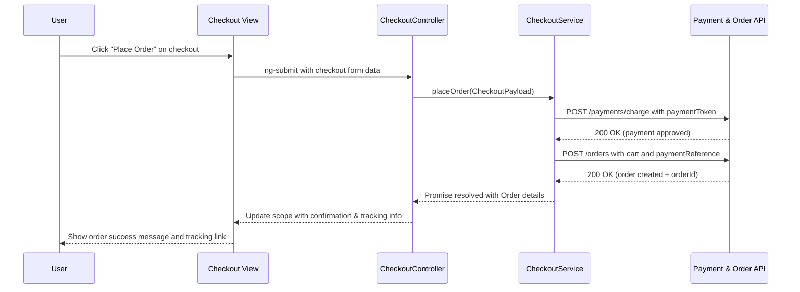

# QE-4087 Low-Level Design (LLD) – Consumer Shopping and Checkout Experience

## a. Architecture Mapping
- Consumer Web/Mobile Client → `app.consumer` module with `ConsumerShellController` and views under `app/consumer/views/`.
- Authentication Service → `AuthService` in `app/consumer/consumer.service.js` + shared `authInterceptor` in `app/shared/interceptors/`.
- Product Catalog Service → `ProductCatalogService` consumed by `ProductCatalogController` with `productCatalog.html` view.
- Shopping Cart Service → `CartService` factory (shared cart state) used by `CartController` with `cart.html` view.
- Checkout & Payment Service → `CheckoutService` used by `CheckoutController` with `checkout.html` view.
- Order Management Service → `OrderService` used by `OrderHistoryController` with `order-history.html` and `OrderDetailController` with `order-detail.html`.
- Notification Service → `NotificationService` in `app/shared/services/` used by all consumer controllers for toasts/alerts.
- Payment Gateway API → wrapped by `PaymentGatewayService` (REST integration) in `app/shared/services/`.
- Logistics API → wrapped by `LogisticsService` (REST integration) in `app/shared/services/`.

Recommended folder structure (feature-focused):
- `app/consumer/consumer.module.js`
- `app/consumer/consumer.routes.js`
- `app/consumer/consumer.controller.js` (shell + shared controllers)
- `app/consumer/consumer.service.js` (AuthService, ProductCatalogService, CartService, CheckoutService, OrderService)
- `app/consumer/views/` (`product-catalog.html`, `cart.html`, `checkout.html`, `order-history.html`, `order-detail.html`, `wishlist.html`)
- `app/shared/services/NotificationService.js`, `PaymentGatewayService.js`, `LogisticsService.js`
- `app/shared/interceptors/authInterceptor.js`

## b. Component Specifications
| Name | Artifact Type | Responsibility | Key Dependencies |
|---|---|---|---|
| app.consumer | Module | Group consumer shopping, cart, checkout, and order features | ui-router, shared services module |
| ConsumerShellController | Controller | Manage global consumer state (auth status, navigation, header cart badge) | AuthService, CartService, NotificationService |
| ProductCatalogController | Controller | Load products, handle search/filter, and expose catalog to view | ProductCatalogService, NotificationService |
| CartController | Controller | Manage cart items, quantities, totals, and transition to checkout | CartService, ProductCatalogService, NotificationService |
| CheckoutController | Controller | Orchestrate checkout steps, validate data, and trigger payment | CheckoutService, CartService, PaymentGatewayService, NotificationService |
| OrderHistoryController | Controller | Display list of past orders and high-level statuses | OrderService, NotificationService |
| OrderDetailController | Controller | Show detailed order info, tracking, cancellation/refund actions | OrderService, LogisticsService, NotificationService |
| WishlistController | Controller | Manage wishlist items and add-to-cart from wishlist | ProductCatalogService, NotificationService, CartService |
| AuthService | Service | Handle user registration, login, logout, and session management | `$http`, authInterceptor |
| ProductCatalogService | Service | Fetch product catalog, search results, and filter options via APIs | `$http`, NotificationService |
| CartService | Factory | Maintain shared cart state (items, totals) across controllers | `$http`, ProductCatalogService |
| CheckoutService | Service | Prepare checkout payload, call payment APIs, persist order | `$http`, PaymentGatewayService, CartService |
| OrderService | Service | Retrieve orders, order details, and manage cancellations/refunds | `$http`, LogisticsService, NotificationService |
| NotificationService | Service | Provide reusable success/error/info notifications | `$window`, `$timeout` |
| PaymentGatewayService | Service | Integrate with third-party payment APIs for charges and refunds | `$http` |
| LogisticsService | Service | Integrate with logistics API for shipment tracking status | `$http` |
| authInterceptor | Interceptor | Attach auth token to requests and handle 401 responses globally | `$q`, AuthService, NotificationService |

## c. Data Model
```js
User = {
  id: Number,
  name: String,
  email: String,
  phone: String,
  roles: Array<String>,
  isAuthenticated: Boolean
}

Product = {
  id: Number,
  name: String,
  description: String,
  category: String,
  price: Number,
  currency: String,
  imageUrl: String,
  rating: Number,
  reviewsCount: Number,
  inStock: Boolean
}

CartItem = {
  productId: Number,
  name: String,
  unitPrice: Number,
  quantity: Number,
  lineTotal: Number
}

Cart = {
  items: Array<CartItem>,
  totalAmount: Number,
  currency: String
}

CheckoutPayload = {
  userId: Number,
  cart: Cart,
  shippingAddressId: Number,
  billingAddressId: Number,
  paymentMethod: String,
  paymentToken: String
}

Order = {
  id: Number,
  userId: Number,
  items: Array<CartItem>,
  totalAmount: Number,
  currency: String,
  status: String,
  createdAt: String,
  updatedAt: String,
  trackingId: String,
  paymentReference: String
}

WishlistItem = {
  productId: Number,
  addedAt: String
}
```

## d. Data Flow
When a consumer discovers a product and proceeds to purchase, the user interacts with the `product-catalog.html` view (search, filter, add to cart) bound to `ProductCatalogController`, which uses `ProductCatalogService` to load products from the backend API and `CartService` to add selected items into the shared cart model. Navigating to the cart and checkout views binds `CartController` and `CheckoutController`, which read cart state from `CartService`, build a `CheckoutPayload`, and call `CheckoutService`. `CheckoutService` delegates payment processing to `PaymentGatewayService`, which posts to the third-party payment API and receives an authorization/charge result; on success, `CheckoutService` persists an `Order` via `OrderService`. The response updates the controllers’ scope models, which refresh the UI with order confirmation and tracking details through `order-history.html` and `order-detail.html`, while `NotificationService` surfaces real-time feedback (success or error) to the user.

## e. Primary Sequence Diagram


## f. Implementation Notes
- Use `app.consumer` AngularJS module with `ui-router` states for catalog, cart, checkout, and orders.
- Apply DI via `$inject` arrays on all controllers/services to remain minification-safe.
- Centralize REST calls in services (`AuthService`, `ProductCatalogService`, `CartService`, `CheckoutService`, `OrderService`) using `$http` with ES6 `let`/`const` and arrow functions.
- Represent shared cart state via `CartService` factory singleton injected into multiple controllers.
- Integrate payment and logistics APIs through dedicated services (`PaymentGatewayService`, `LogisticsService`) returning promises for controller orchestration.

## g. Error Handling
Centralized `$http` interceptor catches failures; user-facing errors surfaced via a shared notification service.

## h. Security Notes
Requires token-based auth via existing SSO and payment flows must comply with PCI DSS using secure, encrypted API calls.