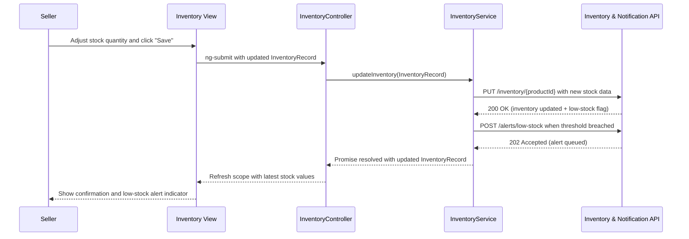

# QE-4088 Low-Level Design (LLD) – Seller Management and Operations

## a. Architecture Mapping
- Seller Web Portal → `app.seller` module with `SellerShellController` and views under `app/seller/views/`.
- Seller Authentication Service → `SellerAuthService` in `app/seller/seller.service.js` + shared `authInterceptor` in `app/shared/interceptors/`.
- Product Management Service → `SellerProductService` used by `SellerProductController` with `seller-products.html` view.
- Inventory Management Service → `InventoryService` used by `InventoryController` with `inventory.html` view.
- Order Processing Service → `SellerOrderService` used by `SellerOrderController` with `seller-orders.html` view.
- Analytics Dashboard Service → `SellerAnalyticsController` backed by `AnalyticsService` with `seller-analytics.html` view.
- Notification Service → shared `NotificationService` in `app/shared/services/` used for inventory alerts and order notifications.
- Payment Gateway API → wrapped by `SellerSettlementService` (payouts, fees) in `app/shared/services/`.
- Logistics API → wrapped by `SellerLogisticsService` (fulfillment updates) in `app/shared/services/`.

Recommended folder structure (feature-focused):
- `app/seller/seller.module.js`
- `app/seller/seller.routes.js`
- `app/seller/seller.controller.js` (shell + feature controllers)
- `app/seller/seller.service.js` (SellerAuthService, SellerProductService, InventoryService, SellerOrderService, AnalyticsService)
- `app/seller/views/` (`seller-products.html`, `inventory.html`, `seller-orders.html`, `seller-analytics.html`)
- `app/shared/services/NotificationService.js`, `SellerSettlementService.js`, `SellerLogisticsService.js`
- `app/shared/interceptors/authInterceptor.js`

## b. Component Specifications
| Name | Artifact Type | Responsibility | Key Dependencies |
|---|---|---|---|
| app.seller | Module | Group seller registration, catalog, inventory, orders, and analytics features | ui-router, shared services module |
| SellerShellController | Controller | Manage global seller session, navigation, and header summaries | SellerAuthService, NotificationService |
| SellerProductController | Controller | Create, update, and list seller products with images and descriptions | SellerProductService, NotificationService |
| InventoryController | Controller | Display and adjust inventory levels, trigger low-stock alerts | InventoryService, NotificationService |
| SellerOrderController | Controller | View and process orders, update fulfillment statuses | SellerOrderService, SellerLogisticsService, NotificationService |
| SellerAnalyticsController | Controller | Render sales analytics metrics and charts for the seller dashboard | AnalyticsService, NotificationService |
| SellerAuthService | Service | Handle seller registration, authentication, and profile management | `$http`, authInterceptor |
| SellerProductService | Service | Manage product listing CRUD and image metadata persistence | `$http`, NotificationService |
| InventoryService | Service | Track stock levels, thresholds, and push low-stock events | `$http`, NotificationService |
| SellerOrderService | Service | Retrieve and update seller-side order statuses and fulfillment data | `$http`, SellerLogisticsService |
| AnalyticsService | Service | Aggregate sales, conversion, and inventory metrics for dashboards | `$http` |
| NotificationService | Service | Provide reusable notifications for seller events (low stock, orders) | `$window`, `$timeout` |
| SellerSettlementService | Service | Integrate with payment gateway for seller payouts and settlements | `$http` |
| SellerLogisticsService | Service | Integrate with logistics API for shipment and fulfillment status | `$http` |
| authInterceptor | Interceptor | Attach seller auth token and manage global auth errors | `$q`, SellerAuthService, NotificationService |

## c. Data Model
```js
Seller = {
  id: Number,
  name: String,
  email: String,
  phone: String,
  companyName: String,
  roles: Array<String>,
  isAuthenticated: Boolean
}

SellerProduct = {
  id: Number,
  sellerId: Number,
  name: String,
  description: String,
  category: String,
  price: Number,
  currency: String,
  imageUrl: String,
  sku: String,
  stockQuantity: Number,
  isActive: Boolean
}

InventoryRecord = {
  productId: Number,
  currentStock: Number,
  reorderThreshold: Number,
  lastUpdatedAt: String
}

SellerOrder = {
  id: Number,
  sellerId: Number,
  buyerId: Number,
  items: Array<SellerProduct>,
  totalAmount: Number,
  currency: String,
  status: String,
  shippingProvider: String,
  trackingId: String,
  createdAt: String,
  updatedAt: String
}

SalesMetric = {
  sellerId: Number,
  period: String,
  totalSalesAmount: Number,
  ordersCount: Number,
  averageOrderValue: Number,
  topProductIds: Array<Number>
}
```

## d. Data Flow
When a seller logs into the portal and manages inventory, the seller interacts with `inventory.html` bound to `InventoryController`, which uses `SellerAuthService` to verify the authenticated seller and `InventoryService` to fetch current `InventoryRecord` data from the backend API. Updates to stock levels or thresholds are made through the view and propagated via `InventoryController` to `InventoryService`, which posts changes to the inventory API and, when thresholds are breached, triggers low-stock alerts through `NotificationService` and external notification providers. The updated inventory data returned from the API is merged into the controller’s scope, refreshing the UI with current stock levels while `SellerAnalyticsController` and `AnalyticsService` consume the same data to recompute `SalesMetric` values shown on `seller-analytics.html`.

## e. Primary Sequence Diagram


## f. Implementation Notes
- Use `app.seller` AngularJS module with `ui-router` states for products, inventory, orders, and analytics.
- Apply `$inject`-based DI for controllers and services to ensure minification safety.
- Encapsulate all seller REST operations in services (`SellerAuthService`, `SellerProductService`, `InventoryService`, `SellerOrderService`, `AnalyticsService`) using `$http` and ES6 constructs.
- Drive low-stock alerts via `InventoryService` integrating with notification providers and surfacing UI messages through `NotificationService`.
- Keep analytics dashboards responsive by using lightweight API payloads and caching results in `AnalyticsService` where appropriate.

## g. Error Handling
Centralized `$http` interceptor catches failures; user-facing errors surfaced via a shared notification service.

## h. Security Notes
Standard input validation and secure API calls assumed, with encrypted seller data and fraud detection mechanisms handled by backend services.
