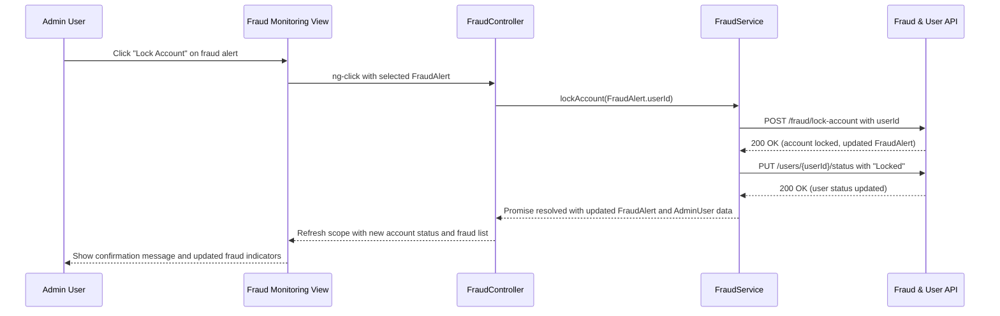

# QE-4089 Low-Level Design (LLD) – Platform Administration and Governance

## a. Architecture Mapping
- Admin Portal → `app.admin` module with `AdminShellController` and views under `app/admin/views/`.
- Admin Authentication Service → `AdminAuthService` in `app/admin/admin.service.js` + shared `authInterceptor` in `app/shared/interceptors/`.
- Analytics Dashboard Service → `AdminAnalyticsController` backed by `PlatformAnalyticsService` with `admin-analytics.html` view.
- User Management Service → `UserManagementService` used by `UserManagementController` with `user-management.html` view.
- RBAC Service → `RbacService` used by `RoleManagementController` with `role-management.html` view.
- Dispute Resolution Service → `DisputeService` used by `DisputeController` with `disputes.html` view.
- Fraud Detection Service → `FraudService` consumed by `FraudController` with `fraud-monitoring.html` view.
- Compliance Monitoring Service → `ComplianceService` used by `ComplianceController` with `compliance.html` view.
- Payment Gateway API → accessed via `TransactionMonitoringService` encapsulating gateway transaction data.
- Notification Service → shared `NotificationService` for admin alerts and user notifications.
- Compliance Auditing Tools → integrated via `ComplianceAuditIntegrationService` in `app/shared/services/`.

Recommended folder structure (feature-focused):
- `app/admin/admin.module.js`
- `app/admin/admin.routes.js`
- `app/admin/admin.controller.js` (shell + feature controllers)
- `app/admin/admin.service.js` (AdminAuthService, PlatformAnalyticsService, UserManagementService, RbacService, DisputeService, FraudService, ComplianceService, TransactionMonitoringService)
- `app/admin/views/` (`admin-analytics.html`, `user-management.html`, `role-management.html`, `disputes.html`, `fraud-monitoring.html`, `compliance.html`)
- `app/shared/services/NotificationService.js`, `ComplianceAuditIntegrationService.js`
- `app/shared/interceptors/authInterceptor.js`

## b. Component Specifications
| Name | Artifact Type | Responsibility | Key Dependencies |
|---|---|---|---|
| app.admin | Module | Group admin analytics, governance, user management, and compliance features | ui-router, shared services module |
| AdminShellController | Controller | Manage admin session, navigation, and global filters | AdminAuthService, NotificationService |
| AdminAnalyticsController | Controller | Render platform performance KPIs and fraud/compliance metrics | PlatformAnalyticsService, NotificationService |
| UserManagementController | Controller | Manage buyer/seller accounts, statuses, and profile updates | UserManagementService, RbacService, NotificationService |
| RoleManagementController | Controller | Configure role-based access control mappings and permissions | RbacService, NotificationService |
| DisputeController | Controller | Handle dispute tickets, workflow transitions, and outcomes | DisputeService, NotificationService |
| FraudController | Controller | Monitor fraud alerts, lock/unlock accounts, and escalate cases | FraudService, UserManagementService, NotificationService |
| ComplianceController | Controller | View compliance status, reports, and audit results | ComplianceService, ComplianceAuditIntegrationService, NotificationService |
| AdminAuthService | Service | Authenticate admins and manage role/permission claims | `$http`, authInterceptor |
| PlatformAnalyticsService | Service | Aggregate platform-wide metrics for dashboards | `$http` |
| UserManagementService | Service | CRUD for users, account status changes, and verification flags | `$http` |
| RbacService | Service | Manage roles, permissions, and policy assignments | `$http` |
| DisputeService | Service | Implement dispute workflows and state transitions | `$http`, NotificationService |
| FraudService | Service | Integrate with fraud detection algorithms and generate alerts | `$http`, UserManagementService |
| ComplianceService | Service | Track compliance indicators and generate reports | `$http`, ComplianceAuditIntegrationService |
| TransactionMonitoringService | Service | Query payment gateway APIs for transaction monitoring | `$http` |
| ComplianceAuditIntegrationService | Service | Integrate with external auditing tools for compliance checks | `$http` |
| NotificationService | Service | Central notification channel for admin alerts and user messages | `$window`, `$timeout` |
| authInterceptor | Interceptor | Attach admin auth token and enforce role-based access checks at API layer | `$q`, AdminAuthService, NotificationService |

## c. Data Model
```js
AdminUser = {
  id: Number,
  name: String,
  email: String,
  roles: Array<String>,
  isActive: Boolean,
  lastLoginAt: String
}

Role = {
  id: Number,
  name: String,
  permissions: Array<String>
}

Dispute = {
  id: Number,
  orderId: Number,
  buyerId: Number,
  sellerId: Number,
  status: String,
  reason: String,
  createdAt: String,
  updatedAt: String
}

FraudAlert = {
  id: Number,
  userId: Number,
  riskScore: Number,
  alertType: String,
  createdAt: String,
  status: String
}

ComplianceReport = {
  id: Number,
  period: String,
  region: String,
  status: String,
  issuesCount: Number,
  generatedAt: String
}

PlatformMetric = {
  id: Number,
  metricName: String,
  value: Number,
  collectedAt: String
}
```

## d. Data Flow
When an administrator monitors platform health and responds to fraud, the admin interacts with `fraud-monitoring.html` bound to `FraudController`, which uses `AdminAuthService` to validate the admin session and `FraudService` to retrieve current `FraudAlert` data via backend APIs. Actions taken in the view (such as locking an account or escalating a case) are passed through `FraudController` to `FraudService`, which updates fraud records and, when necessary, calls `UserManagementService` to update user status and `NotificationService` to trigger alerts. The backend responses containing updated `FraudAlert`, `AdminUser`, and `PlatformMetric` information are applied to the controller scope, causing the UI to refresh fraud lists, risk scores, and related analytics in `admin-analytics.html`, ensuring admins have up-to-date visibility and control.

## e. Primary Sequence Diagram


## f. Implementation Notes
- Use `app.admin` AngularJS module with `ui-router` states for analytics, user management, RBAC, disputes, fraud, and compliance.
- Apply `$inject`-based DI for controllers/services and keep logic testable and modular.
- Centralize admin REST calls in services (`PlatformAnalyticsService`, `UserManagementService`, `RbacService`, `DisputeService`, `FraudService`, `ComplianceService`, `TransactionMonitoringService`) using `$http` with ES6 features.
- Apply RBAC checks in both UI (route guards) and API layer via `authInterceptor` and backend enforcement.
- Integrate external compliance and fraud tools via dedicated services returning promises, keeping controllers thin.

## g. Error Handling
Centralized `$http` interceptor catches failures; user-facing errors surfaced via a shared notification service.

## h. Security Notes
Requires token-based admin authentication with role-based access control, secure encrypted API calls, and adherence to PCI DSS and regional data privacy regulations.
