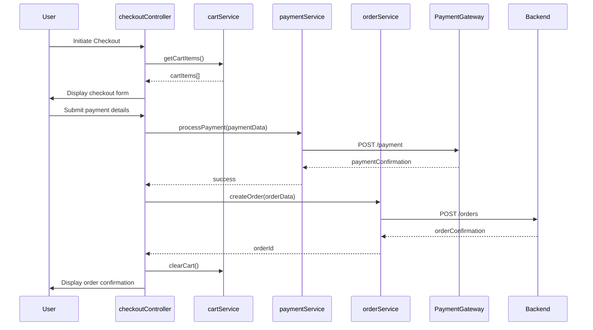

# Low-Level Design: Consumer Shopping Journey

**Epic ID:** QE-4090  
**Title:** Consumer Shopping Journey - Complete Purchase Flow

## a. Architecture Mapping

- Authentication → AuthModule (authController, authService)
- Product Catalog → ProductModule (productListController, productService, productFactory)
- Search & Filter → SearchModule (searchController, searchService, filterDirective)
- Shopping Cart → CartModule (cartController, cartService)
- Checkout → CheckoutModule (checkoutController, paymentService, orderService)
- Recommendations → RecommendationModule (recommendationService, recommendationDirective)
- Reviews → ReviewModule (reviewController, reviewService)
- Wishlist → WishlistModule (wishlistController, wishlistService)

**Folder Structure:**
```
/app
  /modules
    /auth, /product, /cart, /checkout, /review, /wishlist, /recommendation
  /services
  /controllers
  /directives
  /factories
  /models
```

## b. Component Specifications

| Name | Artifact Type | Responsibility | Key Dependencies |
|------|---------------|----------------|------------------|
| authController | Controller | Manages login/registration UI and form validation | authService, $scope, $location |
| authService | Service | Handles authentication API calls and token management | $http, $window, tokenFactory |
| productListController | Controller | Displays product catalog and handles user interactions | productService, $scope, $routeParams |
| productService | Service | Fetches product data from REST API | $http, $q, apiConfig |
| searchController | Controller | Manages search input and filter selections | searchService, $scope |
| searchService | Service | Executes search/filter queries against API | $http, $q |
| filterDirective | Directive | Renders dynamic filter UI components | searchService |
| cartController | Controller | Manages cart UI, add/remove items, quantity updates | cartService, $scope |
| cartService | Service | Maintains cart state and syncs with backend | $http, localStorageService |
| checkoutController | Controller | Orchestrates checkout flow and payment submission | paymentService, orderService, cartService, $scope |
| paymentService | Service | Integrates with payment gateway API | $http, $q |
| orderService | Service | Creates and retrieves order records | $http, $q |
| recommendationService | Service | Fetches personalized product recommendations | $http, $q |
| recommendationDirective | Directive | Displays recommendation widgets | recommendationService |
| reviewController | Controller | Manages review submission and display | reviewService, $scope |
| reviewService | Service | Handles review CRUD operations via API | $http, $q |
| wishlistController | Controller | Manages wishlist UI operations | wishlistService, $scope |
| wishlistService | Service | Persists wishlist items to backend | $http, $q |

## c. Data Model

**User:**
```javascript
{
  userId: String,
  email: String,
  name: String,
  authToken: String,
  role: String
}
```

**Product:**
```javascript
{
  productId: String,
  name: String,
  description: String,
  price: Number,
  imageUrl: String,
  category: String,
  stock: Number,
  rating: Number
}
```

**CartItem:**
```javascript
{
  cartItemId: String,
  productId: String,
  quantity: Number,
  price: Number
}
```

**Order:**
```javascript
{
  orderId: String,
  userId: String,
  items: Array<CartItem>,
  totalAmount: Number,
  status: String,
  paymentMethod: String,
  createdAt: Date
}
```

**Review:**
```javascript
{
  reviewId: String,
  productId: String,
  userId: String,
  rating: Number,
  comment: String,
  verified: Boolean
}
```

## d. Data Flow

User authenticates via authController which calls authService to validate credentials and store JWT token. User browses products rendered by productListController fetching data from productService REST API. Search/filter actions trigger searchService API calls with query parameters. Adding to cart invokes cartService which updates local state and syncs with backend API. Checkout flow begins in checkoutController, validates cart via cartService, submits payment through paymentService to payment gateway, then calls orderService to create order record. Order confirmation triggers email notification via backend. Recommendations are fetched by recommendationService based on user behavior and displayed via directive. Reviews are submitted through reviewController to reviewService API endpoint.

## e. Primary Sequence Diagram



## f. Implementation Notes

- Use AngularJS dependency injection for all services and controllers with explicit annotation to avoid minification issues
- Implement HTTP interceptor for JWT token attachment and error handling across all API calls
- Use $q promises for asynchronous operations with proper error propagation
- Leverage ng-repeat with track by for product lists to optimize rendering performance
- Store cart state in localStorage with cartService sync to handle session persistence

## g. Error Handling

HTTP interceptor captures API errors (4xx/5xx), displays user-friendly notifications via toastr/modal, and logs errors to console for debugging.

## h. Security Notes

Requires JWT token-based authentication with existing SSO integration; all payment data transmitted via HTTPS with PCI DSS compliant payment gateway.