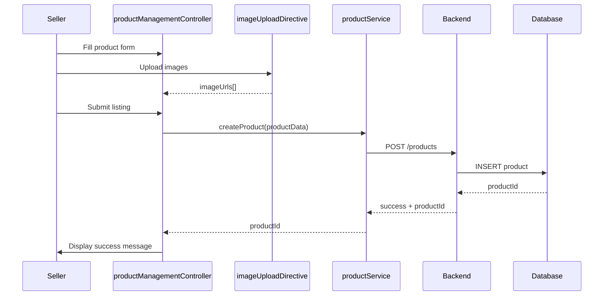

# Low-Level Design: Seller Management Platform

**Epic ID:** QE-4091  
**Title:** Seller Management Platform

## a. Architecture Mapping

- Seller Dashboard → SellerModule (dashboardController, analyticsService)
- Product Listing → ProductManagementModule (productManagementController, productService, imageUploadDirective)
- Inventory Management → InventoryModule (inventoryController, inventoryService, alertService)
- Order Processing → OrderModule (orderController, orderService)
- Sales Analytics → AnalyticsModule (analyticsController, analyticsService, chartDirective)

**Folder Structure:**
```
/app
  /modules
    /seller-dashboard, /product-management, /inventory, /order, /analytics
  /services
  /controllers
  /directives
```

## b. Component Specifications

| Name | Artifact Type | Responsibility | Key Dependencies |
|------|---------------|----------------|------------------|
| dashboardController | Controller | Orchestrates seller dashboard view and navigation | analyticsService, $scope, $location |
| analyticsService | Service | Fetches sales metrics and performance data | $http, $q |
| productManagementController | Controller | Manages product CRUD operations and form validation | productService, $scope, Upload |
| productService | Service | Handles product listing API calls | $http, $q |
| imageUploadDirective | Directive | Handles image upload with preview and validation | Upload, $timeout |
| inventoryController | Controller | Displays inventory levels and handles stock updates | inventoryService, alertService, $scope |
| inventoryService | Service | Manages inventory data and threshold monitoring | $http, $q, $interval |
| alertService | Service | Sends low-stock notifications | $http |
| orderController | Controller | Displays seller orders and manages order status updates | orderService, $scope |
| orderService | Service | Fetches and updates order records | $http, $q |
| analyticsController | Controller | Renders sales analytics and reports | analyticsService, $scope |
| chartDirective | Directive | Renders charts using Chart.js or D3 | analyticsService |

## c. Data Model

**Seller:**
```javascript
{
  sellerId: String,
  businessName: String,
  email: String,
  verified: Boolean,
  authToken: String
}
```

**Product:**
```javascript
{
  productId: String,
  sellerId: String,
  name: String,
  description: String,
  price: Number,
  images: Array<String>,
  category: String,
  stock: Number,
  status: String
}
```

**InventoryItem:**
```javascript
{
  productId: String,
  currentStock: Number,
  lowStockThreshold: Number,
  lastUpdated: Date
}
```

**SellerOrder:**
```javascript
{
  orderId: String,
  sellerId: String,
  items: Array,
  totalAmount: Number,
  status: String,
  buyerInfo: Object,
  createdAt: Date
}
```

**SalesMetrics:**
```javascript
{
  totalRevenue: Number,
  totalOrders: Number,
  period: String,
  topProducts: Array
}
```

## d. Data Flow

Seller authenticates and accesses dashboardController which loads analytics via analyticsService from backend API. Product listing flow: productManagementController captures form data including images via imageUploadDirective, calls productService to POST to /products endpoint, backend persists to database and returns productId. Inventory monitoring: inventoryService polls backend API at intervals, compares stock levels against thresholds, triggers alertService when low stock detected, which calls notification API. Order processing: orderController fetches orders via orderService GET /orders?sellerId=X, displays list, seller updates status triggering orderService PUT /orders/:id, backend updates database and notifies buyer. Analytics: analyticsController calls analyticsService which aggregates data from backend and chartDirective renders visualizations.

## e. Primary Sequence Diagram



## f. Implementation Notes

- Use ng-file-upload module for image upload with client-side validation (format, size limits)
- Implement $interval service in inventoryService for periodic stock level polling with configurable refresh rate
- Use AngularJS factory pattern for shared data models across controllers
- Leverage Chart.js integration via custom directive for sales analytics visualization
- Apply form validation using AngularJS built-in validators and custom directives for business rules

## g. Error Handling

HTTP interceptor with try/catch blocks in service methods; display error notifications via toastr and log to console.

## h. Security Notes

Seller authentication via JWT with role-based access control ensuring sellers only access their own data; input validation on all forms.