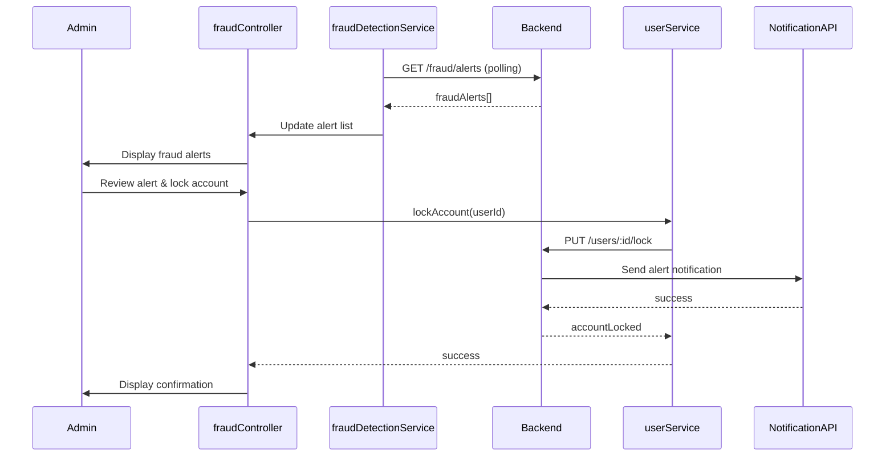

# Low-Level Design: Administrative Platform

**Epic ID:** QE-4092  
**Title:** Administrative Platform

## a. Architecture Mapping

- Admin Dashboard → AdminModule (adminDashboardController, systemHealthService)
- User Management → UserManagementModule (userManagementController, userService, rbacService)
- Fraud Detection → FraudModule (fraudController, fraudDetectionService)
- Dispute Resolution → DisputeModule (disputeController, disputeService)
- Compliance → ComplianceModule (complianceController, auditService)

**Folder Structure:**
```
/app
  /modules
    /admin-dashboard, /user-management, /fraud, /dispute, /compliance
  /services
  /controllers
  /directives
```

## b. Component Specifications

| Name | Artifact Type | Responsibility | Key Dependencies |
|------|---------------|----------------|------------------|
| adminDashboardController | Controller | Displays platform metrics and system health | systemHealthService, $scope, $interval |
| systemHealthService | Service | Fetches real-time system health metrics | $http, $q |
| userManagementController | Controller | Manages user CRUD operations and role assignments | userService, rbacService, $scope |
| userService | Service | Handles user management API calls | $http, $q |
| rbacService | Service | Manages role-based access control logic | $http |
| fraudController | Controller | Displays fraud alerts and manages investigations | fraudDetectionService, $scope |
| fraudDetectionService | Service | Monitors transactions and flags suspicious activity | $http, $q, $interval |
| disputeController | Controller | Manages dispute case workflow and resolution | disputeService, $scope |
| disputeService | Service | Handles dispute CRUD and status updates | $http, $q |
| complianceController | Controller | Generates compliance reports and audit logs | auditService, $scope |
| auditService | Service | Fetches audit logs and compliance data | $http, $q |

## c. Data Model

**Admin:**
```javascript
{
  adminId: String,
  email: String,
  role: String,
  permissions: Array<String>,
  authToken: String
}
```

**User:**
```javascript
{
  userId: String,
  email: String,
  role: String,
  status: String,
  verified: Boolean,
  accountLocked: Boolean
}
```

**FraudAlert:**
```javascript
{
  alertId: String,
  userId: String,
  transactionId: String,
  severity: String,
  reason: String,
  status: String,
  createdAt: Date
}
```

**Dispute:**
```javascript
{
  disputeId: String,
  orderId: String,
  buyerId: String,
  sellerId: String,
  description: String,
  status: String,
  resolution: String,
  createdAt: Date
}
```

**AuditLog:**
```javascript
{
  logId: String,
  action: String,
  userId: String,
  timestamp: Date,
  details: Object
}
```

## d. Data Flow

Admin authenticates with elevated privileges and accesses adminDashboardController which fetches platform metrics via systemHealthService from monitoring API. User management: userManagementController displays user list from userService, admin performs CRUD operations or role assignments validated by rbacService, changes persisted via API to database. Fraud detection: fraudDetectionService polls backend fraud detection API, receives alerts, displays in fraudController, admin reviews and can trigger account lockout via userService API call. Dispute resolution: disputeController fetches open disputes via disputeService, admin reviews case details, updates status and resolution notes, disputeService syncs to backend which notifies involved parties. Compliance: complianceController calls auditService to generate reports from audit log data stored in database.

## e. Primary Sequence Diagram



## f. Implementation Notes

- Implement RBAC using AngularJS route guards and permission-based UI element visibility with ng-if
- Use $interval for real-time polling of fraud alerts and system health metrics with configurable intervals
- Apply AngularJS filters for data formatting in tables (dates, currency, status badges)
- Leverage AngularJS $http interceptor for admin token validation on all API requests
- Use factory pattern for shared admin utilities and permission checking logic

## g. Error Handling

Centralized HTTP interceptor captures all API errors, displays admin-specific error modals, and logs critical failures for audit trail.

## h. Security Notes

Multi-factor authentication for admin access with role-based permissions enforced at API level; all admin actions logged for compliance audit trail.